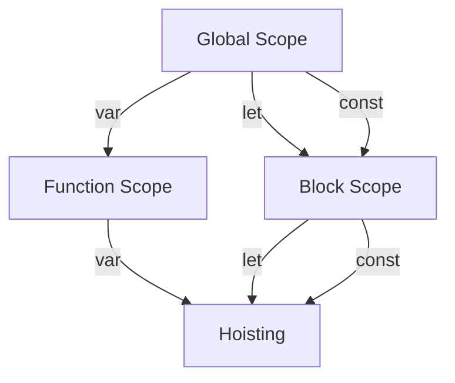

## 4.2 Declaring Variables with `var`, `let`, and `const`

In JavaScript, variables are fundamental building blocks that allow us to store and manipulate data. Understanding how to declare variables effectively is crucial for writing clean and efficient code. In this section, we'll explore the three primary ways to declare variables in JavaScript: `var`, `let`, and `const`. We'll discuss their differences, scope, and hoisting behavior, and provide guidance on when to use each.

### Understanding Variable Declaration

Before we dive into the specifics of `var`, `let`, and `const`, let's briefly review what a variable is. A variable is a named storage location in memory that holds a value. You can think of it as a container for data that can be referenced and manipulated throughout your program.

### `var`: The Traditional Way

The `var` keyword is the traditional way of declaring variables in JavaScript. It has been around since the early days of the language and is still widely used. However, it comes with some quirks that you need to be aware of.

#### Scope of `var`

Variables declared with `var` have a function scope or global scope. This means that if you declare a variable inside a function using `var`, it is only accessible within that function. If declared outside any function, it becomes a global variable.

```javascript
function exampleFunction() {
    var functionScoped = "I'm only accessible within this function";
    console.log(functionScoped); // Output: I'm only accessible within this function
}

exampleFunction();
console.log(functionScoped); // Error: functionScoped is not defined
```

If you declare a variable with `var` outside of any function, it becomes globally scoped and can be accessed from anywhere in your code.

```javascript
var globalScoped = "I'm accessible anywhere in the code";

function anotherFunction() {
    console.log(globalScoped); // Output: I'm accessible anywhere in the code
}

anotherFunction();
console.log(globalScoped); // Output: I'm accessible anywhere in the code
```

#### Hoisting with `var`

One of the unique characteristics of `var` is hoisting. Hoisting is JavaScript's default behavior of moving declarations to the top of the current scope (function or global). This means that you can use a variable before it has been declared, and JavaScript will not throw an error.

```javascript
console.log(hoistedVar); // Output: undefined
var hoistedVar = "I'm hoisted!";
console.log(hoistedVar); // Output: I'm hoisted!
```

In the example above, the declaration of `hoistedVar` is hoisted to the top of the scope, but its assignment is not. This is why the first `console.log` outputs `undefined`.

### `let`: The Modern Approach

The `let` keyword was introduced in ECMAScript 6 (ES6) to address some of the issues associated with `var`. It provides block-level scope, which is more intuitive and predictable.

#### Scope of `let`

Variables declared with `let` are block-scoped. A block is defined by a pair of curly braces `{}`. This means that a variable declared with `let` is only accessible within the block in which it is defined.

```javascript
if (true) {
    let blockScoped = "I'm only accessible within this block";
    console.log(blockScoped); // Output: I'm only accessible within this block
}

console.log(blockScoped); // Error: blockScoped is not defined
```

In the example above, `blockScoped` is only accessible within the `if` block.

#### Hoisting with `let`

Like `var`, `let` is also hoisted, but it is not initialized. This means that you cannot access a `let` variable before it is declared, which prevents the common pitfalls associated with `var`.

```javascript
console.log(notHoistedLet); // Error: Cannot access 'notHoistedLet' before initialization
let notHoistedLet = "I'm not hoisted!";
console.log(notHoistedLet); // Output: I'm not hoisted!
```

### `const`: Immutable Variables

The `const` keyword, also introduced in ES6, is used to declare variables that are intended to remain constant. Once a variable is assigned a value using `const`, it cannot be reassigned.

#### Scope of `const`

Like `let`, `const` is block-scoped. It follows the same rules regarding accessibility within blocks.

```javascript
if (true) {
    const blockScopedConst = "I'm only accessible within this block";
    console.log(blockScopedConst); // Output: I'm only accessible within this block
}

console.log(blockScopedConst); // Error: blockScopedConst is not defined
```

#### Hoisting with `const`

`const` is also hoisted, but like `let`, it is not initialized. You cannot access a `const` variable before it is declared.

```javascript
console.log(notHoistedConst); // Error: Cannot access 'notHoistedConst' before initialization
const notHoistedConst = "I'm not hoisted!";
console.log(notHoistedConst); // Output: I'm not hoisted!
```

#### Immutability of `const`

While `const` variables cannot be reassigned, it is important to note that if the variable holds an object or an array, the contents of the object or array can still be modified.

```javascript
const myArray = [1, 2, 3];
myArray.push(4);
console.log(myArray); // Output: [1, 2, 3, 4]

const myObject = { key: "value" };
myObject.key = "newValue";
console.log(myObject); // Output: { key: "newValue" }
```

### When to Use `var`, `let`, and `const`

Now that we understand the differences between `var`, `let`, and `const`, let's discuss when to use each.

- **Use `let`** when you need a variable that can change its value and is limited to a specific block scope. This is the most common use case in modern JavaScript development.
- **Use `const`** when you want to declare a variable that should not be reassigned. This is particularly useful for constants and values that should remain unchanged throughout your program.
- **Avoid `var`** in most cases, as it can lead to unexpected behavior due to its function scope and hoisting characteristics. `let` and `const` provide more predictable and safer alternatives.

### Try It Yourself

Let's put our knowledge into practice with a simple exercise. Modify the following code to use `let` and `const` appropriately:

```javascript
var name = "Alice";
var age = 25;
var isStudent = true;

if (isStudent) {
    var discount = 0.1;
    console.log("Discount applied:", discount);
}

console.log(name, age, isStudent, discount);
```

**Challenge:** Change the `var` declarations to `let` or `const` where appropriate, and ensure the code still functions correctly.

### Visualizing Scope and Hoisting

To better understand the scope and hoisting behavior of `var`, `let`, and `const`, let's visualize it using a diagram.



**Diagram Explanation:** 
- `var` can be accessed in the global or function scope and is hoisted.
- `let` and `const` are block-scoped and are also hoisted but not initialized.

### Further Reading

For more information on variable declaration and scope in JavaScript, check out the following resources:

- [MDN Web Docs: var](https://developer.mozilla.org/en-US/docs/Web/JavaScript/Reference/Statements/var)
- [MDN Web Docs: let](https://developer.mozilla.org/en-US/docs/Web/JavaScript/Reference/Statements/let)
- [MDN Web Docs: const](https://developer.mozilla.org/en-US/docs/Web/JavaScript/Reference/Statements/const)

### Summary

In this section, we've explored the differences between `var`, `let`, and `const` in JavaScript. We've learned about their scope, hoisting behavior, and best practices for using each. By understanding these concepts, you can write more predictable and maintainable JavaScript code.

---

## Quiz Time!



### Which keyword should you use for a variable that should not be reassigned?

- [ ] var
- [ ] let
- [x] const
- [ ] none of the above

> **Explanation:** `const` is used for variables that should not be reassigned.

### What is the scope of a variable declared with `let`?

- [ ] Global
- [ ] Function
- [x] Block
- [ ] None

> **Explanation:** `let` is block-scoped, meaning it is only accessible within the block in which it is declared.

### What happens when you try to access a `let` variable before it is declared?

- [ ] It returns `undefined`
- [x] It throws an error
- [ ] It returns `null`
- [ ] It returns the value of the variable

> **Explanation:** Accessing a `let` variable before it is declared throws a `ReferenceError`.

### Which keyword allows you to declare a variable that can be accessed globally if declared outside a function?

- [x] var
- [ ] let
- [ ] const
- [ ] none of the above

> **Explanation:** `var` allows for global scope when declared outside of a function.

### What is hoisting in JavaScript?

- [x] Moving declarations to the top of the scope
- [ ] Moving assignments to the top of the scope
- [ ] Moving functions to the top of the scope
- [ ] None of the above

> **Explanation:** Hoisting is JavaScript's behavior of moving declarations to the top of the current scope.

### Can you modify the contents of an array declared with `const`?

- [x] Yes
- [ ] No

> **Explanation:** You can modify the contents of an array declared with `const`, but you cannot reassign the array itself.

### What is the default value of a `var` variable before it is assigned?

- [x] undefined
- [ ] null
- [ ] 0
- [ ] ""

> **Explanation:** The default value of a `var` variable before assignment is `undefined`.

### Which keyword should you avoid using in modern JavaScript development?

- [x] var
- [ ] let
- [ ] const
- [ ] none of the above

> **Explanation:** `var` should generally be avoided in favor of `let` and `const` due to its unpredictable behavior.

### What is the scope of a variable declared with `const`?

- [ ] Global
- [ ] Function
- [x] Block
- [ ] None

> **Explanation:** `const` is block-scoped, similar to `let`.

### True or False: `let` and `const` are not hoisted.

- [ ] True
- [x] False

> **Explanation:** `let` and `const` are hoisted, but they are not initialized until their declaration is evaluated.


