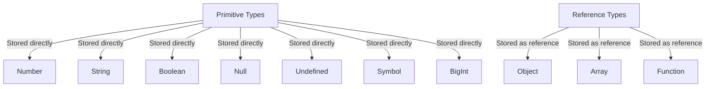

## 4.3 JavaScript Data Types Overview

In JavaScript, understanding data types is crucial as they define the kind of data that can be stored and manipulated within a program. JavaScript is a dynamically typed language, meaning you don't have to specify data types explicitly when declaring variables. However, knowing the types of data you are working with is essential for writing effective and error-free code. In this section, we will explore both **primitive** and **reference** data types in JavaScript.

### Primitive Data Types

Primitive data types are the most basic data types in JavaScript. They are immutable, meaning their values cannot be changed once created. JavaScript has seven primitive data types:

1. **Number**
2. **String**
3. **Boolean**
4. **Null**
5. **Undefined**
6. **Symbol**
7. **BigInt** (introduced in ECMAScript 2020)

Let's delve into each of these primitive data types.

#### 1. Number

The `Number` type in JavaScript is used to represent both integers and floating-point numbers. JavaScript does not differentiate between whole numbers and decimals; they are all considered `Number` types.

```javascript
// Example of Number type
let integerNumber = 42; // An integer
let floatingPointNumber = 3.14; // A floating-point number
let negativeNumber = -7; // A negative number

// Arithmetic operations
let sum = integerNumber + floatingPointNumber; // 45.14
let product = integerNumber * negativeNumber; // -294
```

JavaScript also supports special numeric values such as `Infinity`, `-Infinity`, and `NaN` (Not-a-Number).

```javascript
let infiniteValue = 1 / 0; // Infinity
let notANumber = "hello" / 2; // NaN
```

#### 2. String

A `String` in JavaScript is a sequence of characters used to represent text. Strings can be enclosed in single quotes (`'`), double quotes (`"`), or backticks (`` ` ``) for template literals.

```javascript
// Example of String type
let singleQuoteString = 'Hello, World!';
let doubleQuoteString = "JavaScript is fun!";
let templateLiteralString = `The sum of 2 and 3 is ${2 + 3}`; // Template literal with expression

// String concatenation
let greeting = "Hello, " + "World!"; // "Hello, World!"
```

#### 3. Boolean

The `Boolean` type has only two possible values: `true` or `false`. Booleans are commonly used in conditional statements to control the flow of a program.

```javascript
// Example of Boolean type
let isJavaScriptFun = true;
let isLearningHard = false;

// Using Booleans in conditional statements
if (isJavaScriptFun) {
    console.log("JavaScript is indeed fun!");
}
```

#### 4. Null

`Null` is a special keyword in JavaScript that represents the intentional absence of any object value. It is often used to indicate that a variable should be empty.

```javascript
// Example of Null type
let emptyValue = null;

// Checking for null
if (emptyValue === null) {
    console.log("The variable is null.");
}
```

#### 5. Undefined

A variable that has been declared but not assigned a value has the type `undefined`. It indicates that a variable is not initialized.

```javascript
// Example of Undefined type
let uninitializedVariable;

console.log(uninitializedVariable); // undefined
```

#### 6. Symbol

Introduced in ECMAScript 2015 (ES6), a `Symbol` is a unique and immutable primitive value often used to create unique property keys for objects.

```javascript
// Example of Symbol type
let uniqueId = Symbol('id');

console.log(typeof uniqueId); // "symbol"
```

#### 7. BigInt

`BigInt` is a numeric primitive in JavaScript that can represent integers with arbitrary precision, making it possible to work with very large numbers beyond the safe integer limit for `Number`.

```javascript
// Example of BigInt type
let bigIntNumber = 1234567890123456789012345678901234567890n;

console.log(bigIntNumber + 1n); // 1234567890123456789012345678901234567891n
```

### Reference Data Types

Unlike primitive data types, reference data types are mutable and can hold collections of values and more complex entities. The main reference data types in JavaScript are:

1. **Object**
2. **Array**
3. **Function**

Let's explore these reference data types.

#### 1. Object

An `Object` is a collection of properties, where each property is defined as a key-value pair. Objects can be used to store various keyed collections and more complex entities.

```javascript
// Example of Object type
let person = {
    firstName: "John",
    lastName: "Doe",
    age: 30,
    isEmployed: true
};

// Accessing object properties
console.log(person.firstName); // "John"
console.log(person['lastName']); // "Doe"
```

#### 2. Array

An `Array` is a special type of object used to store ordered collections of values. Arrays can hold any type of data, including other arrays and objects.

```javascript
// Example of Array type
let fruits = ["Apple", "Banana", "Cherry"];

// Accessing array elements
console.log(fruits[0]); // "Apple"

// Adding an element to an array
fruits.push("Date");
console.log(fruits); // ["Apple", "Banana", "Cherry", "Date"]
```

#### 3. Function

A `Function` is a block of code designed to perform a particular task. Functions are objects in JavaScript and can be assigned to variables, passed as arguments, or returned from other functions.

```javascript
// Example of Function type
function greet(name) {
    return `Hello, ${name}!`;
}

console.log(greet("Alice")); // "Hello, Alice!"
```

### Primitive vs. Reference Types

Understanding the difference between primitive and reference types is crucial in JavaScript. Here are the key distinctions:

- **Primitive Types**: Stored directly in the location that the variable accesses. They are immutable, meaning their values cannot be changed once created. Any operation on a primitive type results in a new value.

- **Reference Types**: Stored as a reference in memory. They are mutable, meaning their values can be changed. When you manipulate an object, you work on the reference to the object, not the actual object itself.

Let's illustrate this difference with an example:

```javascript
// Primitive type example
let x = 10;
let y = x; // y is a copy of x

x = 20;
console.log(y); // 10, because y is a separate copy

// Reference type example
let obj1 = { value: 10 };
let obj2 = obj1; // obj2 is a reference to obj1

obj1.value = 20;
console.log(obj2.value); // 20, because obj2 is a reference to obj1
```

In the above example, changing the value of `x` does not affect `y` because they are separate copies of a primitive type. However, changing the property of `obj1` affects `obj2` because they both reference the same object in memory.

### Visualizing Data Types

To better understand how JavaScript handles data types, let's visualize the concept using Mermaid.js diagrams.

#### Primitive vs. Reference Types Diagram



**Diagram Explanation:** The diagram above shows that primitive types are stored directly in memory, whereas reference types are stored as references pointing to the actual data in memory.

### Try It Yourself

Now that we've covered the basics, let's encourage you to experiment with these concepts. Try modifying the examples above to see how JavaScript handles different data types. Here are a few suggestions:

- Change the values of primitive types and observe how they behave.
- Create an object and modify its properties. Notice how changes affect references.
- Experiment with arrays by adding, removing, or modifying elements.

### Further Reading

For more detailed information on JavaScript data types, consider exploring these resources:

- [MDN Web Docs: Data types](https://developer.mozilla.org/en-US/docs/Web/JavaScript/Data_structures)
- [W3Schools: JavaScript Data Types](https://www.w3schools.com/js/js_datatypes.asp)

### Key Takeaways

- JavaScript has seven primitive data types: Number, String, Boolean, Null, Undefined, Symbol, and BigInt.
- Reference data types include Object, Array, and Function.
- Primitive types are immutable and stored directly in memory, while reference types are mutable and stored as references.
- Understanding data types is essential for writing effective JavaScript code.

## Quiz Time!



### Which of the following is a primitive data type in JavaScript?

- [x] Number
- [ ] Object
- [ ] Array
- [ ] Function

> **Explanation:** Number is a primitive data type in JavaScript, while Object, Array, and Function are reference types.

### What is the result of `typeof null` in JavaScript?

- [ ] "null"
- [x] "object"
- [ ] "undefined"
- [ ] "nulltype"

> **Explanation:** In JavaScript, `typeof null` returns "object" due to a historical bug in the language.

### How can you create a unique and immutable value in JavaScript?

- [ ] Using a Number
- [ ] Using a String
- [x] Using a Symbol
- [ ] Using a Boolean

> **Explanation:** A Symbol is used to create a unique and immutable value in JavaScript.

### What is the output of the following code?
```javascript
let a = 5;
let b = a;
a = 10;
console.log(b);
```

- [x] 5
- [ ] 10
- [ ] undefined
- [ ] null

> **Explanation:** `b` is a copy of the primitive value `a`, so changing `a` does not affect `b`.

### Which of the following is a reference data type?

- [ ] Boolean
- [x] Array
- [ ] Null
- [ ] Undefined

> **Explanation:** Array is a reference data type, while Boolean, Null, and Undefined are primitive types.

### What will be the output of the following code?
```javascript
let obj1 = { name: "Alice" };
let obj2 = obj1;
obj1.name = "Bob";
console.log(obj2.name);
```

- [ ] Alice
- [x] Bob
- [ ] undefined
- [ ] null

> **Explanation:** `obj2` is a reference to `obj1`, so changes to `obj1` are reflected in `obj2`.

### Which data type can represent very large integers in JavaScript?

- [ ] Number
- [ ] String
- [x] BigInt
- [ ] Boolean

> **Explanation:** BigInt is used to represent very large integers in JavaScript.

### What is the purpose of the `typeof` operator?

- [x] To determine the data type of a variable
- [ ] To convert a variable to a string
- [ ] To check if a variable is null
- [ ] To declare a variable

> **Explanation:** The `typeof` operator is used to determine the data type of a variable in JavaScript.

### Which of the following is a mutable data type?

- [ ] Number
- [x] Object
- [ ] Boolean
- [ ] Symbol

> **Explanation:** Object is a mutable data type, meaning its properties can be changed.

### True or False: In JavaScript, a variable declared with `let` can have its value changed.

- [x] True
- [ ] False

> **Explanation:** Variables declared with `let` are mutable, meaning their values can be changed.



By understanding and practicing with JavaScript data types, you will build a strong foundation for your programming skills. Keep experimenting and exploring to deepen your knowledge!
