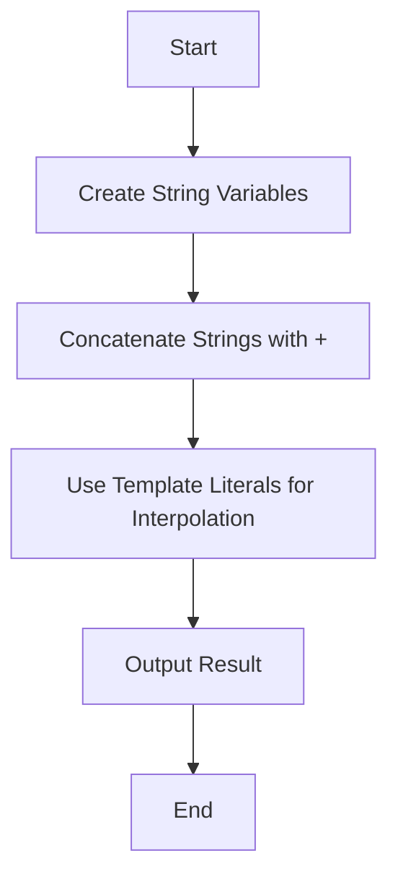

## 4.4 Working with Strings

Welcome to the fascinating world of strings in JavaScript! Strings are a fundamental data type that allow us to work with text. Whether you're displaying a message, processing user input, or manipulating data, strings are indispensable. In this section, we'll explore how to create and manipulate strings using various techniques. By the end, you'll be equipped with the knowledge to handle strings effectively in your JavaScript programs.

### Creating Strings

In JavaScript, strings can be created using single quotes (`'`), double quotes (`"`), or backticks (`` ` ``). Each of these methods has its own use cases and advantages.

#### Single Quotes and Double Quotes

Single quotes and double quotes are interchangeable for creating strings. The choice between them often comes down to personal preference or the need to include one type of quote inside another.

```javascript
// Using single quotes
let singleQuoteString = 'Hello, World!';

// Using double quotes
let doubleQuoteString = "Hello, World!";
```

When using single or double quotes, if you need to include the same type of quote within the string, you'll need to use an escape sequence.

```javascript
// Including a single quote in a single-quoted string
let quoteInSingle = 'It\'s a beautiful day!';

// Including a double quote in a double-quoted string
let quoteInDouble = "He said, \"Hello!\"";
```

#### Backticks and Template Literals

Backticks are used to create template literals, which offer more flexibility than single or double quotes. Template literals allow for string interpolation and multiline strings without the need for escape sequences.

```javascript
// Using backticks for a simple string
let backtickString = `Hello, World!`;

// Multiline string with backticks
let multilineString = `This is a string
that spans multiple
lines.`;

// String interpolation with template literals
let name = 'Alice';
let greeting = `Hello, ${name}!`;
```

### Escape Sequences

Escape sequences are special characters that allow you to include characters in a string that would otherwise be difficult to represent. They are preceded by a backslash (`\`).

- `\n`: New line
- `\t`: Tab
- `\\`: Backslash
- `\'`: Single quote
- `\"`: Double quote

```javascript
let escapeExample = 'Line 1\nLine 2\tTabbed';
console.log(escapeExample);
```

### String Concatenation

String concatenation is the process of joining two or more strings together. In JavaScript, the `+` operator is used for this purpose.

```javascript
let firstName = 'John';
let lastName = 'Doe';
let fullName = firstName + ' ' + lastName;
console.log(fullName); // Outputs: John Doe
```

### Template Literals and String Interpolation

Template literals, created with backticks, allow for string interpolation, which means you can embed expressions inside a string. This makes it easier to construct strings dynamically.

```javascript
let age = 30;
let interpolatedString = `My name is ${name} and I am ${age} years old.`;
console.log(interpolatedString);
```

### Common String Methods

JavaScript provides a variety of methods to manipulate strings. Here are some of the most commonly used ones:

#### `.length`

The `.length` property returns the number of characters in a string.

```javascript
let text = 'Hello, World!';
console.log(text.length); // Outputs: 13
```

#### `.toUpperCase()` and `.toLowerCase()`

These methods convert a string to uppercase or lowercase, respectively.

```javascript
let lowerCaseText = 'hello';
let upperCaseText = lowerCaseText.toUpperCase();
console.log(upperCaseText); // Outputs: HELLO

let mixedCaseText = 'HeLLo';
let lowerText = mixedCaseText.toLowerCase();
console.log(lowerText); // Outputs: hello
```

#### `.includes()`

The `.includes()` method checks if a string contains a specified substring, returning `true` or `false`.

```javascript
let sentence = 'The quick brown fox jumps over the lazy dog.';
let hasFox = sentence.includes('fox');
console.log(hasFox); // Outputs: true
```

#### `.indexOf()` and `.lastIndexOf()`

These methods return the index of the first or last occurrence of a specified substring. If the substring is not found, they return `-1`.

```javascript
let phrase = 'Hello, World!';
let index = phrase.indexOf('World');
console.log(index); // Outputs: 7

let lastIndex = phrase.lastIndexOf('o');
console.log(lastIndex); // Outputs: 8
```

#### `.slice()`

The `.slice()` method extracts a section of a string and returns it as a new string.

```javascript
let originalText = 'JavaScript is fun!';
let slicedText = originalText.slice(0, 10);
console.log(slicedText); // Outputs: JavaScript
```

#### `.replace()`

The `.replace()` method returns a new string with some or all matches of a pattern replaced by a replacement.

```javascript
let greetingText = 'Hello, World!';
let newGreeting = greetingText.replace('World', 'JavaScript');
console.log(newGreeting); // Outputs: Hello, JavaScript!
```

#### `.split()`

The `.split()` method splits a string into an array of substrings based on a specified delimiter.

```javascript
let csv = 'apple,banana,cherry';
let fruits = csv.split(',');
console.log(fruits); // Outputs: ['apple', 'banana', 'cherry']
```

### Try It Yourself

Now it's your turn to experiment with strings in JavaScript! Try modifying the examples above or create your own strings using different quotes and methods. Here are a few challenges to get you started:

1. Create a string using backticks that includes a variable and a multiline message.
2. Use string concatenation to combine three different strings into one.
3. Check if a string contains the word "JavaScript" using the `.includes()` method.
4. Convert a mixed-case string to all uppercase letters.

### Visual Aids

To help you visualize how strings and their methods work, let's look at a simple flowchart that demonstrates the process of string concatenation and interpolation.



This flowchart outlines the steps we take when working with strings, from creating variables to outputting the final result.

### References and Links

For more information on JavaScript strings, you can explore the following resources:

- [MDN Web Docs: String](https://developer.mozilla.org/en-US/docs/Web/JavaScript/Reference/Global_Objects/String)
- [W3Schools: JavaScript Strings](https://www.w3schools.com/js/js_strings.asp)

### Engagement and Reinforcement

To reinforce your understanding of strings, try answering the following questions:

- What are the differences between single quotes, double quotes, and backticks in JavaScript?
- How do escape sequences work, and when would you use them?
- What are some advantages of using template literals over traditional string concatenation?

### Summary

In this section, we've covered the basics of working with strings in JavaScript. We've learned how to create strings using different types of quotes, use escape sequences, concatenate strings, and utilize template literals for interpolation. We've also explored common string methods that allow us to manipulate and analyze text. With these tools in your toolkit, you're well on your way to mastering strings in JavaScript!

## Quiz Time!



### Which of the following is a valid way to create a string in JavaScript?

- [x] `let str = 'Hello';`
- [x] `let str = "Hello";`
- [x] `let str = `Hello`;`
- [ ] `let str = Hello;`

> **Explanation:** Strings can be created using single quotes, double quotes, or backticks. The last option is incorrect because it lacks quotes.

### What does the `\n` escape sequence represent in a string?

- [x] New line
- [ ] Tab
- [ ] Backslash
- [ ] Single quote

> **Explanation:** The `\n` escape sequence is used to insert a new line in a string.

### How can you include a double quote inside a double-quoted string?

- [x] Use `\"` inside the string
- [ ] Use `\'` inside the string
- [ ] Use `\\` inside the string
- [ ] Use `\n` inside the string

> **Explanation:** To include a double quote inside a double-quoted string, use the escape sequence `\"`.

### What is the output of the following code: `console.log('Hello' + ' ' + 'World!');`?

- [x] `Hello World!`
- [ ] `HelloWorld!`
- [ ] `Hello + World!`
- [ ] `Hello World`

> **Explanation:** The `+` operator concatenates the strings with a space in between, resulting in `Hello World!`.

### Which method would you use to convert a string to all uppercase letters?

- [x] `.toUpperCase()`
- [ ] `.toLowerCase()`
- [ ] `.includes()`
- [ ] `.slice()`

> **Explanation:** The `.toUpperCase()` method converts a string to all uppercase letters.

### What does the `.includes()` method return?

- [x] `true` or `false`
- [ ] The index of the substring
- [ ] The length of the string
- [ ] A new string with the substring replaced

> **Explanation:** The `.includes()` method returns `true` if the specified substring is found, otherwise `false`.

### How do you create a multiline string using backticks?

- [x] Use backticks and press Enter between lines
- [ ] Use single quotes and `\n` escape sequences
- [ ] Use double quotes and `\t` escape sequences
- [ ] Use backslashes at the end of each line

> **Explanation:** Backticks allow for multiline strings by simply pressing Enter between lines.

### What is string interpolation?

- [x] Embedding expressions inside a string using `${}`
- [ ] Concatenating strings using the `+` operator
- [ ] Splitting a string into an array
- [ ] Replacing a substring with another string

> **Explanation:** String interpolation involves embedding expressions inside a string using `${}` with template literals.

### Which method splits a string into an array of substrings?

- [x] `.split()`
- [ ] `.slice()`
- [ ] `.replace()`
- [ ] `.indexOf()`

> **Explanation:** The `.split()` method splits a string into an array of substrings based on a specified delimiter.

### True or False: Template literals can only be used for string interpolation.

- [ ] True
- [x] False

> **Explanation:** False. Template literals can also be used for creating multiline strings and embedding expressions.


