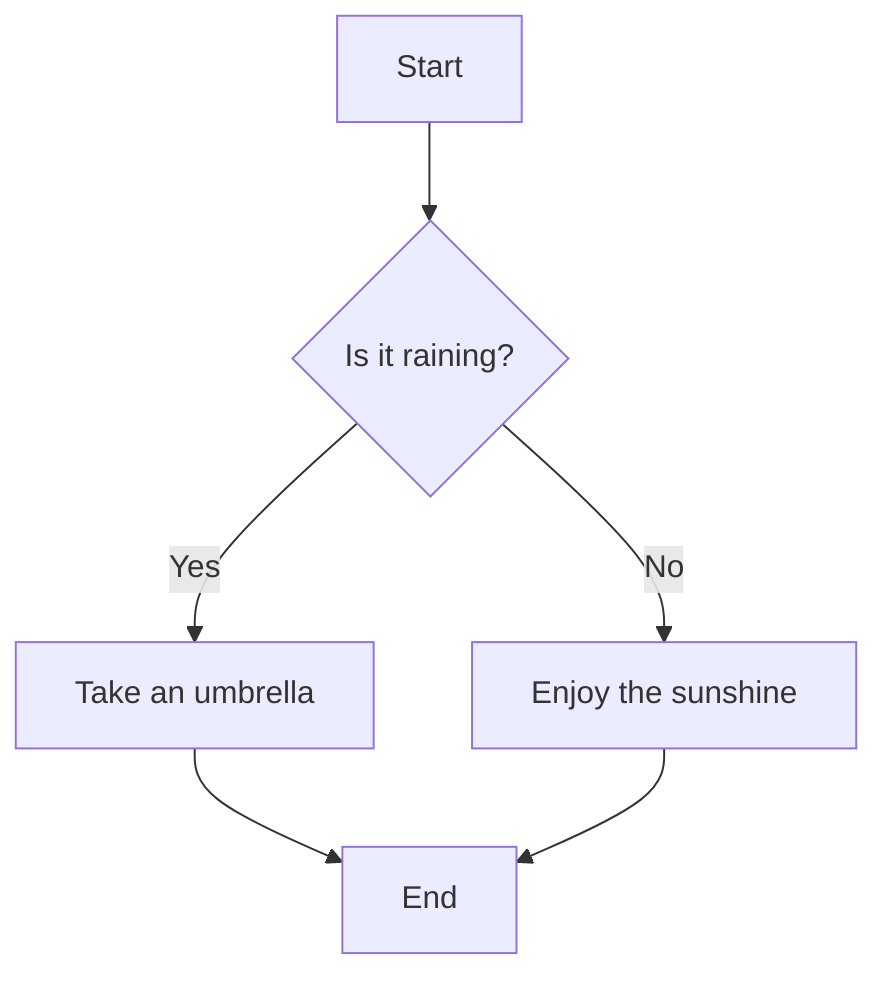

## 4.6 Boolean Values

In the world of programming, making decisions is a fundamental part of writing code. At the heart of these decisions are Boolean values, which are the simplest form of data types in JavaScript. Boolean values can be either `true` or `false`, and they play a critical role in controlling the flow of a program.

### Understanding Boolean Values

Boolean values are named after George Boole, a mathematician who first defined an algebraic system of logic in the mid-1800s. In JavaScript, a Boolean value is a primitive data type that can hold one of two values: `true` or `false`. These values are used to represent truthiness and falseness in logical expressions and are essential for decision-making in code.

#### Defining Boolean Values

In JavaScript, you can directly assign a Boolean value to a variable. Here’s how you can define Boolean values:

```javascript
let isJavaScriptFun = true; // This variable holds a Boolean value of true
let isRaining = false; // This variable holds a Boolean value of false
```

In the examples above, `isJavaScriptFun` is set to `true`, indicating that JavaScript is fun, while `isRaining` is set to `false`, indicating that it is not raining.

### The Role of Boolean Values in Programming Logic

Boolean values are integral to programming logic because they allow us to perform conditional operations. Conditional operations enable a program to execute different code blocks based on whether a condition is `true` or `false`.

#### Using Booleans in Conditional Statements

Consider the following example where we use a Boolean value in an `if` statement:

```javascript
let isLoggedIn = true;

if (isLoggedIn) {
    console.log("Welcome back, user!");
} else {
    console.log("Please log in.");
}
```

In this example, the `if` statement checks the value of `isLoggedIn`. If it is `true`, the program prints "Welcome back, user!" to the console. If it is `false`, the program prints "Please log in."

### Truthy and Falsy Values in JavaScript

JavaScript is a flexible language, and it allows more than just `true` and `false` to be used in Boolean contexts. This is where the concepts of "truthy" and "falsy" values come into play.

#### What are Truthy and Falsy Values?

In JavaScript, a truthy value is a value that translates to `true` when evaluated in a Boolean context, while a falsy value translates to `false`. Understanding these concepts is crucial because they affect how conditions are evaluated in your code.

##### Falsy Values

There are only a few falsy values in JavaScript:

- `false`: The Boolean value `false`.
- `0`: The number zero.
- `""` or `''`: An empty string.
- `null`: Represents the absence of any value.
- `undefined`: A variable that has been declared but not assigned a value.
- `NaN`: Stands for "Not-a-Number", a result of an invalid or undefined mathematical operation.

Here's an example demonstrating falsy values:

```javascript
let testValue = 0;

if (testValue) {
    console.log("This is truthy.");
} else {
    console.log("This is falsy.");
}

// Output: "This is falsy."
```

In this example, `testValue` is `0`, which is a falsy value. Therefore, the `else` block is executed.

##### Truthy Values

Anything that is not falsy is considered truthy. This includes:

- Non-zero numbers (e.g., `1`, `-1`, `3.14`)
- Non-empty strings (e.g., `"hello"`, `"false"`)
- Objects and arrays (even empty ones, like `{}` or `[]`)
- The Boolean value `true`

Here's an example demonstrating truthy values:

```javascript
let testValue = "hello";

if (testValue) {
    console.log("This is truthy.");
} else {
    console.log("This is falsy.");
}

// Output: "This is truthy."
```

In this example, `testValue` is a non-empty string, which is truthy, so the `if` block is executed.

### Conditions and Expressions Resulting in Boolean Values

In JavaScript, conditions and expressions often result in Boolean values. These expressions are used in control structures like `if` statements, loops, and more.

#### Comparison Operators

Comparison operators are used to compare two values and return a Boolean result. Here are some common comparison operators:

- `==`: Equal to
- `!=`: Not equal to
- `===`: Strict equal to (checks both value and type)
- `!==`: Strict not equal to
- `>`: Greater than
- `<`: Less than
- `>=`: Greater than or equal to
- `<=`: Less than or equal to

Example of using comparison operators:

```javascript
let age = 18;

if (age >= 18) {
    console.log("You are an adult.");
} else {
    console.log("You are not an adult.");
}

// Output: "You are an adult."
```

In this example, the condition `age >= 18` evaluates to `true`, so the `if` block is executed.

#### Logical Operators

Logical operators are used to combine multiple Boolean expressions. The most common logical operators are:

- `&&`: Logical AND
- `||`: Logical OR
- `!`: Logical NOT

Example of using logical operators:

```javascript
let isSunny = true;
let isWarm = false;

if (isSunny && isWarm) {
    console.log("It's a great day for a picnic!");
} else {
    console.log("Maybe we should stay indoors.");
}

// Output: "Maybe we should stay indoors."
```

In this example, the condition `isSunny && isWarm` evaluates to `false` because `isWarm` is `false`.

### Try It Yourself

To reinforce your understanding of Boolean values, try modifying the code examples above. Change the values of variables and observe how the output changes. Experiment with different combinations of truthy and falsy values, and use comparison and logical operators to create your own conditions.

### Visualizing Boolean Logic

To better understand how Boolean logic works, let's visualize it using a simple flowchart. Consider the following decision-making process:



In this flowchart, we start by asking if it is raining. If the answer is "Yes," we take an umbrella. If the answer is "No," we enjoy the sunshine. This simple decision-making process is an example of how Boolean logic is used in programming.

### Key Takeaways

- Boolean values are fundamental to programming logic and can be either `true` or `false`.
- JavaScript also recognizes truthy and falsy values, which are used in Boolean contexts.
- Conditions and expressions often result in Boolean values and are used in control structures.
- Comparison and logical operators help create complex conditions for decision-making.

### Further Reading

For more information on Boolean values and logic in JavaScript, check out these resources:

- [MDN Web Docs: Boolean](https://developer.mozilla.org/en-US/docs/Web/JavaScript/Reference/Global_Objects/Boolean)
- [W3Schools: JavaScript Booleans](https://www.w3schools.com/js/js_booleans.asp)

## Quiz Time!



### What is a Boolean value in JavaScript?

- [x] A data type that can be either true or false
- [ ] A data type that can hold numbers
- [ ] A data type that can hold strings
- [ ] A data type that represents an object

> **Explanation:** A Boolean value in JavaScript is a primitive data type that can be either `true` or `false`.

### Which of the following is a falsy value in JavaScript?

- [x] 0
- [ ] 1
- [ ] "false"
- [ ] {}

> **Explanation:** The number `0` is considered a falsy value in JavaScript, while `1`, `"false"`, and `{}` are truthy.

### What does the `&&` operator do in a Boolean expression?

- [x] It performs a logical AND operation
- [ ] It performs a logical OR operation
- [ ] It performs a logical NOT operation
- [ ] It performs a comparison operation

> **Explanation:** The `&&` operator is used to perform a logical AND operation, which returns `true` only if both operands are truthy.

### Which of the following expressions evaluates to `true`?

- [x] "hello" && 1
- [ ] 0 || false
- [ ] !true
- [ ] null && undefined

> **Explanation:** The expression `"hello" && 1` evaluates to `true` because both `"hello"` and `1` are truthy values.

### What is the result of the expression `!false`?

- [x] true
- [ ] false
- [ ] null
- [ ] undefined

> **Explanation:** The `!` operator negates the Boolean value, so `!false` evaluates to `true`.

### Which of the following is a truthy value?

- [x] "0"
- [ ] 0
- [ ] ""
- [ ] NaN

> **Explanation:** The string `"0"` is a truthy value, while `0`, `""`, and `NaN` are falsy.

### What does the `||` operator do in a Boolean expression?

- [x] It performs a logical OR operation
- [ ] It performs a logical AND operation
- [ ] It performs a logical NOT operation
- [ ] It performs a comparison operation

> **Explanation:** The `||` operator is used to perform a logical OR operation, which returns `true` if at least one operand is truthy.

### Which of the following is a falsy value?

- [x] undefined
- [ ] "undefined"
- [ ] []
- [ ] true

> **Explanation:** The value `undefined` is falsy, while `"undefined"`, `[]`, and `true` are truthy.

### What is the result of the expression `true || false`?

- [x] true
- [ ] false
- [ ] null
- [ ] undefined

> **Explanation:** The expression `true || false` evaluates to `true` because at least one operand is truthy.

### True or False: An empty array `[]` is a falsy value in JavaScript.

- [ ] True
- [x] False

> **Explanation:** An empty array `[]` is considered a truthy value in JavaScript.


