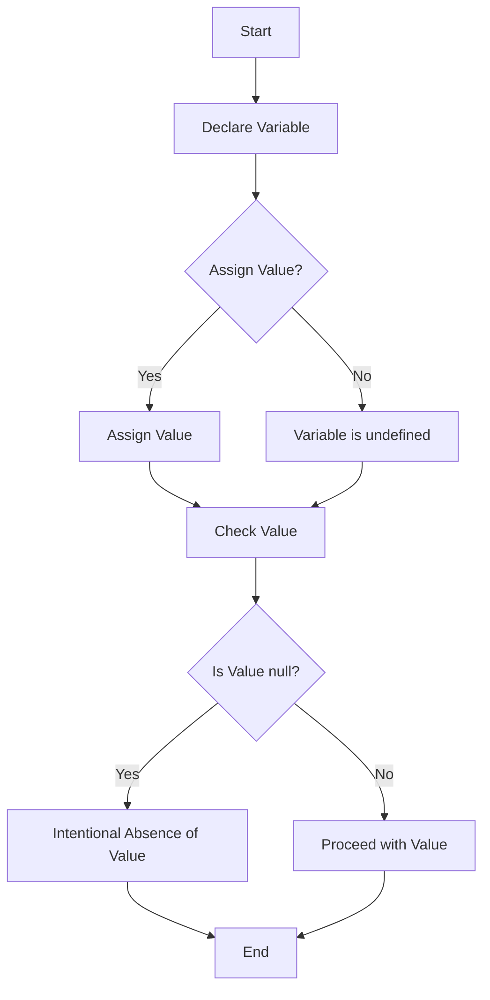

## 4.7 `null` and `undefined`

As we dive deeper into JavaScript, understanding the subtle differences between `null` and `undefined` is crucial for writing effective and error-free code. These two concepts often confuse beginners, but with a clear explanation and practical examples, you will be able to grasp their significance and use them appropriately in your programs.

### Understanding `undefined`

In JavaScript, `undefined` is a primitive value that is automatically assigned to variables that have been declared but not yet initialized. It represents the absence of a value. Let's explore this concept with some examples.

#### When Does `undefined` Occur?

1. **Uninitialized Variables**: When you declare a variable without assigning it a value, JavaScript automatically assigns it the value `undefined`.

    ```javascript
    let myVariable;
    console.log(myVariable); // Output: undefined
    ```

2. **Missing Function Arguments**: If you call a function without providing all the expected arguments, the missing arguments are assigned the value `undefined`.

    ```javascript
    function greet(name) {
        console.log("Hello, " + name);
    }

    greet(); // Output: Hello, undefined
    ```

3. **Non-Existent Object Properties**: Accessing a property that does not exist on an object will return `undefined`.

    ```javascript
    let person = { name: "Alice" };
    console.log(person.age); // Output: undefined
    ```

4. **Array Elements**: Accessing an array element that hasn't been initialized will also return `undefined`.

    ```javascript
    let numbers = [1, 2, 3];
    console.log(numbers[5]); // Output: undefined
    ```

### Understanding `null`

Unlike `undefined`, `null` is a value that you can explicitly assign to a variable to indicate that it should have no value. It is a way for programmers to signify the intentional absence of any object value.

#### When to Use `null`

1. **Intentional Absence of Value**: Use `null` when you want to explicitly indicate that a variable should not have a value.

    ```javascript
    let selectedOption = null;
    ```

2. **Resetting Variables**: You might assign `null` to a variable to reset or clear its value.

    ```javascript
    let user = { name: "Bob" };
    user = null; // The user object is now cleared
    ```

### Comparing `null` and `undefined`

While both `null` and `undefined` represent the absence of a value, they are used in different contexts and have distinct meanings. Let's compare them using equality operators.

#### Using `==` (Loose Equality)

The `==` operator checks for equality but does not consider the type. In JavaScript, `null` and `undefined` are considered equal when using `==`.

```javascript
console.log(null == undefined); // Output: true
```

#### Using `===` (Strict Equality)

The `===` operator checks for both value and type equality. Since `null` and `undefined` are different types, they are not equal when using `===`.

```javascript
console.log(null === undefined); // Output: false
```

### Practical Examples

Let's explore some practical examples to solidify our understanding of `null` and `undefined`.

#### Example 1: Function Parameters

Consider a function that calculates the area of a rectangle. If the height is not provided, it should default to `null` to indicate that the calculation cannot proceed.

```javascript
function calculateArea(width, height = null) {
    if (height === null) {
        console.log("Height is required to calculate the area.");
        return;
    }
    console.log("Area: " + (width * height));
}

calculateArea(5); // Output: Height is required to calculate the area.
calculateArea(5, 10); // Output: Area: 50
```

#### Example 2: Object Properties

When working with objects, you might encounter situations where a property is optional. Using `undefined` can help you determine if a property was never set.

```javascript
let car = {
    make: "Toyota",
    model: "Corolla"
};

if (car.year === undefined) {
    console.log("Year is not specified.");
} else {
    console.log("Year: " + car.year);
}
// Output: Year is not specified.
```

### Visualizing `null` and `undefined`

To better understand the relationship between `null` and `undefined`, let's visualize their usage in a flowchart.



**Description**: This flowchart illustrates the decision-making process when dealing with `null` and `undefined`. It shows how variables are initialized and how to handle their values.

### Common Mistakes and Best Practices

1. **Avoid Using `null` and `undefined` Interchangeably**: Understand the context and use the appropriate value to convey your intent.

2. **Initialize Variables**: Always initialize variables to avoid unexpected `undefined` values.

3. **Check for `null` and `undefined`**: Use strict equality (`===`) to differentiate between `null` and `undefined`.

4. **Use Default Parameters**: When defining functions, use default parameters to handle missing arguments gracefully.

### References and Further Reading

- [MDN Web Docs - null](https://developer.mozilla.org/en-US/docs/Web/JavaScript/Reference/Global_Objects/null)
- [MDN Web Docs - undefined](https://developer.mozilla.org/en-US/docs/Web/JavaScript/Reference/Global_Objects/undefined)
- [W3Schools - JavaScript null](https://www.w3schools.com/jsref/jsref_null.asp)
- [W3Schools - JavaScript undefined](https://www.w3schools.com/jsref/jsref_undefined.asp)

### Try It Yourself

Experiment with the examples provided. Try modifying the code to see how `null` and `undefined` behave in different scenarios. For instance, change the default value of the `height` parameter in the `calculateArea` function to `undefined` and observe the output.

### Summary

In this section, we explored the concepts of `null` and `undefined` in JavaScript. We learned that `undefined` is automatically assigned to uninitialized variables, while `null` is used to explicitly indicate the absence of a value. We also compared these two using equality operators and discussed best practices for their usage. Understanding these concepts is essential for writing robust JavaScript code.

## Quiz Time!



### What is the default value of an uninitialized variable in JavaScript?

- [x] undefined
- [ ] null
- [ ] 0
- [ ] ""

> **Explanation:** In JavaScript, variables that are declared but not initialized are automatically assigned the value `undefined`.

### Which of the following represents an intentional absence of a value?

- [ ] undefined
- [x] null
- [ ] NaN
- [ ] false

> **Explanation:** `null` is used to represent an intentional absence of a value, whereas `undefined` indicates that a variable has not been initialized.

### What will be the output of `console.log(null == undefined);`?

- [x] true
- [ ] false
- [ ] null
- [ ] undefined

> **Explanation:** Using the loose equality operator `==`, `null` and `undefined` are considered equal.

### What will be the output of `console.log(null === undefined);`?

- [ ] true
- [x] false
- [ ] null
- [ ] undefined

> **Explanation:** The strict equality operator `===` checks for both value and type, and `null` and `undefined` are different types.

### Which operator should you use to check both value and type equality?

- [ ] ==
- [x] ===
- [ ] !=
- [ ] =

> **Explanation:** The `===` operator checks for both value and type equality, ensuring a strict comparison.

### What value does a missing function argument receive?

- [x] undefined
- [ ] null
- [ ] 0
- [ ] ""

> **Explanation:** Missing function arguments are assigned the value `undefined` by default.

### How can you reset a variable to indicate it should have no value?

- [ ] Assign undefined
- [x] Assign null
- [ ] Assign 0
- [ ] Assign ""

> **Explanation:** Assigning `null` to a variable indicates that it should have no value.

### What will `console.log(typeof null);` output?

- [ ] "null"
- [ ] "undefined"
- [x] "object"
- [ ] "string"

> **Explanation:** In JavaScript, `typeof null` returns "object", which is a historical bug in the language.

### How can you check if an object property does not exist?

- [x] Check if it is undefined
- [ ] Check if it is null
- [ ] Check if it is false
- [ ] Check if it is 0

> **Explanation:** Accessing a non-existent object property returns `undefined`, so checking for `undefined` can determine if a property does not exist.

### True or False: `null` and `undefined` can be used interchangeably.

- [ ] True
- [x] False

> **Explanation:** `null` and `undefined` have different meanings and should not be used interchangeably. `null` is an intentional absence of value, while `undefined` indicates a lack of initialization.


