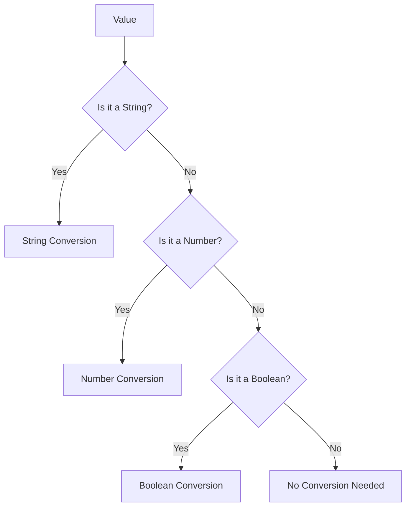

## 4.8 Basic Type Conversion

In JavaScript, understanding how data types interact is crucial for writing effective and error-free code. One of the key aspects of this interaction is type conversion, which allows us to change a value from one data type to another. This section will explore both implicit type coercion and explicit type conversion, providing you with the knowledge to handle data types confidently.

### What is Type Conversion?

Type conversion is the process of converting a value from one data type to another. In JavaScript, this can happen automatically (implicit type coercion) or manually (explicit type conversion). Let's dive into these concepts to understand how they work and when to use them.

### Implicit Type Coercion

Implicit type coercion occurs when JavaScript automatically converts a value from one type to another. This often happens in operations involving different data types. While implicit coercion can be convenient, it can also lead to unexpected results if not understood properly.

#### Demonstrating Implicit Type Coercion

Let's look at some examples to see how implicit type coercion works:

```javascript
// Example 1: String and Number
let result1 = '5' + 3; 
console.log(result1); // Output: '53'
// Explanation: The number 3 is coerced into a string, and the two strings are concatenated.

// Example 2: String and Boolean
let result2 = '5' + true;
console.log(result2); // Output: '5true'
// Explanation: The boolean true is coerced into a string, resulting in string concatenation.

// Example 3: Number and Boolean
let result3 = 5 + true;
console.log(result3); // Output: 6
// Explanation: The boolean true is coerced into the number 1, and the numbers are added.
```

In these examples, JavaScript automatically converts the types to perform the operation. This behavior is known as implicit coercion.

#### When Implicit Coercion Occurs

Implicit coercion typically occurs in the following scenarios:

- **Arithmetic Operations**: When using operators like `+`, `-`, `*`, and `/`, JavaScript may convert operands to numbers.
- **String Concatenation**: The `+` operator can also concatenate strings, leading to string coercion.
- **Logical Operations**: Logical operators such as `&&`, `||`, and `!` may coerce values to booleans.

### Explicit Type Conversion

Explicit type conversion, also known as type casting, involves manually converting a value from one type to another using JavaScript functions. This approach gives you more control over the conversion process and helps prevent unexpected results.

#### Performing Explicit Type Conversion

JavaScript provides several functions for explicit type conversion:

1. **String Conversion**: Use the `String()` function to convert a value to a string.
2. **Number Conversion**: Use the `Number()` function to convert a value to a number.
3. **Boolean Conversion**: Use the `Boolean()` function to convert a value to a boolean.

Let's explore each of these in detail.

#### String Conversion

The `String()` function converts a value to a string. This is useful when you need to display numbers or booleans as text.

```javascript
// Convert a number to a string
let num = 42;
let strNum = String(num);
console.log(strNum); // Output: '42'
console.log(typeof strNum); // Output: 'string'

// Convert a boolean to a string
let bool = true;
let strBool = String(bool);
console.log(strBool); // Output: 'true'
console.log(typeof strBool); // Output: 'string'
```

#### Number Conversion

The `Number()` function converts a value to a number. This is helpful when performing arithmetic operations on strings or booleans.

```javascript
// Convert a string to a number
let str = '123';
let numStr = Number(str);
console.log(numStr); // Output: 123
console.log(typeof numStr); // Output: 'number'

// Convert a boolean to a number
let bool = false;
let numBool = Number(bool);
console.log(numBool); // Output: 0
console.log(typeof numBool); // Output: 'number'
```

#### Boolean Conversion

The `Boolean()` function converts a value to a boolean. This is often used in conditional statements to evaluate truthiness.

```javascript
// Convert a number to a boolean
let num = 0;
let boolNum = Boolean(num);
console.log(boolNum); // Output: false
console.log(typeof boolNum); // Output: 'boolean'

// Convert a string to a boolean
let str = 'hello';
let boolStr = Boolean(str);
console.log(boolStr); // Output: true
console.log(typeof boolStr); // Output: 'boolean'
```

### When Type Conversion is Necessary

Type conversion is often necessary to ensure accurate comparisons or operations. Let's explore some scenarios where type conversion is crucial.

#### Accurate Comparisons

When comparing values of different types, explicit type conversion ensures that the comparison is meaningful.

```javascript
// Without type conversion
let a = '5';
let b = 5;
console.log(a == b); // Output: true
// Explanation: Implicit coercion converts '5' to 5, resulting in true.

// With type conversion
console.log(Number(a) === b); // Output: true
// Explanation: Explicit conversion ensures both values are numbers before comparison.
```

#### Performing Operations

Explicit type conversion ensures that operations involving different types produce expected results.

```javascript
// Without type conversion
let x = '10';
let y = 2;
console.log(x * y); // Output: 20
// Explanation: Implicit coercion converts '10' to 10.

// With type conversion
console.log(Number(x) * y); // Output: 20
// Explanation: Explicit conversion ensures both values are numbers before multiplication.
```

### Try It Yourself

Now that we've explored type conversion, let's try some exercises to reinforce your understanding.

1. **Experiment with Implicit Coercion**: Modify the following code to see how implicit coercion affects the result.

    ```javascript
    let result = '10' - 5;
    console.log(result); // What do you expect the output to be?
    ```

2. **Practice Explicit Conversion**: Convert the following values using explicit conversion functions and predict the output.

    ```javascript
    let val1 = 'false';
    let val2 = '123abc';
    console.log(Number(val1)); // Predict the output
    console.log(Number(val2)); // Predict the output
    ```

3. **Create a Comparison**: Write a comparison that uses explicit type conversion to ensure accuracy.

    ```javascript
    let strNum = '100';
    let num = 100;
    // Write a comparison using explicit conversion
    ```

### Visualizing Type Conversion

To better understand type conversion, let's visualize the process using a flowchart. This diagram illustrates how values are converted between different types.



**Diagram Explanation**: This flowchart shows the decision-making process for type conversion. Depending on the initial type of the value, it is converted to a string, number, or boolean, or no conversion is performed if it's already of the desired type.

### References and Further Reading

For more information on type conversion in JavaScript, check out these resources:

- [MDN Web Docs: Type Conversions](https://developer.mozilla.org/en-US/docs/Web/JavaScript/Guide/Expressions_and_Operators#type_conversions)
- [W3Schools: JavaScript Type Conversion](https://www.w3schools.com/js/js_type_conversion.asp)

### Key Takeaways

- **Implicit Type Coercion**: JavaScript automatically converts values in certain operations, which can lead to unexpected results.
- **Explicit Type Conversion**: Use `String()`, `Number()`, and `Boolean()` functions to manually convert values and ensure accuracy.
- **Importance of Conversion**: Type conversion is crucial for accurate comparisons and operations involving different data types.

By understanding and applying type conversion, you'll be better equipped to handle data types in JavaScript and write more reliable code.

## Quiz Time!



### What is implicit type coercion in JavaScript?

- [x] Automatic conversion of values by JavaScript
- [ ] Manual conversion of values by the programmer
- [ ] Conversion of values using external libraries
- [ ] Conversion of values only in strict mode

> **Explanation:** Implicit type coercion is when JavaScript automatically converts values from one type to another during operations.

### Which function is used for explicit string conversion in JavaScript?

- [x] String()
- [ ] Number()
- [ ] Boolean()
- [ ] Convert()

> **Explanation:** The `String()` function is used to explicitly convert a value to a string.

### What is the result of `Number('123abc')`?

- [ ] 123
- [ ] 0
- [ ] NaN
- [x] NaN

> **Explanation:** `Number('123abc')` results in `NaN` because the string cannot be fully converted to a number.

### How does JavaScript handle `true + 1`?

- [x] Converts `true` to 1 and adds it to 1
- [ ] Converts `true` to 0 and adds it to 1
- [ ] Throws an error
- [ ] Concatenates `true` and 1

> **Explanation:** JavaScript converts `true` to 1, resulting in the sum of 2.

### Which of the following is a scenario where implicit coercion occurs?

- [x] Using the `+` operator with a string and a number
- [ ] Comparing two numbers using `===`
- [ ] Assigning a value to a variable
- [ ] Declaring a function

> **Explanation:** Implicit coercion occurs when using the `+` operator with a string and a number, leading to string concatenation.

### What does `Boolean('')` evaluate to?

- [ ] true
- [x] false
- [ ] NaN
- [ ] undefined

> **Explanation:** `Boolean('')` evaluates to `false` because an empty string is considered falsy.

### Why is explicit type conversion important?

- [x] Ensures accurate comparisons and operations
- [ ] Makes code run faster
- [ ] Reduces memory usage
- [ ] Is required in all JavaScript programs

> **Explanation:** Explicit type conversion ensures accurate comparisons and operations by converting values to the desired type.

### What is the output of `'5' - 3` in JavaScript?

- [x] 2
- [ ] '53'
- [ ] NaN
- [ ] Error

> **Explanation:** `'5' - 3` results in 2 because JavaScript implicitly converts the string '5' to the number 5.

### Which function is used for explicit number conversion in JavaScript?

- [x] Number()
- [ ] String()
- [ ] Boolean()
- [ ] Convert()

> **Explanation:** The `Number()` function is used to explicitly convert a value to a number.

### True or False: Implicit type coercion can lead to unexpected results if not understood properly.

- [x] True
- [ ] False

> **Explanation:** Implicit type coercion can lead to unexpected results if the programmer does not understand how JavaScript converts values.


