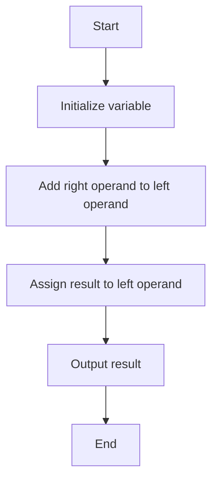

## 5.1 Assignment Operators

Welcome to the fascinating world of assignment operators in JavaScript! As we embark on this journey, we'll explore how these operators are used to assign values to variables, a fundamental concept in programming. By the end of this section, you'll have a solid understanding of both basic and compound assignment operators, enabling you to write more efficient and readable code.

### Understanding the Basic Assignment Operator `=`

The assignment operator `=` is one of the most fundamental tools in JavaScript. It is used to assign a value to a variable. Let's break it down:

- **Variable**: A storage location identified by a memory address and an associated symbolic name (an identifier), which contains some known or unknown quantity of information referred to as a value.
- **Value**: The data stored in a variable.

When you use the `=` operator, you're telling JavaScript to store a value in a variable. Here's a simple example:

```javascript
let number; // Declare a variable named 'number'
number = 5; // Assign the value 5 to the variable 'number'
console.log(number); // Output: 5
```

In this example, we first declare a variable `number` using the `let` keyword. Then, we use the `=` operator to assign the value `5` to `number`. Finally, we use `console.log()` to display the value stored in `number`.

### Compound Assignment Operators

Compound assignment operators are shorthand ways to update the value of a variable. They combine an arithmetic operation with an assignment. These operators make your code more concise and often more readable. Let's explore some of the most common compound assignment operators:

#### 1. Addition Assignment `+=`

The `+=` operator adds the right operand to the left operand and assigns the result to the left operand.

```javascript
let total = 10; // Initialize 'total' with 10
total += 5; // Equivalent to total = total + 5
console.log(total); // Output: 15
```

In this example, `total += 5` is a shorthand for `total = total + 5`. The value of `total` is updated to `15`.

#### 2. Subtraction Assignment `-=`

The `-=` operator subtracts the right operand from the left operand and assigns the result to the left operand.

```javascript
let balance = 20; // Initialize 'balance' with 20
balance -= 5; // Equivalent to balance = balance - 5
console.log(balance); // Output: 15
```

Here, `balance -= 5` is a shorthand for `balance = balance - 5`. The value of `balance` is updated to `15`.

#### 3. Multiplication Assignment `*=`

The `*=` operator multiplies the left operand by the right operand and assigns the result to the left operand.

```javascript
let product = 4; // Initialize 'product' with 4
product *= 3; // Equivalent to product = product * 3
console.log(product); // Output: 12
```

In this case, `product *= 3` is a shorthand for `product = product * 3`. The value of `product` is updated to `12`.

#### 4. Division Assignment `/=`

The `/=` operator divides the left operand by the right operand and assigns the result to the left operand.

```javascript
let quotient = 20; // Initialize 'quotient' with 20
quotient /= 4; // Equivalent to quotient = quotient / 4
console.log(quotient); // Output: 5
```

Here, `quotient /= 4` is a shorthand for `quotient = quotient / 4`. The value of `quotient` is updated to `5`.

#### 5. Remainder Assignment `%=` 

The `%=` operator divides the left operand by the right operand and assigns the remainder to the left operand.

```javascript
let remainder = 10; // Initialize 'remainder' with 10
remainder %= 3; // Equivalent to remainder = remainder % 3
console.log(remainder); // Output: 1
```

In this example, `remainder %= 3` is a shorthand for `remainder = remainder % 3`. The value of `remainder` is updated to `1`.

### Visualizing Compound Assignment Operators

To better understand how compound assignment operators work, let's visualize the process using a flowchart. This flowchart represents the addition assignment operator `+=`:



This flowchart illustrates the steps involved in using the `+=` operator. The process starts by initializing a variable, adding the right operand to the left operand, assigning the result back to the left operand, and finally outputting the result.

### Try It Yourself

Now that we've covered the basics of assignment operators, it's time for you to experiment! Try modifying the following code examples to see how each operator affects the outcome:

```javascript
let x = 10;
x += 2; // Try changing the value and see the result
console.log(x);

let y = 15;
y -= 5; // Try changing the value and see the result
console.log(y);

let z = 3;
z *= 4; // Try changing the value and see the result
console.log(z);

let a = 20;
a /= 2; // Try changing the value and see the result
console.log(a);

let b = 7;
b %= 3; // Try changing the value and see the result
console.log(b);
```

### Practice Exercises

To reinforce your understanding of assignment operators, try solving these exercises:

1. **Exercise 1**: Write a JavaScript program that initializes a variable with the value `100`. Use the addition assignment operator to add `50` to the variable and print the result.

2. **Exercise 2**: Create a program that initializes a variable with the value `200`. Use the subtraction assignment operator to subtract `75` from the variable and display the result.

3. **Exercise 3**: Write a script that initializes a variable with the value `8`. Use the multiplication assignment operator to multiply the variable by `5` and output the result.

4. **Exercise 4**: Develop a program that initializes a variable with the value `40`. Use the division assignment operator to divide the variable by `4` and print the result.

5. **Exercise 5**: Create a JavaScript program that initializes a variable with the value `15`. Use the remainder assignment operator to find the remainder when the variable is divided by `4` and display the result.

### Key Takeaways

- The basic assignment operator `=` is used to assign values to variables.
- Compound assignment operators (`+=`, `-=`, `*=`, `/=`, `%=`) provide a shorthand way to perform arithmetic operations and assignments simultaneously.
- Understanding assignment operators is essential for writing efficient and readable JavaScript code.

### Further Reading

For more information on JavaScript operators, you can explore the following resources:

- [MDN Web Docs: Assignment Operators](https://developer.mozilla.org/en-US/docs/Web/JavaScript/Guide/Expressions_and_Operators#assignment_operators)
- [W3Schools: JavaScript Operators](https://www.w3schools.com/js/js_operators.asp)

By mastering assignment operators, you're building a strong foundation for your JavaScript programming skills. Keep practicing, and soon you'll be ready to tackle more complex programming challenges!

## Quiz Time!



### What does the basic assignment operator `=` do?

- [x] It assigns a value to a variable.
- [ ] It compares two values.
- [ ] It adds two numbers.
- [ ] It multiplies two numbers.

> **Explanation:** The `=` operator is used to assign a value to a variable in JavaScript.

### Which operator is used to add a value to a variable and assign the result back to the variable?

- [ ] `-=`
- [x] `+=`
- [ ] `*=`
- [ ] `/=`

> **Explanation:** The `+=` operator adds a value to a variable and assigns the result back to the variable.

### What is the result of the following code? `let x = 10; x -= 3;`

- [ ] 13
- [x] 7
- [ ] 3
- [ ] 10

> **Explanation:** The `-=` operator subtracts 3 from 10, resulting in 7.

### Which operator would you use to multiply a variable by a value and assign the result back to the variable?

- [ ] `+=`
- [ ] `-=`
- [x] `*=`
- [ ] `/=`

> **Explanation:** The `*=` operator multiplies a variable by a value and assigns the result back to the variable.

### What does the `%=` operator do?

- [ ] It adds two numbers.
- [ ] It divides two numbers.
- [x] It assigns the remainder of a division to a variable.
- [ ] It subtracts two numbers.

> **Explanation:** The `%=` operator divides the left operand by the right operand and assigns the remainder to the left operand.

### If `let y = 20; y /= 4;`, what is the value of `y`?

- [ ] 80
- [ ] 16
- [x] 5
- [ ] 4

> **Explanation:** The `/=` operator divides 20 by 4, resulting in 5.

### Which of the following statements is equivalent to `x = x + 10`?

- [ ] `x -= 10`
- [x] `x += 10`
- [ ] `x *= 10`
- [ ] `x /= 10`

> **Explanation:** The `+=` operator is equivalent to adding a value to a variable and assigning the result back to the variable.

### What is the result of `let z = 15; z %= 4;`?

- [ ] 3
- [ ] 4
- [x] 3
- [ ] 15

> **Explanation:** The `%=` operator finds the remainder of 15 divided by 4, which is 3.

### Which operator is used to subtract a value from a variable and assign the result back to the variable?

- [ ] `+=`
- [x] `-=`
- [ ] `*=`
- [ ] `/=`

> **Explanation:** The `-=` operator subtracts a value from a variable and assigns the result back to the variable.

### True or False: The `*=` operator is used to divide a variable by a value and assign the result back to the variable.

- [ ] True
- [x] False

> **Explanation:** The `*=` operator is used to multiply a variable by a value, not divide it.


