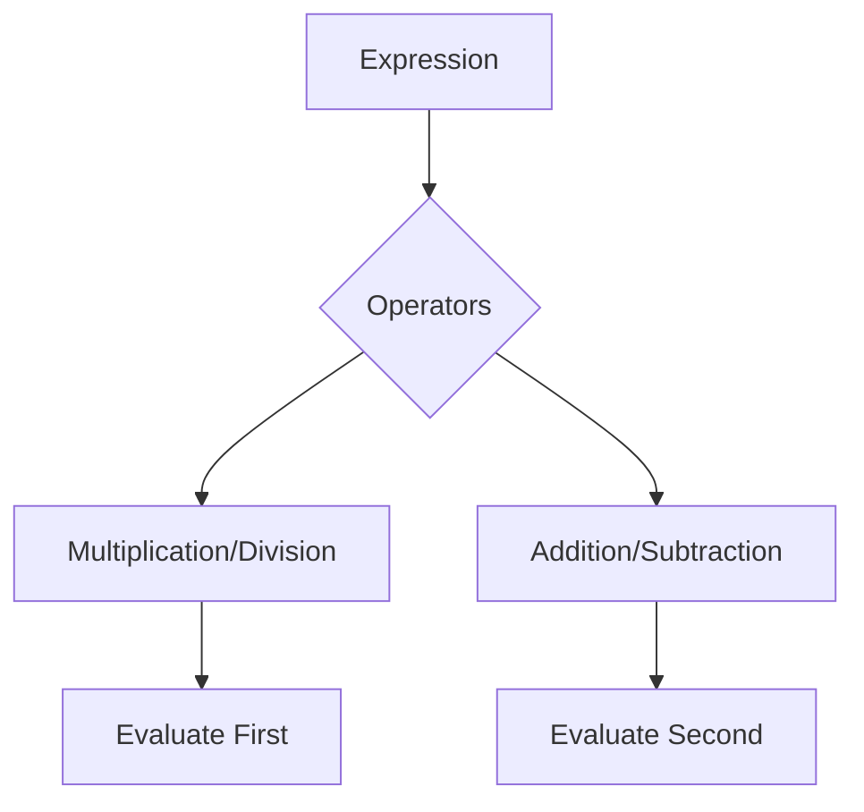

## 5.2 Arithmetic Operators

Arithmetic operators are fundamental tools in JavaScript that allow us to perform mathematical calculations. Whether you're adding numbers, calculating percentages, or determining the power of a number, understanding these operators is essential for any programmer. In this section, we'll explore each arithmetic operator in detail, providing examples and explanations to ensure you grasp their usage.

### Introduction to Arithmetic Operators

Arithmetic operators are symbols that represent mathematical operations. In JavaScript, these operators are used to perform calculations on numbers, and they form the building blocks for more complex expressions. Let's dive into each operator and see how they work.

### Addition (`+`)

The addition operator `+` is used to sum two or more numbers. It's one of the most basic operations and is often used in programming to combine values.

**Example:**

```javascript
let a = 5;
let b = 10;
let sum = a + b; // sum is 15
console.log("The sum is: " + sum);
```

In this example, we add two numbers, `5` and `10`, and store the result in the variable `sum`.

### Subtraction (`-`)

The subtraction operator `-` is used to find the difference between two numbers. It's the opposite of addition and is equally important.

**Example:**

```javascript
let a = 20;
let b = 5;
let difference = a - b; // difference is 15
console.log("The difference is: " + difference);
```

Here, we subtract `5` from `20`, resulting in `15`.

### Multiplication (`*`)

The multiplication operator `*` multiplies two numbers together. It's used in various calculations, from scaling values to calculating areas.

**Example:**

```javascript
let a = 4;
let b = 3;
let product = a * b; // product is 12
console.log("The product is: " + product);
```

We multiply `4` by `3`, giving us a product of `12`.

### Division (`/`)

The division operator `/` divides one number by another. It's crucial for operations like averaging and distributing values evenly.

**Example:**

```javascript
let a = 20;
let b = 4;
let quotient = a / b; // quotient is 5
console.log("The quotient is: " + quotient);
```

In this case, `20` divided by `4` results in `5`.

### Modulus (`%`)

The modulus operator `%` returns the remainder of a division operation. It's useful for determining if a number is even or odd, among other things.

**Example:**

```javascript
let a = 10;
let b = 3;
let remainder = a % b; // remainder is 1
console.log("The remainder is: " + remainder);
```

Here, dividing `10` by `3` leaves a remainder of `1`.

### Exponentiation (`**`)

The exponentiation operator `**` raises a number to the power of another number. It's a concise way to perform power calculations.

**Example:**

```javascript
let base = 2;
let exponent = 3;
let power = base ** exponent; // power is 8
console.log("The power is: " + power);
```

We raise `2` to the power of `3`, resulting in `8`.

### Increment (`++`) and Decrement (`--`)

The increment operator `++` increases a number by one, while the decrement operator `--` decreases it by one. These operators are often used in loops and counters.

**Increment Example:**

```javascript
let count = 5;
count++; // count is now 6
console.log("The incremented count is: " + count);
```

**Decrement Example:**

```javascript
let count = 5;
count--; // count is now 4
console.log("The decremented count is: " + count);
```

### Operator Precedence and Associativity

Operator precedence determines the order in which operations are performed in an expression. Operators with higher precedence are evaluated first. Associativity defines the direction in which operators of the same precedence are evaluated.

**Precedence Example:**

```javascript
let result = 5 + 3 * 2; // result is 11, not 16
```

In this example, multiplication has higher precedence than addition, so `3 * 2` is evaluated first.

**Associativity Example:**

```javascript
let result = 10 - 5 - 2; // result is 3
```

Subtraction is left-associative, so `10 - 5` is evaluated first, followed by `5 - 2`.

### Visualizing Operator Precedence

To better understand operator precedence, let's visualize it using a flowchart:



In this flowchart, we see that multiplication and division are evaluated before addition and subtraction.

### Try It Yourself

Now that we've covered the basics, try experimenting with these operators. Modify the examples above to see how different numbers and operations affect the results. Here are some suggestions:

- Change the numbers in the addition example and observe the output.
- Use the modulus operator to determine if a number is even or odd.
- Experiment with different bases and exponents using the exponentiation operator.

### Summary

In this section, we've explored the fundamental arithmetic operators in JavaScript. These operators are essential for performing calculations and manipulating data. By understanding how each operator works, you can write more efficient and effective code.

### Further Reading

For more information on JavaScript arithmetic operators, check out these resources:

- [MDN Web Docs: Arithmetic Operators](https://developer.mozilla.org/en-US/docs/Web/JavaScript/Guide/Expressions_and_Operators#Arithmetic_operators)
- [W3Schools: JavaScript Arithmetic](https://www.w3schools.com/js/js_arithmetic.asp)

## Quiz Time!



### Which operator is used for addition in JavaScript?

- [x] +
- [ ] -
- [ ] *
- [ ] /

> **Explanation:** The `+` operator is used for addition in JavaScript.

### What is the result of `10 % 3`?

- [ ] 3
- [ ] 10
- [ ] 0
- [x] 1

> **Explanation:** The modulus operator `%` returns the remainder of the division, which is `1` in this case.

### Which operator is used for exponentiation in JavaScript?

- [ ] ^
- [ ] /
- [x] **
- [ ] %

> **Explanation:** The `**` operator is used for exponentiation in JavaScript.

### What does the increment operator `++` do?

- [x] Increases a number by one
- [ ] Decreases a number by one
- [ ] Multiplies a number by two
- [ ] Divides a number by two

> **Explanation:** The increment operator `++` increases a number by one.

### Which operator has higher precedence, multiplication or addition?

- [x] Multiplication
- [ ] Addition

> **Explanation:** Multiplication has higher precedence than addition, so it is evaluated first in expressions.

### What is the result of `5 + 3 * 2`?

- [ ] 16
- [x] 11
- [ ] 13
- [ ] 10

> **Explanation:** Multiplication is evaluated first, so `3 * 2` is `6`, and then `5 + 6` is `11`.

### What is the associativity of the subtraction operator?

- [x] Left
- [ ] Right

> **Explanation:** The subtraction operator is left-associative, meaning expressions are evaluated from left to right.

### How do you decrease a number by one using an operator?

- [ ] ++
- [x] --
- [ ] **
- [ ] %

> **Explanation:** The decrement operator `--` decreases a number by one.

### Which operator would you use to find the remainder of a division?

- [ ] /
- [ ] **
- [x] %
- [ ] +

> **Explanation:** The modulus operator `%` is used to find the remainder of a division.

### True or False: The division operator `/` can be used to find the remainder of a division.

- [ ] True
- [x] False

> **Explanation:** The division operator `/` is used to divide numbers, not to find remainders. The modulus operator `%` is used for remainders.


