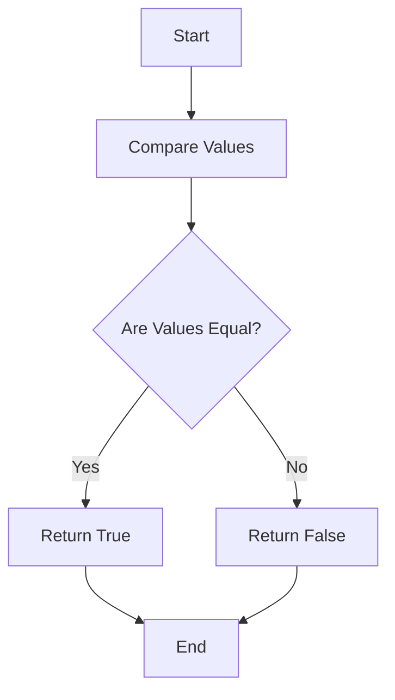

## 5.3 Comparison Operators

In programming, comparison operators are essential tools that allow us to compare values and make decisions based on those comparisons. In JavaScript, comparison operators are used to evaluate conditions, which is a fundamental aspect of control flow in programming. In this section, we will delve into the different types of comparison operators available in JavaScript, including equality operators and relational operators. We will provide examples and explanations to help you understand how these operators work and how to use them effectively in your code.

### Understanding Equality Operators

Equality operators are used to compare two values to determine if they are equal or not. JavaScript provides two types of equality operators: loose equality (`==`) and strict equality (`===`). Let's explore each of these operators in detail.

#### Loose Equality (`==`)

The loose equality operator (`==`) compares two values for equality after converting them to a common type. This means that JavaScript will perform type coercion if the values being compared are of different types. Type coercion is the process of converting one data type to another. 

**Example:**

```javascript
console.log(5 == '5'); // true
console.log(true == 1); // true
console.log(null == undefined); // true
```

In the examples above, JavaScript converts the string `'5'` to the number `5`, the boolean `true` to the number `1`, and considers `null` and `undefined` as equal, resulting in `true` for each comparison.

While the loose equality operator can be convenient, it can also lead to unexpected results due to type coercion. Therefore, it is generally recommended to use the strict equality operator for comparisons.

#### Strict Equality (`===`)

The strict equality operator (`===`) compares two values for equality without performing type coercion. This means that the values must be of the same type and have the same value to be considered equal.

**Example:**

```javascript
console.log(5 === '5'); // false
console.log(true === 1); // false
console.log(null === undefined); // false
console.log(5 === 5); // true
```

In the examples above, the comparisons return `false` because the values are of different types, except for the last comparison where both values are numbers and equal.

### Understanding Inequality Operators

Inequality operators are the opposite of equality operators. They are used to determine if two values are not equal. JavaScript provides two types of inequality operators: loose inequality (`!=`) and strict inequality (`!==`).

#### Loose Inequality (`!=`)

The loose inequality operator (`!=`) compares two values for inequality after converting them to a common type, similar to the loose equality operator.

**Example:**

```javascript
console.log(5 != '5'); // false
console.log(true != 1); // false
console.log(null != undefined); // false
```

In the examples above, JavaScript performs type coercion, resulting in `false` for each comparison because the values are considered equal after conversion.

#### Strict Inequality (`!==`)

The strict inequality operator (`!==`) compares two values for inequality without performing type coercion. The values must be of different types or have different values to be considered not equal.

**Example:**

```javascript
console.log(5 !== '5'); // true
console.log(true !== 1); // true
console.log(null !== undefined); // true
console.log(5 !== 5); // false
```

In the examples above, the comparisons return `true` because the values are of different types, except for the last comparison where both values are numbers and equal.

### Understanding Relational Operators

Relational operators are used to compare the relationship between two values. JavaScript provides four relational operators: greater than (`>`), less than (`<`), greater than or equal to (`>=`), and less than or equal to (`<=`). These operators are used to compare numeric values, but they can also be used with strings and other data types.

#### Greater Than (`>`)

The greater than operator (`>`) checks if the value on the left is greater than the value on the right.

**Example:**

```javascript
console.log(10 > 5); // true
console.log(5 > 10); // false
console.log('b' > 'a'); // true
```

In the examples above, the comparisons return `true` when the left value is greater than the right value.

#### Less Than (`<`)

The less than operator (`<`) checks if the value on the left is less than the value on the right.

**Example:**

```javascript
console.log(5 < 10); // true
console.log(10 < 5); // false
console.log('a' < 'b'); // true
```

In the examples above, the comparisons return `true` when the left value is less than the right value.

#### Greater Than or Equal To (`>=`)

The greater than or equal to operator (`>=`) checks if the value on the left is greater than or equal to the value on the right.

**Example:**

```javascript
console.log(10 >= 5); // true
console.log(5 >= 10); // false
console.log(5 >= 5); // true
```

In the examples above, the comparisons return `true` when the left value is greater than or equal to the right value.

#### Less Than or Equal To (`<=`)

The less than or equal to operator (`<=`) checks if the value on the left is less than or equal to the value on the right.

**Example:**

```javascript
console.log(5 <= 10); // true
console.log(10 <= 5); // false
console.log(5 <= 5); // true
```

In the examples above, the comparisons return `true` when the left value is less than or equal to the right value.

### Comparing Different Data Types

JavaScript allows you to compare different data types using comparison operators. However, the results may not always be intuitive due to type coercion and the way JavaScript handles comparisons.

#### Comparing Numbers and Strings

When comparing numbers and strings, JavaScript attempts to convert the string to a number before performing the comparison.

**Example:**

```javascript
console.log('10' > 5); // true
console.log('5' < 10); // true
console.log('5' == 5); // true
console.log('5' === 5); // false
```

In the examples above, JavaScript converts the string `'10'` and `'5'` to numbers before performing the comparison, resulting in `true` for the first three comparisons. The last comparison returns `false` because the strict equality operator does not perform type coercion.

#### Comparing Booleans and Numbers

When comparing booleans and numbers, JavaScript converts the boolean to a number (`true` becomes `1`, and `false` becomes `0`) before performing the comparison.

**Example:**

```javascript
console.log(true > 0); // true
console.log(false < 1); // true
console.log(true == 1); // true
console.log(false === 0); // false
```

In the examples above, JavaScript converts `true` to `1` and `false` to `0`, resulting in `true` for the first three comparisons. The last comparison returns `false` because the strict equality operator does not perform type coercion.

#### Comparing Null and Undefined

When comparing `null` and `undefined`, JavaScript considers them equal when using the loose equality operator, but not equal when using the strict equality operator.

**Example:**

```javascript
console.log(null == undefined); // true
console.log(null === undefined); // false
console.log(null > 0); // false
console.log(undefined < 0); // false
```

In the examples above, `null` and `undefined` are considered equal with the loose equality operator, but not with the strict equality operator. When compared to numbers, both `null` and `undefined` are considered not greater or less than any number.

### Try It Yourself

Now that we've covered the basics of comparison operators, let's try some experiments. Modify the code examples above and observe the outcomes. Here are some suggestions:

- Change the values being compared and see how the results change.
- Try comparing different data types, such as strings and booleans.
- Use both loose and strict equality operators to see the difference in results.

### Visualizing Comparison Operators

To better understand how comparison operators work, let's visualize the process of comparing two values using a flowchart.



**Caption:** This flowchart represents the basic process of comparing two values using equality operators. The process starts by comparing the values, checks if they are equal, and returns `true` or `false` based on the result.

### Key Takeaways

- **Loose Equality (`==`)**: Compares values after type coercion. Use with caution due to potential unexpected results.
- **Strict Equality (`===`)**: Compares values without type coercion. Recommended for most comparisons.
- **Loose Inequality (`!=`)**: Compares values for inequality after type coercion.
- **Strict Inequality (`!==`)**: Compares values for inequality without type coercion.
- **Relational Operators (`>`, `<`, `>=`, `<=`)**: Compare the relationship between two values.
- **Type Coercion**: JavaScript converts values to a common type when using loose equality and inequality operators.

### Further Reading

For more information on comparison operators in JavaScript, check out these resources:

- [MDN Web Docs: Equality Comparisons and Sameness](https://developer.mozilla.org/en-US/docs/Web/JavaScript/Equality_comparisons_and_sameness)
- [W3Schools: JavaScript Comparison and Logical Operators](https://www.w3schools.com/js/js_comparisons.asp)

## Quiz Time!



### What does the loose equality operator (`==`) do?

- [x] Compares two values for equality after converting them to a common type.
- [ ] Compares two values for equality without converting them.
- [ ] Compares two values for inequality after converting them to a common type.
- [ ] Compares two values for inequality without converting them.

> **Explanation:** The loose equality operator (`==`) compares two values for equality after converting them to a common type through type coercion.

### What is the result of `5 === '5'` in JavaScript?

- [ ] true
- [x] false
- [ ] undefined
- [ ] null

> **Explanation:** The strict equality operator (`===`) does not perform type coercion, so `5` (a number) and `'5'` (a string) are not considered equal.

### Which operator should you use to avoid type coercion when comparing values?

- [ ] ==
- [x] ===
- [ ] !=
- [ ] <=

> **Explanation:** The strict equality operator (`===`) should be used to avoid type coercion when comparing values.

### What does the relational operator `>` do?

- [x] Checks if the left value is greater than the right value.
- [ ] Checks if the left value is less than the right value.
- [ ] Checks if the left value is equal to the right value.
- [ ] Checks if the left value is not equal to the right value.

> **Explanation:** The greater than operator (`>`) checks if the left value is greater than the right value.

### What is the result of `null == undefined` in JavaScript?

- [x] true
- [ ] false
- [ ] undefined
- [ ] null

> **Explanation:** In JavaScript, `null` and `undefined` are considered equal when using the loose equality operator (`==`).

### What is the result of `'10' > 5` in JavaScript?

- [x] true
- [ ] false
- [ ] undefined
- [ ] null

> **Explanation:** JavaScript converts the string `'10'` to the number `10` before performing the comparison, resulting in `true`.

### What does the strict inequality operator (`!==`) do?

- [x] Compares two values for inequality without converting them.
- [ ] Compares two values for inequality after converting them to a common type.
- [ ] Compares two values for equality without converting them.
- [ ] Compares two values for equality after converting them to a common type.

> **Explanation:** The strict inequality operator (`!==`) compares two values for inequality without performing type coercion.

### What is the result of `true == 1` in JavaScript?

- [x] true
- [ ] false
- [ ] undefined
- [ ] null

> **Explanation:** JavaScript converts `true` to `1` before performing the comparison, resulting in `true`.

### Which operator checks if the left value is less than or equal to the right value?

- [ ] >
- [ ] <
- [ ] >=
- [x] <=

> **Explanation:** The less than or equal to operator (`<=`) checks if the left value is less than or equal to the right value.

### True or False: The strict equality operator (`===`) performs type coercion.

- [ ] True
- [x] False

> **Explanation:** The strict equality operator (`===`) does not perform type coercion; it compares values without converting them.


