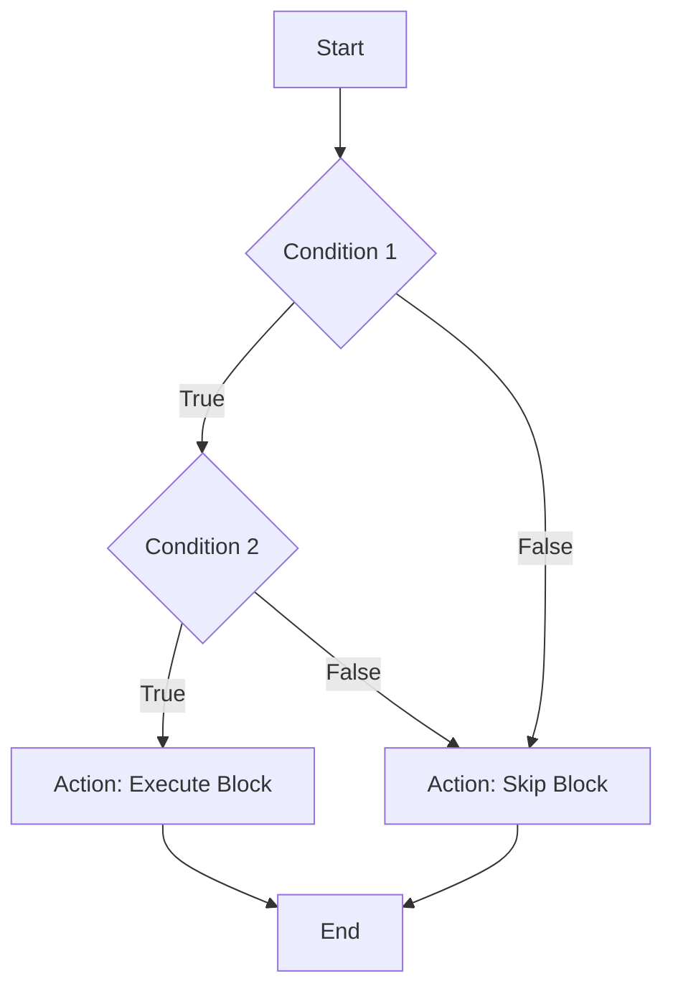

## 5.4 Logical Operators

In this section, we will explore the logical operators in JavaScript: the AND (`&&`), OR (`||`), and NOT (`!`) operators. These operators are fundamental in controlling the flow of your programs and making decisions based on multiple conditions. Understanding how to use logical operators will empower you to write more complex and dynamic code.

### Understanding Logical Operators

Logical operators are used to combine two or more conditions. They return a Boolean value (`true` or `false`) based on the logic of the conditions provided. Let's break down each of these operators and see how they work.

#### The AND Operator (`&&`)

The AND operator (`&&`) evaluates to `true` only if both operands (conditions) are true. If either of the operands is false, the entire expression evaluates to false.

**Syntax:**

```javascript
condition1 && condition2
```

**Example:**

```javascript
let isSunny = true;
let isWarm = true;

if (isSunny && isWarm) {
    console.log("It's a perfect day for a picnic!");
} else {
    console.log("Maybe we should stay indoors.");
}
```

In this example, the message "It's a perfect day for a picnic!" will be logged to the console only if both `isSunny` and `isWarm` are true.

#### The OR Operator (`||`)

The OR operator (`||`) evaluates to `true` if at least one of the operands is true. It only evaluates to false if both operands are false.

**Syntax:**

```javascript
condition1 || condition2
```

**Example:**

```javascript
let isRaining = false;
let isSnowing = true;

if (isRaining || isSnowing) {
    console.log("Better take an umbrella or wear a coat.");
} else {
    console.log("No need for an umbrella or coat today.");
}
```

In this example, the message "Better take an umbrella or wear a coat." will be logged to the console because `isSnowing` is true, even though `isRaining` is false.

#### The NOT Operator (`!`)

The NOT operator (`!`) is a unary operator that inverts the value of a Boolean expression. If the expression is true, the NOT operator will make it false, and vice versa.

**Syntax:**

```javascript
!condition
```

**Example:**

```javascript
let isWeekend = false;

if (!isWeekend) {
    console.log("Time to go to work.");
} else {
    console.log("Enjoy your weekend!");
}
```

In this example, the message "Time to go to work." will be logged to the console because `isWeekend` is false, and the NOT operator inverts it to true.

### Short-Circuit Evaluation

JavaScript uses a concept called short-circuit evaluation with logical operators. This means that in an expression using `&&` or `||`, JavaScript will stop evaluating as soon as the result is determined.

#### Short-Circuit with AND (`&&`)

With the AND operator, if the first operand is false, JavaScript doesn't need to evaluate the second operand because the whole expression cannot be true.

**Example:**

```javascript
let isHungry = false;
let hasFood = true;

if (isHungry && hasFood) {
    console.log("Let's eat!");
} else {
    console.log("Not hungry or no food available.");
}
```

In this example, JavaScript will not evaluate `hasFood` because `isHungry` is false, and the result of the AND operation is already determined to be false.

#### Short-Circuit with OR (`||`)

With the OR operator, if the first operand is true, JavaScript doesn't need to evaluate the second operand because the whole expression is already true.

**Example:**

```javascript
let hasCar = true;
let hasBike = false;

if (hasCar || hasBike) {
    console.log("You have a mode of transportation.");
} else {
    console.log("You need to find a way to travel.");
}
```

In this example, JavaScript will not evaluate `hasBike` because `hasCar` is true, and the result of the OR operation is already determined to be true.

### Practical Uses in Conditional Statements

Logical operators are incredibly useful in conditional statements where you need to check multiple conditions. Here are some practical examples to illustrate their use:

#### Example 1: User Authentication

Imagine a scenario where you want to allow a user to log in only if they have entered both a correct username and password.

```javascript
let username = "admin";
let password = "1234";

let enteredUsername = "admin";
let enteredPassword = "1234";

if (enteredUsername === username && enteredPassword === password) {
    console.log("Login successful!");
} else {
    console.log("Invalid username or password.");
}
```

In this example, the user will only see "Login successful!" if both the `enteredUsername` and `enteredPassword` match the stored `username` and `password`.

#### Example 2: Access Control

Suppose you want to grant access to a resource if the user is either an admin or a member.

```javascript
let isAdmin = false;
let isMember = true;

if (isAdmin || isMember) {
    console.log("Access granted.");
} else {
    console.log("Access denied.");
}
```

Here, the message "Access granted." will be logged because `isMember` is true, even though `isAdmin` is false.

#### Example 3: Toggle Feature

Consider a feature that should be enabled only if a certain condition is not met.

```javascript
let isFeatureEnabled = false;

if (!isFeatureEnabled) {
    console.log("Feature is now enabled.");
    isFeatureEnabled = true;
} else {
    console.log("Feature is already enabled.");
}
```

In this example, the feature will be enabled only if `isFeatureEnabled` is initially false.

### Visualizing Logical Operators

To better understand how logical operators work, let's visualize them using a flowchart. This flowchart shows the decision-making process when using logical operators in conditional statements.



**Caption:** This flowchart illustrates how the AND (`&&`) operator evaluates conditions. Both conditions must be true for the action block to execute.

### Try It Yourself

Now that we've covered the basics of logical operators, try modifying the examples above to see how changes affect the output. Here are some suggestions:

- Change the values of the variables in the examples to see how the output changes.
- Add more conditions to the `if` statements using logical operators.
- Try using the NOT operator in combination with AND and OR operators.

### Key Takeaways

- **AND Operator (`&&`)**: Evaluates to true only if both operands are true.
- **OR Operator (`||`)**: Evaluates to true if at least one operand is true.
- **NOT Operator (`!`)**: Inverts the value of a Boolean expression.
- **Short-Circuit Evaluation**: Stops evaluating as soon as the result is determined.
- **Practical Uses**: Logical operators are essential in making decisions based on multiple conditions.

Understanding logical operators is crucial for writing effective and efficient JavaScript code. They allow you to control the flow of your program and make decisions based on complex conditions.

## Quiz Time!



### What does the AND (`&&`) operator do?

- [x] Evaluates to true only if both operands are true
- [ ] Evaluates to true if at least one operand is true
- [ ] Inverts the value of a Boolean expression
- [ ] Stops evaluating as soon as the result is determined

> **Explanation:** The AND (`&&`) operator evaluates to true only if both operands are true.

### What does the OR (`||`) operator do?

- [ ] Evaluates to true only if both operands are true
- [x] Evaluates to true if at least one operand is true
- [ ] Inverts the value of a Boolean expression
- [ ] Stops evaluating as soon as the result is determined

> **Explanation:** The OR (`||`) operator evaluates to true if at least one operand is true.

### What does the NOT (`!`) operator do?

- [ ] Evaluates to true only if both operands are true
- [ ] Evaluates to true if at least one operand is true
- [x] Inverts the value of a Boolean expression
- [ ] Stops evaluating as soon as the result is determined

> **Explanation:** The NOT (`!`) operator inverts the value of a Boolean expression.

### What is short-circuit evaluation?

- [ ] Evaluates all conditions regardless of the result
- [x] Stops evaluating as soon as the result is determined
- [ ] Inverts the value of a Boolean expression
- [ ] Evaluates to true only if both operands are true

> **Explanation:** Short-circuit evaluation stops evaluating as soon as the result is determined.

### Which of the following is true about the AND (`&&`) operator?

- [x] It evaluates to true only if both operands are true
- [ ] It evaluates to true if at least one operand is true
- [x] It uses short-circuit evaluation
- [ ] It inverts the value of a Boolean expression

> **Explanation:** The AND (`&&`) operator evaluates to true only if both operands are true and uses short-circuit evaluation.

### Which of the following is true about the OR (`||`) operator?

- [ ] It evaluates to true only if both operands are true
- [x] It evaluates to true if at least one operand is true
- [x] It uses short-circuit evaluation
- [ ] It inverts the value of a Boolean expression

> **Explanation:** The OR (`||`) operator evaluates to true if at least one operand is true and uses short-circuit evaluation.

### What happens if the first operand of an AND (`&&`) expression is false?

- [x] The second operand is not evaluated
- [ ] The second operand is evaluated
- [ ] The result is true
- [ ] The result is undefined

> **Explanation:** If the first operand of an AND (`&&`) expression is false, the second operand is not evaluated due to short-circuit evaluation.

### What happens if the first operand of an OR (`||`) expression is true?

- [x] The second operand is not evaluated
- [ ] The second operand is evaluated
- [ ] The result is false
- [ ] The result is undefined

> **Explanation:** If the first operand of an OR (`||`) expression is true, the second operand is not evaluated due to short-circuit evaluation.

### Which operator would you use to invert a Boolean value?

- [x] NOT (`!`)
- [ ] AND (`&&`)
- [ ] OR (`||`)
- [ ] XOR (`^`)

> **Explanation:** The NOT (`!`) operator is used to invert a Boolean value.

### True or False: The NOT (`!`) operator can be used with both AND (`&&`) and OR (`||`) operators.

- [x] True
- [ ] False

> **Explanation:** The NOT (`!`) operator can be used in combination with both AND (`&&`) and OR (`||`) operators to invert the result of their expressions.


