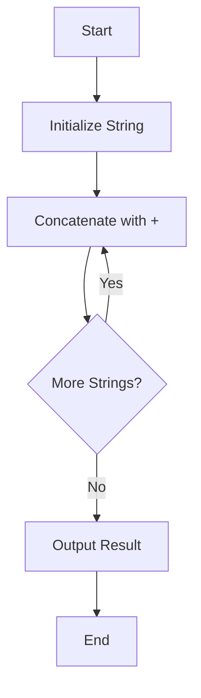

## 5.5 String Operators

Welcome to the exciting world of string operators in JavaScript! Strings are a fundamental data type in programming, representing text. In this section, we'll explore how to manipulate strings using operators, focusing on concatenation. By the end of this chapter, you'll be able to combine strings, understand how they interact with other data types, and use compound assignment for efficient string manipulation.

### Understanding String Concatenation

Concatenation is the process of joining two or more strings together. In JavaScript, the `+` operator is used for string concatenation. This operator allows you to create new strings by combining existing ones. Let's dive into how it works.

#### Basic Concatenation with the `+` Operator

The `+` operator is versatile in JavaScript. While it's commonly used for arithmetic addition, it also serves as a powerful tool for string concatenation. When used with strings, the `+` operator combines them into a single string.

**Example: Basic String Concatenation**

```javascript
let greeting = "Hello";
let name = "World";
let message = greeting + ", " + name + "!";

console.log(message); // Output: Hello, World!
```

In this example, we have two strings, `greeting` and `name`. By using the `+` operator, we concatenate them with a comma and an exclamation mark to form the complete message "Hello, World!".

#### Concatenation with Different Data Types

JavaScript is a dynamically typed language, meaning variables can hold values of any data type. When concatenating strings with other data types, JavaScript automatically converts non-string data types to strings.

**Example: Concatenating Strings with Numbers**

```javascript
let age = 25;
let ageMessage = "I am " + age + " years old.";

console.log(ageMessage); // Output: I am 25 years old.
```

Here, the number `25` is converted to a string and concatenated with the other strings to form the complete sentence.

**Example: Concatenating Strings with Booleans**

```javascript
let isStudent = true;
let statusMessage = "Student status: " + isStudent;

console.log(statusMessage); // Output: Student status: true
```

In this example, the boolean `true` is converted to the string "true" and concatenated with the other string.

#### The Importance of Order in Concatenation

The order of operations is crucial in string concatenation. JavaScript evaluates expressions from left to right, so the order in which you concatenate strings and other data types can affect the outcome.

**Example: Order Matters**

```javascript
let number = 5;
let result1 = "The number is: " + number + 10;
let result2 = "The number is: " + (number + 10);

console.log(result1); // Output: The number is: 510
console.log(result2); // Output: The number is: 15
```

In `result1`, the number `5` is first converted to a string and concatenated with "10", resulting in "510". In `result2`, the parentheses ensure that `number + 10` is evaluated first, resulting in "15".

### Compound Assignment with `+=`

The `+=` operator is a compound assignment operator that combines addition and assignment. When used with strings, it appends the right-hand operand to the left-hand operand, updating the left-hand operand with the new value.

**Example: Using `+=` for String Concatenation**

```javascript
let sentence = "JavaScript is";
sentence += " fun!";
sentence += " Let's learn it together.";

console.log(sentence); // Output: JavaScript is fun! Let's learn it together.
```

In this example, we start with the string "JavaScript is" and use the `+=` operator to append additional strings, building the complete sentence.

#### Benefits of Using `+=`

- **Efficiency**: The `+=` operator is concise and reduces the need for repetitive code.
- **Readability**: It makes the code easier to read and understand, especially when building strings incrementally.

**Example: Building a String with `+=`**

```javascript
let story = "Once upon a time, ";
story += "there was a brave knight. ";
story += "He fought dragons and saved the kingdom.";

console.log(story);
// Output: Once upon a time, there was a brave knight. He fought dragons and saved the kingdom.
```

Here, the `+=` operator is used to construct a story by appending sentences to the initial string.

### Common Mistakes and How to Avoid Them

When working with string operators, it's important to be aware of common pitfalls to ensure your code behaves as expected.

#### Mistake 1: Forgetting to Initialize Strings

Before using the `+=` operator, ensure that the variable is initialized as a string. Otherwise, you might encounter unexpected results.

**Example: Uninitialized String**

```javascript
let description;
description += "This is a description.";

console.log(description); // Output: undefinedThis is a description.
```

In this example, `description` is not initialized, resulting in "undefined" being concatenated with the string. To avoid this, initialize `description` as an empty string:

```javascript
let description = "";
description += "This is a description.";

console.log(description); // Output: This is a description.
```

#### Mistake 2: Misusing Parentheses

When concatenating strings with expressions, use parentheses to ensure the correct order of operations.

**Example: Misusing Parentheses**

```javascript
let x = 10;
let y = 5;
let result = "The sum is: " + x + y;

console.log(result); // Output: The sum is: 105
```

In this example, the numbers are concatenated as strings. To fix this, use parentheses:

```javascript
let result = "The sum is: " + (x + y);

console.log(result); // Output: The sum is: 15
```

### Try It Yourself

Now that you've learned about string operators, let's put your knowledge to the test! Try modifying the following code examples to see how string concatenation works in different scenarios.

1. **Experiment with Concatenating Different Data Types**

   ```javascript
   let city = "New York";
   let population = 8419000;
   let description = city + " has a population of " + population + " people.";

   console.log(description);
   ```

   - Try changing `population` to a string and observe the result.

2. **Use `+=` to Build a Story**

   ```javascript
   let adventure = "In a faraway land, ";
   adventure += "a hero embarked on a quest. ";
   adventure += "The journey was filled with challenges.";

   console.log(adventure);
   ```

   - Add more sentences to the story using `+=`.

### Visualizing String Concatenation

To help you understand string concatenation better, let's visualize the process using a flowchart.



**Caption**: This flowchart illustrates the process of string concatenation. We start by initializing a string, then concatenate additional strings using the `+` operator. The process repeats until no more strings are left to concatenate, and the final result is output.

### Further Reading

For more information on string operators and manipulation in JavaScript, consider exploring the following resources:

- [MDN Web Docs: String](https://developer.mozilla.org/en-US/docs/Web/JavaScript/Reference/Global_Objects/String)
- [W3Schools: JavaScript Strings](https://www.w3schools.com/js/js_strings.asp)

### Key Takeaways

- The `+` operator is used for string concatenation, combining strings into a single string.
- JavaScript automatically converts non-string data types to strings when using the `+` operator.
- The `+=` operator is a compound assignment operator that appends strings efficiently.
- Be mindful of the order of operations and initialize strings before using `+=`.

Now that you've mastered string operators, you're ready to tackle more complex string manipulations in JavaScript. Keep practicing and experimenting to reinforce your understanding!

## Quiz Time!



### What does the `+` operator do when used with strings?

- [x] Concatenates strings
- [ ] Multiplies strings
- [ ] Divides strings
- [ ] Subtracts strings

> **Explanation:** The `+` operator is used to concatenate, or join, strings together in JavaScript.

### What will the following code output? `console.log("Hello" + 5);`

- [x] Hello5
- [ ] Hello
- [ ] 5Hello
- [ ] 5

> **Explanation:** The number `5` is converted to a string and concatenated with "Hello", resulting in "Hello5".

### Which operator can be used to append a string to an existing string variable?

- [x] +=
- [ ] -=
- [ ] *=
- [ ] /=

> **Explanation:** The `+=` operator appends the right-hand string to the left-hand string variable.

### What is the result of `"10" + 20 + 30` in JavaScript?

- [x] 102030
- [ ] 60
- [ ] 1030
- [ ] 50

> **Explanation:** The first operation is string concatenation, resulting in "1020", which is then concatenated with "30" to form "102030".

### How can you ensure that a number is added before concatenation in a string?

- [x] Use parentheses around the addition
- [ ] Use the `-` operator
- [ ] Use the `*` operator
- [ ] Use the `/` operator

> **Explanation:** Parentheses ensure that the addition is performed before concatenation, e.g., `"" + (10 + 20)`.

### What will `console.log("Result: " + (5 + 5));` output?

- [x] Result: 10
- [ ] Result: 55
- [ ] Result: 5 + 5
- [ ] Result: 10.0

> **Explanation:** The parentheses ensure that the addition is performed first, resulting in "Result: 10".

### What is the output of `let str = "Hello"; str += " World!"; console.log(str);`?

- [x] Hello World!
- [ ] HelloWorld!
- [ ] Hello
- [ ] World!

> **Explanation:** The `+=` operator appends " World!" to "Hello", resulting in "Hello World!".

### What happens if you use `+=` on an uninitialized string variable?

- [x] It results in "undefined" followed by the string
- [ ] It throws an error
- [ ] It results in an empty string
- [ ] It initializes the variable

> **Explanation:** Using `+=` on an uninitialized string variable results in "undefined" being concatenated with the string.

### Which of the following is a correct way to concatenate strings in JavaScript?

- [x] "Hello" + " " + "World"
- [ ] "Hello" - "World"
- [ ] "Hello" * "World"
- [ ] "Hello" / "World"

> **Explanation:** The `+` operator is used for concatenating strings, while the other operators are not valid for strings.

### True or False: JavaScript automatically converts numbers to strings when using the `+` operator for concatenation.

- [x] True
- [ ] False

> **Explanation:** JavaScript automatically converts numbers to strings when they are used with the `+` operator for concatenation.




