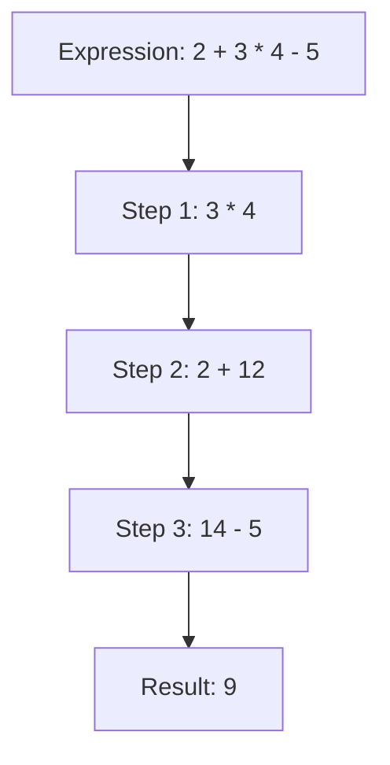

## 5.6 Operator Precedence and Associativity

In JavaScript, as in many programming languages, understanding how expressions are evaluated is crucial for writing correct and efficient code. This section will guide you through the concepts of operator precedence and associativity, helping you understand how JavaScript determines the order in which operations are performed. By the end of this section, you'll be able to predict the outcome of complex expressions and avoid common pitfalls.

### Understanding Operator Precedence

Operator precedence determines the order in which operators are evaluated in expressions. Operators with higher precedence are evaluated before those with lower precedence. For example, multiplication has a higher precedence than addition, so in the expression `2 + 3 * 4`, the multiplication is performed first, resulting in `2 + 12`, and then the addition, resulting in `14`.

#### Operator Precedence Table

Here's a brief overview of some common JavaScript operators, listed from highest to lowest precedence:

| Precedence Level | Operator Type         | Operators                      |
|------------------|-----------------------|--------------------------------|
| 1                | Grouping              | `()`                           |
| 2                | Member                | `.` `[]`                       |
| 3                | Function Call         | `()`                           |
| 4                | Unary                 | `++` `--` `+` `-` `!` `~`      |
| 5                | Exponentiation        | `**`                           |
| 6                | Multiplicative        | `*` `/` `%`                    |
| 7                | Additive              | `+` `-`                        |
| 8                | Shift                 | `<<` `>>` `>>>`                |
| 9                | Relational            | `<` `<=` `>` `>=` `in` `instanceof` |
| 10               | Equality              | `==` `!=` `===` `!==`          |
| 11               | Bitwise AND           | `&`                            |
| 12               | Bitwise XOR           | `^`                            |
| 13               | Bitwise OR            | `|`                            |
| 14               | Logical AND           | `&&`                           |
| 15               | Logical OR            | `||`                           |
| 16               | Conditional           | `?:`                           |
| 17               | Assignment            | `=` `+=` `-=` `*=` `/=` `%=`   |
| 18               | Comma                 | `,`                            |

This table is not exhaustive but covers the most commonly used operators. The operators at the top of the table have the highest precedence and are evaluated first.

### Associativity: Left-to-Right or Right-to-Left?

Associativity determines the order in which operators of the same precedence level are evaluated. It can be either left-to-right or right-to-left. 

- **Left-to-Right Associativity**: Most operators, such as addition (`+`) and multiplication (`*`), are left-to-right associative. This means that in an expression like `a - b - c`, the operations are performed from left to right: `(a - b) - c`.

- **Right-to-Left Associativity**: Some operators, like the assignment operator (`=`) and the exponentiation operator (`**`), are right-to-left associative. This means that in an expression like `a = b = c`, the operations are performed from right to left: `a = (b = c)`.

### Using Parentheses to Control Evaluation

Parentheses `()` can be used to override the default precedence and associativity, allowing you to explicitly specify the order of operations. This is particularly useful for improving code readability and avoiding mistakes.

#### Example: Overriding Precedence with Parentheses

Consider the following expression:

```javascript
let result = 2 + 3 * 4; // Without parentheses
console.log(result); // Output: 14
```

In this example, multiplication has higher precedence than addition, so `3 * 4` is evaluated first, resulting in `12`, and then `2 + 12` is evaluated, resulting in `14`.

Now, let's use parentheses to change the order of evaluation:

```javascript
let result = (2 + 3) * 4; // With parentheses
console.log(result); // Output: 20
```

Here, the parentheses force the addition to be evaluated first, resulting in `5`, and then `5 * 4` is evaluated, resulting in `20`.

### Common Mistakes and How to Avoid Them

Understanding operator precedence and associativity can help you avoid common mistakes in your code. Here are some examples:

#### Mistake 1: Misunderstanding Operator Precedence

```javascript
let a = 10;
let b = 5;
let c = 2;

let result = a + b * c; // Mistake: Expecting (a + b) * c
console.log(result); // Output: 20
```

In this example, the multiplication is performed first due to its higher precedence, resulting in `5 * 2 = 10`, and then the addition is performed, resulting in `10 + 10 = 20`. To achieve the intended result, use parentheses:

```javascript
let result = (a + b) * c;
console.log(result); // Output: 30
```

#### Mistake 2: Confusing Associativity

```javascript
let x = 2;
let y = 3;
let z = 4;

let result = x ** y ** z; // Mistake: Expecting (x ** y) ** z
console.log(result); // Output: 2417851639229258349412352
```

The exponentiation operator is right-to-left associative, so `y ** z` is evaluated first, resulting in `3 ** 4 = 81`, and then `x ** 81` is evaluated. To achieve the intended result, use parentheses:

```javascript
let result = (x ** y) ** z;
console.log(result); // Output: 4096
```

### Try It Yourself

To reinforce your understanding of operator precedence and associativity, try modifying the following code examples:

1. Change the order of operations using parentheses in the expression `10 + 5 * 2 - 3`.
2. Experiment with different combinations of operators and parentheses in the expression `8 / 2 * (2 + 2)`.

### Visualizing Operator Precedence and Associativity

To help visualize how operator precedence and associativity work, let's use a flowchart to represent the evaluation of a complex expression:



In this flowchart, the expression `2 + 3 * 4 - 5` is evaluated step by step, following the rules of operator precedence and associativity.

### References and Further Reading

For more information on operator precedence and associativity in JavaScript, check out these resources:

- [MDN Web Docs: Operator Precedence](https://developer.mozilla.org/en-US/docs/Web/JavaScript/Reference/Operators/Operator_Precedence)
- [W3Schools: JavaScript Operators](https://www.w3schools.com/js/js_operators.asp)

### Engagement and Reinforcement

To further solidify your understanding, consider these questions:

- How would you evaluate the expression `5 + 3 * 2 ** 2`?
- What is the result of the expression `10 - 5 + 3`?
- How can you use parentheses to change the result of the expression `8 / 2 * (2 + 2)`?

### Exercises

1. Write a JavaScript function that evaluates the expression `a + b * c - d / e` with given values for `a`, `b`, `c`, `d`, and `e`. Use parentheses to change the order of operations and observe the difference in results.

2. Create a complex expression using at least five different operators. Predict the result using operator precedence and associativity, then verify your prediction by running the code.

### Summary

In this section, we've explored the concepts of operator precedence and associativity in JavaScript. By understanding these concepts, you can predict the outcome of complex expressions and write more accurate code. Remember to use parentheses to control the order of operations and avoid common mistakes. With practice, you'll become more confident in evaluating expressions and understanding how JavaScript processes them.

## Quiz Time!



### Which operator has the highest precedence in JavaScript?

- [x] Parentheses `()`
- [ ] Multiplication `*`
- [ ] Addition `+`
- [ ] Assignment `=`

> **Explanation:** Parentheses have the highest precedence and are used to explicitly specify the order of operations.

### What is the associativity of the addition operator `+`?

- [x] Left-to-right
- [ ] Right-to-left
- [ ] None
- [ ] Both

> **Explanation:** The addition operator `+` is left-to-right associative, meaning operations are performed from left to right.

### How can you change the order of operations in an expression?

- [x] By using parentheses `()`
- [ ] By using commas `,`
- [ ] By using semicolons `;`
- [ ] By using colons `:`

> **Explanation:** Parentheses can be used to override the default operator precedence and specify the order of operations.

### In the expression `a = b = c`, which assignment is performed first?

- [x] `b = c`
- [ ] `a = b`
- [ ] `a = c`
- [ ] All at once

> **Explanation:** The assignment operator `=` is right-to-left associative, so `b = c` is performed first.

### Which operator has higher precedence: multiplication `*` or addition `+`?

- [x] Multiplication `*`
- [ ] Addition `+`
- [ ] They have the same precedence
- [ ] It depends on the context

> **Explanation:** Multiplication `*` has higher precedence than addition `+`, so it is evaluated first.

### What is the result of the expression `5 + 2 * 3`?

- [x] 11
- [ ] 21
- [ ] 15
- [ ] 30

> **Explanation:** The multiplication `2 * 3` is evaluated first due to higher precedence, resulting in `6`, and then `5 + 6` is evaluated, resulting in `11`.

### How does JavaScript evaluate the expression `3 + 4 * 2 / (1 - 5) ** 2`?

- [x] 3.5
- [ ] 7
- [ ] 1
- [ ] -1

> **Explanation:** The expression is evaluated as `3 + (4 * 2) / ((1 - 5) ** 2)`, resulting in `3.5`.

### Which of the following operators is right-to-left associative?

- [x] Exponentiation `**`
- [ ] Addition `+`
- [ ] Multiplication `*`
- [ ] Subtraction `-`

> **Explanation:** The exponentiation operator `**` is right-to-left associative, meaning operations are performed from right to left.

### What is the result of the expression `(8 / 2) * (2 + 2)`?

- [x] 16
- [ ] 8
- [ ] 4
- [ ] 2

> **Explanation:** The expression is evaluated as `(8 / 2) * 4`, resulting in `16`.

### True or False: The expression `10 - 5 + 3` is evaluated as `(10 - 5) + 3`.

- [x] True
- [ ] False

> **Explanation:** The subtraction and addition operators have the same precedence and are left-to-right associative, so the expression is evaluated as `(10 - 5) + 3`.


