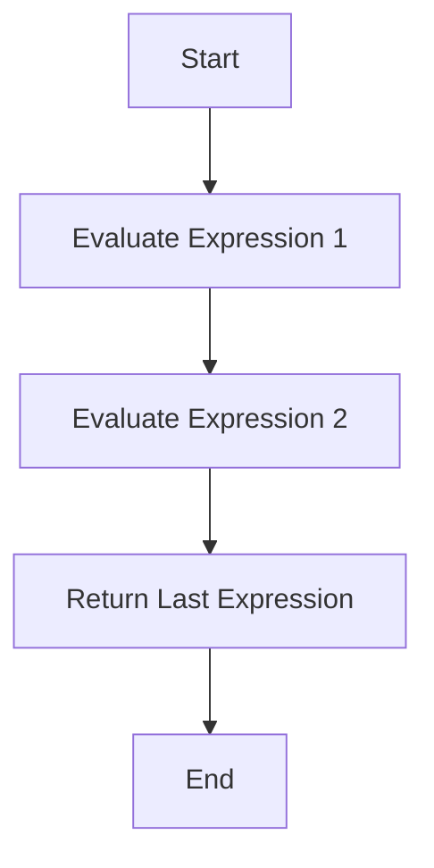
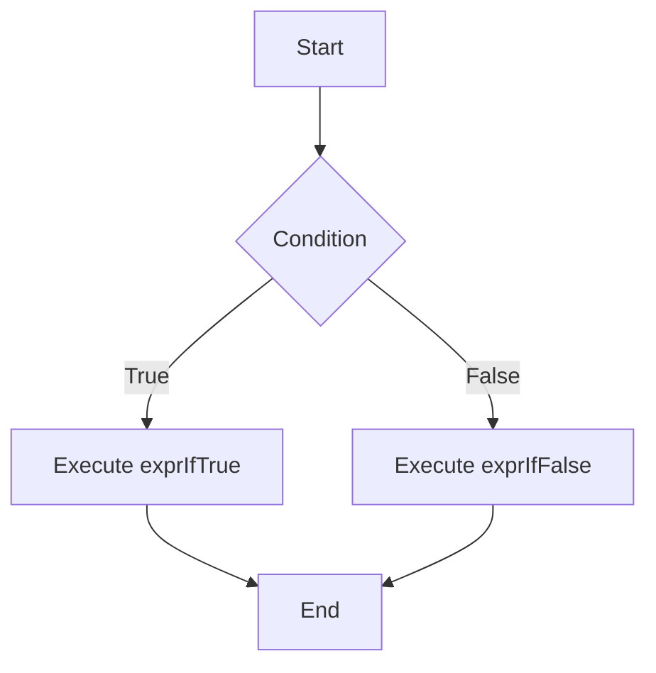

## 5.7 Other Useful Operators

In this section, we will explore some additional operators in JavaScript that are incredibly useful for various programming tasks. These operators include the **comma operator**, the **conditional (ternary) operator**, the **spread operator**, the **in operator**, and the **instanceof operator**. Understanding these operators will enhance your ability to write concise and efficient code.

### The Comma Operator `,`

The comma operator is one of the lesser-known operators in JavaScript, but it can be quite useful in certain scenarios. It allows you to evaluate multiple expressions in a single statement, returning the value of the last expression.

#### Syntax and Usage

The syntax for the comma operator is straightforward:

```javascript
expression1, expression2, ..., expressionN
```

Each expression is evaluated from left to right, and the result of the last expression is returned.

#### Example

Let's look at an example to understand how the comma operator works:

```javascript
let x = (1 + 2, 3 + 4);
console.log(x); // Output: 7
```

In this example, both `1 + 2` and `3 + 4` are evaluated, but only the result of `3 + 4` (which is `7`) is assigned to `x`.

#### Practical Use Cases

While the comma operator is not commonly used, it can be handy in scenarios such as:

- **Loop Initialization and Incrementation**: You can use the comma operator to include multiple expressions in a `for` loop.

```javascript
for (let i = 0, j = 10; i < j; i++, j--) {
    console.log(i, j);
}
```

- **Shortening Code**: It can be used to execute multiple expressions in a single line, although this can sometimes reduce code readability.

### The Conditional (Ternary) Operator `condition ? exprIfTrue : exprIfFalse`

The conditional (ternary) operator is a concise way to perform conditional operations. It is the only JavaScript operator that takes three operands.

#### Syntax and Usage

The syntax for the ternary operator is:

```javascript
condition ? exprIfTrue : exprIfFalse
```

- **condition**: The expression to evaluate.
- **exprIfTrue**: The expression to execute if the condition is true.
- **exprIfFalse**: The expression to execute if the condition is false.

#### Example

Here's a simple example of using the ternary operator:

```javascript
let age = 18;
let canVote = (age >= 18) ? 'Yes' : 'No';
console.log(canVote); // Output: Yes
```

In this example, the condition `age >= 18` is evaluated. Since it is true, the expression `'Yes'` is returned and assigned to `canVote`.

#### Practical Use Cases

- **Conditional Assignments**: Use the ternary operator for simple conditional assignments.

```javascript
let max = (a > b) ? a : b;
```

- **Inline Conditions**: It is useful for inline conditions where using an `if...else` statement would be verbose.

### The Spread Operator `...` (ES6)

The spread operator, introduced in ES6, is a powerful tool for working with arrays and objects. It allows you to expand elements of an iterable (like an array) into individual elements.

#### Syntax and Usage

The syntax for the spread operator is:

```javascript
...iterable
```

#### Example

Let's look at an example of using the spread operator with arrays:

```javascript
let numbers = [1, 2, 3];
let moreNumbers = [...numbers, 4, 5, 6];
console.log(moreNumbers); // Output: [1, 2, 3, 4, 5, 6]
```

In this example, the spread operator is used to expand the `numbers` array into individual elements, which are then combined with `4, 5, 6` to create a new array `moreNumbers`.

#### Practical Use Cases

- **Copying Arrays**: Create a shallow copy of an array.

```javascript
let originalArray = [1, 2, 3];
let copiedArray = [...originalArray];
```

- **Merging Arrays**: Combine multiple arrays into one.

```javascript
let array1 = [1, 2];
let array2 = [3, 4];
let combinedArray = [...array1, ...array2];
```

- **Function Arguments**: Pass elements of an array as arguments to a function.

```javascript
function sum(a, b, c) {
    return a + b + c;
}

let numbers = [1, 2, 3];
console.log(sum(...numbers)); // Output: 6
```

### The `in` Operator

The `in` operator is used to check if a property exists in an object. It returns `true` if the specified property is in the object or its prototype chain.

#### Syntax and Usage

The syntax for the `in` operator is:

```javascript
'property' in object
```

#### Example

Here's an example of using the `in` operator:

```javascript
let car = { make: 'Toyota', model: 'Corolla' };
console.log('make' in car); // Output: true
console.log('year' in car); // Output: false
```

In this example, `'make'` is a property of the `car` object, so the `in` operator returns `true`. However, `'year'` is not a property, so it returns `false`.

#### Practical Use Cases

- **Property Checks**: Use the `in` operator to check for the existence of properties before accessing them.

```javascript
if ('make' in car) {
    console.log(car.make);
}
```

- **Iterating Over Properties**: It can be used in conjunction with loops to iterate over object properties.

### The `instanceof` Operator

The `instanceof` operator is used to check if an object is an instance of a specific class or constructor function. It returns `true` if the object is an instance, otherwise `false`.

#### Syntax and Usage

The syntax for the `instanceof` operator is:

```javascript
object instanceof constructor
```

#### Example

Here's an example of using the `instanceof` operator:

```javascript
function Car(make, model) {
    this.make = make;
    this.model = model;
}

let myCar = new Car('Toyota', 'Corolla');
console.log(myCar instanceof Car); // Output: true
console.log(myCar instanceof Object); // Output: true
```

In this example, `myCar` is an instance of `Car`, so `myCar instanceof Car` returns `true`. Since all objects in JavaScript inherit from `Object`, `myCar instanceof Object` also returns `true`.

#### Practical Use Cases

- **Type Checking**: Use `instanceof` to ensure that an object is of a specific type before performing operations.

```javascript
if (myCar instanceof Car) {
    console.log('This is a car.');
}
```

- **Inheritance Checks**: It can be used to check for inheritance in prototype chains.

### Try It Yourself

Now that we've covered these operators, try experimenting with them in your own code. Here are a few suggestions:

- Modify the example using the comma operator to include more expressions.
- Create a function that uses the ternary operator to return different messages based on input.
- Use the spread operator to merge multiple arrays and objects.
- Write a function that checks if a property exists in an object using the `in` operator.
- Create a class and use the `instanceof` operator to check if an object is an instance of that class.

### Visual Aids

#### Comma Operator Flow



#### Ternary Operator Flow



### References and Links

For more information on these operators, you can visit the following resources:

- [MDN Web Docs - JavaScript Operators](https://developer.mozilla.org/en-US/docs/Web/JavaScript/Guide/Expressions_and_Operators)
- [W3Schools - JavaScript Operators](https://www.w3schools.com/js/js_operators.asp)

### Engagement and Reinforcement

To reinforce your learning, try answering these questions:

- What is the result of using the comma operator with multiple expressions?
- How does the ternary operator differ from an `if...else` statement?
- What are some practical applications of the spread operator?
- How can you check if a property exists in an object?
- What does the `instanceof` operator return if an object is not an instance of a specified class?

### Summary

In this section, we explored some of the more advanced operators in JavaScript, including the comma, conditional, spread, in, and instanceof operators. These operators provide powerful ways to manipulate data and control the flow of your programs. By understanding and using these operators effectively, you can write more concise and efficient JavaScript code.

## Quiz Time!



### What does the comma operator return?

- [ ] The first expression
- [ ] The second expression
- [x] The last expression
- [ ] None of the expressions

> **Explanation:** The comma operator evaluates all expressions and returns the value of the last expression.

### How does the ternary operator work?

- [x] It evaluates a condition and returns one of two expressions based on the result.
- [ ] It evaluates multiple conditions and returns multiple expressions.
- [ ] It only works with numbers.
- [ ] It is used for loops.

> **Explanation:** The ternary operator evaluates a condition and returns `exprIfTrue` if the condition is true, otherwise it returns `exprIfFalse`.

### What is a use case for the spread operator?

- [ ] Checking property existence
- [x] Merging arrays
- [ ] Looping through objects
- [ ] Type checking

> **Explanation:** The spread operator is commonly used for merging arrays and objects, among other applications.

### Which operator checks if a property exists in an object?

- [ ] instanceof
- [ ] spread
- [x] in
- [ ] ternary

> **Explanation:** The `in` operator checks if a property exists in an object or its prototype chain.

### What does the `instanceof` operator do?

- [x] Checks if an object is an instance of a specific class
- [ ] Checks if a property exists in an object
- [ ] Merges arrays
- [ ] Evaluates conditions

> **Explanation:** The `instanceof` operator checks if an object is an instance of a specific class or constructor function.

### Can the comma operator be used in a loop?

- [x] Yes
- [ ] No

> **Explanation:** The comma operator can be used in loop initialization and incrementation to evaluate multiple expressions.

### What is returned by the ternary operator if the condition is false?

- [ ] exprIfTrue
- [x] exprIfFalse
- [ ] The condition itself
- [ ] None of the above

> **Explanation:** If the condition is false, the ternary operator returns `exprIfFalse`.

### Can the spread operator be used with objects?

- [x] Yes
- [ ] No

> **Explanation:** The spread operator can be used to expand objects into individual properties, similar to arrays.

### Does the `in` operator check for inherited properties?

- [x] Yes
- [ ] No

> **Explanation:** The `in` operator checks for properties in the object and its prototype chain.

### Is `instanceof` used for checking property existence?

- [ ] True
- [x] False

> **Explanation:** The `instanceof` operator is used for checking if an object is an instance of a specific class, not for checking property existence.


