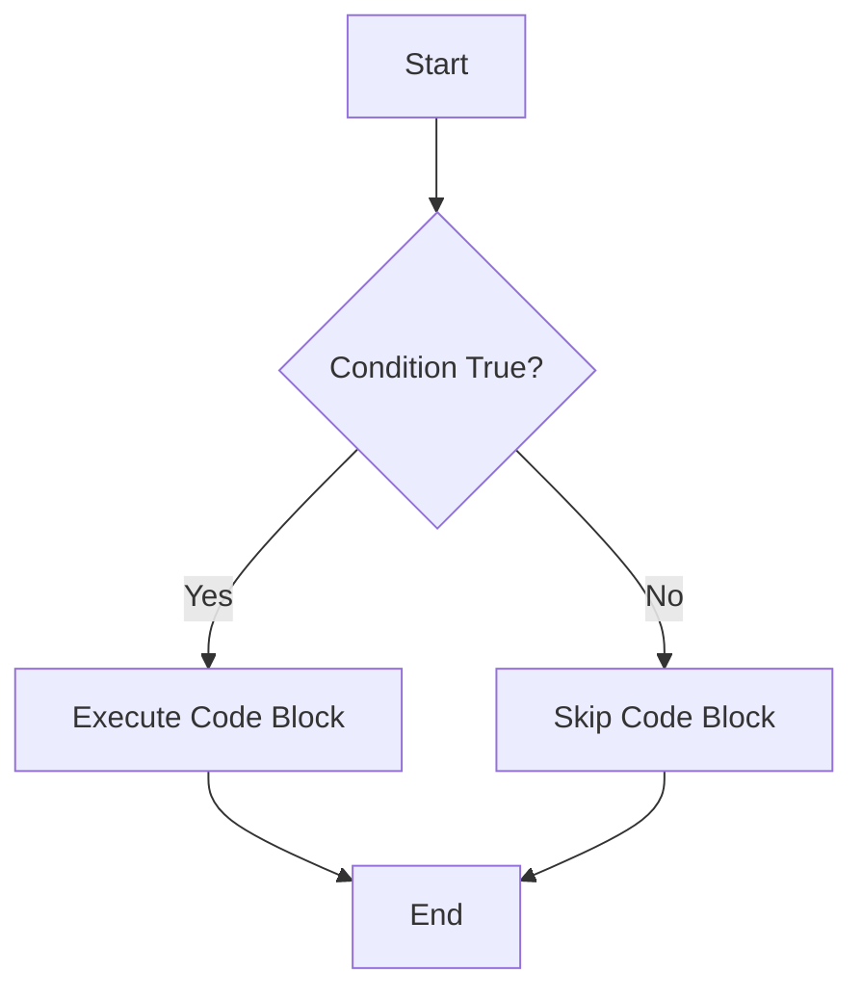

## 6.1 The `if` Statement

Welcome to the world of conditional logic in JavaScript! In this section, we'll explore the `if` statement, a fundamental building block for making decisions in your code. As you embark on your journey to mastering JavaScript, understanding how to use the `if` statement effectively will empower you to create dynamic and responsive programs.

### What is the `if` Statement?

The `if` statement is a control structure that allows your program to execute a block of code only if a specified condition is true. This capability is essential for creating programs that can adapt to different situations and inputs.

#### Syntax of the `if` Statement

The basic syntax of an `if` statement in JavaScript is as follows:

```javascript
if (condition) {
    // Code to execute if the condition is true
}
```

- **`condition`**: This is a Boolean expression that evaluates to either `true` or `false`.
- **Code Block**: The block of code inside the curly braces `{}` is executed only if the condition is true.

### Understanding Boolean Expressions

Before diving deeper into the `if` statement, let's briefly discuss Boolean expressions. A Boolean expression is any expression that evaluates to a Boolean value: `true` or `false`. These expressions are the backbone of conditional logic.

#### Examples of Boolean Expressions

1. **Comparison Operators**: These operators compare two values and return a Boolean result.

   ```javascript
   let age = 18;
   let isAdult = age >= 18; // true
   ```

2. **Logical Operators**: These operators combine multiple Boolean expressions.

   ```javascript
   let hasLicense = true;
   let canDrive = isAdult && hasLicense; // true
   ```

3. **Equality Operators**: These operators check if two values are equal or not.

   ```javascript
   let isEqual = (5 === 5); // true
   ```

### Using the `if` Statement

Now that we understand Boolean expressions, let's see how they integrate with the `if` statement to control program flow.

#### Example 1: Basic `if` Statement

Let's start with a simple example where we check if a number is positive:

```javascript
let number = 10;

if (number > 0) {
    console.log("The number is positive.");
}
```

**Explanation**: In this example, the condition `number > 0` evaluates to `true`, so the message "The number is positive." is printed to the console.

#### Example 2: Using Variables in Conditions

You can use variables to make your conditions more dynamic:

```javascript
let temperature = 25;
let isWarm = temperature > 20;

if (isWarm) {
    console.log("It's a warm day.");
}
```

**Explanation**: Here, the variable `isWarm` holds the result of the condition `temperature > 20`. Since `isWarm` is `true`, the message "It's a warm day." is printed.

### Best Practices for Using the `if` Statement

1. **Use Braces for Readability**: Even if your `if` statement contains a single line of code, it's a good practice to use curly braces `{}`. This enhances readability and reduces the risk of errors when modifying code.

   ```javascript
   if (isWarm) {
       console.log("It's a warm day.");
   }
   ```

2. **Keep Conditions Simple**: Break complex conditions into smaller, manageable parts. This makes your code easier to read and maintain.

3. **Use Descriptive Variable Names**: Choose variable names that clearly describe their purpose. This helps others (and your future self) understand the code more easily.

### Visualizing the `if` Statement

To better understand how the `if` statement works, let's visualize the flow of control using a flowchart.



**Description**: The flowchart illustrates that the program checks the condition. If the condition is true, it executes the code block. If false, it skips the block and continues with the rest of the program.

### Try It Yourself

Now it's your turn! Experiment with the `if` statement by modifying the examples above. Here are a few suggestions:

- Change the value of `number` in Example 1 to see how the output changes.
- Modify the condition in Example 2 to check if the temperature is below 15 degrees.

### Common Mistakes and How to Avoid Them

1. **Forgetting Curly Braces**: Omitting curly braces can lead to unexpected behavior, especially when adding more lines to the `if` block later.

   ```javascript
   if (isWarm)
       console.log("It's a warm day.");
       console.log("Enjoy the sunshine!"); // This line always executes
   ```

2. **Misusing Assignment and Equality Operators**: Remember that `=` is for assignment, while `==` and `===` are for equality checks.

   ```javascript
   let isEqual = (5 === 5); // Correct
   ```

3. **Complex Conditions Without Parentheses**: Use parentheses to clarify complex conditions.

   ```javascript
   if ((age > 18) && (hasLicense || hasPermit)) {
       console.log("You can drive.");
   }
   ```

### Further Reading

For more information on the `if` statement and conditional logic in JavaScript, check out these resources:

- [MDN Web Docs: if...else](https://developer.mozilla.org/en-US/docs/Web/JavaScript/Reference/Statements/if...else)
- [W3Schools: JavaScript Conditions](https://www.w3schools.com/js/js_if_else.asp)

### Summary

In this section, we've explored the `if` statement, a fundamental tool for controlling program flow based on conditions. By understanding Boolean expressions and following best practices, you can write clear and effective conditional logic in your JavaScript programs.

## Quiz Time!



### What is the primary purpose of the `if` statement in JavaScript?

- [x] To execute a block of code only if a specified condition is true
- [ ] To repeat a block of code a certain number of times
- [ ] To define a function
- [ ] To declare a variable

> **Explanation:** The `if` statement is used to execute a block of code only when a specified condition evaluates to true.

### Which of the following is a Boolean expression?

- [x] `5 > 3`
- [ ] `"Hello, World!"`
- [ ] `42`
- [ ] `let x = 10;`

> **Explanation:** A Boolean expression evaluates to either true or false. `5 > 3` is a comparison that results in a Boolean value.

### What is the result of the following code?
```javascript
let age = 18;
if (age >= 18) {
    console.log("Adult");
}
```

- [x] "Adult"
- [ ] No output
- [ ] Syntax error
- [ ] "Minor"

> **Explanation:** The condition `age >= 18` is true, so the code block inside the `if` statement is executed, printing "Adult".

### Why is it recommended to use curly braces `{}` even for single-line `if` statements?

- [x] For readability and to prevent errors when adding more lines later
- [ ] To make the code run faster
- [ ] To avoid syntax errors
- [ ] To save space

> **Explanation:** Using curly braces improves readability and reduces the risk of errors when modifying the code.

### Which of the following is a correct `if` statement syntax?

- [x] `if (x > 0) { console.log("Positive"); }`
- [ ] `if x > 0 { console.log("Positive"); }`
- [ ] `if (x > 0) console.log("Positive");`
- [ ] `if (x > 0) { console.log("Positive") }`

> **Explanation:** The correct syntax includes parentheses around the condition and curly braces around the code block.

### What will be the output of this code?
```javascript
let temperature = 30;
if (temperature < 20) {
    console.log("Cold");
} else {
    console.log("Warm");
}
```

- [ ] "Cold"
- [x] "Warm"
- [ ] No output
- [ ] Syntax error

> **Explanation:** The condition `temperature < 20` is false, so the `else` block is executed, printing "Warm".

### What does the following code do?
```javascript
if (false) {
    console.log("This will not print.");
}
```

- [x] It does nothing
- [ ] It prints "This will not print."
- [ ] It throws an error
- [ ] It prints an empty line

> **Explanation:** Since the condition is `false`, the code block inside the `if` statement is not executed.

### Which operator is used to check equality in JavaScript?

- [ ] `=`
- [x] `==` or `===`
- [ ] `!=`
- [ ] `=>`

> **Explanation:** `==` and `===` are used to check equality, with `===` being the strict equality operator.

### What is a common mistake when using `if` statements?

- [x] Forgetting to use curly braces for single-line statements
- [ ] Using `console.log()` inside the `if` block
- [ ] Declaring variables inside the `if` block
- [ ] Using comparison operators

> **Explanation:** Forgetting curly braces can lead to unexpected behavior, especially when adding more lines to the `if` block later.

### True or False: The `if` statement can only be used with numeric conditions.

- [ ] True
- [x] False

> **Explanation:** The `if` statement can be used with any Boolean expression, not just numeric conditions.



By mastering the `if` statement, you're taking a significant step towards becoming proficient in JavaScript programming. Keep practicing, and soon you'll be able to handle even more complex logic with ease!
