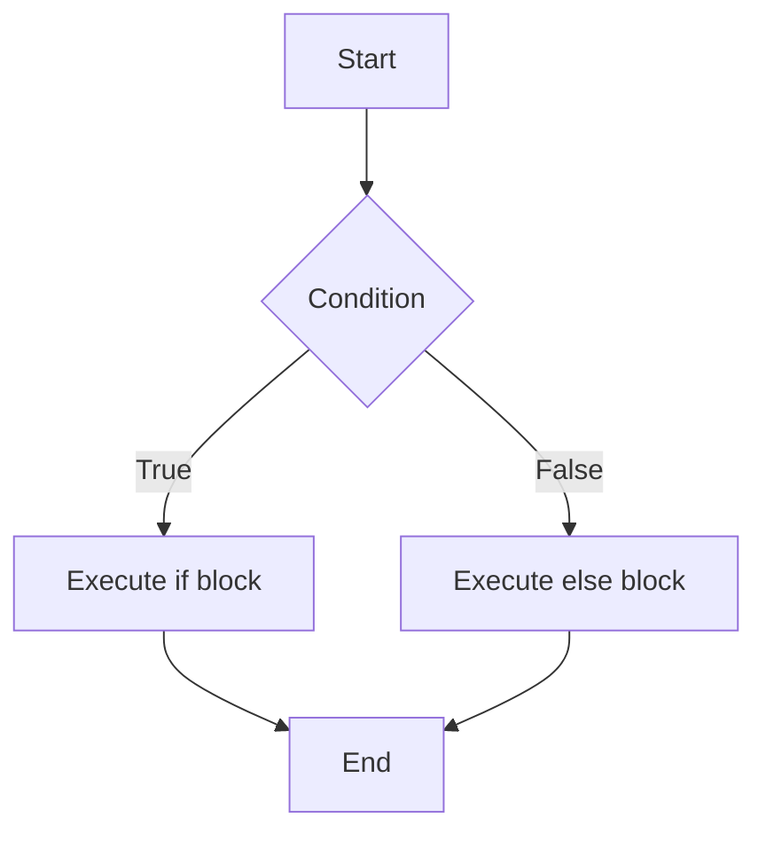

## 6.2 The `if...else` Statement

In the journey of learning JavaScript, understanding how to control the flow of your program is crucial. The `if...else` statement is a fundamental tool that allows you to make decisions in your code. By using `if...else`, you can execute different blocks of code based on certain conditions. This section will guide you through the concept of `if...else` statements, provide examples, and offer exercises to reinforce your understanding.

### Understanding the `if` Statement

Before diving into the `if...else` statement, let's revisit the basic `if` statement. The `if` statement allows you to execute a block of code only if a specified condition is true. Here's a simple example:

```javascript
let temperature = 30;

// Check if the temperature is greater than 25
if (temperature > 25) {
    console.log("It's a hot day!");
}
```

In this example, the message "It's a hot day!" will be displayed only if the `temperature` is greater than 25. If the condition is false, the code inside the `if` block will be skipped.

### Introducing the `if...else` Statement

The `if...else` statement extends the functionality of the `if` statement by providing an alternative block of code to execute if the condition is false. This is particularly useful when you want to handle both outcomes of a condition. Here's how it works:

```javascript
let temperature = 20;

// Check if the temperature is greater than 25
if (temperature > 25) {
    console.log("It's a hot day!");
} else {
    console.log("It's a cool day!");
}
```

In this example, if the temperature is not greater than 25, the message "It's a cool day!" will be displayed. The `else` block provides an alternative path for the program to follow.

### Importance of Proper Indentation and Code Structure

When writing `if...else` statements, proper indentation and code structure are essential for readability and maintainability. Indentation helps to visually separate different blocks of code, making it easier to understand the flow of the program. Here's an example with proper indentation:

```javascript
let age = 18;

// Check if the person is an adult
if (age >= 18) {
    console.log("You are an adult.");
} else {
    console.log("You are a minor.");
}
```

Notice how the code inside the `if` and `else` blocks is indented. This makes it clear which lines of code belong to each block.

### Nested `if...else` Statements

Sometimes, you may need to evaluate multiple conditions. In such cases, you can nest `if...else` statements within each other. Here's an example:

```javascript
let score = 85;

// Determine the grade based on the score
if (score >= 90) {
    console.log("Grade: A");
} else {
    if (score >= 80) {
        console.log("Grade: B");
    } else {
        console.log("Grade: C");
    }
}
```

In this example, the program checks if the score is greater than or equal to 90. If not, it checks if the score is greater than or equal to 80. If neither condition is true, it assigns a grade of C.

### Using `else if` for Multiple Conditions

While nested `if...else` statements work, they can become cumbersome. A more elegant solution is to use `else if` to handle multiple conditions. Here's how:

```javascript
let score = 85;

// Determine the grade based on the score
if (score >= 90) {
    console.log("Grade: A");
} else if (score >= 80) {
    console.log("Grade: B");
} else {
    console.log("Grade: C");
}
```

The `else if` statement allows you to check additional conditions without nesting. This makes the code cleaner and easier to read.

### Common Mistakes and How to Avoid Them

When working with `if...else` statements, beginners often make a few common mistakes. Let's explore these mistakes and how to avoid them:

1. **Missing Curly Braces**: Always use curly braces `{}` to define blocks of code, even for single statements. This prevents errors when adding more statements later.

    ```javascript
    // Incorrect
    if (temperature > 25)
        console.log("It's a hot day!");

    // Correct
    if (temperature > 25) {
        console.log("It's a hot day!");
    }
    ```

2. **Incorrect Condition Syntax**: Ensure that your conditions are correctly written. Use comparison operators like `==`, `===`, `!=`, `!==`, `>`, `<`, `>=`, and `<=`.

    ```javascript
    // Incorrect
    if temperature > 25 {
        console.log("It's a hot day!");
    }

    // Correct
    if (temperature > 25) {
        console.log("It's a hot day!");
    }
    ```

3. **Confusing Assignment with Comparison**: Use `==` or `===` for comparison, not `=` which is used for assignment.

    ```javascript
    // Incorrect
    if (temperature = 25) {
        console.log("Temperature is 25.");
    }

    // Correct
    if (temperature == 25) {
        console.log("Temperature is 25.");
    }
    ```

### Visualizing the `if...else` Flow

To better understand how `if...else` statements work, let's visualize the flow using a diagram. This flowchart represents the decision-making process in an `if...else` statement:



In this flowchart, the program starts by evaluating the condition. If the condition is true, it executes the `if` block. If false, it executes the `else` block. Finally, the program ends.

### Practical Examples

Let's look at some practical examples to see how `if...else` statements can be used in real-world scenarios.

#### Example 1: Checking User Age

Suppose you are developing a website that requires users to be at least 18 years old to register. You can use an `if...else` statement to check the user's age:

```javascript
let userAge = 16;

// Check if the user is old enough to register
if (userAge >= 18) {
    console.log("Welcome! You can register.");
} else {
    console.log("Sorry, you must be at least 18 years old to register.");
}
```

#### Example 2: Determining Even or Odd Numbers

You can use `if...else` statements to determine if a number is even or odd:

```javascript
let number = 7;

// Check if the number is even or odd
if (number % 2 === 0) {
    console.log("The number is even.");
} else {
    console.log("The number is odd.");
}
```

#### Example 3: Traffic Light System

Consider a simple traffic light system where you want to display the action based on the light color:

```javascript
let lightColor = "red";

// Determine the action based on the traffic light color
if (lightColor === "green") {
    console.log("Go!");
} else if (lightColor === "yellow") {
    console.log("Slow down!");
} else if (lightColor === "red") {
    console.log("Stop!");
} else {
    console.log("Invalid color!");
}
```

### Try It Yourself

Now it's your turn! Try modifying the examples above to see how `if...else` statements work in different scenarios. Here are some suggestions:

- Change the `temperature` variable in the first example to see how the output changes.
- Modify the `score` variable in the grading example to test different grades.
- Experiment with different `lightColor` values in the traffic light example.

### Exercises

To reinforce your understanding, try solving these exercises:

1. **Exercise 1**: Write a program that checks if a number is positive, negative, or zero, and displays an appropriate message.

2. **Exercise 2**: Create a program that determines the largest of three numbers using `if...else` statements.

3. **Exercise 3**: Write a program that calculates the discount based on the total purchase amount. If the amount is greater than $100, apply a 10% discount; otherwise, apply a 5% discount.

### Summary

In this section, we explored the `if...else` statement, a powerful tool for controlling the flow of your JavaScript programs. We learned how to use `if` and `else` blocks to execute different code paths based on conditions. We also discussed the importance of proper indentation and code structure, common mistakes to avoid, and practical examples to solidify your understanding.

By mastering `if...else` statements, you can create dynamic and responsive programs that make decisions based on user input or other conditions. Keep practicing and experimenting with different scenarios to enhance your skills.

## Quiz Time!



### What is the purpose of the `if...else` statement in JavaScript?

- [x] To execute different blocks of code based on a condition
- [ ] To declare variables
- [ ] To create loops
- [ ] To define functions

> **Explanation:** The `if...else` statement is used to execute different blocks of code based on whether a condition is true or false.

### Which of the following is the correct syntax for an `if...else` statement?

- [x] `if (condition) { // code } else { // code }`
- [ ] `if condition { // code } else { // code }`
- [ ] `if (condition) // code else // code`
- [ ] `if (condition) { // code } else // code`

> **Explanation:** The correct syntax for an `if...else` statement includes parentheses around the condition and curly braces around the code blocks.

### What will the following code output if `temperature` is 30?

```javascript
let temperature = 30;
if (temperature > 25) {
    console.log("It's a hot day!");
} else {
    console.log("It's a cool day!");
}
```

- [x] "It's a hot day!"
- [ ] "It's a cool day!"
- [ ] "It's a warm day!"
- [ ] No output

> **Explanation:** Since the `temperature` is greater than 25, the condition is true, and the code inside the `if` block will execute.

### How can you check multiple conditions using `if...else`?

- [x] Use `else if` to check additional conditions
- [ ] Use multiple `if` statements
- [ ] Use a loop
- [ ] Use a function

> **Explanation:** You can use `else if` to check multiple conditions in a more readable and organized way.

### What is the output of the following code if `score` is 75?

```javascript
let score = 75;
if (score >= 90) {
    console.log("Grade: A");
} else if (score >= 80) {
    console.log("Grade: B");
} else {
    console.log("Grade: C");
}
```

- [ ] "Grade: A"
- [ ] "Grade: B"
- [x] "Grade: C"
- [ ] No output

> **Explanation:** Since the `score` is not greater than or equal to 80, the `else` block executes, resulting in "Grade: C".

### What is a common mistake when writing `if...else` statements?

- [x] Forgetting to use curly braces for code blocks
- [ ] Using `else if` for a single condition
- [ ] Using `console.log()` for output
- [ ] Declaring variables

> **Explanation:** A common mistake is forgetting to use curly braces `{}` for code blocks, which can lead to errors when adding more statements.

### What will the following code output if `number` is 10?

```javascript
let number = 10;
if (number % 2 === 0) {
    console.log("The number is even.");
} else {
    console.log("The number is odd.");
}
```

- [x] "The number is even."
- [ ] "The number is odd."
- [ ] "The number is prime."
- [ ] No output

> **Explanation:** Since `number` is divisible by 2, the condition is true, and the code inside the `if` block will execute.

### What is the purpose of indentation in `if...else` statements?

- [x] To improve code readability and structure
- [ ] To execute code faster
- [ ] To reduce memory usage
- [ ] To declare variables

> **Explanation:** Proper indentation improves code readability and helps to visually separate different blocks of code.

### True or False: The `else` block is mandatory in an `if...else` statement.

- [ ] True
- [x] False

> **Explanation:** The `else` block is optional. You can use an `if` statement without an `else` block if you only need to execute code when the condition is true.

### What will the following code output if `lightColor` is "blue"?

```javascript
let lightColor = "blue";
if (lightColor === "green") {
    console.log("Go!");
} else if (lightColor === "yellow") {
    console.log("Slow down!");
} else if (lightColor === "red") {
    console.log("Stop!");
} else {
    console.log("Invalid color!");
}
```

- [ ] "Go!"
- [ ] "Slow down!"
- [ ] "Stop!"
- [x] "Invalid color!"

> **Explanation:** Since `lightColor` is "blue", none of the conditions are true, so the `else` block executes, resulting in "Invalid color!".


