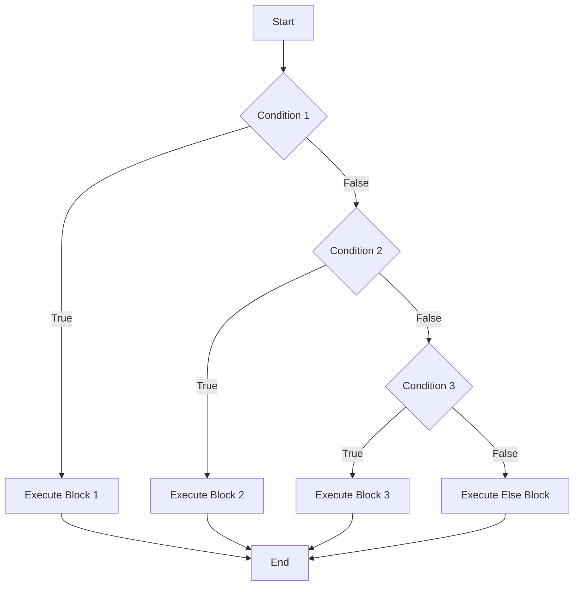

## 6.3 The `else if` Clause

In the world of programming, making decisions is crucial. As we write code, we often need to execute different actions based on varying conditions. This is where conditional statements come into play. In this section, we'll delve into the `else if` clause, a powerful tool for handling multiple conditions in JavaScript. We'll explore how it works, compare it to using separate `if` statements, and discuss the logical flow and efficiency considerations.

### Understanding the `else if` Clause

The `else if` clause allows us to evaluate multiple conditions in a sequence. When the first condition in an `if` statement is not met, the program can check additional conditions using `else if`. This provides a structured way to handle multiple scenarios without writing separate `if` statements for each condition.

#### Basic Syntax

Here's a simple example to illustrate the syntax of an `else if` clause:

```javascript
let temperature = 30;

if (temperature > 30) {
    console.log("It's a hot day!");
} else if (temperature > 20) {
    console.log("It's a warm day.");
} else if (temperature > 10) {
    console.log("It's a cool day.");
} else {
    console.log("It's a cold day.");
}
```

In this example, the program checks the temperature and prints a message based on the range it falls into. The `else if` clauses allow us to handle different temperature ranges efficiently.

### Comparing `else if` Chains to Separate `if` Statements

When deciding how to handle multiple conditions, it's important to consider the differences between using `else if` chains and separate `if` statements.

#### Using Separate `if` Statements

Using separate `if` statements means each condition is evaluated independently, regardless of the outcome of previous conditions. Here's an example:

```javascript
let score = 85;

if (score >= 90) {
    console.log("Grade: A");
}

if (score >= 80) {
    console.log("Grade: B");
}

if (score >= 70) {
    console.log("Grade: C");
}
```

In this case, if the score is 85, both the second and third `if` statements will execute, resulting in two grades being printed.

#### Using `else if` Chains

With `else if` chains, conditions are evaluated sequentially, and only the first true condition's block is executed:

```javascript
let score = 85;

if (score >= 90) {
    console.log("Grade: A");
} else if (score >= 80) {
    console.log("Grade: B");
} else if (score >= 70) {
    console.log("Grade: C");
}
```

Here, only the second condition is true, so only "Grade: B" is printed. This approach is more efficient when only one condition should be true at a time.

### Logical Flow and Efficiency Considerations

When using `else if` chains, the logical flow is straightforward. The program evaluates each condition in order, stopping as soon as it finds a true condition. This can improve efficiency, as not all conditions need to be checked if an earlier condition is true.

#### Efficiency in Large Condition Sets

In scenarios with many conditions, using `else if` chains can significantly reduce the number of evaluations. Consider a scenario with ten conditions. If the first condition is true, the program won't evaluate the remaining nine conditions, saving processing time.

#### Readability and Maintainability

Using `else if` chains can also enhance the readability and maintainability of your code. By grouping related conditions together, the code becomes more organized and easier to understand. This is especially important in larger programs where multiple conditions are common.

### Practical Examples

Let's explore some practical examples to solidify our understanding of the `else if` clause.

#### Example 1: Traffic Light System

Imagine a simple traffic light system that changes colors based on time:

```javascript
let time = 15; // Time in seconds

if (time < 10) {
    console.log("Green Light");
} else if (time < 20) {
    console.log("Yellow Light");
} else {
    console.log("Red Light");
}
```

In this example, the light changes from green to yellow to red as time progresses. The `else if` clause efficiently handles the transitions between light colors.

#### Example 2: Grading System

Let's revisit the grading system example with a more comprehensive approach:

```javascript
let score = 72;

if (score >= 90) {
    console.log("Grade: A");
} else if (score >= 80) {
    console.log("Grade: B");
} else if (score >= 70) {
    console.log("Grade: C");
} else if (score >= 60) {
    console.log("Grade: D");
} else {
    console.log("Grade: F");
}
```

This example demonstrates how `else if` clauses can be used to categorize scores into different grades.

### Visualizing the `else if` Flow

To better understand the flow of an `else if` statement, let's visualize it using a flowchart.



In this flowchart, the program starts by evaluating Condition 1. If true, it executes Block 1 and ends. If false, it moves to Condition 2, and so on. If none of the conditions are true, the `else` block is executed.

### Try It Yourself

Now that we've covered the basics, let's try modifying some code to see how `else if` works in practice.

#### Challenge 1: Weather Forecast

Modify the following code to include an additional condition for "It's a perfect day!" when the temperature is exactly 25 degrees.

```javascript
let temperature = 25;

// Add your code here

if (temperature > 30) {
    console.log("It's a hot day!");
} else if (temperature > 20) {
    console.log("It's a warm day.");
} else if (temperature > 10) {
    console.log("It's a cool day.");
} else {
    console.log("It's a cold day.");
}
```

#### Challenge 2: Age Categories

Write a program that categorizes a person's age into "Child," "Teenager," "Adult," and "Senior" using `else if` clauses.

```javascript
let age = 45;

// Add your code here

```

### Key Takeaways

- The `else if` clause allows us to evaluate multiple conditions in sequence, executing only the first true condition's block.
- Using `else if` chains can improve efficiency by reducing the number of evaluations.
- `else if` chains enhance code readability and maintainability by grouping related conditions together.
- Visualizing the flow of `else if` statements can aid in understanding their logical structure.

### Further Reading

For more information on conditional statements in JavaScript, check out these resources:

- [MDN Web Docs: if...else](https://developer.mozilla.org/en-US/docs/Web/JavaScript/Reference/Statements/if...else)
- [W3Schools: JavaScript if...else](https://www.w3schools.com/js/js_if_else.asp)

## Quiz Time!



### What is the primary purpose of the `else if` clause in JavaScript?

- [x] To evaluate multiple conditions in sequence.
- [ ] To execute all conditions regardless of their truth value.
- [ ] To replace the `if` statement entirely.
- [ ] To handle errors in code execution.

> **Explanation:** The `else if` clause is used to evaluate multiple conditions in sequence, executing only the first true condition's block.

### How does using `else if` chains improve code efficiency?

- [x] By reducing the number of evaluations when a true condition is found.
- [ ] By executing all conditions simultaneously.
- [ ] By eliminating the need for `if` statements.
- [ ] By increasing the number of evaluations.

> **Explanation:** `else if` chains improve efficiency by stopping evaluations once a true condition is found, reducing unnecessary checks.

### What happens when none of the conditions in an `else if` chain are true?

- [x] The `else` block is executed.
- [ ] The program throws an error.
- [ ] The first condition is executed by default.
- [ ] The program skips the entire block.

> **Explanation:** If none of the conditions are true, the `else` block is executed, if present.

### In a grading system using `else if`, what grade is assigned to a score of 85?

- [ ] Grade: A
- [x] Grade: B
- [ ] Grade: C
- [ ] Grade: D

> **Explanation:** With a score of 85, the condition for "Grade: B" is true, so "Grade: B" is assigned.

### Which of the following is a benefit of using `else if` chains over separate `if` statements?

- [x] Improved readability and maintainability.
- [ ] Increased execution time.
- [ ] More complex code structure.
- [ ] Greater likelihood of errors.

> **Explanation:** `else if` chains improve readability and maintainability by grouping related conditions together.

### What is the outcome of the following code if `temperature` is 25?

```javascript
let temperature = 25;

if (temperature > 30) {
    console.log("It's a hot day!");
} else if (temperature > 20) {
    console.log("It's a warm day.");
} else if (temperature > 10) {
    console.log("It's a cool day.");
} else {
    console.log("It's a cold day.");
}
```

- [x] "It's a warm day."
- [ ] "It's a hot day!"
- [ ] "It's a cool day."
- [ ] "It's a cold day."

> **Explanation:** With a temperature of 25, the condition for "It's a warm day." is true.

### How can you modify the code to print "It's a perfect day!" when the temperature is exactly 25?

- [x] Add an `else if (temperature === 25)` clause.
- [ ] Change the first condition to `if (temperature === 25)`.
- [ ] Remove the `else` block.
- [ ] Use a separate `if` statement.

> **Explanation:** Adding an `else if (temperature === 25)` clause will handle the specific case of 25 degrees.

### What does the following flowchart represent?


- [x] The logical flow of an `else if` statement.
- [ ] The structure of a `for` loop.
- [ ] The execution of a function.
- [ ] The syntax of a switch statement.

> **Explanation:** The flowchart represents the logical flow of an `else if` statement, showing how conditions are evaluated sequentially.

### What is the result of using separate `if` statements for multiple conditions?

- [ ] Only the first true condition is executed.
- [x] Each condition is evaluated independently.
- [ ] The program stops after the first evaluation.
- [ ] The `else` block is always executed.

> **Explanation:** Separate `if` statements evaluate each condition independently, regardless of previous evaluations.

### True or False: `else if` chains are always more efficient than separate `if` statements.

- [ ] True
- [x] False

> **Explanation:** While `else if` chains can be more efficient by reducing evaluations, the efficiency depends on the specific conditions and context.




