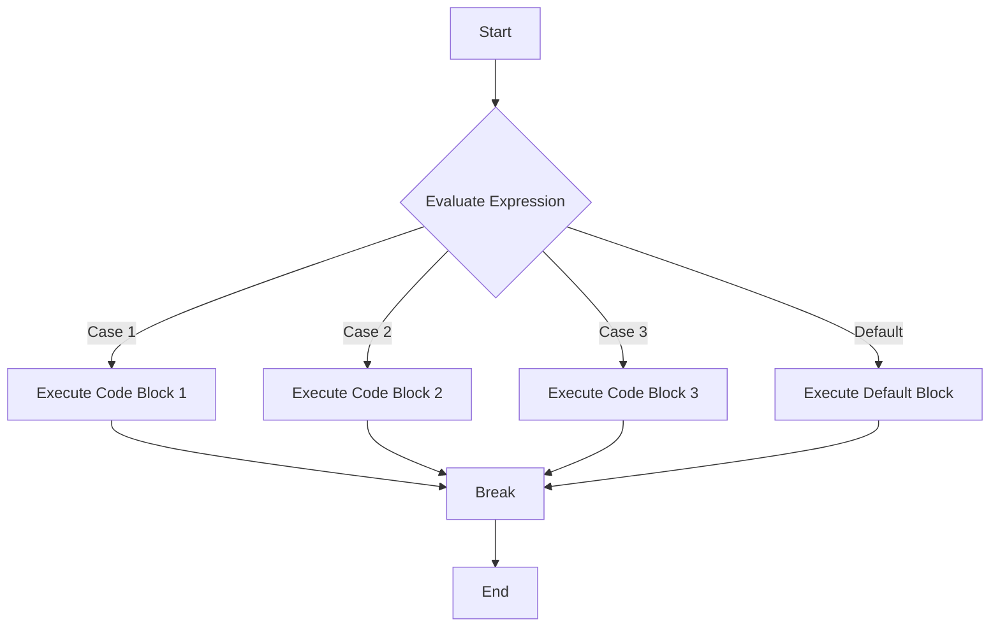

## 6.4 The `switch` Statement

In our journey through JavaScript, we've encountered several ways to control the flow of our programs. One of the most powerful tools at our disposal is the `switch` statement. This statement allows us to evaluate an expression and execute different blocks of code based on the value of that expression. In this section, we'll explore the syntax, use cases, and best practices for using the `switch` statement in JavaScript.

### What is a `switch` Statement?

The `switch` statement is a control structure that allows you to execute different parts of code based on the value of a variable or expression. It is particularly useful when you have a single variable or expression that can take on multiple values, and you want to perform different actions depending on which value it takes.

#### Syntax of a `switch` Statement

Let's start by examining the basic syntax of a `switch` statement:

```javascript
switch (expression) {
  case value1:
    // Code to execute if expression === value1
    break;
  case value2:
    // Code to execute if expression === value2
    break;
  // Add more cases as needed
  default:
    // Code to execute if none of the cases match
}
```

- **`expression`**: This is the value that you want to evaluate. It can be a variable or any expression that returns a value.
- **`case value`**: Each `case` represents a possible value of the expression. If the expression matches this value, the code block following the `case` will be executed.
- **`break`**: This keyword is used to terminate a `case` block. Without it, the code will continue to execute the next case block, a behavior known as "fall-through."
- **`default`**: This is an optional block that will execute if none of the `case` values match the expression.

### Understanding `break` and Fall-Through

One of the most important aspects of using a `switch` statement is understanding the role of the `break` keyword. Without `break`, the program will continue to execute the subsequent `case` blocks even if a match is found. This is called "fall-through" and can lead to unexpected results.

Consider the following example:

```javascript
let fruit = "apple";

switch (fruit) {
  case "apple":
    console.log("Apples are red or green.");
    // No break here, so fall-through occurs
  case "banana":
    console.log("Bananas are yellow.");
    break;
  case "orange":
    console.log("Oranges are orange.");
    break;
  default:
    console.log("Unknown fruit.");
}
```

**Output:**

```
Apples are red or green.
Bananas are yellow.
```

In this example, because there is no `break` after the first `case`, the program continues to execute the code in the `banana` case, even though `fruit` is "apple." To prevent this, always use `break` unless you intentionally want fall-through behavior.

### Using `case` Statements and the `default` Case

The `case` statements are the heart of the `switch` statement. They define the possible values that the expression can take and the corresponding actions to perform. The `default` case is optional but highly recommended as a catch-all to handle unexpected values.

Here's an example that uses multiple `case` statements and a `default` case:

```javascript
let day = 3;

switch (day) {
  case 1:
    console.log("Monday");
    break;
  case 2:
    console.log("Tuesday");
    break;
  case 3:
    console.log("Wednesday");
    break;
  case 4:
    console.log("Thursday");
    break;
  case 5:
    console.log("Friday");
    break;
  case 6:
    console.log("Saturday");
    break;
  case 7:
    console.log("Sunday");
    break;
  default:
    console.log("Invalid day");
}
```

**Output:**

```
Wednesday
```

In this example, the `switch` statement evaluates the `day` variable. Since `day` is 3, the code block for `case 3` is executed, and "Wednesday" is printed to the console. If `day` were not between 1 and 7, the `default` case would execute, printing "Invalid day."

### When to Use `switch` Over `if...else`

Both `switch` and `if...else` statements can be used to control the flow of a program, but they are suited to different scenarios.

- **Use `switch` when:**
  - You have a single expression that can take on multiple discrete values.
  - You want to improve code readability by clearly listing all possible values and their corresponding actions.
  - You want to avoid deeply nested `if...else` structures.

- **Use `if...else` when:**
  - You have complex conditions that involve multiple expressions or logical operators.
  - You need to evaluate ranges of values or conditions that are not easily expressed as discrete cases.

Here's a comparison of `switch` and `if...else` for the same logic:

**Using `switch`:**

```javascript
let animal = "dog";

switch (animal) {
  case "cat":
    console.log("Meow");
    break;
  case "dog":
    console.log("Woof");
    break;
  case "cow":
    console.log("Moo");
    break;
  default:
    console.log("Unknown animal sound");
}
```

**Using `if...else`:**

```javascript
let animal = "dog";

if (animal === "cat") {
  console.log("Meow");
} else if (animal === "dog") {
  console.log("Woof");
} else if (animal === "cow") {
  console.log("Moo");
} else {
  console.log("Unknown animal sound");
}
```

Both examples achieve the same result, but the `switch` statement provides a more concise and readable way to handle multiple discrete values.

### Try It Yourself

To reinforce your understanding of the `switch` statement, try modifying the following code:

```javascript
let weather = "sunny";

switch (weather) {
  case "sunny":
    console.log("It's a bright day!");
    break;
  case "rainy":
    console.log("Don't forget your umbrella.");
    break;
  case "snowy":
    console.log("Time to build a snowman!");
    break;
  default:
    console.log("Weather unknown.");
}
```

**Challenge:**

1. Add a new case for "cloudy" weather.
2. Remove the `break` statement from the "rainy" case and observe the output.
3. Change the value of `weather` to "windy" and see which message is displayed.

### Visualizing the `switch` Statement

To better understand the flow of a `switch` statement, let's visualize it using a flowchart:



**Description:**

- The flowchart begins with evaluating the expression.
- Depending on the result, the program executes the corresponding code block.
- If a `break` statement is encountered, the program exits the `switch` statement.
- If no cases match, the `default` block is executed.

### Best Practices for Using `switch`

- **Always include a `default` case**: This ensures that your program handles unexpected values gracefully.
- **Use `break` to prevent fall-through**: Unless you specifically want to execute multiple cases, always use `break` to terminate each case block.
- **Keep cases simple**: Each case should perform a single, clear action. If a case becomes too complex, consider refactoring it into a separate function.
- **Avoid using `switch` for ranges**: If you need to evaluate ranges of values, `if...else` statements are more appropriate.

### Common Mistakes and How to Avoid Them

- **Forgetting the `break` statement**: This is a common mistake that leads to fall-through behavior. Always double-check that each case ends with a `break`.
- **Using complex expressions in `case` statements**: `case` values should be simple and discrete. If you find yourself using complex expressions, reconsider whether a `switch` statement is the best choice.
- **Not handling all possible values**: Ensure that your `switch` statement covers all possible values of the expression, including unexpected ones with a `default` case.

### References and Further Reading

To deepen your understanding of `switch` statements and control flow in JavaScript, consider exploring the following resources:

- [MDN Web Docs: switch](https://developer.mozilla.org/en-US/docs/Web/JavaScript/Reference/Statements/switch)
- [W3Schools: JavaScript Switch Statement](https://www.w3schools.com/js/js_switch.asp)

These resources provide additional examples and explanations to help you master the `switch` statement.

### Summary

The `switch` statement is a powerful tool for controlling the flow of your JavaScript programs. By allowing you to evaluate an expression and execute different code blocks based on its value, `switch` statements can make your code more readable and maintainable. Remember to use `break` to prevent fall-through, include a `default` case to handle unexpected values, and choose `switch` over `if...else` when dealing with multiple discrete values.

## Quiz Time!



### What is the primary purpose of a `switch` statement in JavaScript?

- [x] To execute different code blocks based on the value of an expression.
- [ ] To loop through a set of values.
- [ ] To declare variables.
- [ ] To handle errors in code.

> **Explanation:** A `switch` statement is used to execute different code blocks based on the value of an expression.

### What keyword is used to prevent fall-through in a `switch` statement?

- [x] break
- [ ] continue
- [ ] return
- [ ] exit

> **Explanation:** The `break` keyword is used to terminate a case block and prevent fall-through to subsequent cases.

### What happens if you omit the `break` statement in a `switch` case?

- [x] The program continues to execute the next case block.
- [ ] The program exits the `switch` statement.
- [ ] The program throws an error.
- [ ] The program restarts from the first case.

> **Explanation:** Omitting the `break` statement causes the program to continue executing the next case block, a behavior known as fall-through.

### Which part of a `switch` statement is optional but recommended?

- [x] default
- [ ] case
- [ ] expression
- [ ] break

> **Explanation:** The `default` case is optional but recommended to handle unexpected values.

### When is it more appropriate to use `if...else` instead of `switch`?

- [x] When evaluating complex conditions with multiple expressions.
- [ ] When dealing with a single variable with discrete values.
- [ ] When you want to improve code readability.
- [ ] When you want to avoid deeply nested structures.

> **Explanation:** `if...else` is more appropriate for evaluating complex conditions involving multiple expressions or logical operators.

### What is the output of the following code?
```javascript
let color = "blue";

switch (color) {
  case "red":
    console.log("Red");
  case "blue":
    console.log("Blue");
  case "green":
    console.log("Green");
  default:
    console.log("Unknown color");
}
```

- [ ] Red
- [x] Blue
- [x] Green
- [x] Unknown color

> **Explanation:** Without `break` statements, the program falls through all subsequent cases, printing "Blue", "Green", and "Unknown color".

### How can you handle unexpected values in a `switch` statement?

- [x] By including a `default` case.
- [ ] By using a `try...catch` block.
- [ ] By using a `return` statement.
- [ ] By using a `continue` statement.

> **Explanation:** Including a `default` case allows you to handle unexpected values gracefully.

### What is the purpose of the `expression` in a `switch` statement?

- [x] To determine which case block to execute.
- [ ] To declare a variable.
- [ ] To handle errors.
- [ ] To loop through values.

> **Explanation:** The `expression` is evaluated to determine which case block should be executed.

### Which of the following is a correct use of a `switch` statement?

- [x] Evaluating a single variable with multiple discrete values.
- [ ] Evaluating complex logical conditions.
- [ ] Declaring multiple variables.
- [ ] Handling asynchronous operations.

> **Explanation:** A `switch` statement is best used for evaluating a single variable with multiple discrete values.

### True or False: A `switch` statement can have multiple `default` cases.

- [x] False
- [ ] True

> **Explanation:** A `switch` statement can only have one `default` case to handle unmatched values.



By mastering the `switch` statement, you've taken another step forward in your JavaScript journey. Keep practicing and experimenting with different scenarios to solidify your understanding of this powerful control structure.
