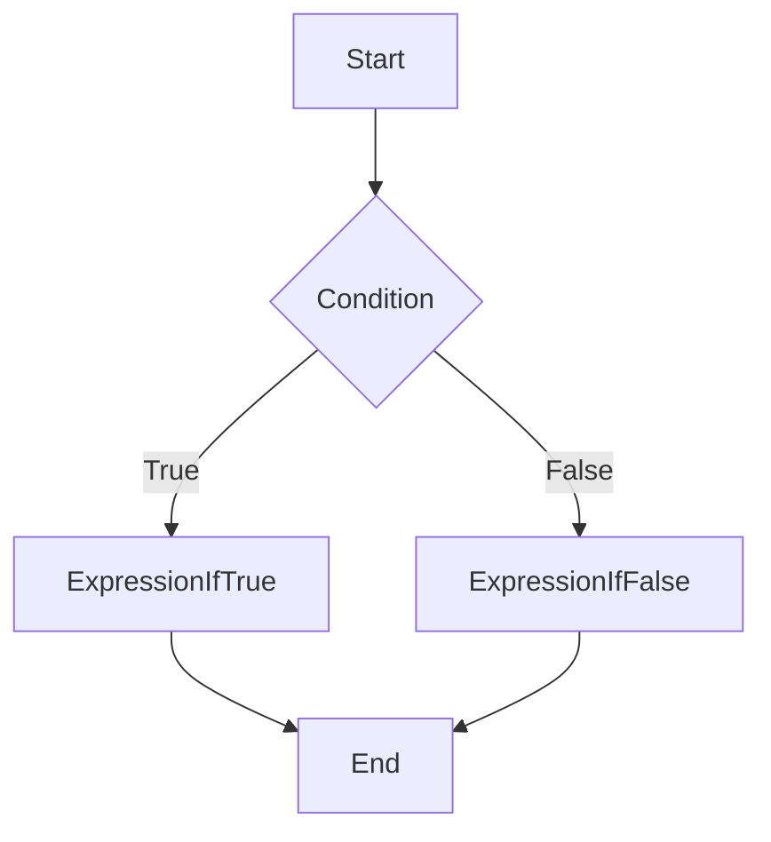

## 6.5 The Conditional (Ternary) Operator

Welcome to our exploration of the **Conditional (Ternary) Operator** in JavaScript! This operator is a powerful tool that allows us to write concise conditional statements in a single line. As we dive into this topic, we'll cover the syntax, provide examples, and discuss best practices for using the ternary operator effectively. Let's get started!

### Understanding the Ternary Operator

The ternary operator is a shorthand way of writing an `if...else` statement. It is called "ternary" because it involves three operands: a condition, a result for true, and a result for false. The general syntax of the ternary operator is:

```javascript
condition ? expressionIfTrue : expressionIfFalse;
```

- **Condition**: This is the expression that is evaluated. If it is true, the first expression (`expressionIfTrue`) is executed. If it is false, the second expression (`expressionIfFalse`) is executed.
- **ExpressionIfTrue**: This is the expression that is executed if the condition is true.
- **ExpressionIfFalse**: This is the expression that is executed if the condition is false.

### Simple Conditional Assignments

Let's look at some examples to better understand how the ternary operator works.

#### Example 1: Basic Usage

Suppose we want to assign a value to a variable based on a condition. We can use the ternary operator to do this concisely.

```javascript
let age = 18;
let canVote = (age >= 18) ? "Yes, you can vote." : "No, you cannot vote.";

console.log(canVote); // Output: Yes, you can vote.
```

In this example, we check if the `age` is greater than or equal to 18. If it is, `canVote` is assigned the string `"Yes, you can vote."`, otherwise, it is assigned `"No, you cannot vote."`.

#### Example 2: Simplifying `if...else`

Consider the following `if...else` statement:

```javascript
let number = 10;
let result;

if (number % 2 === 0) {
    result = "Even";
} else {
    result = "Odd";
}

console.log(result); // Output: Even
```

We can simplify this using the ternary operator:

```javascript
let number = 10;
let result = (number % 2 === 0) ? "Even" : "Odd";

console.log(result); // Output: Even
```

As you can see, the ternary operator allows us to write the conditional logic in a single line, making the code more concise.

### Readability Considerations with Nested Ternary Operators

While the ternary operator is a powerful tool for writing concise code, it can become difficult to read when used excessively or in nested form. Let's explore this with an example.

#### Example 3: Nested Ternary Operators

Consider a scenario where we want to assign a grade based on a score:

```javascript
let score = 85;
let grade = (score >= 90) ? "A" :
            (score >= 80) ? "B" :
            (score >= 70) ? "C" :
            (score >= 60) ? "D" : "F";

console.log(grade); // Output: B
```

In this example, we have nested ternary operators to determine the grade based on the score. While this approach works, it can be challenging to read and understand, especially for beginners.

#### Best Practices for Readability

1. **Limit Nesting**: Avoid using nested ternary operators. If the logic becomes too complex, consider using `if...else` statements for better readability.

2. **Use Parentheses for Clarity**: When using multiple ternary operators, consider using parentheses to make the code more readable.

3. **Commenting**: Add comments to explain the logic, especially when the ternary operator is used in complex scenarios.

4. **Refactor Complex Logic**: If the ternary operator makes the code difficult to read, refactor it into a function or use `if...else` statements.

### Try It Yourself

Now that we've covered the basics of the ternary operator, let's try modifying some code examples to reinforce your understanding.

#### Challenge 1: Modify the Voting Age Example

Modify the voting age example to include a message for ages below 18, indicating how many years are left until they can vote.

```javascript
let age = 16;
let canVote = (age >= 18) ? "Yes, you can vote." : `No, you cannot vote. Wait ${18 - age} more years.`;

console.log(canVote); // Output: No, you cannot vote. Wait 2 more years.
```

#### Challenge 2: Refactor Nested Ternary Operators

Refactor the nested ternary operator example for grading into an `if...else` statement for better readability.

```javascript
let score = 85;
let grade;

if (score >= 90) {
    grade = "A";
} else if (score >= 80) {
    grade = "B";
} else if (score >= 70) {
    grade = "C";
} else if (score >= 60) {
    grade = "D";
} else {
    grade = "F";
}

console.log(grade); // Output: B
```

### Visualizing the Ternary Operator

To further enhance our understanding, let's visualize the flow of a ternary operation using a flowchart.



In this flowchart, we start with a condition. If the condition is true, we execute `ExpressionIfTrue`. If it is false, we execute `ExpressionIfFalse`. This visualization helps us understand the decision-making process of the ternary operator.

### References and Further Reading

For more information on the ternary operator and conditional statements in JavaScript, check out these resources:

- [MDN Web Docs: Conditional (Ternary) Operator](https://developer.mozilla.org/en-US/docs/Web/JavaScript/Reference/Operators/Conditional_Operator)
- [W3Schools: JavaScript Ternary Operator](https://www.w3schools.com/js/js_comparisons.asp)

### Key Takeaways

- The ternary operator is a concise way to write conditional statements in JavaScript.
- It involves three operands: a condition, an expression if true, and an expression if false.
- While the ternary operator can simplify code, excessive nesting can reduce readability.
- Use parentheses, comments, and refactor complex logic to maintain code clarity.

### Exercises

1. Write a program using the ternary operator to determine if a number is positive, negative, or zero.
2. Create a function that uses the ternary operator to return the larger of two numbers.
3. Refactor a complex `if...else` statement into a ternary operator, ensuring readability is maintained.

## Quiz Time!



### What is the purpose of the ternary operator in JavaScript?

- [x] To write concise conditional statements
- [ ] To perform arithmetic operations
- [ ] To declare variables
- [ ] To create loops

> **Explanation:** The ternary operator is used to write concise conditional statements in a single line.

### How many operands does the ternary operator involve?

- [x] Three
- [ ] One
- [ ] Two
- [ ] Four

> **Explanation:** The ternary operator is called "ternary" because it involves three operands: a condition, an expression if true, and an expression if false.

### Which of the following is the correct syntax for the ternary operator?

- [x] `condition ? expressionIfTrue : expressionIfFalse;`
- [ ] `condition : expressionIfTrue ? expressionIfFalse;`
- [ ] `condition ? expressionIfFalse : expressionIfTrue;`
- [ ] `condition : expressionIfFalse ? expressionIfTrue;`

> **Explanation:** The correct syntax for the ternary operator is `condition ? expressionIfTrue : expressionIfFalse;`.

### What is the output of the following code: `let result = (5 > 3) ? "Yes" : "No"; console.log(result);`?

- [x] Yes
- [ ] No
- [ ] Undefined
- [ ] Error

> **Explanation:** The condition `5 > 3` is true, so the expression `"Yes"` is executed.

### What should you consider when using nested ternary operators?

- [x] Readability
- [ ] Performance
- [ ] Memory Usage
- [ ] Compilation Time

> **Explanation:** Readability is a key consideration when using nested ternary operators, as they can make the code difficult to understand.

### Which of the following is a best practice for using the ternary operator?

- [x] Limit nesting
- [ ] Use it for all conditional logic
- [ ] Avoid using parentheses
- [ ] Use it only for arithmetic operations

> **Explanation:** Limiting nesting is a best practice for using the ternary operator to maintain code readability.

### How can you improve the readability of complex ternary operations?

- [x] Use parentheses and comments
- [ ] Avoid using the ternary operator
- [ ] Use more nested ternary operators
- [ ] Ignore readability concerns

> **Explanation:** Using parentheses and comments can improve the readability of complex ternary operations.

### What is the output of this code: `let age = 20; let canDrink = (age >= 21) ? "Yes" : "No"; console.log(canDrink);`?

- [x] No
- [ ] Yes
- [ ] Undefined
- [ ] Error

> **Explanation:** The condition `age >= 21` is false, so the expression `"No"` is executed.

### Which of the following is NOT a component of the ternary operator?

- [x] Loop
- [ ] Condition
- [ ] ExpressionIfTrue
- [ ] ExpressionIfFalse

> **Explanation:** A loop is not a component of the ternary operator. The ternary operator involves a condition, an expression if true, and an expression if false.

### True or False: The ternary operator can only be used for numerical comparisons.

- [ ] True
- [x] False

> **Explanation:** False. The ternary operator can be used for any condition, not just numerical comparisons.



By mastering the ternary operator, you'll be able to write more concise and efficient code, enhancing your JavaScript programming skills. Keep practicing and experimenting with different scenarios to deepen your understanding!
