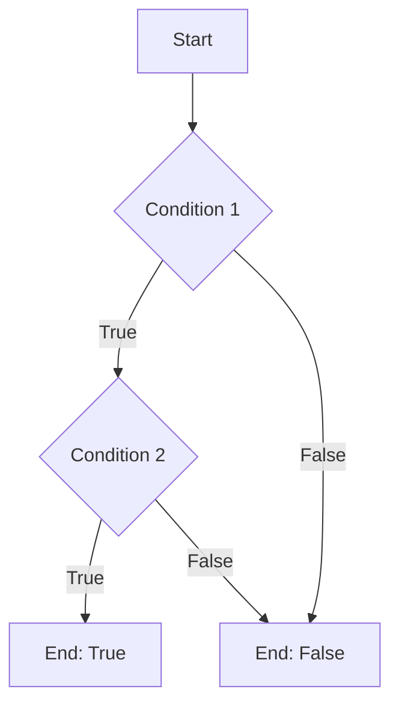

## 6.6 Logical Operators in Conditional Statements

In this section, we will explore how logical operators can be used in JavaScript conditional statements to combine multiple conditions. This is an essential skill for writing more complex and efficient code. We will also introduce De Morgan's Laws, which can help simplify complex logical expressions, and provide examples of common patterns in condition checking.

### Understanding Logical Operators

Logical operators are used to combine multiple boolean expressions or conditions. In JavaScript, the primary logical operators are:

- **Logical AND (`&&`)**: Returns `true` if both operands are true.
- **Logical OR (`||`)**: Returns `true` if at least one of the operands is true.
- **Logical NOT (`!`)**: Inverts the boolean value of its operand.

Let's dive into each of these operators and see how they can be used in conditional statements.

#### Logical AND (`&&`)

The logical AND operator (`&&`) is used when you want to check if multiple conditions are true simultaneously. If all conditions are true, the entire expression evaluates to `true`. If any condition is false, the expression evaluates to `false`.

**Example:**

```javascript
let age = 25;
let hasDrivingLicense = true;

// Check if the person is an adult and has a driving license
if (age >= 18 && hasDrivingLicense) {
    console.log("You can drive.");
} else {
    console.log("You cannot drive.");
}
```

In this example, both conditions `age >= 18` and `hasDrivingLicense` must be true for the message "You can drive." to be printed.

#### Logical OR (`||`)

The logical OR operator (`||`) is used when you want to check if at least one of multiple conditions is true. If any condition is true, the entire expression evaluates to `true`. If all conditions are false, the expression evaluates to `false`.

**Example:**

```javascript
let isWeekend = true;
let isHoliday = false;

// Check if today is a day off
if (isWeekend || isHoliday) {
    console.log("You have a day off.");
} else {
    console.log("You have to work.");
}
```

Here, the message "You have a day off." will be printed if either `isWeekend` or `isHoliday` is true.

#### Logical NOT (`!`)

The logical NOT operator (`!`) is used to invert the boolean value of a condition. If the condition is true, `!` makes it false, and vice versa.

**Example:**

```javascript
let isRaining = false;

// Check if it's not raining
if (!isRaining) {
    console.log("You can go for a walk.");
} else {
    console.log("Better stay indoors.");
}
```

In this case, `!isRaining` evaluates to `true`, so "You can go for a walk." will be printed.

### Combining Logical Operators

Logical operators can be combined to create more complex conditional statements. This allows you to check multiple conditions at once and make decisions based on the results.

**Example:**

```javascript
let temperature = 22;
let isSunny = true;
let isWeekend = true;

// Check if it's a good day for a picnic
if ((temperature > 20 && isSunny) || isWeekend) {
    console.log("It's a great day for a picnic!");
} else {
    console.log("Maybe another day.");
}
```

In this example, the message "It's a great day for a picnic!" will be printed if either both `temperature > 20` and `isSunny` are true, or if `isWeekend` is true.

### De Morgan's Laws

De Morgan's Laws are two transformation rules that can be used to simplify complex logical expressions. They are particularly useful when working with negations in conditional statements.

The laws are as follows:

1. **NOT (A AND B) is equivalent to (NOT A) OR (NOT B)**
2. **NOT (A OR B) is equivalent to (NOT A) AND (NOT B)**

Let's see how these laws can be applied in JavaScript.

**Example:**

Suppose you have the following condition:

```javascript
if (!(age >= 18 && hasDrivingLicense)) {
    console.log("You cannot drive.");
}
```

Using De Morgan's Laws, this can be rewritten as:

```javascript
if (age < 18 || !hasDrivingLicense) {
    console.log("You cannot drive.");
}
```

Both versions of the condition are logically equivalent, but the second version might be easier to read and understand.

### Common Patterns in Condition Checking

Let's explore some common patterns in condition checking using logical operators.

#### Checking for Multiple Conditions

When you need to check if multiple conditions are true, use the logical AND operator (`&&`).

**Example:**

```javascript
let hasPassport = true;
let hasVisa = true;

// Check if the person can travel internationally
if (hasPassport && hasVisa) {
    console.log("You can travel internationally.");
} else {
    console.log("You cannot travel internationally.");
}
```

#### Checking for Any Condition

When you need to check if at least one condition is true, use the logical OR operator (`||`).

**Example:**

```javascript
let isMember = false;
let hasInvitation = true;

// Check if the person can enter the event
if (isMember || hasInvitation) {
    console.log("You can enter the event.");
} else {
    console.log("You cannot enter the event.");
}
```

#### Negating Conditions

When you need to check if a condition is false, use the logical NOT operator (`!`).

**Example:**

```javascript
let isClosed = false;

// Check if the store is open
if (!isClosed) {
    console.log("The store is open.");
} else {
    console.log("The store is closed.");
}
```

### Try It Yourself

Now that we've covered the basics of logical operators in conditional statements, it's time to experiment with some code. Try modifying the examples above to see how different conditions affect the output. Here are a few ideas:

- Change the values of variables to see how the output changes.
- Combine multiple logical operators to create more complex conditions.
- Use De Morgan's Laws to simplify conditions in your own code.

### Visualizing Logical Operators

To better understand how logical operators work, let's visualize the process of evaluating a condition using a flowchart.



This flowchart represents a simple conditional statement using the logical AND operator (`&&`). The process starts at `A`, checks `Condition 1`, and if true, proceeds to check `Condition 2`. If both conditions are true, the result is true; otherwise, it is false.

### Further Reading

For more information on logical operators and conditional statements in JavaScript, check out the following resources:

- [MDN Web Docs: Logical Operators](https://developer.mozilla.org/en-US/docs/Web/JavaScript/Guide/Expressions_and_Operators#logical_operators)
- [W3Schools: JavaScript Conditions](https://www.w3schools.com/js/js_if_else.asp)

### Summary

In this section, we've explored how logical operators can be used in JavaScript conditional statements to combine multiple conditions. We've learned about the logical AND (`&&`), OR (`||`), and NOT (`!`) operators, and how they can be combined to create complex conditions. We've also introduced De Morgan's Laws, which can help simplify complex logical expressions. By understanding and applying these concepts, you can write more efficient and readable code.

## Quiz Time!



### Which logical operator returns true if both operands are true?

- [x] Logical AND (`&&`)
- [ ] Logical OR (`||`)
- [ ] Logical NOT (`!`)
- [ ] Logical XOR

> **Explanation:** The logical AND (`&&`) operator returns true only if both operands are true.

### What does the logical OR (`||`) operator do?

- [ ] Returns true if both operands are true
- [x] Returns true if at least one operand is true
- [ ] Returns true if both operands are false
- [ ] Inverts the boolean value

> **Explanation:** The logical OR (`||`) operator returns true if at least one of the operands is true.

### How does the logical NOT (`!`) operator affect a boolean value?

- [x] It inverts the boolean value
- [ ] It doubles the boolean value
- [ ] It halves the boolean value
- [ ] It leaves the boolean value unchanged

> **Explanation:** The logical NOT (`!`) operator inverts the boolean value, turning true into false and vice versa.

### What is the result of the expression `!(true && false)`?

- [x] true
- [ ] false
- [ ] undefined
- [ ] null

> **Explanation:** The expression `true && false` evaluates to false, and the logical NOT (`!`) operator inverts it to true.

### Which of the following is an example of De Morgan's Laws?

- [x] NOT (A AND B) is equivalent to (NOT A) OR (NOT B)
- [ ] NOT (A OR B) is equivalent to (A AND B)
- [x] NOT (A OR B) is equivalent to (NOT A) AND (NOT B)
- [ ] NOT (A AND B) is equivalent to (A OR B)

> **Explanation:** De Morgan's Laws state that NOT (A AND B) is equivalent to (NOT A) OR (NOT B), and NOT (A OR B) is equivalent to (NOT A) AND (NOT B).

### What is the primary use of logical operators in conditional statements?

- [ ] To perform arithmetic operations
- [x] To combine multiple conditions
- [ ] To declare variables
- [ ] To define functions

> **Explanation:** Logical operators are primarily used to combine multiple conditions in conditional statements.

### What will the following code output if `isWeekend` is true and `isHoliday` is false?

```javascript
if (isWeekend || isHoliday) {
    console.log("You have a day off.");
} else {
    console.log("You have to work.");
}
```

- [x] "You have a day off."
- [ ] "You have to work."
- [ ] "Error"
- [ ] "Undefined"

> **Explanation:** Since `isWeekend` is true, the logical OR (`||`) operator will evaluate the condition as true, resulting in "You have a day off."

### How can you simplify the condition `!(age >= 18 && hasDrivingLicense)` using De Morgan's Laws?

- [x] age < 18 || !hasDrivingLicense
- [ ] age >= 18 || hasDrivingLicense
- [ ] age < 18 && !hasDrivingLicense
- [ ] age >= 18 && hasDrivingLicense

> **Explanation:** Using De Morgan's Laws, `!(age >= 18 && hasDrivingLicense)` can be simplified to `age < 18 || !hasDrivingLicense`.

### Which logical operator should you use to check if multiple conditions are true?

- [x] Logical AND (`&&`)
- [ ] Logical OR (`||`)
- [ ] Logical NOT (`!`)
- [ ] Logical XOR

> **Explanation:** The logical AND (`&&`) operator is used to check if multiple conditions are true.

### True or False: The logical NOT (`!`) operator can only be used with boolean values.

- [x] True
- [ ] False

> **Explanation:** The logical NOT (`!`) operator is used to invert boolean values, so it is primarily used with boolean expressions.




