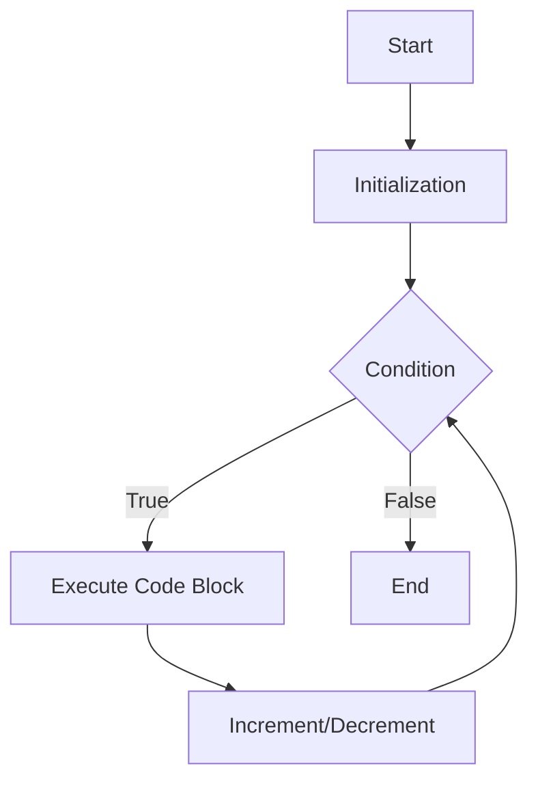

## 7.1 Introduction to Loops

In the world of programming, we often encounter situations where we need to repeat a set of instructions multiple times. Whether it's processing items in a list, performing calculations, or iterating through a sequence of numbers, loops are essential tools that allow us to automate repetitive tasks efficiently. In this section, we will explore the concept of loops in JavaScript, understand their purpose, and introduce different loop control structures available in the language.

### Understanding the Purpose of Loops

Imagine you have a task that needs to be repeated several times, like printing numbers from 1 to 10. Without loops, you would have to write each print statement individually, which is not only tedious but also prone to errors. Loops provide a way to execute a block of code multiple times, making our programs more concise, efficient, and easier to maintain.

Loops are particularly useful when:

- You need to perform the same action on multiple elements of a collection.
- You want to execute a block of code a specific number of times.
- You need to iterate over data structures like arrays or objects.

By using loops, we can reduce redundancy in our code and focus on the logic rather than repetitive tasks.

### Introducing Loop Control Structures in JavaScript

JavaScript offers several loop control structures that cater to different needs and scenarios. Let's introduce the most common ones:

1. **`for` Loop**: The `for` loop is used when you know in advance how many times you want to execute a block of code. It consists of three parts: initialization, condition, and increment/decrement.

2. **`while` Loop**: The `while` loop continues to execute a block of code as long as a specified condition is true. It's useful when the number of iterations is not known beforehand.

3. **`do...while` Loop**: Similar to the `while` loop, but the block of code is executed at least once before the condition is tested.

4. **`for...in` Loop**: This loop is used to iterate over the properties of an object. It's particularly useful for working with objects.

5. **`for...of` Loop**: Introduced in ES6, the `for...of` loop is used to iterate over iterable objects like arrays, strings, and more.

Let's dive deeper into each of these loop structures with examples and explanations.

### The `for` Loop

The `for` loop is one of the most commonly used loops in JavaScript. It allows you to execute a block of code a specific number of times. Here's the basic syntax:

```javascript
for (initialization; condition; increment/decrement) {
    // Code to be executed
}
```

- **Initialization**: Sets up a loop counter variable and is executed once before the loop starts.
- **Condition**: Evaluated before each iteration. If true, the loop continues; if false, the loop stops.
- **Increment/Decrement**: Updates the loop counter after each iteration.

#### Example: Printing Numbers from 1 to 5

Let's use a `for` loop to print numbers from 1 to 5:

```javascript
for (let i = 1; i <= 5; i++) {
    console.log(i);
}
```

**Explanation**:
- **Initialization**: `let i = 1` sets the loop counter `i` to 1.
- **Condition**: `i <= 5` checks if `i` is less than or equal to 5.
- **Increment**: `i++` increases the value of `i` by 1 after each iteration.

This loop will output:
```
1
2
3
4
5
```

### The `while` Loop

The `while` loop is used when you want to repeat a block of code as long as a certain condition is true. The syntax is as follows:

```javascript
while (condition) {
    // Code to be executed
}
```

#### Example: Printing Numbers from 1 to 5

Here's how you can achieve the same result using a `while` loop:

```javascript
let i = 1;
while (i <= 5) {
    console.log(i);
    i++;
}
```

**Explanation**:
- **Initialization**: `let i = 1` sets the loop counter `i` to 1.
- **Condition**: `i <= 5` checks if `i` is less than or equal to 5.
- **Increment**: `i++` increases the value of `i` by 1 after each iteration.

The output will be the same as the `for` loop example.

### The `do...while` Loop

The `do...while` loop is similar to the `while` loop, but it guarantees that the code block will be executed at least once. The syntax is:

```javascript
do {
    // Code to be executed
} while (condition);
```

#### Example: Printing Numbers from 1 to 5

Let's see how a `do...while` loop works:

```javascript
let i = 1;
do {
    console.log(i);
    i++;
} while (i <= 5);
```

**Explanation**:
- The code block inside the `do` statement is executed first.
- The condition `i <= 5` is checked after each iteration.

The output will be:
```
1
2
3
4
5
```

### The `for...in` Loop

The `for...in` loop is specifically designed for iterating over the properties of an object. Here's the syntax:

```javascript
for (variable in object) {
    // Code to be executed
}
```

#### Example: Iterating Over Object Properties

Let's iterate over the properties of an object:

```javascript
const person = {
    name: "Alice",
    age: 25,
    city: "New York"
};

for (let key in person) {
    console.log(key + ": " + person[key]);
}
```

**Explanation**:
- The loop iterates over each property (`key`) in the `person` object.
- `person[key]` accesses the value associated with each property.

The output will be:
```
name: Alice
age: 25
city: New York
```

### The `for...of` Loop

The `for...of` loop is used to iterate over iterable objects like arrays, strings, and more. It's a more modern and concise way to loop through elements. The syntax is:

```javascript
for (variable of iterable) {
    // Code to be executed
}
```

#### Example: Iterating Over an Array

Let's use a `for...of` loop to iterate over an array:

```javascript
const fruits = ["apple", "banana", "cherry"];

for (let fruit of fruits) {
    console.log(fruit);
}
```

**Explanation**:
- The loop iterates over each element (`fruit`) in the `fruits` array.

The output will be:
```
apple
banana
cherry
```

### Visualizing Loop Control Flow

To better understand how loops work, let's visualize the control flow of a `for` loop using a flowchart.



**Description**: This flowchart illustrates the control flow of a `for` loop. The loop starts with initialization, checks the condition, executes the code block if the condition is true, and then increments or decrements the counter. This process repeats until the condition becomes false.

### Try It Yourself

Now that we've covered the basics of loops, it's time for you to try it yourself! Experiment with the code examples provided and make modifications to see how they work. Here are a few suggestions:

- Modify the `for` loop to print numbers from 10 to 1.
- Use a `while` loop to print even numbers between 1 and 10.
- Create an object with different properties and use a `for...in` loop to print them.
- Use a `for...of` loop to iterate over a string and print each character.

### Key Takeaways

- Loops are essential for automating repetitive tasks in programming.
- JavaScript provides several loop control structures: `for`, `while`, `do...while`, `for...in`, and `for...of`.
- Each loop structure has its own use case and syntax.
- Understanding loops helps in writing efficient and concise code.

By mastering loops, you'll be able to tackle more complex programming challenges and write code that is both efficient and easy to maintain.

## Quiz Time!



### What is the main purpose of loops in programming?

- [x] To automate repetitive tasks
- [ ] To create variables
- [ ] To define functions
- [ ] To handle errors

> **Explanation:** Loops are used to automate repetitive tasks by executing a block of code multiple times.

### Which loop structure is best suited for iterating over the properties of an object?

- [ ] `for` loop
- [ ] `while` loop
- [x] `for...in` loop
- [ ] `for...of` loop

> **Explanation:** The `for...in` loop is specifically designed for iterating over the properties of an object.

### What is the difference between a `while` loop and a `do...while` loop?

- [x] A `do...while` loop executes the code block at least once before checking the condition.
- [ ] A `while` loop executes the code block at least once before checking the condition.
- [ ] A `do...while` loop never executes the code block.
- [ ] A `while` loop always executes the code block twice.

> **Explanation:** A `do...while` loop executes the code block at least once before checking the condition, whereas a `while` loop checks the condition first.

### In a `for` loop, which part is responsible for updating the loop counter?

- [ ] Initialization
- [ ] Condition
- [x] Increment/Decrement
- [ ] Code Block

> **Explanation:** The increment/decrement part of a `for` loop is responsible for updating the loop counter after each iteration.

### Which loop structure was introduced in ES6 for iterating over iterable objects?

- [ ] `for` loop
- [ ] `while` loop
- [ ] `for...in` loop
- [x] `for...of` loop

> **Explanation:** The `for...of` loop was introduced in ES6 for iterating over iterable objects like arrays and strings.

### What will be the output of the following code?
```javascript
let i = 0;
while (i < 3) {
    console.log(i);
    i++;
}
```

- [x] 0 1 2
- [ ] 1 2 3
- [ ] 0 1 2 3
- [ ] 1 2

> **Explanation:** The `while` loop will print numbers 0, 1, and 2 as long as `i` is less than 3.

### Which loop structure guarantees that the code block will be executed at least once?

- [ ] `for` loop
- [ ] `while` loop
- [x] `do...while` loop
- [ ] `for...in` loop

> **Explanation:** The `do...while` loop guarantees that the code block will be executed at least once before checking the condition.

### What is the correct syntax for a `for` loop?

- [x] `for (initialization; condition; increment/decrement) { // code }`
- [ ] `for (condition; initialization; increment/decrement) { // code }`
- [ ] `for (increment/decrement; condition; initialization) { // code }`
- [ ] `for (initialization; increment/decrement; condition) { // code }`

> **Explanation:** The correct syntax for a `for` loop is `for (initialization; condition; increment/decrement) { // code }`.

### Which loop structure is most suitable for iterating over an array?

- [ ] `for...in` loop
- [x] `for...of` loop
- [ ] `while` loop
- [ ] `do...while` loop

> **Explanation:** The `for...of` loop is most suitable for iterating over arrays as it directly accesses each element.

### True or False: The `for...in` loop can be used to iterate over arrays.

- [x] True
- [ ] False

> **Explanation:** While the `for...in` loop can technically be used to iterate over arrays, it is not recommended as it iterates over all enumerable properties, which can lead to unexpected results.


