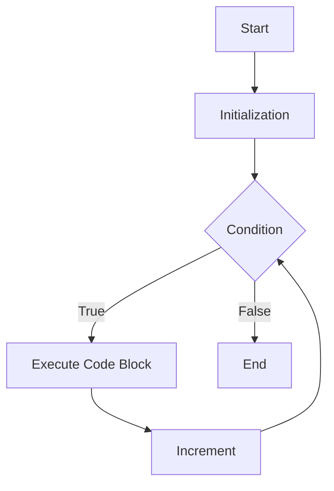

## 7.2 The `for` Loop

Welcome to the exciting world of loops in JavaScript! In this section, we will dive deep into the `for` loop, a fundamental concept that allows us to repeat a block of code multiple times. By the end of this guide, you'll have a solid understanding of how to use the `for` loop to make your programs more efficient and dynamic.

### Understanding the `for` Loop Syntax

The `for` loop is a control structure that allows you to execute a block of code repeatedly based on a condition. The syntax of a `for` loop is as follows:

```javascript
for (initialization; condition; increment) {
    // Code to be executed
}
```

Let's break down each part of the `for` loop syntax:

- **Initialization**: This is where you declare and initialize a loop control variable. It is executed once at the beginning of the loop. Typically, this is where you set the starting value of a counter variable.

- **Condition**: This is a boolean expression that is evaluated before each iteration of the loop. If the condition is `true`, the loop continues to execute. If it is `false`, the loop stops.

- **Increment**: This is an expression that is executed after each iteration of the loop. It is usually used to update the loop control variable.

- **Code Block**: This is the block of code that you want to execute repeatedly. It is enclosed in curly braces `{}`.

### Counting Upwards with a `for` Loop

Let's start with a simple example of a `for` loop that counts upwards from 1 to 5:

```javascript
// Counting upwards from 1 to 5
for (let i = 1; i <= 5; i++) {
    console.log(i);
}
```

**Explanation:**

- **Initialization**: `let i = 1;` - We declare a variable `i` and initialize it to 1.
- **Condition**: `i <= 5;` - The loop will continue as long as `i` is less than or equal to 5.
- **Increment**: `i++` - After each iteration, we increase `i` by 1.
- **Code Block**: `console.log(i);` - This will print the current value of `i` to the console.

### Counting Downwards with a `for` Loop

Now, let's modify our loop to count downwards from 5 to 1:

```javascript
// Counting downwards from 5 to 1
for (let i = 5; i >= 1; i--) {
    console.log(i);
}
```

**Explanation:**

- **Initialization**: `let i = 5;` - We start with `i` initialized to 5.
- **Condition**: `i >= 1;` - The loop will continue as long as `i` is greater than or equal to 1.
- **Increment**: `i--` - We decrease `i` by 1 after each iteration.
- **Code Block**: `console.log(i);` - This will print the current value of `i` to the console.

### Using Variables to Control Loop Execution Dynamically

One of the powerful features of the `for` loop is its ability to use variables to control its execution. This allows for more flexible and dynamic loops.

#### Example: Dynamic Loop Control

Suppose we want to print numbers from a starting point to an endpoint, and both are determined at runtime. Here's how you can achieve that:

```javascript
// Dynamic loop control with variables
let start = 3;
let end = 7;

for (let i = start; i <= end; i++) {
    console.log(i);
}
```

**Explanation:**

- **Initialization**: `let i = start;` - We initialize `i` with the value of `start`.
- **Condition**: `i <= end;` - The loop continues as long as `i` is less than or equal to `end`.
- **Increment**: `i++` - We increment `i` by 1 after each iteration.
- **Code Block**: `console.log(i);` - This prints the current value of `i`.

### Try It Yourself

Now that we've covered the basics, it's time for you to try it yourself! Here are a few exercises to practice using the `for` loop:

1. **Exercise 1**: Modify the counting upwards example to count from 1 to 10.
2. **Exercise 2**: Create a loop that prints the even numbers between 1 and 10.
3. **Exercise 3**: Write a loop that counts down from 10 to 1 and prints "Blast off!" at the end.

### Visualizing the `for` Loop

To help you visualize how the `for` loop works, let's use a flowchart. This diagram represents the flow of control in a `for` loop.



**Diagram Explanation:**

- **Start**: The loop begins with initialization.
- **Initialization**: The loop control variable is initialized.
- **Condition**: The condition is checked. If true, the code block executes.
- **Execute Code Block**: The code inside the loop runs.
- **Increment**: The loop control variable is updated.
- **End**: The loop ends when the condition is false.

### Common Mistakes and Tips

When working with `for` loops, beginners often encounter a few common mistakes. Here are some tips to help you avoid them:

- **Infinite Loops**: Ensure your loop has a condition that will eventually become false. Otherwise, you'll create an infinite loop that never stops.

- **Off-by-One Errors**: Double-check your loop's start and end conditions to avoid running the loop one time too many or too few.

- **Variable Scope**: Remember that variables declared with `let` inside the loop are scoped to the loop block. If you need to access the loop variable outside the loop, declare it before the loop.

### Advanced `for` Loop Techniques

Once you're comfortable with the basics, you can explore more advanced techniques with `for` loops:

#### Nested `for` Loops

A nested `for` loop is a loop inside another loop. This is useful for iterating over multi-dimensional data structures like arrays or matrices.

```javascript
// Nested for loop example
for (let i = 1; i <= 3; i++) {
    for (let j = 1; j <= 3; j++) {
        console.log(`i: ${i}, j: ${j}`);
    }
}
```

**Explanation:**

- The outer loop runs three times, with `i` taking values from 1 to 3.
- For each iteration of the outer loop, the inner loop runs three times, with `j` taking values from 1 to 3.

#### Using `break` and `continue`

You can control the flow of a `for` loop using the `break` and `continue` statements:

- **`break`**: Exits the loop immediately.
- **`continue`**: Skips the current iteration and moves to the next one.

```javascript
// Using break and continue
for (let i = 1; i <= 5; i++) {
    if (i === 3) {
        continue; // Skip the iteration when i is 3
    }
    if (i === 5) {
        break; // Exit the loop when i is 5
    }
    console.log(i);
}
```

### Summary

The `for` loop is a powerful tool in JavaScript that allows you to repeat a block of code multiple times. By understanding its syntax and how to control its execution with variables, you can create dynamic and efficient programs. Remember to practice with the exercises provided and experiment with different loop conditions to deepen your understanding.

### Additional Resources

For further reading and practice, check out these resources:

- [MDN Web Docs: for Loop](https://developer.mozilla.org/en-US/docs/Web/JavaScript/Guide/Loops_and_iteration#for_statement)
- [W3Schools: JavaScript For Loop](https://www.w3schools.com/js/js_loop_for.asp)

## Quiz Time!



### What is the purpose of the initialization part of a `for` loop?

- [x] To declare and initialize the loop control variable
- [ ] To check the loop condition
- [ ] To execute the loop block
- [ ] To update the loop control variable

> **Explanation:** The initialization part is used to declare and initialize the loop control variable, which is executed once at the start of the loop.

### What does the condition part of a `for` loop do?

- [ ] It initializes the loop control variable
- [x] It checks if the loop should continue
- [ ] It updates the loop control variable
- [ ] It executes the loop block

> **Explanation:** The condition part checks if the loop should continue executing. If the condition is true, the loop runs; otherwise, it stops.

### What happens when the condition in a `for` loop evaluates to false?

- [ ] The loop continues
- [x] The loop stops
- [ ] The loop restarts
- [ ] The loop skips an iteration

> **Explanation:** When the condition evaluates to false, the loop stops executing.

### How do you update the loop control variable in a `for` loop?

- [ ] In the initialization part
- [ ] In the condition part
- [x] In the increment part
- [ ] In the loop block

> **Explanation:** The increment part is used to update the loop control variable after each iteration of the loop.

### Which statement is used to exit a loop immediately?

- [x] break
- [ ] continue
- [ ] exit
- [ ] return

> **Explanation:** The `break` statement is used to exit a loop immediately.

### Which statement is used to skip the current iteration of a loop?

- [ ] break
- [x] continue
- [ ] skip
- [ ] return

> **Explanation:** The `continue` statement is used to skip the current iteration and move to the next one.

### What is a nested `for` loop?

- [x] A loop inside another loop
- [ ] A loop that runs indefinitely
- [ ] A loop that skips iterations
- [ ] A loop that exits immediately

> **Explanation:** A nested `for` loop is a loop inside another loop, useful for iterating over multi-dimensional data structures.

### What will be the output of the following code?
```javascript
for (let i = 1; i <= 3; i++) {
    for (let j = 1; j <= 2; j++) {
        console.log(`i: ${i}, j: ${j}`);
    }
}
```

- [x] i: 1, j: 1; i: 1, j: 2; i: 2, j: 1; i: 2, j: 2; i: 3, j: 1; i: 3, j: 2;
- [ ] i: 1, j: 1; i: 2, j: 2; i: 3, j: 3;
- [ ] i: 1, j: 1; i: 2, j: 1; i: 3, j: 1;
- [ ] i: 1, j: 2; i: 2, j: 2; i: 3, j: 2;

> **Explanation:** The outer loop runs three times, and for each iteration, the inner loop runs twice, resulting in six outputs.

### True or False: The loop control variable in a `for` loop must always be an integer.

- [ ] True
- [x] False

> **Explanation:** The loop control variable can be any data type, not just an integer, although integers are commonly used.

### What is the result of the following code?
```javascript
for (let i = 0; i < 5; i++) {
    if (i === 3) {
        break;
    }
    console.log(i);
}
```

- [x] 0, 1, 2
- [ ] 0, 1, 2, 3, 4
- [ ] 0, 1, 2, 3
- [ ] 0, 1, 2, 3, 4, 5

> **Explanation:** The loop breaks when `i` equals 3, so only 0, 1, and 2 are printed.


