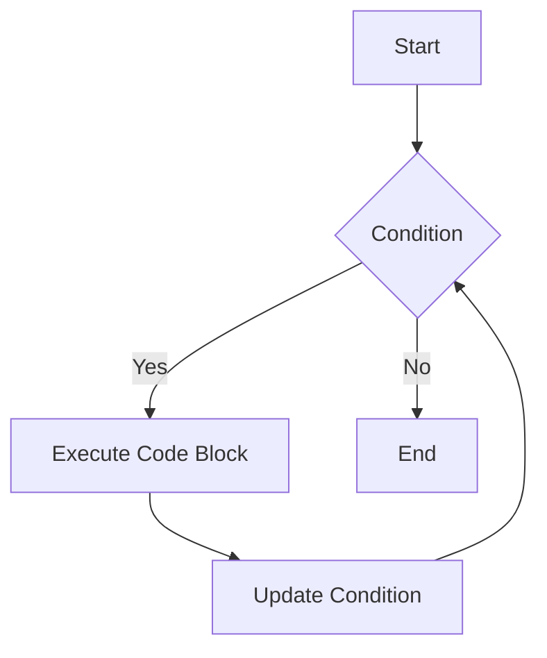

## 7.3 The `while` Loop

In this section, we will delve into the `while` loop, a fundamental control structure in JavaScript that allows us to execute a block of code repeatedly based on a given condition. Understanding how to use loops effectively is crucial for writing efficient and concise code. Let's explore the syntax, usage, and scenarios where the `while` loop shines, as well as how to avoid common pitfalls like infinite loops.

### Understanding the `while` Loop Syntax

The `while` loop in JavaScript is used to execute a block of code as long as a specified condition evaluates to `true`. The syntax for a `while` loop is straightforward:

```javascript
while (condition) {
    // Code to be executed
}
```

- **`condition`:** A Boolean expression that is evaluated before each iteration of the loop. If the condition is `true`, the loop's code block is executed. If the condition is `false`, the loop terminates.

- **Code Block:** The block of code inside the curly braces `{}` is executed repeatedly as long as the condition remains `true`.

#### Example of a Simple `while` Loop

Let's look at a simple example to understand how a `while` loop works:

```javascript
let count = 0;

while (count < 5) {
    console.log("Count is: " + count);
    count++;
}
```

**Explanation:**

- We initialize a variable `count` with a value of `0`.
- The `while` loop checks if `count` is less than `5`.
- If the condition is `true`, it prints the current value of `count` and increments it by `1`.
- This process repeats until `count` is no longer less than `5`.

**Output:**

```
Count is: 0
Count is: 1
Count is: 2
Count is: 3
Count is: 4
```

### When to Use a `while` Loop

The `while` loop is particularly useful in scenarios where the number of iterations is not known beforehand. It is ideal for situations where the loop should continue until a specific condition is met, rather than iterating a fixed number of times.

#### Scenarios for Using a `while` Loop

1. **User Input Validation:**

   When you need to repeatedly prompt a user for input until they provide a valid response, a `while` loop is a great choice.

   ```javascript
   let userInput;
   while (userInput !== "yes" && userInput !== "no") {
       userInput = prompt("Please enter 'yes' or 'no':");
   }
   console.log("You entered: " + userInput);
   ```

2. **Waiting for an Event:**

   In situations where you need to wait for an event or condition to change, such as waiting for a file to be available or a network request to complete, a `while` loop can be used.

3. **Processing Data Streams:**

   When working with data streams or continuously incoming data, a `while` loop can be used to process data until the stream ends.

### Ensuring Loop Termination

One of the most important aspects of using a `while` loop is ensuring that it eventually terminates. Failing to do so can result in an infinite loop, which can cause your program to hang or crash.

#### Tips to Prevent Infinite Loops

1. **Update the Condition:**

   Ensure that the condition in the `while` loop is updated within the loop's body. This often involves modifying a variable that affects the condition.

   ```javascript
   let number = 10;
   while (number > 0) {
       console.log(number);
       number--; // Update the condition
   }
   ```

2. **Use a Sentinel Value:**

   A sentinel value is a special value that indicates the end of a loop. This can be useful when processing input or data streams.

   ```javascript
   let input;
   while (input !== "exit") {
       input = prompt("Enter a command (type 'exit' to quit):");
   }
   ```

3. **Debugging:**

   Use debugging tools and `console.log()` statements to track the values of variables and ensure the loop condition is being updated correctly.

   ```javascript
   let counter = 0;
   while (counter < 10) {
       console.log("Counter is: " + counter);
       counter++;
   }
   ```

### Code Examples and Practice

Let's explore more examples to solidify our understanding of the `while` loop.

#### Example 1: Calculating the Sum of Numbers

Calculate the sum of numbers from 1 to 10 using a `while` loop.

```javascript
let sum = 0;
let i = 1;

while (i <= 10) {
    sum += i; // Add i to sum
    i++;      // Increment i
}

console.log("The sum of numbers from 1 to 10 is: " + sum);
```

**Output:**

```
The sum of numbers from 1 to 10 is: 55
```

#### Example 2: Factorial Calculation

Calculate the factorial of a number using a `while` loop.

```javascript
let number = 5;
let factorial = 1;

while (number > 0) {
    factorial *= number; // Multiply factorial by number
    number--;            // Decrement number
}

console.log("The factorial is: " + factorial);
```

**Output:**

```
The factorial is: 120
```

### Visualizing the `while` Loop

To better understand the flow of a `while` loop, let's visualize it using a flowchart.



**Description:**

- The loop starts by evaluating the condition.
- If the condition is `true`, the code block is executed.
- After executing the code block, the condition is updated.
- The loop continues until the condition evaluates to `false`, at which point it terminates.

### Try It Yourself

Experiment with the following code examples to deepen your understanding of the `while` loop. Modify the conditions, initial values, or operations to see how the loop behavior changes.

1. **Countdown Timer:**

   Create a countdown timer that prints numbers from 10 to 1.

   ```javascript
   let countdown = 10;
   while (countdown > 0) {
       console.log(countdown);
       countdown--;
   }
   console.log("Blast off!");
   ```

2. **Guess the Number Game:**

   Implement a simple game where the user must guess a randomly generated number between 1 and 10.

   ```javascript
   let targetNumber = Math.floor(Math.random() * 10) + 1;
   let guess;

   while (guess !== targetNumber) {
       guess = parseInt(prompt("Guess a number between 1 and 10:"));
       if (guess < targetNumber) {
           console.log("Too low!");
       } else if (guess > targetNumber) {
           console.log("Too high!");
       } else {
           console.log("Congratulations! You guessed the number.");
       }
   }
   ```

### Key Takeaways

- The `while` loop is a powerful tool for executing code repeatedly based on a condition.
- It is ideal for scenarios where the number of iterations is not predetermined.
- Always ensure that the loop condition is updated to prevent infinite loops.
- Practice using `while` loops to become comfortable with their syntax and behavior.

### Further Reading

For more information on the `while` loop and other control structures in JavaScript, consider exploring the following resources:

- [MDN Web Docs: while](https://developer.mozilla.org/en-US/docs/Web/JavaScript/Reference/Statements/while)
- [W3Schools: JavaScript while Loop](https://www.w3schools.com/js/js_loop_while.asp)

## Quiz Time!



### What is the primary purpose of a `while` loop in JavaScript?

- [x] To execute a block of code repeatedly as long as a condition is true
- [ ] To execute a block of code a fixed number of times
- [ ] To execute a block of code only once
- [ ] To execute a block of code based on user input

> **Explanation:** The `while` loop is used to execute a block of code repeatedly as long as a specified condition is true.

### Which of the following scenarios is best suited for a `while` loop?

- [x] Validating user input until it meets certain criteria
- [ ] Iterating over an array with a known length
- [ ] Executing a block of code exactly 10 times
- [ ] Performing a task at a specific time

> **Explanation:** A `while` loop is ideal for scenarios where the number of iterations is not predetermined, such as validating user input.

### What is a common mistake that can lead to an infinite loop?

- [x] Failing to update the loop condition within the loop
- [ ] Using a `for` loop instead of a `while` loop
- [ ] Using a `do...while` loop
- [ ] Using a `switch` statement

> **Explanation:** Failing to update the loop condition within the loop can result in an infinite loop, as the condition will never become false.

### How can you prevent an infinite loop in a `while` loop?

- [x] Ensure the loop condition is updated within the loop
- [ ] Use a `for` loop instead
- [ ] Avoid using loops altogether
- [ ] Use a `switch` statement

> **Explanation:** To prevent an infinite loop, ensure that the loop condition is updated within the loop so that it eventually evaluates to false.

### What is the output of the following code?

```javascript
let i = 0;
while (i < 3) {
    console.log(i);
    i++;
}
```

- [x] 0 1 2
- [ ] 0 1 2 3
- [ ] 1 2 3
- [ ] 1 2

> **Explanation:** The loop prints the values 0, 1, and 2 before the condition `i < 3` becomes false.

### Which of the following is a valid use of a `while` loop?

- [x] Processing data until a specific condition is met
- [ ] Iterating over an array with a known length
- [ ] Executing a block of code a fixed number of times
- [ ] Performing a task at a specific time

> **Explanation:** A `while` loop is used to process data until a specific condition is met, making it suitable for scenarios where the number of iterations is unknown.

### What happens if the condition in a `while` loop is initially false?

- [x] The loop is skipped entirely
- [ ] The loop executes once
- [ ] The loop executes indefinitely
- [ ] The loop executes twice

> **Explanation:** If the condition is initially false, the loop is skipped entirely, and the code block is not executed.

### What is the role of a sentinel value in a `while` loop?

- [x] To indicate the end of the loop
- [ ] To start the loop
- [ ] To increment the loop counter
- [ ] To decrement the loop counter

> **Explanation:** A sentinel value is a special value used to indicate the end of a loop, often used in input processing.

### How does a `while` loop differ from a `for` loop?

- [x] A `while` loop is used when the number of iterations is not known
- [ ] A `while` loop is used for iterating over arrays
- [ ] A `while` loop is used for executing code a fixed number of times
- [ ] A `while` loop is used only for input validation

> **Explanation:** A `while` loop is used when the number of iterations is not known, whereas a `for` loop is typically used when the number of iterations is predetermined.

### True or False: A `while` loop can be used to create an infinite loop intentionally.

- [x] True
- [ ] False

> **Explanation:** True. A `while` loop can be used to create an infinite loop intentionally by ensuring the condition always evaluates to true.



By mastering the `while` loop, you are well on your way to becoming proficient in JavaScript programming. Keep practicing and experimenting with different scenarios to enhance your understanding and skills. Happy coding!
