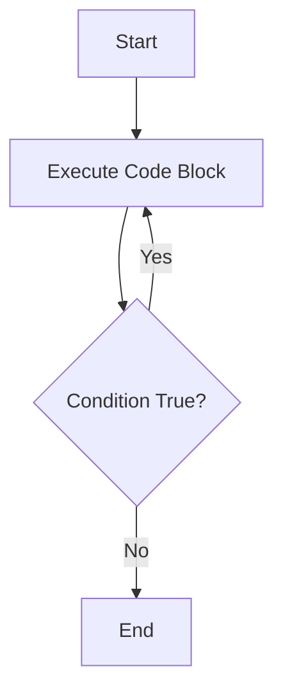

## 7.4 The `do...while` Loop

In the world of programming, loops are essential tools that allow us to execute a block of code repeatedly. In JavaScript, we have several types of loops, each with its unique characteristics and use cases. In this section, we will delve into the `do...while` loop, a loop that ensures a block of code is executed at least once before checking a condition. This feature sets it apart from other loops like the `while` loop.

### Understanding the `do...while` Loop

The `do...while` loop is a control flow statement that executes a block of code once and then repeats the execution as long as a specified condition evaluates to true. The key feature of the `do...while` loop is that it guarantees the code block inside the loop will run at least once, regardless of whether the condition is true or false.

#### Syntax of the `do...while` Loop

The syntax of the `do...while` loop is straightforward:

```javascript
do {
    // Code to be executed
} while (condition);
```

- **`do`**: This keyword indicates the start of the loop.
- **Code Block**: The code inside the curly braces `{}` is executed once before the condition is tested.
- **`while`**: This keyword is followed by a condition that is evaluated after the code block is executed.
- **Condition**: If the condition is true, the loop will execute the code block again. If false, the loop will terminate.

### How the `do...while` Loop Differs from the `while` Loop

The primary difference between the `do...while` loop and the `while` loop lies in when the condition is evaluated:

- **`while` Loop**: The condition is checked before the code block is executed. If the condition is false initially, the code block may never run.
  
  ```javascript
  let count = 0;
  while (count < 5) {
      console.log(count);
      count++;
  }
  ```

- **`do...while` Loop**: The code block is executed first, and then the condition is checked. This guarantees that the code block runs at least once.

  ```javascript
  let count = 0;
  do {
      console.log(count);
      count++;
  } while (count < 5);
  ```

### Practical Use Cases for `do...while` Loops

The `do...while` loop is particularly useful in scenarios where you need to ensure that a block of code runs at least once. Here are some practical use cases:

1. **User Input Validation**: When prompting a user for input, you may want to ensure that the user provides a valid input before proceeding. The `do...while` loop can be used to repeatedly prompt the user until a valid input is received.

2. **Menu Selection**: In console applications, you might display a menu and require the user to make a selection. The `do...while` loop can ensure that the menu is displayed at least once and continues to display until a valid choice is made.

3. **Retry Mechanisms**: In situations where you need to retry an operation until it succeeds, such as network requests or file operations, the `do...while` loop can be employed to attempt the operation at least once and continue if necessary.

### Example: User Input Validation

Let's consider a scenario where we need to prompt a user to enter a number between 1 and 10. We can use a `do...while` loop to ensure that the prompt is displayed at least once and continues until a valid number is entered.

```javascript
let number;
do {
    number = parseInt(prompt("Enter a number between 1 and 10: "), 10);
} while (isNaN(number) || number < 1 || number > 10);

console.log(`You entered: ${number}`);
```

In this example:

- The `prompt` function is used to display a dialog box that asks the user to enter a number.
- The `parseInt` function converts the input string to an integer.
- The `isNaN` function checks if the input is not a number.
- The loop continues until the user enters a valid number between 1 and 10.

### Example: Menu Selection

Consider a simple console application that displays a menu and requires the user to make a selection. The `do...while` loop ensures that the menu is displayed at least once and continues until the user makes a valid choice.

```javascript
let choice;
do {
    console.log("Menu:");
    console.log("1. Start Game");
    console.log("2. View Scores");
    console.log("3. Exit");

    choice = parseInt(prompt("Enter your choice (1-3): "), 10);
} while (isNaN(choice) || choice < 1 || choice > 3);

switch (choice) {
    case 1:
        console.log("Starting game...");
        break;
    case 2:
        console.log("Viewing scores...");
        break;
    case 3:
        console.log("Exiting...");
        break;
}
```

In this example:

- The menu is displayed using `console.log`.
- The user is prompted to enter a choice.
- The loop continues until the user enters a valid choice (1, 2, or 3).
- A `switch` statement is used to handle the user's choice.

### Example: Retry Mechanism

In scenarios where an operation may fail and needs to be retried, such as fetching data from a server, the `do...while` loop can be used to attempt the operation at least once and continue if necessary.

```javascript
let success = false;
let attempts = 0;
const maxAttempts = 3;

do {
    attempts++;
    console.log(`Attempt ${attempts}: Fetching data...`);

    // Simulate a fetch operation with a 50% chance of success
    success = Math.random() > 0.5;

    if (success) {
        console.log("Data fetched successfully!");
    } else {
        console.log("Failed to fetch data. Retrying...");
    }
} while (!success && attempts < maxAttempts);

if (!success) {
    console.log("Failed to fetch data after maximum attempts.");
}
```

In this example:

- A `success` variable is used to track whether the operation succeeded.
- A `maxAttempts` variable limits the number of retries.
- The loop continues until the operation succeeds or the maximum number of attempts is reached.
- The `Math.random` function simulates a 50% chance of success.

### Visualizing the `do...while` Loop

To better understand the flow of the `do...while` loop, let's visualize it using a flowchart:



In this flowchart:

- The loop starts by executing the code block.
- After executing the code block, the condition is checked.
- If the condition is true, the loop repeats the code block.
- If the condition is false, the loop ends.

### Try It Yourself

Experimenting with code is a great way to solidify your understanding. Try modifying the examples above to see how the `do...while` loop behaves in different scenarios. Here are some ideas:

- Modify the user input validation example to prompt for a different range of numbers.
- Add more menu options to the menu selection example.
- Change the retry mechanism example to simulate different success rates.

### Conclusion

The `do...while` loop is a valuable tool in JavaScript programming, especially when you need to ensure that a block of code runs at least once. By understanding its unique characteristics and practical use cases, you can effectively incorporate it into your programs. Remember to experiment with the examples provided and explore additional resources to deepen your understanding.

### Further Reading

For more information on the `do...while` loop and other JavaScript loops, consider exploring the following resources:

- [MDN Web Docs: do...while](https://developer.mozilla.org/en-US/docs/Web/JavaScript/Reference/Statements/do...while)
- [W3Schools: JavaScript Loops](https://www.w3schools.com/js/js_loop_while.asp)

## Quiz Time!



### What is the primary characteristic of a `do...while` loop?

- [x] It executes the code block at least once before checking the condition.
- [ ] It checks the condition before executing the code block.
- [ ] It executes the code block only if the condition is true.
- [ ] It never executes the code block if the condition is false.

> **Explanation:** The `do...while` loop executes the code block once before evaluating the condition, ensuring the block runs at least once.

### Which of the following is a valid use case for a `do...while` loop?

- [x] User input validation
- [ ] Infinite loops
- [ ] Conditional statements
- [ ] Function declarations

> **Explanation:** The `do...while` loop is useful for scenarios like user input validation, where you need to ensure the code runs at least once.

### How does the `do...while` loop differ from the `while` loop?

- [x] The `do...while` loop executes the code block before checking the condition.
- [ ] The `while` loop executes the code block before checking the condition.
- [ ] Both loops execute the code block only if the condition is true.
- [ ] The `do...while` loop never executes the code block if the condition is false.

> **Explanation:** The `do...while` loop executes the code block first, while the `while` loop checks the condition before execution.

### What happens if the condition in a `do...while` loop is false initially?

- [x] The code block executes once, then the loop terminates.
- [ ] The code block never executes.
- [ ] The loop continues indefinitely.
- [ ] The loop throws an error.

> **Explanation:** The `do...while` loop executes the code block once before checking the condition, so it runs once even if the condition is initially false.

### In which scenario would a `do...while` loop be more appropriate than a `while` loop?

- [x] When the code block must run at least once regardless of the condition.
- [ ] When the code block should only run if the condition is true.
- [ ] When the loop should terminate immediately if the condition is false.
- [ ] When the loop should run indefinitely.

> **Explanation:** The `do...while` loop is suitable when the code block must execute at least once, regardless of the condition.

### What is the output of the following code?

```javascript
let count = 0;
do {
    console.log(count);
    count++;
} while (count < 3);
```

- [x] 0 1 2
- [ ] 0 1 2 3
- [ ] 1 2 3
- [ ] 0 1

> **Explanation:** The loop executes the code block three times, printing 0, 1, and 2, before the condition becomes false.

### Which of the following statements is true about the `do...while` loop?

- [x] It guarantees at least one execution of the code block.
- [ ] It guarantees zero executions of the code block.
- [x] It evaluates the condition after executing the code block.
- [ ] It evaluates the condition before executing the code block.

> **Explanation:** The `do...while` loop guarantees at least one execution and evaluates the condition after the code block.

### What is the purpose of the `do` keyword in a `do...while` loop?

- [x] It indicates the start of the loop.
- [ ] It checks the condition.
- [ ] It ends the loop.
- [ ] It increments the loop counter.

> **Explanation:** The `do` keyword marks the beginning of the loop, indicating that the code block will execute.

### How many times will the following loop execute?

```javascript
let count = 5;
do {
    console.log(count);
    count++;
} while (count < 5);
```

- [x] 1
- [ ] 0
- [ ] 5
- [ ] Infinite

> **Explanation:** The loop executes once because the code block runs before the condition is checked.

### True or False: The `do...while` loop is ideal for situations where the code block should run at least once.

- [x] True
- [ ] False

> **Explanation:** True. The `do...while` loop ensures the code block runs at least once, making it ideal for such situations.


