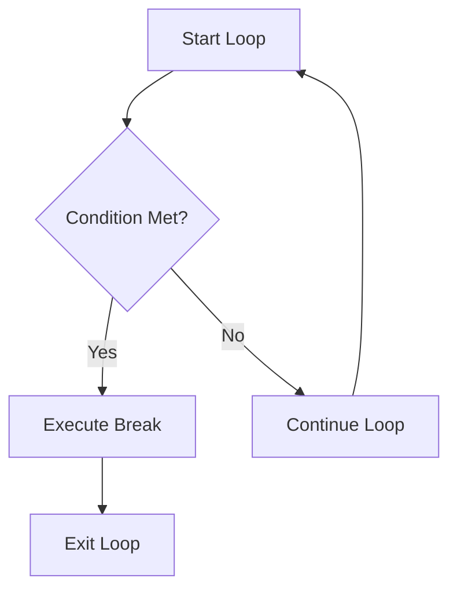
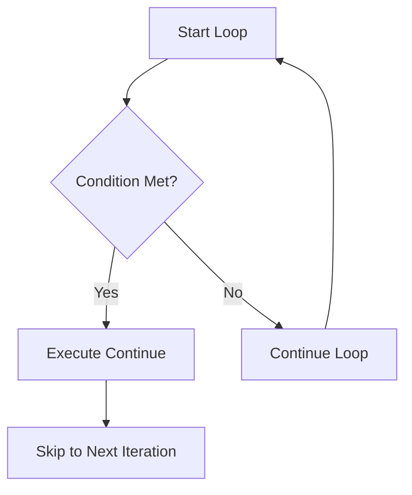

## 7.5 Controlling Loops with `break` and `continue`

In programming, loops are essential for performing repetitive tasks efficiently. However, sometimes we need to control the flow of these loops to either exit them prematurely or skip certain iterations. JavaScript provides two powerful statements for this purpose: `break` and `continue`. In this section, we'll explore how these statements work, their impact on loop execution, and how you can use them to write more efficient and readable code.

### Understanding the `break` Statement

The `break` statement is used to exit a loop prematurely. When the `break` statement is executed, the loop stops immediately, and the program continues with the next statement following the loop. This can be particularly useful when you want to stop processing as soon as a certain condition is met.

#### Using `break` in a `for` Loop

Let's consider a scenario where we want to find the first number in an array that is greater than 10. Once we find such a number, there's no need to continue checking the rest of the array. Here's how we can achieve this using the `break` statement:

```javascript
let numbers = [3, 8, 12, 5, 7, 15];
let foundNumber = null;

for (let i = 0; i < numbers.length; i++) {
  if (numbers[i] > 10) {
    foundNumber = numbers[i];
    break; // Exit the loop as soon as we find a number greater than 10
  }
}

console.log(`The first number greater than 10 is: ${foundNumber}`);
```

In this example, the loop iterates over the `numbers` array. As soon as it encounters the number 12, which is greater than 10, the `break` statement is executed, and the loop terminates. The program then prints the found number.

#### Using `break` in a `while` Loop

The `break` statement can also be used in `while` loops. Suppose we want to keep generating random numbers until we get a number greater than 0.9. Here's how we can use `break` to achieve this:

```javascript
let randomNumber;

while (true) {
  randomNumber = Math.random();
  console.log(randomNumber);
  if (randomNumber > 0.9) {
    break; // Exit the loop if the random number is greater than 0.9
  }
}

console.log('Found a number greater than 0.9!');
```

In this example, the `while` loop continues indefinitely (`while (true)`) until a random number greater than 0.9 is generated. When this condition is met, the `break` statement exits the loop.

### Understanding the `continue` Statement

The `continue` statement is used to skip the current iteration of a loop and move to the next iteration. This can be useful when you want to skip certain values or conditions without exiting the loop entirely.

#### Using `continue` in a `for` Loop

Imagine we have an array of numbers, and we want to print only the even numbers. We can use the `continue` statement to skip odd numbers:

```javascript
let numbers = [1, 2, 3, 4, 5, 6];

for (let i = 0; i < numbers.length; i++) {
  if (numbers[i] % 2 !== 0) {
    continue; // Skip the current iteration if the number is odd
  }
  console.log(numbers[i]); // Print the even number
}
```

In this example, the loop iterates over the `numbers` array. If a number is odd (`numbers[i] % 2 !== 0`), the `continue` statement is executed, skipping the rest of the loop body and moving to the next iteration.

#### Using `continue` in a `while` Loop

The `continue` statement can also be used in `while` loops. Let's say we want to print numbers from 1 to 10, but skip the number 5:

```javascript
let i = 0;

while (i < 10) {
  i++;
  if (i === 5) {
    continue; // Skip the number 5
  }
  console.log(i);
}
```

In this example, the loop increments `i` from 1 to 10. When `i` equals 5, the `continue` statement is executed, skipping the `console.log(i)` statement for that iteration.

### Visualizing Loop Control with Flowcharts

To better understand how `break` and `continue` affect loop execution, let's visualize the flow of control using flowcharts.

#### Flowchart for `break` Statement



**Description:** This flowchart illustrates how the `break` statement exits the loop when a condition is met.

#### Flowchart for `continue` Statement



**Description:** This flowchart shows how the `continue` statement skips the current iteration and moves to the next one when a condition is met.

### Practical Examples and Exercises

Let's look at some practical examples and exercises to solidify your understanding of `break` and `continue`.

#### Example: Finding a Specific Character in a String

Suppose we have a string, and we want to find the first occurrence of the character 'a'. Once found, we should stop searching. Here's how we can use `break`:

```javascript
let text = "JavaScript is awesome!";
let foundIndex = -1;

for (let i = 0; i < text.length; i++) {
  if (text[i] === 'a') {
    foundIndex = i;
    break; // Exit the loop once 'a' is found
  }
}

console.log(`The first occurrence of 'a' is at index: ${foundIndex}`);
```

#### Exercise: Skipping Specific Values

Write a program that iterates over an array of numbers and prints only those numbers that are not divisible by 3. Use the `continue` statement to skip numbers divisible by 3.

```javascript
let numbers = [1, 2, 3, 4, 5, 6, 7, 8, 9, 10];

for (let i = 0; i < numbers.length; i++) {
  if (numbers[i] % 3 === 0) {
    continue; // Skip numbers divisible by 3
  }
  console.log(numbers[i]);
}
```

### Try It Yourself

Now it's your turn to experiment with `break` and `continue`. Here are some ideas to try:

1. Modify the example where we find the first number greater than 10 to find the first number less than 5.
2. In the even numbers example, try printing only the odd numbers instead.
3. Create a loop that generates random numbers between 1 and 100, and stops when it finds a number divisible by both 5 and 7.

### Key Takeaways

- **`break` Statement:** Use `break` to exit a loop prematurely when a specific condition is met.
- **`continue` Statement:** Use `continue` to skip the current iteration and move to the next one.
- **Flow Control:** Understanding how `break` and `continue` affect loop execution can help you write more efficient and readable code.

### Further Reading and Resources

- [MDN Web Docs: `break` Statement](https://developer.mozilla.org/en-US/docs/Web/JavaScript/Reference/Statements/break)
- [MDN Web Docs: `continue` Statement](https://developer.mozilla.org/en-US/docs/Web/JavaScript/Reference/Statements/continue)
- [W3Schools: JavaScript Loops](https://www.w3schools.com/js/js_loop_for.asp)

## Quiz Time!



### What does the `break` statement do in a loop?

- [x] Exits the loop immediately
- [ ] Skips the current iteration
- [ ] Continues to the next iteration
- [ ] Restarts the loop

> **Explanation:** The `break` statement exits the loop immediately when executed.

### What does the `continue` statement do in a loop?

- [ ] Exits the loop immediately
- [x] Skips the current iteration
- [ ] Continues to the next iteration
- [ ] Restarts the loop

> **Explanation:** The `continue` statement skips the current iteration and moves to the next one.

### In which type of loop can you use the `break` statement?

- [x] Both `for` and `while` loops
- [ ] Only `for` loops
- [ ] Only `while` loops
- [ ] Neither `for` nor `while` loops

> **Explanation:** The `break` statement can be used in both `for` and `while` loops.

### What happens when the `continue` statement is executed?

- [ ] The loop exits immediately
- [x] The current iteration is skipped
- [ ] The loop restarts
- [ ] The loop continues without skipping

> **Explanation:** The `continue` statement skips the current iteration and moves to the next one.

### Can the `break` statement be used inside a `switch` statement?

- [x] Yes
- [ ] No

> **Explanation:** The `break` statement is commonly used in `switch` statements to exit a case block.

### What is the output of the following code?

```javascript
for (let i = 0; i < 5; i++) {
  if (i === 3) {
    break;
  }
  console.log(i);
}
```

- [x] 0 1 2
- [ ] 0 1 2 3
- [ ] 0 1 2 3 4
- [ ] 0 1 2 3 4 5

> **Explanation:** The loop exits when `i` equals 3, so only 0, 1, and 2 are printed.

### What is the output of the following code?

```javascript
for (let i = 0; i < 5; i++) {
  if (i === 3) {
    continue;
  }
  console.log(i);
}
```

- [x] 0 1 2 4
- [ ] 0 1 2 3 4
- [ ] 0 1 2
- [ ] 0 1 2 3

> **Explanation:** The `continue` statement skips the iteration when `i` equals 3, so 0, 1, 2, and 4 are printed.

### Which statement is used to exit a loop prematurely?

- [x] break
- [ ] continue
- [ ] exit
- [ ] stop

> **Explanation:** The `break` statement is used to exit a loop prematurely.

### Which statement is used to skip the current iteration of a loop?

- [ ] break
- [x] continue
- [ ] exit
- [ ] skip

> **Explanation:** The `continue` statement is used to skip the current iteration of a loop.

### True or False: The `continue` statement can be used to exit a loop.

- [ ] True
- [x] False

> **Explanation:** The `continue` statement does not exit a loop; it skips the current iteration and continues with the next one.



By mastering `break` and `continue`, you can gain greater control over your loops, making your JavaScript code more efficient and easier to understand. Keep practicing and experimenting with these statements to see how they can improve your programming skills!
