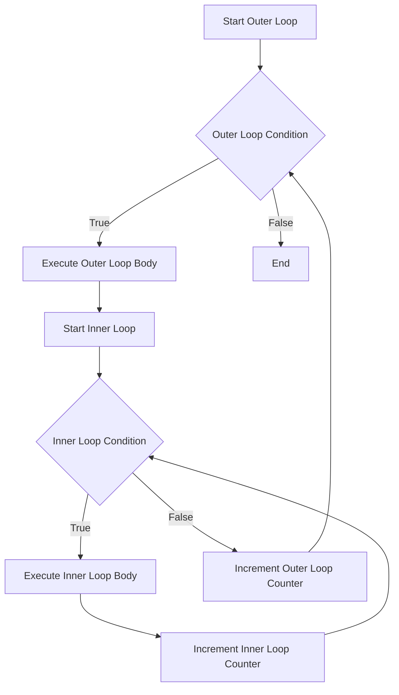

## 7.6 Nested Loops

Welcome to the world of nested loops in JavaScript! In this section, we'll explore the concept of loops within loops, which is a powerful technique that allows us to perform complex iterations over data structures like matrices or multi-dimensional arrays. We'll break down the concept step-by-step, provide practical examples, and discuss important considerations such as performance and complexity. By the end of this section, you'll have a solid understanding of how to use nested loops effectively in your JavaScript programs.

### Understanding Nested Loops

Nested loops are loops that exist inside another loop. The inner loop runs completely every time the outer loop runs once. This technique is particularly useful when dealing with multi-dimensional data structures or when you need to perform repetitive tasks that involve multiple layers of iteration.

#### Why Use Nested Loops?

Nested loops are essential when you need to:

- **Iterate over multi-dimensional arrays**: For example, processing a grid or matrix.
- **Perform complex data manipulations**: Such as generating combinations or permutations.
- **Implement algorithms**: Like sorting or searching in data structures.

### Basic Structure of Nested Loops

A nested loop consists of an outer loop and one or more inner loops. Here's a simple example to illustrate the basic structure:

```javascript
for (let i = 0; i < 3; i++) {
    console.log(`Outer loop iteration: ${i}`);
    for (let j = 0; j < 2; j++) {
        console.log(`  Inner loop iteration: ${j}`);
    }
}
```

**Explanation:**

- The outer loop runs three times (`i` ranges from 0 to 2).
- For each iteration of the outer loop, the inner loop runs twice (`j` ranges from 0 to 1).
- The inner loop completes all its iterations before the outer loop moves to the next iteration.

### Practical Example: Iterating Over a Matrix

Let's consider a practical example where we use nested loops to iterate over a 2D array, also known as a matrix. A matrix is a grid-like data structure that can be visualized as rows and columns.

```javascript
let matrix = [
    [1, 2, 3],
    [4, 5, 6],
    [7, 8, 9]
];

for (let row = 0; row < matrix.length; row++) {
    for (let col = 0; col < matrix[row].length; col++) {
        console.log(`Element at [${row}][${col}]: ${matrix[row][col]}`);
    }
}
```

**Explanation:**

- The outer loop iterates over each row of the matrix.
- The inner loop iterates over each element in the current row.
- This setup allows us to access each element of the matrix using the indices `[row][col]`.

### Visualizing Nested Loops

To better understand how nested loops work, let's visualize the flow of execution using a flowchart.



**Diagram Explanation:**

- The outer loop starts and checks its condition.
- If the condition is true, the outer loop body executes, and the inner loop begins.
- The inner loop runs until its condition is false, at which point control returns to the outer loop.
- This process repeats until the outer loop condition is false.

### Performance Considerations

While nested loops are powerful, they can also lead to performance issues if not used carefully. Here are some considerations to keep in mind:

- **Time Complexity**: The time complexity of nested loops is generally the product of the individual loop complexities. For example, two nested loops each running `n` times result in a time complexity of O(n^2).
- **Efficiency**: Avoid unnecessary nested loops. Consider if the task can be accomplished with fewer iterations or a different approach.
- **Memory Usage**: Be mindful of the memory usage when dealing with large data structures.

### Avoiding Common Pitfalls

When working with nested loops, it's important to avoid common pitfalls that can lead to errors or inefficient code:

- **Infinite Loops**: Ensure that each loop has a proper termination condition to avoid infinite loops.
- **Off-by-One Errors**: Double-check loop boundaries to prevent accessing elements outside the array bounds.
- **Complexity**: Keep the logic within nested loops as simple as possible to maintain readability and efficiency.

### Try It Yourself: Experiment with Nested Loops

Let's encourage you to experiment with nested loops by modifying the code examples provided. Here are some ideas to get you started:

- **Modify the Matrix**: Change the size or values of the matrix and observe how the nested loops iterate over it.
- **Add More Layers**: Try adding a third layer of loops to simulate a 3D array.
- **Implement a Pattern**: Use nested loops to generate patterns, such as a multiplication table or a triangle of numbers.

### Advanced Example: Generating a Multiplication Table

Let's take a look at a more advanced example where we use nested loops to generate a multiplication table:

```javascript
let size = 5; // Size of the multiplication table

for (let i = 1; i <= size; i++) {
    let row = '';
    for (let j = 1; j <= size; j++) {
        row += (i * j).toString().padStart(4, ' ');
    }
    console.log(row);
}
```

**Explanation:**

- The outer loop iterates over the rows of the table.
- The inner loop calculates the product of the current row and column indices.
- The result is formatted and printed in a tabular format.

### Real-World Applications of Nested Loops

Nested loops are used in various real-world applications, including:

- **Image Processing**: Iterating over pixels in an image to apply filters or transformations.
- **Game Development**: Managing grids or tile-based maps in games.
- **Data Analysis**: Processing multi-dimensional datasets for statistical analysis.

### Summary

Nested loops are a fundamental concept in programming that allows us to perform complex iterations over multi-dimensional data structures. By understanding the structure and flow of nested loops, you can tackle a wide range of programming challenges. Remember to consider performance implications and strive for efficient, readable code.

### Further Reading and Resources

For more information on loops and iterations in JavaScript, check out the following resources:

- [MDN Web Docs: Loops and Iteration](https://developer.mozilla.org/en-US/docs/Web/JavaScript/Guide/Loops_and_iteration)
- [W3Schools: JavaScript Loops](https://www.w3schools.com/js/js_loop_for.asp)

---

## Quiz Time!



### What is a nested loop?

- [x] A loop inside another loop
- [ ] A loop that runs indefinitely
- [ ] A loop that executes only once
- [ ] A loop with no condition

> **Explanation:** A nested loop is a loop that exists within another loop, allowing for multi-layered iterations.

### What is the time complexity of two nested loops, each running `n` times?

- [x] O(n^2)
- [ ] O(n)
- [ ] O(2n)
- [ ] O(n^3)

> **Explanation:** The time complexity of two nested loops, each running `n` times, is O(n^2), as the inner loop runs `n` times for each iteration of the outer loop.

### What is a common use case for nested loops?

- [x] Iterating over a matrix
- [ ] Reading a single file
- [ ] Printing a single line
- [ ] Declaring variables

> **Explanation:** Nested loops are commonly used to iterate over multi-dimensional data structures like matrices.

### What should you be cautious of when using nested loops?

- [x] Infinite loops
- [ ] Variable declarations
- [ ] Single-line comments
- [ ] Function definitions

> **Explanation:** It's important to ensure that each loop has a proper termination condition to avoid infinite loops.

### How can you improve the efficiency of nested loops?

- [x] Avoid unnecessary iterations
- [ ] Add more loops
- [ ] Use more variables
- [ ] Increase the loop counter

> **Explanation:** Avoiding unnecessary iterations and optimizing the loop logic can improve the efficiency of nested loops.

### What is the output of the following code snippet?
```javascript
for (let i = 0; i < 2; i++) {
    for (let j = 0; j < 2; j++) {
        console.log(i + j);
    }
}
```

- [x] 0, 1, 1, 2
- [ ] 0, 1, 2, 3
- [ ] 1, 2, 3, 4
- [ ] 0, 1, 2

> **Explanation:** The nested loops iterate over the indices, and the sum of `i` and `j` is printed for each combination.

### Which of the following is a benefit of using nested loops?

- [x] They allow for complex data manipulations
- [ ] They reduce code readability
- [ ] They increase memory usage
- [ ] They simplify single-loop tasks

> **Explanation:** Nested loops enable complex data manipulations, such as iterating over multi-dimensional arrays.

### What is the purpose of the inner loop in a nested loop structure?

- [x] To execute multiple iterations for each iteration of the outer loop
- [ ] To terminate the outer loop
- [ ] To declare variables
- [ ] To print a message

> **Explanation:** The inner loop executes multiple iterations for each iteration of the outer loop, allowing for layered iterations.

### What is the output of the following code snippet?
```javascript
for (let i = 1; i <= 3; i++) {
    for (let j = 1; j <= 2; j++) {
        console.log(i * j);
    }
}
```

- [x] 1, 2, 2, 4, 3, 6
- [ ] 1, 2, 3, 4, 5, 6
- [ ] 2, 4, 6, 8, 10, 12
- [ ] 1, 1, 2, 2, 3, 3

> **Explanation:** The nested loops iterate over the indices, and the product of `i` and `j` is printed for each combination.

### True or False: Nested loops are only useful for iterating over arrays.

- [ ] True
- [x] False

> **Explanation:** Nested loops are useful for a variety of tasks, including iterating over arrays, generating patterns, and implementing algorithms.


