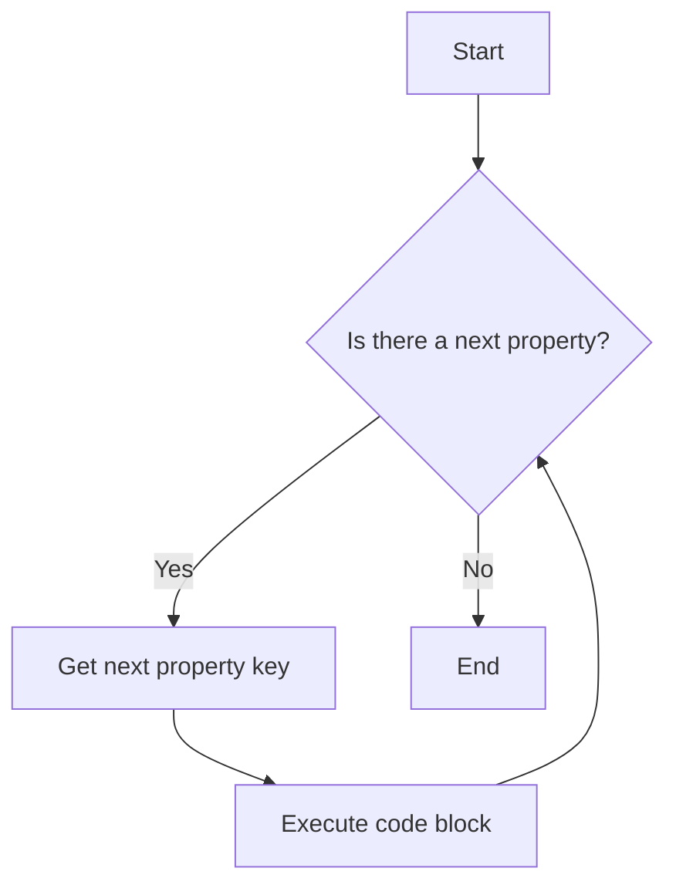

## 7.7 The `for...in` Loop (Introduction)

In this section, we will delve into the `for...in` loop, a unique and powerful tool in JavaScript for iterating over the properties of objects. As you embark on your programming journey, understanding how to effectively navigate and manipulate objects is crucial. The `for...in` loop provides a straightforward way to access each property within an object, making it an essential concept for beginners to grasp.

### What is the `for...in` Loop?

The `for...in` loop is a control structure in JavaScript specifically designed for iterating over the enumerable properties of an object. Unlike traditional loops that iterate over numerical indices or elements in an array, the `for...in` loop allows you to traverse the keys of an object, providing a convenient way to access and manipulate its properties.

#### Syntax of the `for...in` Loop

Let's begin by examining the basic syntax of the `for...in` loop:

```javascript
for (let key in object) {
    // Code to execute for each property
}
```

- **`key`**: Represents the current property name (or key) of the object being iterated over.
- **`object`**: The object whose properties you want to iterate through.

### Key Differences from the Traditional `for` Loop

Before we dive into examples, it's important to understand how the `for...in` loop differs from the traditional `for` loop:

1. **Purpose**: The traditional `for` loop is typically used for iterating over arrays or executing a block of code a specific number of times. In contrast, the `for...in` loop is designed for iterating over object properties.

2. **Iteration**: The `for...in` loop iterates over the keys (property names) of an object, while the traditional `for` loop iterates over numerical indices.

3. **Use Case**: Use the `for...in` loop when you need to access or manipulate the properties of an object, and the traditional `for` loop when dealing with arrays or sequences.

### Exploring the `for...in` Loop with Examples

To solidify our understanding, let's explore some examples of how the `for...in` loop can be used in practice.

#### Example 1: Iterating Over an Object

Consider the following object representing a person:

```javascript
const person = {
    name: "Alice",
    age: 30,
    occupation: "Engineer"
};

for (let key in person) {
    console.log(key + ": " + person[key]);
}
```

**Output:**

```
name: Alice
age: 30
occupation: Engineer
```

In this example, the `for...in` loop iterates over each property of the `person` object, allowing us to access both the property name (`key`) and its corresponding value (`person[key]`).

#### Example 2: Modifying Object Properties

The `for...in` loop can also be used to modify the properties of an object. Let's see how:

```javascript
const scores = {
    math: 85,
    science: 90,
    english: 78
};

for (let subject in scores) {
    scores[subject] += 5; // Increase each score by 5
}

console.log(scores);
```

**Output:**

```javascript
{ math: 90, science: 95, english: 83 }
```

Here, we iterate over the `scores` object and increase each score by 5, demonstrating how the `for...in` loop can be used to update object properties.

### Understanding Inherited Properties and `hasOwnProperty()`

While the `for...in` loop is a powerful tool, it's important to be aware of its behavior regarding inherited properties. By default, the `for...in` loop iterates over all enumerable properties of an object, including those inherited from its prototype chain.

#### Example 3: Inherited Properties

Consider the following example:

```javascript
function Animal(name) {
    this.name = name;
}

Animal.prototype.type = "Mammal";

const dog = new Animal("Buddy");

for (let key in dog) {
    console.log(key + ": " + dog[key]);
}
```

**Output:**

```
name: Buddy
type: Mammal
```

In this example, the `for...in` loop iterates over both the `name` property of the `dog` object and the `type` property inherited from the `Animal` prototype.

#### Using `hasOwnProperty()` to Filter Inherited Properties

To avoid iterating over inherited properties, you can use the `hasOwnProperty()` method, which checks whether a property belongs directly to the object:

```javascript
for (let key in dog) {
    if (dog.hasOwnProperty(key)) {
        console.log(key + ": " + dog[key]);
    }
}
```

**Output:**

```
name: Buddy
```

By incorporating `hasOwnProperty()`, we ensure that only the properties directly defined on the `dog` object are iterated over, excluding inherited properties.

### Visualizing the `for...in` Loop

To further enhance our understanding, let's visualize the `for...in` loop using a Mermaid.js diagram. This diagram represents the flow of the loop as it iterates over the properties of an object.



**Diagram Description**: This flowchart illustrates the process of the `for...in` loop. It starts by checking if there is a next property to iterate over. If yes, it retrieves the next property key, executes the code block, and repeats the process. If no, the loop ends.

### Common Use Cases for the `for...in` Loop

The `for...in` loop is particularly useful in scenarios where you need to:

- **Access and Display Object Properties**: Easily iterate over and display all properties of an object, as demonstrated in our earlier examples.

- **Modify Object Properties**: Update or transform the values of an object's properties, such as increasing scores or changing property values.

- **Filter Properties**: Use `hasOwnProperty()` to filter out inherited properties and focus on the object's own properties.

### Potential Pitfalls and Best Practices

While the `for...in` loop is a valuable tool, there are some potential pitfalls to be aware of:

1. **Inherited Properties**: As discussed, the loop iterates over inherited properties by default. Use `hasOwnProperty()` to filter them out if needed.

2. **Performance Considerations**: For large objects or performance-critical applications, consider alternative methods like `Object.keys()` or `Object.entries()` for more efficient iteration.

3. **Order of Iteration**: The order in which properties are iterated over is not guaranteed. If order matters, consider using arrays or other data structures.

### Try It Yourself

To reinforce your understanding, try modifying the code examples provided. Experiment with different objects, properties, and operations. Here are some suggestions:

- Create an object representing a car with properties like `make`, `model`, and `year`. Use the `for...in` loop to display each property.
- Modify the `scores` object example to decrease each score by a certain percentage.
- Add inherited properties to an object and practice using `hasOwnProperty()` to filter them out.

### Further Reading

For more in-depth information on the `for...in` loop and related topics, consider exploring the following resources:

- [MDN Web Docs: for...in](https://developer.mozilla.org/en-US/docs/Web/JavaScript/Reference/Statements/for...in)
- [W3Schools: JavaScript for...in Loop](https://www.w3schools.com/jsref/jsref_forin.asp)

### Summary

In this section, we've explored the `for...in` loop, a powerful tool for iterating over object properties in JavaScript. We've learned about its syntax, use cases, and how it differs from traditional loops. By understanding the nuances of the `for...in` loop and incorporating best practices, you'll be well-equipped to work with objects effectively in your JavaScript programs.

## Quiz Time!



### What is the primary use of the `for...in` loop in JavaScript?

- [x] Iterating over the properties of an object
- [ ] Iterating over elements in an array
- [ ] Executing a block of code a specific number of times
- [ ] Iterating over characters in a string

> **Explanation:** The `for...in` loop is specifically designed for iterating over the properties of an object.

### Which method can be used to filter out inherited properties in a `for...in` loop?

- [x] `hasOwnProperty()`
- [ ] `Object.keys()`
- [ ] `Object.values()`
- [ ] `Object.entries()`

> **Explanation:** The `hasOwnProperty()` method checks whether a property belongs directly to the object, excluding inherited properties.

### What does the `for...in` loop iterate over?

- [x] The keys (property names) of an object
- [ ] The values of an object
- [ ] The indices of an array
- [ ] The characters of a string

> **Explanation:** The `for...in` loop iterates over the keys (property names) of an object.

### How does the `for...in` loop differ from the traditional `for` loop?

- [x] It iterates over object properties instead of numerical indices
- [ ] It iterates over array elements
- [ ] It is used for executing a block of code a specific number of times
- [ ] It iterates over characters in a string

> **Explanation:** The `for...in` loop is designed for iterating over object properties, while the traditional `for` loop is used for numerical indices.

### What is the output of the following code?

```javascript
const obj = { a: 1, b: 2 };
for (let key in obj) {
    console.log(key);
}
```

- [x] `a`, `b`
- [ ] `1`, `2`
- [ ] `a: 1`, `b: 2`
- [ ] `undefined`

> **Explanation:** The `for...in` loop iterates over the keys of the object, which are `a` and `b`.

### Which of the following is a potential pitfall of using the `for...in` loop?

- [x] It iterates over inherited properties by default
- [ ] It cannot iterate over object properties
- [ ] It only works with arrays
- [ ] It requires a specific order of iteration

> **Explanation:** The `for...in` loop iterates over all enumerable properties, including inherited ones, which can be a pitfall if not handled correctly.

### What is the purpose of using `hasOwnProperty()` in a `for...in` loop?

- [x] To filter out inherited properties
- [ ] To sort the properties of an object
- [ ] To convert an object to an array
- [ ] To iterate over array elements

> **Explanation:** `hasOwnProperty()` is used to filter out inherited properties, ensuring only the object's own properties are iterated over.

### Can the `for...in` loop be used to iterate over arrays?

- [x] Yes, but it's not recommended
- [ ] No, it only works with objects
- [ ] Yes, and it's the best method for arrays
- [ ] No, it only works with strings

> **Explanation:** While the `for...in` loop can technically iterate over arrays, it's not recommended due to potential issues with inherited properties and order.

### What is the output of the following code?

```javascript
function Animal() {}
Animal.prototype.type = "Mammal";
const dog = new Animal();
for (let key in dog) {
    console.log(key);
}
```

- [x] `type`
- [ ] `Mammal`
- [ ] `undefined`
- [ ] No output

> **Explanation:** The `for...in` loop iterates over the `type` property inherited from the `Animal` prototype.

### True or False: The order of iteration in a `for...in` loop is guaranteed.

- [ ] True
- [x] False

> **Explanation:** The order of iteration in a `for...in` loop is not guaranteed and may vary between different JavaScript engines.


