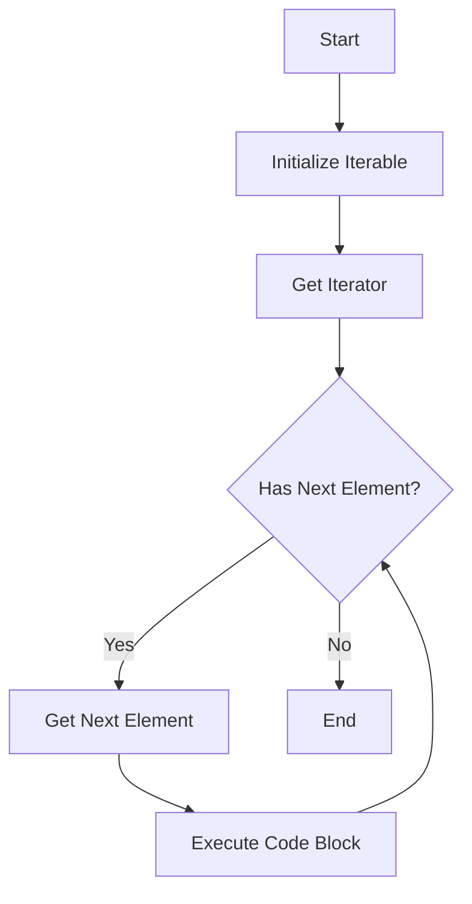

## 7.8 The `for...of` Loop (ES6)

In this section, we will explore the `for...of` loop, a powerful feature introduced in ECMAScript 6 (ES6) that allows us to iterate over iterable objects such as arrays and strings. The `for...of` loop provides a more readable and concise syntax for iterating over elements, making it a valuable tool for JavaScript developers.

### Understanding the `for...of` Loop

The `for...of` loop is designed to iterate over iterable objects. But what exactly is an iterable object? In JavaScript, an iterable is an object that implements the `@@iterator` method, which returns an iterator. This iterator is an object that adheres to the iterator protocol, providing a `next()` method that returns an object with two properties: `value` and `done`.

The most common iterable objects in JavaScript are arrays and strings, but other data structures like Maps, Sets, and even the arguments object are also iterable. Let's start by understanding how the `for...of` loop works with arrays and strings.

### Syntax of the `for...of` Loop

The syntax of the `for...of` loop is straightforward and easy to understand:

```javascript
for (const element of iterable) {
    // Code to execute for each element
}
```

- **`element`**: A variable that holds the current element of the iterable object during each iteration.
- **`iterable`**: An iterable object (e.g., an array or a string) that you want to loop over.

### Iterating Over Arrays

Arrays are one of the most common data structures in JavaScript, and the `for...of` loop is particularly useful for iterating over them. Let's see how it works with an example:

```javascript
const fruits = ['apple', 'banana', 'cherry'];

for (const fruit of fruits) {
    console.log(fruit);
}
```

**Output:**

```
apple
banana
cherry
```

**Explanation:**

- We declare an array `fruits` containing three elements: `'apple'`, `'banana'`, and `'cherry'`.
- The `for...of` loop iterates over each element of the `fruits` array.
- During each iteration, the current element is stored in the variable `fruit`, and we log it to the console.

### Iterating Over Strings

Strings are also iterable, which means we can use the `for...of` loop to iterate over each character in a string. Here's an example:

```javascript
const greeting = 'Hello';

for (const char of greeting) {
    console.log(char);
}
```

**Output:**

```
H
e
l
l
o
```

**Explanation:**

- We declare a string `greeting` with the value `'Hello'`.
- The `for...of` loop iterates over each character in the string.
- During each iteration, the current character is stored in the variable `char`, and we log it to the console.

### Differences Between `for...in` and `for...of`

It's important to understand the differences between the `for...in` and `for...of` loops, as they serve different purposes and can lead to different results.

#### `for...in` Loop

The `for...in` loop is used to iterate over the enumerable properties of an object. This includes properties that are inherited through the prototype chain, which can sometimes lead to unexpected results when used with arrays.

Example of `for...in` with an array:

```javascript
const fruits = ['apple', 'banana', 'cherry'];

for (const index in fruits) {
    console.log(index); // Logs the indices: 0, 1, 2
    console.log(fruits[index]); // Logs the elements: apple, banana, cherry
}
```

**Key Points:**

- The `for...in` loop iterates over the keys (indices) of the array, not the values.
- It is generally used for iterating over object properties rather than array elements.

#### `for...of` Loop

The `for...of` loop, on the other hand, is specifically designed to iterate over the values of iterable objects, such as arrays and strings.

Example of `for...of` with an array:

```javascript
const fruits = ['apple', 'banana', 'cherry'];

for (const fruit of fruits) {
    console.log(fruit); // Logs the elements: apple, banana, cherry
}
```

**Key Points:**

- The `for...of` loop iterates over the values of the array, not the indices.
- It is ideal for iterating over arrays and other iterable objects.

### Benefits of Using `for...of`

The `for...of` loop offers several advantages over other iteration methods:

1. **Readability**: The syntax is simple and intuitive, making the code easier to read and understand.
2. **Conciseness**: It eliminates the need for manual index management, reducing the likelihood of errors.
3. **Flexibility**: It works seamlessly with any iterable object, including arrays, strings, Maps, and Sets.
4. **Avoids Prototype Chain Issues**: Unlike `for...in`, the `for...of` loop does not iterate over inherited properties, making it safer for array iteration.

### Using `for...of` with Other Iterables

While arrays and strings are the most common use cases, the `for...of` loop can also be used with other iterable objects such as Maps, Sets, and the arguments object.

#### Iterating Over a Set

A Set is a collection of unique values. Here's how you can iterate over a Set using the `for...of` loop:

```javascript
const uniqueNumbers = new Set([1, 2, 3, 4, 5]);

for (const number of uniqueNumbers) {
    console.log(number);
}
```

**Output:**

```
1
2
3
4
5
```

#### Iterating Over a Map

A Map is a collection of key-value pairs. You can iterate over the entries, keys, or values of a Map using the `for...of` loop:

```javascript
const userRoles = new Map([
    ['Alice', 'Admin'],
    ['Bob', 'Editor'],
    ['Charlie', 'Viewer']
]);

// Iterating over entries
for (const [user, role] of userRoles) {
    console.log(`${user}: ${role}`);
}

// Iterating over keys
for (const user of userRoles.keys()) {
    console.log(user);
}

// Iterating over values
for (const role of userRoles.values()) {
    console.log(role);
}
```

**Output:**

```
Alice: Admin
Bob: Editor
Charlie: Viewer
Alice
Bob
Charlie
Admin
Editor
Viewer
```

### Try It Yourself

Now that we've covered the basics of the `for...of` loop, let's try some hands-on exercises to reinforce your understanding.

#### Exercise 1: Iterate Over an Array

Create an array of your favorite colors and use a `for...of` loop to log each color to the console.

#### Exercise 2: Iterate Over a String

Choose a word and use a `for...of` loop to log each character of the word to the console.

#### Exercise 3: Iterate Over a Map

Create a Map with the names of three countries as keys and their capitals as values. Use a `for...of` loop to log each country and its capital to the console.

### Visualizing the `for...of` Loop

To help visualize how the `for...of` loop works, let's use a flowchart to represent the iteration process:



**Description:**

- The loop starts by initializing the iterable object.
- It retrieves an iterator from the iterable.
- The loop checks if there is a next element in the iterator.
- If there is, it retrieves the next element and executes the code block.
- This process repeats until there are no more elements, at which point the loop ends.

### Summary

The `for...of` loop is a versatile and powerful tool for iterating over iterable objects in JavaScript. It simplifies the process of iterating over arrays, strings, and other iterable data structures, providing a clean and readable syntax. By understanding the differences between `for...in` and `for...of`, you can choose the right loop for your specific use case and avoid common pitfalls.

### Further Reading

For more information on the `for...of` loop and iterables in JavaScript, you can explore the following resources:

- [MDN Web Docs: for...of](https://developer.mozilla.org/en-US/docs/Web/JavaScript/Reference/Statements/for...of)
- [W3Schools: JavaScript for...of Loop](https://www.w3schools.com/js/js_loop_forof.asp)

---

## Quiz Time!



### What is the primary purpose of the `for...of` loop in JavaScript?

- [x] To iterate over the values of iterable objects
- [ ] To iterate over the keys of an object
- [ ] To iterate over the indices of an array
- [ ] To iterate over the properties of an object

> **Explanation:** The `for...of` loop is specifically designed to iterate over the values of iterable objects like arrays and strings.

### Which of the following is NOT an iterable object in JavaScript?

- [ ] Array
- [ ] String
- [x] Object
- [ ] Map

> **Explanation:** Objects are not iterable by default in JavaScript. Arrays, strings, and Maps are iterable.

### What does the `for...of` loop iterate over when used with a string?

- [x] Characters
- [ ] Words
- [ ] Sentences
- [ ] Lines

> **Explanation:** The `for...of` loop iterates over each character in a string.

### How does the `for...of` loop differ from the `for...in` loop?

- [x] `for...of` iterates over values, while `for...in` iterates over keys
- [ ] `for...of` iterates over keys, while `for...in` iterates over values
- [ ] `for...of` iterates over indices, while `for...in` iterates over values
- [ ] `for...of` iterates over properties, while `for...in` iterates over values

> **Explanation:** The `for...of` loop iterates over the values of iterable objects, whereas the `for...in` loop iterates over the keys or indices.

### Which loop is more suitable for iterating over an array's elements?

- [x] `for...of`
- [ ] `for...in`
- [ ] `while`
- [ ] `do...while`

> **Explanation:** The `for...of` loop is ideal for iterating over the elements of an array, as it directly accesses the values.

### Can the `for...of` loop be used with Maps?

- [x] Yes
- [ ] No

> **Explanation:** Yes, the `for...of` loop can be used to iterate over the entries, keys, or values of a Map.

### What will the following code output?

```javascript
const numbers = [10, 20, 30];
for (const num of numbers) {
    console.log(num);
}
```

- [x] 10, 20, 30
- [ ] 0, 1, 2
- [ ] 10, 30, 20
- [ ] 30, 20, 10

> **Explanation:** The `for...of` loop iterates over the values of the `numbers` array, logging each value in order.

### Which of the following is a benefit of using the `for...of` loop?

- [x] Improved readability and simplicity
- [ ] Iterates over inherited properties
- [ ] Requires manual index management
- [ ] Limited to arrays only

> **Explanation:** The `for...of` loop offers improved readability and simplicity, as it directly iterates over values without requiring index management.

### Is the `for...of` loop part of the ES6 specification?

- [x] True
- [ ] False

> **Explanation:** True, the `for...of` loop was introduced in ECMAScript 6 (ES6).

### Which method does an object need to implement to be considered iterable?

- [x] `@@iterator`
- [ ] `@@iterable`
- [ ] `@@iter`
- [ ] `@@iterate`

> **Explanation:** An object needs to implement the `@@iterator` method to be considered iterable in JavaScript.


