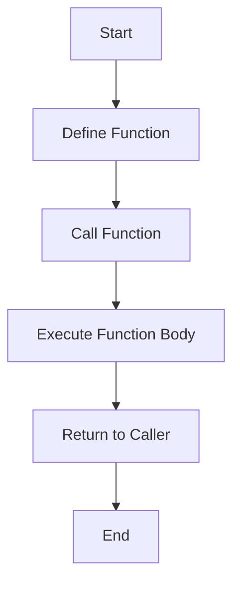

## 8.1 Understanding Functions

Functions are one of the most fundamental building blocks in JavaScript and programming in general. They allow us to encapsulate code into reusable blocks, making our programs more organized, efficient, and easier to understand. In this section, we'll explore what functions are, how they work, and why they are essential in programming.

### What is a Function?

A function is a block of code designed to perform a particular task. It is executed when "called" or "invoked." Functions can take inputs, known as parameters, and return outputs. They help us avoid repetition by allowing us to reuse code without having to write it multiple times.

#### Key Characteristics of Functions:

- **Reusable**: Write once, use multiple times.
- **Encapsulated**: Functions can hide complex logic and expose a simple interface.
- **Modular**: Break down large problems into smaller, manageable pieces.

### Why Use Functions?

Functions are crucial for several reasons:

1. **Code Reusability**: Functions allow us to write code once and reuse it wherever needed, reducing redundancy.
2. **Maintainability**: By organizing code into functions, we make it easier to read, understand, and maintain.
3. **Abstraction**: Functions abstract complex operations, allowing us to focus on higher-level logic.
4. **Testing**: Functions can be tested independently, improving code reliability.

### Function Declarations

A function declaration is the most common way to define a function. It consists of the `function` keyword, followed by the function name, a list of parameters in parentheses, and the function body enclosed in curly braces.

```javascript
// Function Declaration
function greet(name) {
    console.log("Hello, " + name + "!");
}

// Calling the function
greet("Alice"); // Output: Hello, Alice!
```

#### Characteristics of Function Declarations:

- **Hoisting**: Function declarations are hoisted, meaning they can be called before they are defined in the code.
- **Named**: They have a name that can be used to call the function.

### Function Expressions

A function expression is another way to define a function. It involves creating a function and assigning it to a variable. Function expressions can be named or anonymous.

```javascript
// Function Expression
const greet = function(name) {
    console.log("Hello, " + name + "!");
};

// Calling the function
greet("Bob"); // Output: Hello, Bob!
```

#### Characteristics of Function Expressions:

- **Not Hoisted**: Unlike function declarations, function expressions are not hoisted. They must be defined before they are called.
- **Anonymous**: Function expressions can be anonymous, meaning they do not have a name.

### Anonymous Functions

Anonymous functions are functions without a name. They are often used in situations where a function is needed temporarily, such as in event handlers or as arguments to other functions.

```javascript
// Anonymous Function Example
setTimeout(function() {
    console.log("This message appears after 2 seconds.");
}, 2000);
```

#### Use Cases for Anonymous Functions:

- **Callbacks**: Functions passed as arguments to other functions.
- **Event Handlers**: Functions that respond to events like clicks or keypresses.
- **IIFE (Immediately Invoked Function Expressions)**: Functions that run as soon as they are defined.

### Differentiating Function Declarations and Expressions

Understanding the differences between function declarations and expressions is crucial for writing effective JavaScript code.

| Feature               | Function Declaration | Function Expression |
|-----------------------|----------------------|---------------------|
| **Syntax**            | `function name() {}` | `const name = function() {}` |
| **Hoisting**          | Yes                  | No                  |
| **Naming**            | Named                | Can be named or anonymous |
| **Usage**             | General purpose      | Often used for callbacks or closures |

### Try It Yourself

Let's experiment with functions by modifying the examples above. Try changing the function names, adding parameters, or altering the logic inside the function body. Observe how these changes affect the output.

```javascript
// Modify the function to greet with a different message
function greet(name) {
    console.log("Welcome, " + name + "!");
}

// Test the modified function
greet("Charlie"); // Output: Welcome, Charlie!
```

### Visualizing Function Concepts

To better understand how functions work, let's visualize the process of defining and calling a function using a flowchart.



**Diagram Description**: This flowchart illustrates the process of defining a function, calling it, executing its body, and returning to the caller.

### Further Reading

For more information on JavaScript functions, consider exploring the following resources:

- [MDN Web Docs: Functions](https://developer.mozilla.org/en-US/docs/Web/JavaScript/Guide/Functions)
- [W3Schools: JavaScript Functions](https://www.w3schools.com/js/js_functions.asp)

### Key Takeaways

- Functions are reusable blocks of code that perform specific tasks.
- Function declarations are hoisted and named, while function expressions can be anonymous and are not hoisted.
- Anonymous functions are useful for callbacks, event handlers, and IIFEs.
- Understanding the differences between function declarations and expressions is essential for effective JavaScript programming.

## Quiz Time!



### What is a function in JavaScript?

- [x] A reusable block of code designed to perform a specific task.
- [ ] A variable that stores data.
- [ ] A loop that iterates over a set of values.
- [ ] An object that holds key-value pairs.

> **Explanation:** A function is a reusable block of code designed to perform a specific task, making it a fundamental concept in programming.

### Which of the following is a characteristic of a function declaration?

- [x] It is hoisted.
- [ ] It is always anonymous.
- [ ] It cannot take parameters.
- [ ] It must be called before it is defined.

> **Explanation:** Function declarations are hoisted, meaning they can be called before they are defined in the code.

### How do function expressions differ from function declarations?

- [x] Function expressions are not hoisted.
- [ ] Function expressions cannot be named.
- [ ] Function expressions do not return values.
- [ ] Function expressions are always global.

> **Explanation:** Function expressions are not hoisted, meaning they must be defined before they are called.

### What is an anonymous function?

- [x] A function without a name.
- [ ] A function that cannot be called.
- [ ] A function that is always global.
- [ ] A function that returns no value.

> **Explanation:** An anonymous function is a function without a name, often used in situations where a function is needed temporarily.

### In which scenario is an anonymous function commonly used?

- [x] As a callback function.
- [x] As an event handler.
- [ ] As a global variable.
- [ ] As a loop iterator.

> **Explanation:** Anonymous functions are commonly used as callback functions and event handlers due to their temporary nature.

### What is the purpose of a function?

- [x] To encapsulate code into reusable blocks.
- [ ] To store data in a variable.
- [ ] To iterate over a set of values.
- [ ] To create a new object.

> **Explanation:** The primary purpose of a function is to encapsulate code into reusable blocks, making programs more organized and efficient.

### Which of the following is true about function expressions?

- [x] They can be anonymous.
- [ ] They are always hoisted.
- [x] They can be assigned to variables.
- [ ] They cannot take parameters.

> **Explanation:** Function expressions can be anonymous and are often assigned to variables, allowing for flexible usage.

### What is a callback function?

- [x] A function passed as an argument to another function.
- [ ] A function that calls itself.
- [ ] A function that returns a value.
- [ ] A function that is always global.

> **Explanation:** A callback function is a function passed as an argument to another function, allowing it to be executed later.

### Which of the following is a benefit of using functions?

- [x] Improved code reusability.
- [ ] Increased code redundancy.
- [ ] Decreased code readability.
- [ ] Limited code flexibility.

> **Explanation:** Functions improve code reusability by allowing us to write code once and use it multiple times.

### True or False: Function declarations must be defined before they are called.

- [ ] True
- [x] False

> **Explanation:** Function declarations are hoisted, meaning they can be called before they are defined in the code.



By understanding functions and their role in JavaScript, we can write more efficient, organized, and maintainable code. Functions are a powerful tool in any programmer's toolkit, and mastering them is a crucial step in becoming proficient in JavaScript.
