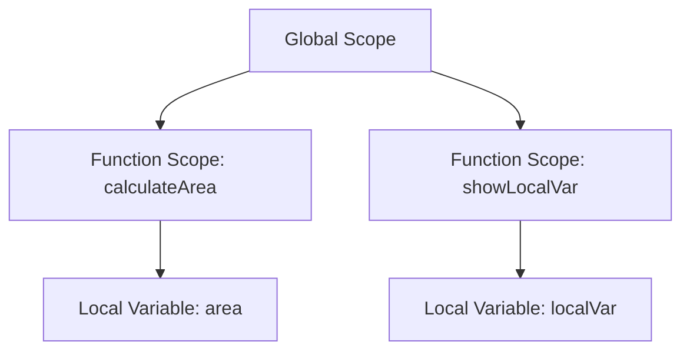

## 8.2 Declaring Functions

Functions are one of the core building blocks in JavaScript and programming in general. They allow us to encapsulate code into reusable blocks, making our programs more organized and efficient. In this section, we'll explore how to declare functions in JavaScript, understand their syntax, and discuss the scope implications of function declarations. Let's dive in!

### Understanding Function Declarations

A function declaration is a way to define a named function in JavaScript. This function can be called later in the code to execute the block of code it contains. Here's the basic syntax for a function declaration:

```javascript
function functionName(parameters) {
    // code to be executed
}
```

- **`function`**: This keyword is used to declare a function.
- **`functionName`**: This is the name of the function. It should be descriptive and indicate what the function does.
- **`parameters`**: These are placeholders for values that will be passed to the function when it is called. They are optional.
- **`{}`**: Curly braces enclose the block of code that will be executed when the function is called.

### Naming Functions Descriptively

When naming functions, it's important to choose names that clearly describe the function's purpose. This makes your code more readable and easier to maintain. Here are some tips for naming functions:

- **Use verbs**: Since functions perform actions, start function names with a verb. For example, `calculateSum`, `fetchData`, or `displayMessage`.
- **Be specific**: Avoid vague names like `doSomething` or `handleEvent`. Instead, use names that describe exactly what the function does.
- **Follow conventions**: In JavaScript, it's common to use camelCase for function names, where the first word is lowercase and each subsequent word starts with an uppercase letter.

### Example of a Function Declaration

Let's look at a simple example of a function declaration:

```javascript
function greetUser(name) {
    console.log("Hello, " + name + "!");
}
```

In this example:

- The function is named `greetUser`.
- It takes one parameter, `name`.
- It logs a greeting message to the console using the provided name.

### Calling a Function

To execute the code inside a function, you need to call it. You do this by using the function's name followed by parentheses. If the function has parameters, you pass the arguments inside the parentheses:

```javascript
greetUser("Alice"); // Output: Hello, Alice!
greetUser("Bob");   // Output: Hello, Bob!
```

### Scope Implications of Function Declarations

In JavaScript, scope determines the accessibility of variables and functions in different parts of your code. Understanding scope is crucial when working with functions.

#### Global Scope

Variables and functions declared outside of any function have global scope. They can be accessed from anywhere in the code.

```javascript
var globalVar = "I am a global variable";

function showGlobalVar() {
    console.log(globalVar);
}

showGlobalVar(); // Output: I am a global variable
```

#### Local Scope

Variables declared inside a function have local scope. They can only be accessed within that function.

```javascript
function showLocalVar() {
    var localVar = "I am a local variable";
    console.log(localVar);
}

showLocalVar(); // Output: I am a local variable
console.log(localVar); // Error: localVar is not defined
```

#### Function Scope

In JavaScript, functions create their own scope. Variables declared within a function are not accessible from outside the function.

```javascript
function calculateArea(width, height) {
    var area = width * height;
    return area;
}

console.log(calculateArea(5, 10)); // Output: 50
console.log(area); // Error: area is not defined
```

### Hoisting in Function Declarations

JavaScript has a behavior called hoisting, which moves function declarations to the top of their containing scope during the compile phase. This means you can call a function before it is declared in the code:

```javascript
sayHello(); // Output: Hello, World!

function sayHello() {
    console.log("Hello, World!");
}
```

### Try It Yourself

Now that we've covered the basics of function declarations, let's experiment with some code. Try modifying the examples above or create your own functions to see how they work. Here are a few ideas:

- Create a function that calculates the square of a number.
- Write a function that takes two numbers and returns their average.
- Develop a function that checks if a number is even or odd.

### Visualizing Function Scope

To better understand how scope works in JavaScript, let's look at a visual representation of function scope using a Mermaid.js diagram.



In this diagram:

- The global scope contains the function declarations.
- Each function has its own scope, represented by the boxes.
- Local variables are only accessible within their respective function scopes.

### Further Reading

For more information on functions and scope in JavaScript, check out these resources:

- [MDN Web Docs: Functions](https://developer.mozilla.org/en-US/docs/Web/JavaScript/Guide/Functions)
- [W3Schools: JavaScript Functions](https://www.w3schools.com/js/js_functions.asp)

### Summary

In this section, we've learned how to declare functions in JavaScript, the importance of naming them descriptively, and the scope implications of function declarations. Functions are powerful tools that help us organize and reuse code efficiently. By understanding how to declare and use functions, you're well on your way to becoming a proficient JavaScript programmer.

## Quiz Time!



### What is the correct syntax for declaring a function in JavaScript?

- [x] `function functionName(parameters) { // code }`
- [ ] `function: functionName(parameters) { // code }`
- [ ] `functionName(parameters) { // code }`
- [ ] `function = functionName(parameters) { // code }`

> **Explanation:** The correct syntax for declaring a function in JavaScript is `function functionName(parameters) { // code }`.

### What is the purpose of naming functions descriptively?

- [x] To make the code more readable and maintainable
- [ ] To make the function execute faster
- [ ] To ensure the function is called correctly
- [ ] To prevent errors in the code

> **Explanation:** Naming functions descriptively helps make the code more readable and maintainable by clearly indicating the function's purpose.

### What is the scope of a variable declared inside a function?

- [x] Local scope
- [ ] Global scope
- [ ] Block scope
- [ ] Module scope

> **Explanation:** A variable declared inside a function has local scope, meaning it can only be accessed within that function.

### What is hoisting in JavaScript?

- [x] The behavior of moving function declarations to the top of their containing scope
- [ ] The process of optimizing function execution
- [ ] The method of declaring variables at the top of a function
- [ ] The technique of calling functions before they are declared

> **Explanation:** Hoisting is the behavior of moving function declarations to the top of their containing scope during the compile phase.

### Which of the following is a good practice when naming functions?

- [x] Use verbs to start function names
- [ ] Use numbers in function names
- [x] Be specific about the function's purpose
- [ ] Use uppercase letters for all function names

> **Explanation:** It's a good practice to use verbs to start function names and be specific about the function's purpose to enhance readability.

### Can you call a function before it is declared in JavaScript?

- [x] Yes, due to hoisting
- [ ] No, it will cause an error
- [ ] Only if the function has no parameters
- [ ] Only in strict mode

> **Explanation:** Yes, you can call a function before it is declared in JavaScript due to hoisting.

### What is the output of the following code?
```javascript
function greet() {
    console.log("Hello!");
}
greet();
```

- [x] `Hello!`
- [ ] `undefined`
- [ ] `Error`
- [ ] `null`

> **Explanation:** The output of the code is `Hello!` because the `greet` function is called, which logs "Hello!" to the console.

### What happens if you try to access a local variable outside its function?

- [x] An error occurs
- [ ] The variable is returned as undefined
- [ ] The variable is automatically converted to a global variable
- [ ] The variable retains its value

> **Explanation:** An error occurs if you try to access a local variable outside its function because it is not defined in the global scope.

### What is the output of the following code?
```javascript
function add(a, b) {
    return a + b;
}
console.log(add(2, 3));
```

- [x] `5`
- [ ] `23`
- [ ] `undefined`
- [ ] `Error`

> **Explanation:** The output of the code is `5` because the `add` function returns the sum of `a` and `b`, which are `2` and `3`.

### True or False: Functions in JavaScript can only have one parameter.

- [ ] True
- [x] False

> **Explanation:** False. Functions in JavaScript can have multiple parameters, or even none at all.



By understanding how to declare functions and their scope implications, you're building a strong foundation for writing efficient and organized JavaScript code. Keep practicing and experimenting with functions to enhance your programming skills!
