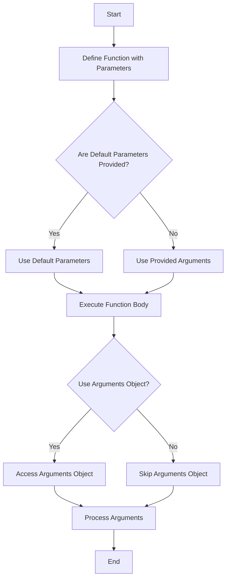

## 8.4 Function Parameters and Arguments

In this section, we delve into the world of function parameters and arguments in JavaScript. Understanding how to define and use them effectively is crucial for writing reusable and efficient code. This guide will cover defining functions with multiple parameters, using default parameters, and exploring the `arguments` object. By the end of this section, you'll have a solid grasp of how to manage inputs to your functions and make them more flexible and powerful.

### Defining Functions with Multiple Parameters

In JavaScript, functions can take multiple parameters. Parameters are essentially placeholders for the values that you pass into a function when you call it. Let's start by defining a simple function with multiple parameters.

```javascript
// Define a function with two parameters
function greet(firstName, lastName) {
    console.log("Hello, " + firstName + " " + lastName + "!");
}

// Call the function with arguments
greet("John", "Doe"); // Output: Hello, John Doe!
```

In the example above, `firstName` and `lastName` are parameters of the `greet` function. When we call the function with `"John"` and `"Doe"`, these values are passed as arguments, and the function prints a greeting message.

#### Key Points:
- **Parameters** are variables listed as part of a function's definition.
- **Arguments** are the actual values passed to the function.

### Default Parameters (ES6 Feature)

JavaScript ES6 introduced default parameters, allowing you to set default values for your function parameters. This feature is handy when you want to ensure that a parameter has a value even if the caller doesn't provide one.

```javascript
// Define a function with default parameters
function greet(firstName = "Guest", lastName = "User") {
    console.log("Hello, " + firstName + " " + lastName + "!");
}

// Call the function without arguments
greet(); // Output: Hello, Guest User!

// Call the function with one argument
greet("John"); // Output: Hello, John User!

// Call the function with two arguments
greet("John", "Doe"); // Output: Hello, John Doe!
```

In this example, if no arguments are provided, `firstName` defaults to `"Guest"` and `lastName` defaults to `"User"`. Default parameters make your functions more robust and reduce the need for additional checks.

#### How Default Parameters Work:
- Default parameters are evaluated at call time, meaning each time the function is called, the default value is re-evaluated.
- They can be any valid JavaScript expression, not just constants.

### The `arguments` Object

The `arguments` object is an array-like object accessible inside functions that contains the values of the arguments passed to that function. It is useful when you want to work with functions that can accept any number of arguments.

```javascript
// Define a function using the arguments object
function sum() {
    let total = 0;
    for (let i = 0; i < arguments.length; i++) {
        total += arguments[i];
    }
    return total;
}

// Call the function with different numbers of arguments
console.log(sum(1, 2, 3)); // Output: 6
console.log(sum(10, 20, 30, 40)); // Output: 100
```

In this example, the `sum` function uses the `arguments` object to calculate the total of all arguments passed to it, regardless of their number.

#### Important Notes about the `arguments` Object:
- It is not a real array but an array-like object.
- It does not have array methods like `forEach`, `map`, or `filter`.
- In ES6, you can use the rest parameter syntax (`...args`) to achieve similar functionality with actual arrays.

### Combining Parameters, Default Parameters, and the `arguments` Object

You can combine these concepts to create flexible and powerful functions. Let's see an example:

```javascript
// Define a function with parameters, default parameters, and the arguments object
function createFullName(firstName = "Guest", lastName = "User") {
    console.log("Function called with " + arguments.length + " arguments.");
    return firstName + " " + lastName;
}

// Call the function with different numbers of arguments
console.log(createFullName()); // Output: Guest User
console.log(createFullName("John")); // Output: John User
console.log(createFullName("John", "Doe")); // Output: John Doe
```

This function demonstrates how you can use default parameters and the `arguments` object together. It prints the number of arguments passed and returns a full name.

### Try It Yourself

Let's encourage you to experiment with these concepts. Modify the examples above to see how they behave with different inputs. Here are a few suggestions:

- **Modify the `greet` function** to include a third parameter for the greeting message, with a default value of `"Hello"`.
- **Create a function** that takes any number of arguments and returns their average.
- **Experiment with the `arguments` object** by creating a function that returns the largest argument passed to it.

### Visual Aids

To better understand how parameters, default parameters, and the `arguments` object work together, let's look at a flowchart that represents the flow of a function call with these elements.



This flowchart illustrates the decision-making process when calling a function with parameters, default parameters, and the `arguments` object.

### References and Links

For further reading and deeper dives into these topics, consider exploring the following resources:

- [MDN Web Docs: Functions](https://developer.mozilla.org/en-US/docs/Web/JavaScript/Guide/Functions)
- [W3Schools: JavaScript Functions](https://www.w3schools.com/js/js_functions.asp)
- [JavaScript.info: Function Parameters](https://javascript.info/function-basics#parameters)

### Engagement and Reinforcement

To reinforce your understanding, try answering these questions:

- What happens if you define a function with default parameters and call it without arguments?
- How can you use the `arguments` object to create a function that accepts a variable number of arguments?
- What are the limitations of the `arguments` object, and how can you overcome them with ES6 features?

### Exercises

1. **Create a function** that takes a person's first name, last name, and age as parameters. Use default parameters for the last name and age. Print a message introducing the person.
2. **Write a function** that accepts any number of numbers and returns their sum. Use the `arguments` object to achieve this.
3. **Modify the `sum` function** to use the rest parameter syntax instead of the `arguments` object.

### Summary

In this section, we explored the essential concepts of function parameters and arguments in JavaScript. We learned how to define functions with multiple parameters, use default parameters to provide fallback values, and leverage the `arguments` object to handle variable numbers of arguments. These tools are fundamental for writing flexible and reusable functions, and they form the backbone of many JavaScript applications.

By experimenting with the examples and exercises provided, you'll gain confidence in using these features in your own projects. Remember, practice is key to mastering programming concepts, so keep experimenting and building your skills!

## Quiz Time!



### What is a parameter in a JavaScript function?

- [x] A variable listed as part of a function's definition.
- [ ] The actual value passed to the function.
- [ ] A reserved keyword in JavaScript.
- [ ] A type of loop structure.

> **Explanation:** A parameter is a variable listed as part of a function's definition, serving as a placeholder for the value passed when the function is called.

### What is an argument in a JavaScript function?

- [ ] A variable listed as part of a function's definition.
- [x] The actual value passed to the function.
- [ ] A reserved keyword in JavaScript.
- [ ] A type of loop structure.

> **Explanation:** An argument is the actual value passed to the function when it is called, corresponding to the function's parameters.

### What feature allows you to set default values for function parameters in ES6?

- [ ] The `arguments` object.
- [x] Default parameters.
- [ ] Arrow functions.
- [ ] Template literals.

> **Explanation:** Default parameters in ES6 allow you to set default values for function parameters, providing fallback values if no arguments are passed.

### How can you access all arguments passed to a function?

- [ ] Using the `this` keyword.
- [ ] Using the `return` statement.
- [x] Using the `arguments` object.
- [ ] Using the `console.log()` function.

> **Explanation:** The `arguments` object is an array-like object that contains all arguments passed to a function.

### What is a limitation of the `arguments` object?

- [ ] It cannot be used in arrow functions.
- [ ] It is not available in ES6.
- [x] It is not a real array and lacks array methods.
- [ ] It cannot hold more than three arguments.

> **Explanation:** The `arguments` object is not a real array and lacks array methods like `forEach`, `map`, or `filter`.

### How can you overcome the limitations of the `arguments` object in ES6?

- [ ] By using `let` and `const`.
- [x] By using the rest parameter syntax (`...args`).
- [ ] By using template literals.
- [ ] By using arrow functions.

> **Explanation:** The rest parameter syntax (`...args`) in ES6 allows you to capture all arguments in an actual array, overcoming the limitations of the `arguments` object.

### What happens if you call a function with fewer arguments than there are parameters?

- [x] The missing parameters are `undefined`.
- [ ] The function throws an error.
- [ ] The function does not execute.
- [ ] The function uses default parameters automatically.

> **Explanation:** If a function is called with fewer arguments than there are parameters, the missing parameters are `undefined` unless default parameters are specified.

### Can default parameters be any valid JavaScript expression?

- [x] True
- [ ] False

> **Explanation:** Default parameters can be any valid JavaScript expression, not just constants, allowing for dynamic default values.

### What does the rest parameter syntax (`...args`) do?

- [ ] It creates a new function.
- [ ] It defines a default parameter.
- [x] It captures all remaining arguments in an array.
- [ ] It accesses the `arguments` object.

> **Explanation:** The rest parameter syntax (`...args`) captures all remaining arguments passed to a function in an array, allowing for flexible argument handling.

### Is the `arguments` object available in arrow functions?

- [ ] True
- [x] False

> **Explanation:** The `arguments` object is not available in arrow functions. Arrow functions do not have their own `arguments` object.


