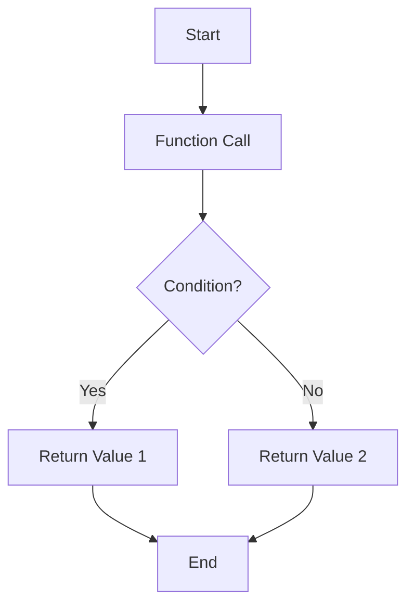

## 8.5 Returning Values from Functions

In the world of programming, functions are one of the most powerful tools we have at our disposal. They allow us to encapsulate code into reusable blocks, making our programs more organized and easier to manage. One of the key aspects of functions is their ability to return values. In this section, we'll explore how to use the `return` statement in JavaScript functions to output values, understand the behavior of functions without a `return` statement, and examine how to return early from functions based on conditions.

### Understanding the `return` Statement

The `return` statement is used in a function to send a value back to the part of the program that called the function. This value can be of any data type, including numbers, strings, arrays, objects, or even other functions. When a `return` statement is executed, the function stops executing and the specified value is returned to the caller.

#### Basic Syntax of the `return` Statement

The syntax for using the `return` statement is straightforward:

```javascript
function functionName(parameters) {
    // code to execute
    return value;
}
```

Here, `value` is the data you want to return from the function. Let's look at a simple example:

```javascript
function add(a, b) {
    return a + b;
}

let sum = add(5, 3);
console.log(sum); // Output: 8
```

In this example, the `add` function takes two parameters, `a` and `b`, adds them together, and returns the result. The returned value is then stored in the variable `sum` and printed to the console.

### Functions Without a `return` Statement

Functions in JavaScript do not require a `return` statement. If a function does not have a `return` statement, it will return `undefined` by default. This is important to remember, especially when you expect a function to return a value.

#### Example of a Function Without a `return` Statement

```javascript
function greet(name) {
    console.log("Hello, " + name + "!");
}

let greeting = greet("Alice");
console.log(greeting); // Output: undefined
```

In this example, the `greet` function prints a greeting message to the console but does not return any value. As a result, when we try to store the result of the function call in the variable `greeting`, it holds the value `undefined`.

### Returning Early from Functions

Sometimes, you may want to exit a function before it reaches the end of its code block. This can be done using the `return` statement. Returning early is useful in situations where you want to stop the execution of a function based on certain conditions.

#### Example of Early Return

```javascript
function checkNumber(num) {
    if (num < 0) {
        return "Negative number";
    }
    return "Positive number";
}

console.log(checkNumber(-5)); // Output: Negative number
console.log(checkNumber(10)); // Output: Positive number
```

In this example, the `checkNumber` function checks if the input number is negative. If it is, the function returns "Negative number" and exits immediately. If not, it continues to the next line and returns "Positive number".

### Multiple Return Statements

A function can have multiple `return` statements. However, only one `return` statement will be executed during a single function call. The function will exit as soon as a `return` statement is encountered.

#### Example with Multiple Return Statements

```javascript
function categorizeAge(age) {
    if (age < 13) {
        return "Child";
    } else if (age < 20) {
        return "Teenager";
    } else {
        return "Adult";
    }
}

console.log(categorizeAge(10)); // Output: Child
console.log(categorizeAge(15)); // Output: Teenager
console.log(categorizeAge(25)); // Output: Adult
```

In this example, the `categorizeAge` function uses multiple `return` statements to categorize a person's age. Depending on the input, the function will return "Child", "Teenager", or "Adult".

### Returning Complex Data Types

In addition to simple data types like numbers and strings, functions can also return complex data types such as arrays and objects. This is particularly useful when you need to return multiple values from a function.

#### Returning an Array

```javascript
function getCoordinates() {
    return [10, 20];
}

let coordinates = getCoordinates();
console.log(coordinates); // Output: [10, 20]
```

In this example, the `getCoordinates` function returns an array containing two numbers. The returned array is then stored in the variable `coordinates`.

#### Returning an Object

```javascript
function createPerson(name, age) {
    return {
        name: name,
        age: age
    };
}

let person = createPerson("Alice", 30);
console.log(person); // Output: { name: 'Alice', age: 30 }
```

In this example, the `createPerson` function returns an object with two properties: `name` and `age`. The returned object is then stored in the variable `person`.

### Try It Yourself

Now that we've covered the basics of returning values from functions, it's time to try it yourself! Here are a few exercises to help you practice:

1. **Exercise 1:** Write a function called `multiply` that takes two numbers as parameters and returns their product.

2. **Exercise 2:** Write a function called `isEven` that takes a number as a parameter and returns `true` if the number is even, and `false` otherwise.

3. **Exercise 3:** Write a function called `getFullName` that takes two strings, `firstName` and `lastName`, and returns the full name as a single string.

4. **Exercise 4:** Write a function called `findMax` that takes an array of numbers and returns the largest number in the array.

5. **Exercise 5:** Write a function called `getUserInfo` that takes a user's name, age, and email as parameters and returns an object containing this information.

### Visualizing Function Returns

To better understand how functions return values, let's visualize the process using a flowchart. This flowchart will illustrate the flow of execution within a function that uses a `return` statement.



**Diagram Description:** This flowchart represents a function with a conditional statement that determines which value to return. The function starts with a call, evaluates a condition, and returns one of two possible values based on the condition.

### Key Takeaways

- The `return` statement is used to send a value back to the caller of a function.
- Functions without a `return` statement return `undefined` by default.
- You can use the `return` statement to exit a function early based on conditions.
- Functions can return complex data types like arrays and objects.
- Visualizing the flow of execution within a function can help you understand how `return` statements work.

### References and Further Reading

- [MDN Web Docs: Functions](https://developer.mozilla.org/en-US/docs/Web/JavaScript/Guide/Functions)
- [W3Schools: JavaScript Functions](https://www.w3schools.com/js/js_functions.asp)

## Quiz Time!



### What does a function return if there is no `return` statement?

- [x] undefined
- [ ] null
- [ ] 0
- [ ] An empty string

> **Explanation:** By default, if a function does not have a `return` statement, it returns `undefined`.

### What happens when a `return` statement is executed in a function?

- [x] The function stops executing and returns the specified value.
- [ ] The function continues executing until the end.
- [ ] The function returns `null`.
- [ ] The function throws an error.

> **Explanation:** When a `return` statement is executed, the function stops executing and returns the specified value to the caller.

### Can a function return multiple values directly?

- [ ] Yes, using multiple `return` statements.
- [x] No, but it can return an array or object containing multiple values.
- [ ] Yes, using a special syntax.
- [ ] No, functions can only return one value.

> **Explanation:** A function can return multiple values by returning an array or object that contains those values.

### What is the output of the following code?
```javascript
function test() {
    return;
    console.log("Hello");
}
test();
```

- [x] undefined
- [ ] "Hello"
- [ ] null
- [ ] An error

> **Explanation:** The function returns `undefined` because the `return` statement is executed before the `console.log` statement.

### Which of the following is a valid use of the `return` statement?

- [x] return a + b;
- [ ] return;
- [x] return "Hello";
- [ ] All of the above

> **Explanation:** All of the options are valid uses of the `return` statement, as it can return expressions, values, or nothing (which results in `undefined`).

### How can you return early from a function?

- [x] By using the `return` statement with a condition.
- [ ] By using a `break` statement.
- [ ] By using a `continue` statement.
- [ ] By using a `stop` statement.

> **Explanation:** You can return early from a function by using the `return` statement with a condition.

### What does the following function return?
```javascript
function checkValue(x) {
    if (x > 10) {
        return "Greater";
    }
    return "Smaller or equal";
}
```

- [x] "Greater" if `x` is more than 10, otherwise "Smaller or equal"
- [ ] "Greater" if `x` is less than 10, otherwise "Smaller or equal"
- [ ] "Smaller or equal" if `x` is more than 10, otherwise "Greater"
- [ ] "Greater" always

> **Explanation:** The function returns "Greater" if `x` is more than 10, otherwise it returns "Smaller or equal".

### Can a function return another function?

- [x] Yes
- [ ] No
- [ ] Only in ES6
- [ ] Only if it's an arrow function

> **Explanation:** A function can return another function, allowing for higher-order functions and closures.

### What is the purpose of the `return` statement in a function?

- [x] To send a value back to the caller of the function.
- [ ] To print a value to the console.
- [ ] To stop the execution of the program.
- [ ] To declare a variable.

> **Explanation:** The `return` statement sends a value back to the caller of the function.

### True or False: A function can have multiple `return` statements, but only one will be executed during a single function call.

- [x] True
- [ ] False

> **Explanation:** A function can have multiple `return` statements, but only one will be executed during a single function call, as the function exits upon encountering a `return` statement.


