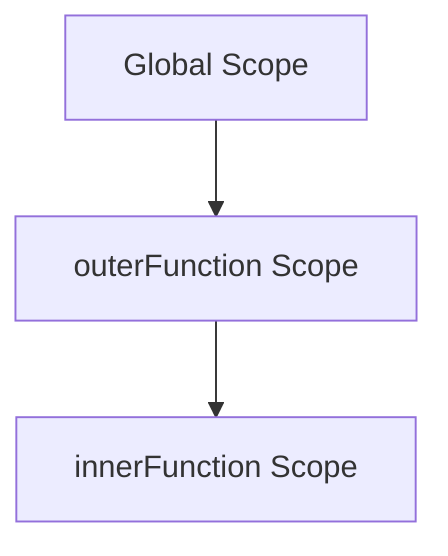

## 8.6 Function Scope

In this section, we will delve into the concept of function scope in JavaScript, which is crucial for understanding how variables are accessed and manipulated within your code. By the end of this section, you'll have a solid grasp of local and global variables, variable shadowing, and the scope chain. Let's get started!

### Understanding Function Scope

Function scope refers to the visibility and accessibility of variables within a function. In JavaScript, variables declared within a function are only accessible within that function. This is known as **local scope**. Conversely, variables declared outside of any function are accessible from anywhere in the code, and they are said to have **global scope**.

#### Local Variables

Local variables are declared within a function and can only be accessed from within that function. They are created when the function is invoked and destroyed when the function execution is complete.

```javascript
function greet() {
    let message = "Hello, World!";
    console.log(message); // Output: Hello, World!
}

greet();
console.log(message); // Error: message is not defined
```

In the example above, the variable `message` is local to the `greet` function and cannot be accessed outside of it. Attempting to log `message` outside the function results in an error.

#### Global Variables

Global variables are declared outside of any function and can be accessed from anywhere in the code. They persist for the duration of the program's execution.

```javascript
let globalMessage = "Hello, Universe!";

function greet() {
    console.log(globalMessage); // Output: Hello, Universe!
}

greet();
console.log(globalMessage); // Output: Hello, Universe!
```

Here, `globalMessage` is a global variable, and it can be accessed both inside and outside the `greet` function.

### Variable Shadowing

Variable shadowing occurs when a local variable in a function has the same name as a global variable. In such cases, the local variable takes precedence within the function, effectively "shadowing" the global variable.

```javascript
let message = "Hello, Universe!";

function greet() {
    let message = "Hello, World!";
    console.log(message); // Output: Hello, World!
}

greet();
console.log(message); // Output: Hello, Universe!
```

In this example, the local variable `message` inside the `greet` function shadows the global variable `message`. As a result, the function logs "Hello, World!" while the global variable remains unchanged outside the function.

### The Scope Chain

The scope chain is the mechanism that JavaScript uses to resolve variable names. When a variable is referenced, JavaScript starts looking for it in the current scope. If it doesn't find it, it moves up to the next outer scope, continuing this process until it reaches the global scope. If the variable is not found in any scope, a reference error is thrown.

```javascript
let outerMessage = "Hello from the outer scope!";

function outerFunction() {
    let innerMessage = "Hello from the inner scope!";
    
    function innerFunction() {
        console.log(innerMessage); // Output: Hello from the inner scope!
        console.log(outerMessage); // Output: Hello from the outer scope!
    }
    
    innerFunction();
}

outerFunction();
```

In the example above, `innerFunction` has access to both `innerMessage` and `outerMessage` due to the scope chain. It first looks for `innerMessage` in its local scope and then finds `outerMessage` in the outer scope.



This diagram illustrates the scope chain in the example. The `innerFunction` scope can access variables from both its own scope and the `outerFunction` scope, as well as the global scope.

### Practical Examples

Let's explore some practical examples to solidify our understanding of function scope.

#### Example 1: Nested Functions

```javascript
let globalVar = "I'm a global variable";

function outer() {
    let outerVar = "I'm an outer variable";
    
    function inner() {
        let innerVar = "I'm an inner variable";
        console.log(globalVar); // Output: I'm a global variable
        console.log(outerVar);  // Output: I'm an outer variable
        console.log(innerVar);  // Output: I'm an inner variable
    }
    
    inner();
}

outer();
```

In this example, the `inner` function can access `globalVar`, `outerVar`, and `innerVar` due to the scope chain.

#### Example 2: Scope and Loops

```javascript
function loopExample() {
    for (let i = 0; i < 3; i++) {
        let loopVar = "I'm inside the loop";
        console.log(loopVar); // Output: I'm inside the loop
    }
    
    console.log(i); // Error: i is not defined
    console.log(loopVar); // Error: loopVar is not defined
}

loopExample();
```

Here, both `i` and `loopVar` are local to the loop block and cannot be accessed outside of it.

### Try It Yourself

To reinforce your understanding of function scope, try modifying the examples above:

1. Change the variable names and observe how shadowing affects the output.
2. Add more nested functions and see how the scope chain resolves variable access.
3. Experiment with different types of loops and observe the scope of loop variables.

### Key Takeaways

- **Local variables** are accessible only within the function they are declared in.
- **Global variables** can be accessed from anywhere in the code.
- **Variable shadowing** occurs when a local variable has the same name as a global variable.
- The **scope chain** is the mechanism by which JavaScript resolves variable names, starting from the current scope and moving outward.

### Further Reading

For more information on JavaScript scope, you can refer to the following resources:

- [MDN Web Docs: JavaScript Scope](https://developer.mozilla.org/en-US/docs/Web/JavaScript/Guide/Grammar_and_types#scope)
- [W3Schools: JavaScript Scope](https://www.w3schools.com/js/js_scope.asp)

## Quiz Time!



### What is a local variable in JavaScript?

- [x] A variable declared within a function and only accessible within that function.
- [ ] A variable declared outside of any function and accessible from anywhere in the code.
- [ ] A variable that is always accessible regardless of where it is declared.
- [ ] A variable that can only be accessed by nested functions.

> **Explanation:** Local variables are declared within a function and can only be accessed from within that function.

### What happens when a local variable has the same name as a global variable?

- [x] The local variable shadows the global variable within the function.
- [ ] The global variable is deleted.
- [ ] The local variable is ignored.
- [ ] Both variables are accessible without any conflict.

> **Explanation:** When a local variable has the same name as a global variable, the local variable takes precedence within the function, shadowing the global variable.

### What is the scope chain in JavaScript?

- [x] The mechanism by which JavaScript resolves variable names, starting from the current scope and moving outward.
- [ ] A list of all variables declared in a program.
- [ ] The order in which functions are called.
- [ ] A hierarchy of function calls.

> **Explanation:** The scope chain is the mechanism that JavaScript uses to resolve variable names, starting from the current scope and moving outward to the global scope.

### Which of the following is true about global variables?

- [x] They can be accessed from anywhere in the code.
- [ ] They can only be accessed within the function they are declared in.
- [ ] They are destroyed after the function execution is complete.
- [ ] They are only accessible by nested functions.

> **Explanation:** Global variables are declared outside of any function and can be accessed from anywhere in the code.

### What is variable shadowing?

- [x] When a local variable has the same name as a global variable and takes precedence within the function.
- [ ] When a global variable is hidden by a function call.
- [ ] When a variable is declared but not used.
- [ ] When a variable is declared in multiple functions.

> **Explanation:** Variable shadowing occurs when a local variable has the same name as a global variable, taking precedence within the function.

### How does JavaScript resolve variable names?

- [x] By using the scope chain, starting from the current scope and moving outward.
- [ ] By checking the global scope first.
- [ ] By looking at the order of variable declarations.
- [ ] By using a random selection process.

> **Explanation:** JavaScript resolves variable names using the scope chain, starting from the current scope and moving outward to the global scope.

### What will happen if you try to access a variable that is not defined in any scope?

- [x] A reference error will be thrown.
- [ ] The program will crash.
- [ ] The variable will be automatically created.
- [ ] The variable will be set to `undefined`.

> **Explanation:** If a variable is not defined in any scope, a reference error will be thrown.

### Can a function access variables declared in its outer scope?

- [x] Yes, due to the scope chain.
- [ ] No, each function has its own isolated scope.
- [ ] Only if the variables are passed as parameters.
- [ ] Only if the variables are declared as global.

> **Explanation:** A function can access variables declared in its outer scope due to the scope chain.

### What is the output of the following code?

```javascript
let message = "Hello, Universe!";

function greet() {
    let message = "Hello, World!";
    console.log(message);
}

greet();
```

- [x] Hello, World!
- [ ] Hello, Universe!
- [ ] Error: message is not defined
- [ ] Undefined

> **Explanation:** The local variable `message` inside the `greet` function shadows the global variable, so "Hello, World!" is logged.

### True or False: A variable declared with `let` inside a loop is accessible outside the loop.

- [ ] True
- [x] False

> **Explanation:** A variable declared with `let` inside a loop is not accessible outside the loop, as it is block-scoped.


