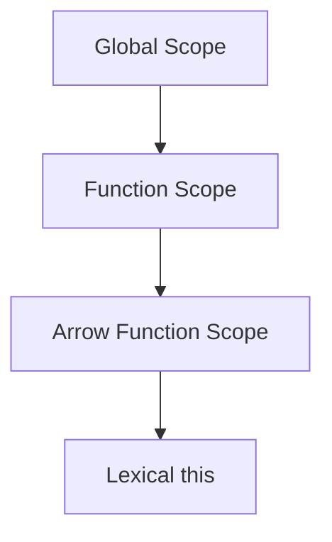

## 8.7 Arrow Functions (ES6 Introduction)

In this section, we will delve into one of the most exciting features introduced in ECMAScript 6 (ES6): arrow functions. These functions offer a more concise syntax compared to traditional function expressions and come with unique characteristics, especially in how they handle the `this` keyword. Let's explore what arrow functions are, how they differ from regular functions, and when to use them.

### Understanding Arrow Function Syntax

Arrow functions provide a shorthand way to write functions in JavaScript. They are particularly useful for writing small, concise functions. Let's start by looking at the syntax of an arrow function and compare it with a traditional function expression.

#### Traditional Function Expression

```javascript
// Traditional function expression
const add = function(a, b) {
    return a + b;
};

console.log(add(2, 3)); // Output: 5
```

#### Arrow Function Syntax

```javascript
// Arrow function
const add = (a, b) => a + b;

console.log(add(2, 3)); // Output: 5
```

**Key Differences:**

- **Conciseness:** Arrow functions allow us to write shorter code. In the example above, the arrow function is more concise than the traditional function expression.
- **Implicit Return:** If the function body contains only a single expression, we can omit the `return` keyword and the curly braces. The expression is implicitly returned.
- **Parentheses:** When there is only one parameter, the parentheses around the parameter can be omitted. However, for zero or multiple parameters, parentheses are required.

#### Examples of Arrow Functions

1. **No Parameters:**

```javascript
const greet = () => console.log('Hello, World!');
greet(); // Output: Hello, World!
```

2. **Single Parameter:**

```javascript
const square = x => x * x;
console.log(square(4)); // Output: 16
```

3. **Multiple Parameters:**

```javascript
const multiply = (a, b) => a * b;
console.log(multiply(3, 4)); // Output: 12
```

### Arrow Functions and the `this` Keyword

One of the most significant differences between arrow functions and traditional functions is how they handle the `this` keyword. In traditional functions, `this` refers to the object that is invoking the function. However, arrow functions do not have their own `this` context. Instead, they inherit `this` from the surrounding lexical context.

#### Traditional Function and `this`

```javascript
function Person(name) {
    this.name = name;
}

Person.prototype.sayName = function() {
    console.log(this.name);
};

const john = new Person('John');
john.sayName(); // Output: John
```

In the example above, `this` inside `sayName` refers to the `john` object.

#### Arrow Function and `this`

```javascript
function Person(name) {
    this.name = name;
}

Person.prototype.sayName = () => {
    console.log(this.name);
};

const john = new Person('John');
john.sayName(); // Output: undefined
```

In this example, `this` inside the arrow function does not refer to the `john` object. Instead, it inherits `this` from its lexical scope, which is the global object in this case, leading to `undefined`.

#### When to Use Arrow Functions

Arrow functions are particularly useful in situations where we want to preserve the `this` context from the surrounding scope. They are commonly used in:

- **Callbacks:** Especially in methods like `map()`, `filter()`, and `reduce()`, where the function does not need its own `this`.

```javascript
const numbers = [1, 2, 3, 4, 5];
const squares = numbers.map(n => n * n);
console.log(squares); // Output: [1, 4, 9, 16, 25]
```

- **Event Handlers:** When using arrow functions as event handlers, `this` will refer to the surrounding lexical context, not the element that triggered the event.

```javascript
class Button {
    constructor() {
        this.count = 0;
        this.button = document.createElement('button');
        this.button.innerText = 'Click me';
        this.button.addEventListener('click', this.handleClick);
        document.body.appendChild(this.button);
    }

    handleClick = () => {
        this.count++;
        console.log(`Button clicked ${this.count} times`);
    }
}

new Button();
```

In the example above, `handleClick` is an arrow function, so `this` refers to the `Button` instance, not the button element.

### When Not to Use Arrow Functions

While arrow functions are powerful, they are not suitable for all situations. Avoid using arrow functions when:

- **Defining Methods in an Object:** Arrow functions should not be used as methods in an object, as they do not have their own `this`.

```javascript
const person = {
    name: 'Alice',
    sayName: () => {
        console.log(this.name);
    }
};

person.sayName(); // Output: undefined
```

- **When `this` Context is Required:** If a function needs its own `this` context, use a traditional function instead.

### Try It Yourself

Let's experiment with arrow functions. Modify the following code examples to see how arrow functions behave differently from traditional functions:

1. **Convert the following traditional function to an arrow function:**

```javascript
const greet = function(name) {
    return `Hello, ${name}!`;
};

console.log(greet('Alice'));
```

2. **Try using an arrow function as a method in an object and observe the behavior of `this`:**

```javascript
const car = {
    brand: 'Toyota',
    getBrand: function() {
        return this.brand;
    }
};

console.log(car.getBrand());
```

### Visualizing Arrow Functions and `this`

To better understand how arrow functions handle `this`, let's visualize the scope chain using a diagram.



**Diagram Explanation:**

- **Global Scope:** The outermost scope where global variables and functions reside.
- **Function Scope:** The scope created by a traditional function.
- **Arrow Function Scope:** The scope created by an arrow function, which does not have its own `this`.
- **Lexical this:** The `this` value inherited from the surrounding lexical context.

### Summary

Arrow functions provide a concise way to write functions in JavaScript, with unique characteristics in handling the `this` keyword. They are ideal for situations where we want to preserve the `this` context from the surrounding scope, such as callbacks and event handlers. However, they are not suitable for all situations, especially when defining methods in objects or when a function needs its own `this` context.

### Further Reading

For more information on arrow functions, check out the following resources:

- [MDN Web Docs: Arrow Functions](https://developer.mozilla.org/en-US/docs/Web/JavaScript/Reference/Functions/Arrow_functions)
- [W3Schools: JavaScript Arrow Functions](https://www.w3schools.com/js/js_arrow_function.asp)

## Quiz Time!



### What is a key feature of arrow functions?

- [x] They have a concise syntax.
- [ ] They have their own `this` context.
- [ ] They require the `function` keyword.
- [ ] They cannot be used as callbacks.

> **Explanation:** Arrow functions have a concise syntax and do not have their own `this` context.

### How do arrow functions handle the `this` keyword?

- [x] They inherit `this` from the surrounding lexical context.
- [ ] They create their own `this` context.
- [ ] They always refer to the global object.
- [ ] They do not use the `this` keyword.

> **Explanation:** Arrow functions inherit `this` from the surrounding lexical context, unlike traditional functions.

### When should you avoid using arrow functions?

- [x] When defining methods in an object.
- [ ] When using callbacks in array methods.
- [ ] When writing event handlers.
- [ ] When using them in a class constructor.

> **Explanation:** Arrow functions should be avoided when defining methods in an object because they do not have their own `this`.

### What is the output of the following code?

```javascript
const add = (a, b) => a + b;
console.log(add(2, 3));
```

- [x] 5
- [ ] 23
- [ ] undefined
- [ ] NaN

> **Explanation:** The arrow function adds the two numbers, resulting in 5.

### Can arrow functions be used as constructors?

- [ ] Yes
- [x] No

> **Explanation:** Arrow functions cannot be used as constructors because they do not have their own `this`.

### What happens if you use an arrow function as an event handler?

- [x] `this` refers to the surrounding lexical context.
- [ ] `this` refers to the event target.
- [ ] `this` is undefined.
- [ ] `this` refers to the global object.

> **Explanation:** Arrow functions used as event handlers inherit `this` from the surrounding lexical context.

### What is the output of the following code?

```javascript
const person = {
    name: 'Alice',
    sayName: () => console.log(this.name)
};

person.sayName();
```

- [ ] Alice
- [ ] undefined
- [x] undefined
- [ ] Error

> **Explanation:** The arrow function does not have its own `this`, so it refers to the global object, resulting in `undefined`.

### What is the benefit of using arrow functions in callbacks?

- [x] They preserve the `this` context.
- [ ] They are slower than traditional functions.
- [ ] They require more code.
- [ ] They cannot be used in callbacks.

> **Explanation:** Arrow functions preserve the `this` context, making them ideal for callbacks.

### What is the syntax for an arrow function with a single parameter?

- [x] `x => x * x`
- [ ] `(x) => { return x * x; }`
- [ ] `function(x) { return x * x; }`
- [ ] `x -> x * x`

> **Explanation:** The syntax `x => x * x` is a concise way to write an arrow function with a single parameter.

### True or False: Arrow functions can have their own `this` context.

- [ ] True
- [x] False

> **Explanation:** Arrow functions do not have their own `this` context; they inherit it from the surrounding lexical scope.




