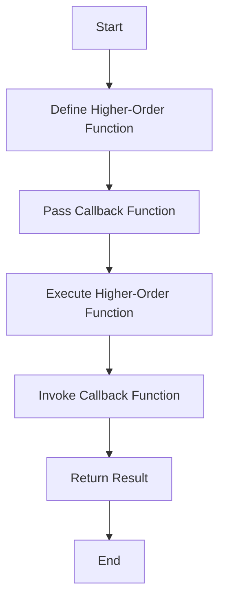

## 8.8 Higher-Order Functions (Basic Concept)

In this section, we will delve into the fascinating world of higher-order functions in JavaScript. This concept is a cornerstone of functional programming, a programming paradigm that treats computation as the evaluation of mathematical functions and avoids changing state and mutable data. Higher-order functions are a powerful tool in JavaScript, allowing us to write more modular, reusable, and expressive code. Let's explore what higher-order functions are, how they work, and how you can use them in your JavaScript programs.

### What are Higher-Order Functions?

Higher-order functions are functions that can take other functions as arguments or return them as results. This ability to manipulate functions as first-class citizens is a key feature of JavaScript and many other modern programming languages.

#### Key Characteristics of Higher-Order Functions

1. **Accept Functions as Arguments**: A higher-order function can take one or more functions as input.
2. **Return Functions as Output**: A higher-order function can produce a function as a result.
3. **Enhance Code Reusability**: By abstracting actions, higher-order functions allow us to reuse code efficiently.

### Understanding Callbacks

Before diving deeper into higher-order functions, it's essential to understand the concept of callbacks. A callback is a function passed into another function as an argument, which is then invoked inside the outer function to complete some kind of routine or action.

#### Example of a Callback Function

```javascript
// A simple function that takes a callback
function greet(name, callback) {
  console.log("Hello, " + name + "!");
  callback();
}

// A callback function
function sayGoodbye() {
  console.log("Goodbye!");
}

// Using the greet function with a callback
greet("Alice", sayGoodbye);
```

In this example, `greet` is a higher-order function because it takes another function (`sayGoodbye`) as an argument. When `greet` is called, it executes the `sayGoodbye` function after greeting the user.

### Practical Examples of Higher-Order Functions

Let's explore some practical examples of higher-order functions using common JavaScript methods like `map`, `filter`, and `reduce`.

#### Using `map` for Transformation

The `map` function is a built-in higher-order function in JavaScript that creates a new array by applying a function to each element of an existing array.

```javascript
const numbers = [1, 2, 3, 4, 5];

// Using map to double each number
const doubled = numbers.map(function(number) {
  return number * 2;
});

console.log(doubled); // Output: [2, 4, 6, 8, 10]
```

In this example, `map` takes an anonymous function (a function without a name) as an argument and applies it to each element in the `numbers` array, resulting in a new array of doubled values.

#### Filtering with `filter`

The `filter` function is another higher-order function that creates a new array containing only the elements that pass a specified test.

```javascript
const numbers = [1, 2, 3, 4, 5];

// Using filter to get even numbers
const evens = numbers.filter(function(number) {
  return number % 2 === 0;
});

console.log(evens); // Output: [2, 4]
```

Here, `filter` uses a callback function to test each element of the `numbers` array, returning a new array with only the even numbers.

#### Reducing with `reduce`

The `reduce` function is a powerful higher-order function that reduces an array to a single value by applying a function to each element and accumulating the result.

```javascript
const numbers = [1, 2, 3, 4, 5];

// Using reduce to sum up the numbers
const sum = numbers.reduce(function(accumulator, currentValue) {
  return accumulator + currentValue;
}, 0);

console.log(sum); // Output: 15
```

In this example, `reduce` takes a callback function that adds each element to an accumulator, starting with an initial value of `0`, to produce the sum of the array.

### The Role of Higher-Order Functions in Functional Programming

Functional programming is a programming paradigm that treats computation as the evaluation of mathematical functions and avoids changing state and mutable data. Higher-order functions are a fundamental concept in functional programming, enabling us to write cleaner, more modular, and more expressive code.

#### Benefits of Functional Programming with Higher-Order Functions

- **Modularity**: Higher-order functions allow us to break down complex problems into smaller, reusable functions.
- **Expressiveness**: By abstracting common patterns, higher-order functions make code more readable and expressive.
- **Immutability**: Functional programming emphasizes immutability, reducing the risk of side effects and making code easier to reason about.

### Try It Yourself

Experiment with higher-order functions by modifying the examples provided. For instance, try creating a new array of numbers that are both doubled and filtered to include only those greater than 5. Here's a starting point:

```javascript
const numbers = [1, 2, 3, 4, 5];

// Chain map and filter to create a new array
const result = numbers.map(function(number) {
  return number * 2;
}).filter(function(number) {
  return number > 5;
});

console.log(result); // Output: [6, 8, 10]
```

### Visualizing Higher-Order Functions

To better understand how higher-order functions work, let's visualize the process using a flowchart.



This flowchart illustrates the process of defining a higher-order function, passing a callback function to it, executing the higher-order function, invoking the callback, and returning the result.

### Further Reading and Resources

To deepen your understanding of higher-order functions and functional programming in JavaScript, consider exploring the following resources:

- [MDN Web Docs on Functions](https://developer.mozilla.org/en-US/docs/Web/JavaScript/Guide/Functions)
- [JavaScript.info on Functional Programming](https://javascript.info/functional-programming)
- [Eloquent JavaScript: Functions](https://eloquentjavascript.net/03_functions.html)

### Key Takeaways

- Higher-order functions are functions that can take other functions as arguments or return them as results.
- Callbacks are a common use case for higher-order functions, allowing us to execute functions asynchronously or in response to events.
- Built-in JavaScript methods like `map`, `filter`, and `reduce` are examples of higher-order functions that enable functional programming.
- Functional programming with higher-order functions promotes modularity, expressiveness, and immutability.

By understanding and utilizing higher-order functions, you can write more efficient, readable, and maintainable JavaScript code. As you continue your programming journey, you'll find that higher-order functions are an invaluable tool in your toolkit.

## Quiz Time!



### What is a higher-order function in JavaScript?

- [x] A function that can take other functions as arguments or return them as results
- [ ] A function that only performs arithmetic operations
- [ ] A function that is executed immediately after it is defined
- [ ] A function that does not accept any parameters

> **Explanation:** Higher-order functions are those that can accept other functions as arguments or return them as results, making them versatile and powerful in functional programming.

### Which of the following is an example of a higher-order function?

- [x] `map`
- [ ] `parseInt`
- [ ] `alert`
- [ ] `Math.sqrt`

> **Explanation:** `map` is a higher-order function because it takes a function as an argument to apply to each element of an array.

### What is a callback function?

- [x] A function passed into another function as an argument
- [ ] A function that calls itself
- [ ] A function that is called at the end of a program
- [ ] A function that only performs mathematical calculations

> **Explanation:** A callback function is a function that is passed as an argument to another function and is executed inside that function.

### Which higher-order function would you use to create a new array with elements that pass a specific test?

- [x] `filter`
- [ ] `map`
- [ ] `reduce`
- [ ] `forEach`

> **Explanation:** `filter` is used to create a new array with elements that pass a specified test provided by a function.

### What does the `reduce` function do?

- [x] It reduces an array to a single value by applying a function to each element
- [ ] It removes elements from an array
- [ ] It sorts the elements of an array
- [ ] It duplicates the elements of an array

> **Explanation:** `reduce` applies a function to each element of an array, accumulating the result to produce a single value.

### How can higher-order functions improve code reusability?

- [x] By abstracting common patterns into reusable functions
- [ ] By making code longer and more complex
- [ ] By removing the need for variables
- [ ] By eliminating the use of loops

> **Explanation:** Higher-order functions abstract common patterns, allowing us to create reusable functions that can be applied in different contexts.

### Which of the following is NOT a characteristic of functional programming?

- [ ] Modularity
- [ ] Immutability
- [x] Changing state frequently
- [ ] Expressiveness

> **Explanation:** Functional programming emphasizes immutability and avoids changing state, focusing on modularity and expressiveness.

### What is the output of the following code?

```javascript
const numbers = [1, 2, 3, 4, 5];
const result = numbers.map(n => n * 2).filter(n => n > 5);
console.log(result);
```

- [x] [6, 8, 10]
- [ ] [2, 4, 6, 8, 10]
- [ ] [12, 14, 16, 18, 20]
- [ ] [1, 2, 3, 4, 5]

> **Explanation:** The `map` function doubles each number, and the `filter` function selects numbers greater than 5, resulting in [6, 8, 10].

### True or False: A higher-order function can only return other functions.

- [ ] True
- [x] False

> **Explanation:** A higher-order function can both accept other functions as arguments and return them as results.

### Higher-order functions are a key concept in which programming paradigm?

- [x] Functional programming
- [ ] Object-oriented programming
- [ ] Procedural programming
- [ ] Imperative programming

> **Explanation:** Higher-order functions are a fundamental concept in functional programming, which emphasizes the use of functions as first-class citizens.


