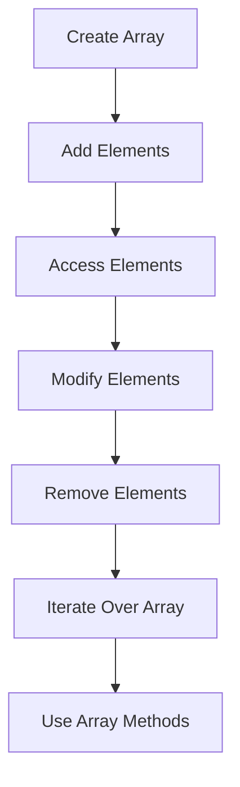

## 9.1 Introduction to Arrays

Welcome to the fascinating world of arrays in JavaScript! Arrays are one of the most fundamental and versatile data structures in programming. They allow us to store, organize, and manipulate collections of data efficiently. In this section, we'll explore what arrays are, how they work, and why they are so essential in programming.

### What is an Array?

An array is an ordered collection of elements, where each element can be accessed by its index. Think of an array as a list of items, similar to a shopping list. Each item on the list has a specific position, and you can refer to any item by its position number.

#### Key Characteristics of Arrays:
- **Ordered Collection**: Elements in an array are stored in a specific sequence.
- **Indexed Access**: Each element in an array can be accessed using its index, which starts from 0.
- **Homogeneous or Heterogeneous**: Arrays can store elements of the same type (homogeneous) or different types (heterogeneous).

### Why Use Arrays?

Arrays are incredibly useful in programming for several reasons:

1. **Efficient Data Storage**: Arrays allow you to store multiple values in a single variable, making it easier to manage and manipulate data.

2. **Easy Access and Manipulation**: With arrays, you can quickly access, update, and manipulate data using indices.

3. **Versatile Data Handling**: Arrays can store any type of data, including numbers, strings, objects, and even other arrays.

4. **Looping and Iteration**: Arrays work seamlessly with loops, allowing you to perform operations on each element efficiently.

### Common Use Cases for Arrays

Arrays are used in a wide range of programming scenarios. Here are some common use cases:

- **Storing Lists of Data**: Arrays are perfect for storing lists, such as a list of names, numbers, or objects.

- **Data Manipulation**: Arrays make it easy to perform operations on data, such as sorting, filtering, and transforming.

- **Iterating Over Data**: Arrays work well with loops, making it easy to iterate over data and perform operations on each element.

- **Storing Complex Data Structures**: Arrays can store other arrays, allowing you to create complex data structures like matrices and multidimensional arrays.

### Creating Arrays in JavaScript

In JavaScript, you can create arrays using two main methods: the `Array` constructor and array literals.

#### Using Array Literals

The most common way to create an array is by using array literals. An array literal is a list of values enclosed in square brackets `[]`.

```javascript
// Creating an array of numbers
let numbers = [1, 2, 3, 4, 5];

// Creating an array of strings
let fruits = ["apple", "banana", "cherry"];

// Creating a mixed array
let mixedArray = [42, "hello", true, null];
```

#### Using the Array Constructor

You can also create arrays using the `Array` constructor, although this method is less common.

```javascript
// Creating an empty array
let emptyArray = new Array();

// Creating an array with initial size
let sizedArray = new Array(5);

// Creating an array with initial elements
let elementsArray = new Array(1, 2, 3);
```

### Accessing Array Elements

You can access elements in an array using their index. Remember, array indices start at 0.

```javascript
let fruits = ["apple", "banana", "cherry"];

console.log(fruits[0]); // Output: apple
console.log(fruits[1]); // Output: banana
console.log(fruits[2]); // Output: cherry
```

### Modifying Array Elements

You can modify elements in an array by assigning a new value to a specific index.

```javascript
let fruits = ["apple", "banana", "cherry"];

fruits[1] = "blueberry"; // Changing banana to blueberry

console.log(fruits); // Output: ["apple", "blueberry", "cherry"]
```

### Adding and Removing Elements

JavaScript provides several methods to add and remove elements from arrays.

#### Adding Elements

- **`push()`**: Adds one or more elements to the end of an array.

```javascript
let fruits = ["apple", "banana"];
fruits.push("cherry");

console.log(fruits); // Output: ["apple", "banana", "cherry"]
```

- **`unshift()`**: Adds one or more elements to the beginning of an array.

```javascript
let fruits = ["banana", "cherry"];
fruits.unshift("apple");

console.log(fruits); // Output: ["apple", "banana", "cherry"]
```

#### Removing Elements

- **`pop()`**: Removes the last element from an array.

```javascript
let fruits = ["apple", "banana", "cherry"];
fruits.pop();

console.log(fruits); // Output: ["apple", "banana"]
```

- **`shift()`**: Removes the first element from an array.

```javascript
let fruits = ["apple", "banana", "cherry"];
fruits.shift();

console.log(fruits); // Output: ["banana", "cherry"]
```

### Array Length

The `length` property of an array returns the number of elements in the array.

```javascript
let fruits = ["apple", "banana", "cherry"];
console.log(fruits.length); // Output: 3
```

### Iterating Over Arrays

You can iterate over arrays using loops, such as `for`, `for...of`, and `forEach`.

#### Using a `for` Loop

```javascript
let fruits = ["apple", "banana", "cherry"];

for (let i = 0; i < fruits.length; i++) {
  console.log(fruits[i]);
}
```

#### Using a `for...of` Loop

```javascript
let fruits = ["apple", "banana", "cherry"];

for (let fruit of fruits) {
  console.log(fruit);
}
```

#### Using `forEach()`

The `forEach()` method executes a provided function once for each array element.

```javascript
let fruits = ["apple", "banana", "cherry"];

fruits.forEach(function(fruit) {
  console.log(fruit);
});
```

### Multidimensional Arrays

Arrays can contain other arrays, allowing you to create multidimensional arrays. These are useful for representing matrices or grids.

```javascript
let matrix = [
  [1, 2, 3],
  [4, 5, 6],
  [7, 8, 9]
];

console.log(matrix[0][0]); // Output: 1
console.log(matrix[1][2]); // Output: 6
```

### Common Array Methods

JavaScript provides a variety of methods to manipulate arrays. Here are some commonly used methods:

- **`concat()`**: Merges two or more arrays.

```javascript
let array1 = [1, 2, 3];
let array2 = [4, 5, 6];
let combined = array1.concat(array2);

console.log(combined); // Output: [1, 2, 3, 4, 5, 6]
```

- **`slice()`**: Returns a shallow copy of a portion of an array.

```javascript
let fruits = ["apple", "banana", "cherry", "date"];
let sliced = fruits.slice(1, 3);

console.log(sliced); // Output: ["banana", "cherry"]
```

- **`splice()`**: Adds or removes elements from an array.

```javascript
let fruits = ["apple", "banana", "cherry"];
fruits.splice(1, 1, "blueberry");

console.log(fruits); // Output: ["apple", "blueberry", "cherry"]
```

- **`indexOf()`**: Returns the first index at which a given element can be found.

```javascript
let fruits = ["apple", "banana", "cherry"];
console.log(fruits.indexOf("banana")); // Output: 1
```

- **`includes()`**: Determines whether an array includes a certain element.

```javascript
let fruits = ["apple", "banana", "cherry"];
console.log(fruits.includes("banana")); // Output: true
```

### Try It Yourself

Now that we've covered the basics of arrays, let's try some hands-on practice. Modify the code examples above to:

- Add more elements to the arrays.
- Change the order of elements.
- Use different methods to manipulate the arrays.
- Create a multidimensional array representing a 3x3 grid and access its elements.

### Visualizing Arrays

To better understand how arrays work, let's visualize a simple array and its operations using a flowchart.



This flowchart represents the typical operations you can perform on arrays, from creation to manipulation and iteration.

### Further Reading

To deepen your understanding of arrays, consider exploring these resources:

- [MDN Web Docs: Array](https://developer.mozilla.org/en-US/docs/Web/JavaScript/Reference/Global_Objects/Array)
- [W3Schools: JavaScript Arrays](https://www.w3schools.com/js/js_arrays.asp)

### Summary

Arrays are a powerful and flexible data structure in JavaScript, allowing you to store and manipulate collections of data efficiently. By mastering arrays, you'll be equipped to handle a wide range of programming tasks, from simple data storage to complex data manipulation.

## Quiz Time!



### What is an array in JavaScript?

- [x] An ordered collection of elements
- [ ] A single value variable
- [ ] A function that performs operations
- [ ] A special type of loop

> **Explanation:** An array is an ordered collection of elements, where each element can be accessed by its index.

### How do you access the first element of an array named `fruits`?

- [x] `fruits[0]`
- [ ] `fruits[1]`
- [ ] `fruits.first()`
- [ ] `fruits.get(0)`

> **Explanation:** In JavaScript, array indices start at 0, so `fruits[0]` accesses the first element.

### Which method adds an element to the end of an array?

- [x] `push()`
- [ ] `pop()`
- [ ] `shift()`
- [ ] `unshift()`

> **Explanation:** The `push()` method adds one or more elements to the end of an array.

### What does the `length` property of an array return?

- [x] The number of elements in the array
- [ ] The last element of the array
- [ ] The first element of the array
- [ ] The type of elements in the array

> **Explanation:** The `length` property returns the number of elements in the array.

### Which method removes the first element from an array?

- [x] `shift()`
- [ ] `pop()`
- [ ] `push()`
- [ ] `unshift()`

> **Explanation:** The `shift()` method removes the first element from an array.

### How can you create an empty array in JavaScript?

- [x] `let arr = [];`
- [ ] `let arr = {};`
- [ ] `let arr = new Array(1);`
- [ ] `let arr = new Set();`

> **Explanation:** `let arr = [];` creates an empty array using array literals.

### What is the index of the last element in an array named `items` with 5 elements?

- [x] 4
- [ ] 5
- [ ] 0
- [ ] 6

> **Explanation:** The index of the last element in an array of 5 elements is 4, as indices start at 0.

### Which method can merge two arrays into one?

- [x] `concat()`
- [ ] `splice()`
- [ ] `slice()`
- [ ] `join()`

> **Explanation:** The `concat()` method merges two or more arrays into one.

### True or False: Arrays in JavaScript can store elements of different types.

- [x] True
- [ ] False

> **Explanation:** Arrays in JavaScript can store elements of different types, such as numbers, strings, and objects.

### What does the `forEach()` method do?

- [x] Executes a provided function once for each array element
- [ ] Adds an element to the array
- [ ] Removes an element from the array
- [ ] Sorts the array

> **Explanation:** The `forEach()` method executes a provided function once for each array element.



By now, you should have a solid understanding of arrays in JavaScript and how to use them effectively. Keep practicing and experimenting with arrays to reinforce your learning and build your programming skills. Happy coding!
