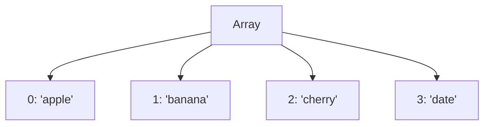

## 9.2 Creating Arrays

Arrays are a fundamental part of JavaScript, allowing us to store multiple values in a single variable. They are incredibly versatile and can hold various types of data, making them essential for any programmer. In this section, we will explore how to create arrays using two primary methods: array literals and the `Array` constructor. We will also delve into initializing arrays with elements and discuss how arrays can hold mixed data types.

### Understanding Arrays

Before we dive into creating arrays, let's briefly understand what arrays are. An array is a special variable that can hold more than one value at a time. Think of an array as a list or a collection of items, where each item is stored at a specific position, known as an index. In JavaScript, arrays are zero-indexed, meaning the first element is at index 0, the second at index 1, and so on.

### Creating Arrays Using Array Literals

The most common and straightforward way to create an array in JavaScript is by using array literals. An array literal is a pair of square brackets `[]` that can contain a list of elements separated by commas. Let's see how this works:

```javascript
// Creating an empty array
let emptyArray = [];

// Creating an array with numbers
let numbers = [1, 2, 3, 4, 5];

// Creating an array with strings
let fruits = ['apple', 'banana', 'cherry'];

// Creating an array with mixed data types
let mixedArray = [42, 'hello', true, null];
```

#### Key Points:

- **Empty Array**: You can create an empty array by simply using `[]`.
- **Array with Elements**: You can initialize an array with elements by placing them inside the brackets, separated by commas.
- **Mixed Data Types**: JavaScript arrays can hold elements of different data types, such as numbers, strings, booleans, and even other arrays.

### Creating Arrays Using the Array Constructor

Another way to create arrays in JavaScript is by using the `Array` constructor. This method is less common but can be useful in certain situations. The `Array` constructor can be used in two main ways:

#### Creating an Empty Array

You can create an empty array by calling the `Array` constructor without any arguments:

```javascript
// Creating an empty array using the Array constructor
let emptyArray = new Array();
```

#### Creating an Array with a Specified Length

You can also create an array with a specified length by passing a single numeric argument to the `Array` constructor. This creates an array with the given number of empty slots:

```javascript
// Creating an array with 5 empty slots
let arrayWithLength = new Array(5);
```

It's important to note that this does not initialize the array with any values; it simply creates an array with a specified length.

#### Creating an Array with Elements

To create an array with elements using the `Array` constructor, you can pass multiple arguments, each representing an element of the array:

```javascript
// Creating an array with elements using the Array constructor
let colors = new Array('red', 'green', 'blue');
```

### Comparing Array Literals and the Array Constructor

While both methods can be used to create arrays, array literals are generally preferred due to their simplicity and readability. The `Array` constructor can sometimes lead to confusion, especially when creating arrays with a single numeric argument, as it creates an array with empty slots rather than an array with a single element.

### Initializing Arrays with Elements

When creating arrays, you can initialize them with elements right from the start. This is useful when you know the values you want to store in the array. Let's look at some examples:

```javascript
// Initializing an array with numbers
let primes = [2, 3, 5, 7, 11];

// Initializing an array with strings
let colors = ['red', 'green', 'blue'];

// Initializing an array with mixed data types
let randomData = [true, 42, 'JavaScript', null];
```

#### Key Points:

- **Order Matters**: The order of elements in an array is significant. The first element you add will be at index 0, the second at index 1, and so on.
- **Dynamic Nature**: Arrays in JavaScript are dynamic, meaning you can add, remove, or change elements at any time.

### Arrays with Mixed Data Types

One of the powerful features of JavaScript arrays is their ability to hold elements of different data types. This flexibility allows you to store various kinds of data in a single array. Let's explore this concept further:

```javascript
// An array with mixed data types
let mixedArray = [1, 'two', true, { name: 'JavaScript' }, [3, 4, 5]];

// Accessing elements of mixedArray
console.log(mixedArray[0]); // Output: 1
console.log(mixedArray[1]); // Output: 'two'
console.log(mixedArray[3].name); // Output: 'JavaScript'
console.log(mixedArray[4][1]); // Output: 4
```

#### Key Points:

- **Objects and Arrays**: You can store objects and even other arrays within an array, making it a powerful tool for organizing complex data structures.
- **Accessing Elements**: You can access elements of an array using their index. For nested arrays or objects, use additional indices or property names.

### Try It Yourself

Now that we've covered the basics of creating arrays, it's time for you to try it yourself! Here's a simple exercise:

1. Create an array named `myFavorites` that contains your favorite number, your favorite color, and a boolean indicating whether you like JavaScript.
2. Add a new element to the array: your favorite fruit.
3. Print the entire array to the console.

```javascript
// Step 1: Create an array with your favorites
let myFavorites = [7, 'blue', true];

// Step 2: Add your favorite fruit to the array
myFavorites.push('mango');

// Step 3: Print the array to the console
console.log(myFavorites);
```

### Visualizing Arrays

To help visualize how arrays work, let's use a diagram to represent an array and its elements. This can be particularly helpful for beginners to understand the concept of indices and how data is stored in an array.



In this diagram, we have an array with four elements: 'apple', 'banana', 'cherry', and 'date'. Each element is associated with an index, starting from 0.

### Further Reading and Resources

To deepen your understanding of arrays in JavaScript, consider exploring the following resources:

- [MDN Web Docs: Arrays](https://developer.mozilla.org/en-US/docs/Web/JavaScript/Reference/Global_Objects/Array)
- [W3Schools: JavaScript Arrays](https://www.w3schools.com/js/js_arrays.asp)

These resources provide comprehensive information and examples to help you master arrays in JavaScript.

### Summary

In this section, we explored how to create arrays in JavaScript using array literals and the `Array` constructor. We learned how to initialize arrays with elements and discovered that arrays can hold mixed data types. Arrays are a powerful and flexible tool in JavaScript, allowing you to store and manipulate collections of data efficiently.

## Quiz Time!



### What is the most common way to create an array in JavaScript?

- [x] Using array literals `[]`
- [ ] Using the `Array` constructor
- [ ] Using the `new` keyword
- [ ] Using the `createArray` function

> **Explanation:** The most common way to create an array in JavaScript is by using array literals `[]` due to their simplicity and readability.

### How can you create an empty array using the Array constructor?

- [x] `let emptyArray = new Array();`
- [ ] `let emptyArray = Array();`
- [ ] `let emptyArray = [];`
- [ ] `let emptyArray = new Array;`

> **Explanation:** You can create an empty array using the `Array` constructor by calling `new Array()`.

### What will be the output of `console.log(mixedArray[3].name);` if `mixedArray` is `[1, 'two', true, { name: 'JavaScript' }, [3, 4, 5]]`?

- [x] 'JavaScript'
- [ ] 'two'
- [ ] true
- [ ] undefined

> **Explanation:** `mixedArray[3]` accesses the object `{ name: 'JavaScript' }`, and `.name` accesses the value 'JavaScript'.

### Which of the following can be stored in a JavaScript array?

- [x] Numbers
- [x] Strings
- [x] Booleans
- [x] Objects

> **Explanation:** JavaScript arrays can store elements of any data type, including numbers, strings, booleans, and objects.

### How do you add a new element to the end of an array?

- [x] Using the `push()` method
- [ ] Using the `add()` method
- [ ] Using the `append()` method
- [ ] Using the `insert()` method

> **Explanation:** The `push()` method is used to add a new element to the end of an array.

### What does the `Array` constructor do when passed a single numeric argument?

- [x] Creates an array with empty slots
- [ ] Creates an array with a single element
- [ ] Throws an error
- [ ] Creates an array with `undefined` values

> **Explanation:** When passed a single numeric argument, the `Array` constructor creates an array with the specified number of empty slots.

### Can JavaScript arrays hold elements of different data types?

- [x] Yes
- [ ] No

> **Explanation:** JavaScript arrays can hold elements of different data types, such as numbers, strings, and booleans.

### What is the index of the first element in a JavaScript array?

- [x] 0
- [ ] 1
- [ ] -1
- [ ] It depends on the array

> **Explanation:** JavaScript arrays are zero-indexed, meaning the first element is at index 0.

### Which method is preferred for creating arrays due to simplicity and readability?

- [x] Array literals `[]`
- [ ] The `Array` constructor
- [ ] The `new` keyword
- [ ] The `createArray` function

> **Explanation:** Array literals `[]` are preferred for creating arrays due to their simplicity and readability.

### True or False: Arrays in JavaScript are static and cannot change size.

- [ ] True
- [x] False

> **Explanation:** Arrays in JavaScript are dynamic, meaning they can change size by adding or removing elements.



---

By understanding how to create and work with arrays, you are building a strong foundation in JavaScript programming. Keep practicing and experimenting with arrays to become more comfortable with this essential data structure.
