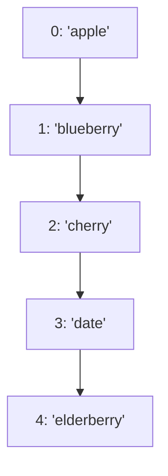

## 9.3 Accessing Array Elements

Arrays are a fundamental part of JavaScript programming, allowing us to store multiple values in a single variable. In this section, we will explore how to access elements within an array using their index positions. We will also discuss the concept of zero-based indexing, how to update array elements, and the significance of the `.length` property. By the end of this section, you will have a solid understanding of how to work with arrays in JavaScript.

### Understanding Zero-Based Indexing

In JavaScript, arrays use zero-based indexing, which means that the first element of an array is accessed with the index `0`, the second element with the index `1`, and so on. This concept is crucial to understand as it is a common source of confusion for beginners.

#### Example of Zero-Based Indexing

Let's consider an array of fruits:

```javascript
let fruits = ['apple', 'banana', 'cherry', 'date'];
```

In this array, the elements are indexed as follows:

- `fruits[0]` is `'apple'`
- `fruits[1]` is `'banana'`
- `fruits[2]` is `'cherry'`
- `fruits[3]` is `'date'`

#### Accessing Array Elements

To access an element in an array, you simply use the array name followed by the index of the element in square brackets. Let's see how we can access elements from the `fruits` array:

```javascript
console.log(fruits[0]); // Output: apple
console.log(fruits[2]); // Output: cherry
```

### Updating Array Elements

Once you have accessed an array element, you can also update it. This is done by assigning a new value to the element at a specific index.

#### Example of Updating Array Elements

Suppose we want to change `'banana'` to `'blueberry'` in our `fruits` array:

```javascript
fruits[1] = 'blueberry';
console.log(fruits); // Output: ['apple', 'blueberry', 'cherry', 'date']
```

### The `.length` Property

The `.length` property of an array provides the number of elements in the array. It is particularly useful when you need to loop through all the elements of an array or when you want to add elements to the end of an array.

#### Example of Using the `.length` Property

Let's see how we can use the `.length` property to iterate over an array:

```javascript
for (let i = 0; i < fruits.length; i++) {
    console.log(fruits[i]);
}
// Output:
// apple
// blueberry
// cherry
// date
```

#### Adding Elements Using the `.length` Property

You can also use the `.length` property to add new elements to the end of an array:

```javascript
fruits[fruits.length] = 'elderberry';
console.log(fruits); // Output: ['apple', 'blueberry', 'cherry', 'date', 'elderberry']
```

### Visualizing Arrays and Indexing

To better understand how arrays and indexing work, let's visualize the `fruits` array using a diagram:



This diagram represents the `fruits` array and its elements with their respective index positions.

### Common Mistakes and How to Avoid Them

When working with arrays, beginners often make some common mistakes. Let's discuss these and how to avoid them:

1. **Off-by-One Errors**: Remember that arrays are zero-indexed. The last element of an array with `n` elements is at index `n-1`, not `n`.

2. **Accessing Non-Existent Elements**: If you try to access an index that doesn't exist, JavaScript will return `undefined`.

    ```javascript
    console.log(fruits[10]); // Output: undefined
    ```

3. **Using the Wrong Index**: Double-check your index values to ensure you're accessing the correct element.

### Try It Yourself

Now that we've covered the basics of accessing and updating array elements, try experimenting with the following exercises:

1. Create an array of your favorite colors and print each color using a loop.
2. Update one of the colors in your array and print the updated array.
3. Add a new color to the end of your array using the `.length` property.

### Key Takeaways

- Arrays in JavaScript use zero-based indexing.
- Access elements using their index positions in square brackets.
- Update elements by assigning a new value to a specific index.
- Use the `.length` property to determine the number of elements in an array and to add new elements to the end of an array.

By understanding these concepts, you will be well-equipped to work with arrays in JavaScript and perform various operations on them.

## Quiz Time!



### What is the index of the first element in a JavaScript array?

- [x] 0
- [ ] 1
- [ ] -1
- [ ] It depends on the array

> **Explanation:** JavaScript arrays use zero-based indexing, so the first element is always at index 0.

### How do you access the third element in an array named `colors`?

- [ ] colors[0]
- [ ] colors[1]
- [x] colors[2]
- [ ] colors[3]

> **Explanation:** The third element is accessed using index 2 because arrays are zero-indexed.

### What will be the output of `console.log(fruits[10]);` if `fruits` is an array of 4 elements?

- [ ] The last element of the array
- [x] undefined
- [ ] An error
- [ ] 10

> **Explanation:** Accessing an index that doesn't exist in the array returns `undefined`.

### How can you update the second element of an array `numbers` to 42?

- [x] numbers[1] = 42;
- [ ] numbers[2] = 42;
- [ ] numbers[0] = 42;
- [ ] numbers[3] = 42;

> **Explanation:** The second element is at index 1 in a zero-indexed array.

### What does the `.length` property of an array return?

- [x] The number of elements in the array
- [ ] The index of the last element
- [ ] The index of the first element
- [ ] The size of the array in bytes

> **Explanation:** The `.length` property returns the total number of elements in the array.

### How can you add a new element to the end of an array `items`?

- [x] items[items.length] = 'newItem';
- [ ] items[0] = 'newItem';
- [ ] items[-1] = 'newItem';
- [ ] items.push('newItem');

> **Explanation:** Using `items[items.length]` adds a new element to the end of the array.

### What will `console.log(fruits.length);` output if `fruits` is `['apple', 'banana', 'cherry']`?

- [x] 3
- [ ] 2
- [ ] 4
- [ ] undefined

> **Explanation:** The `.length` property returns the number of elements, which is 3 in this case.

### Which of the following is a valid way to access the last element of an array `arr`?

- [x] arr[arr.length - 1]
- [ ] arr[length]
- [ ] arr[-1]
- [ ] arr[length - 1]

> **Explanation:** `arr[arr.length - 1]` correctly accesses the last element in a zero-indexed array.

### What will happen if you try to access an array element with a negative index?

- [x] undefined
- [ ] The first element
- [ ] The last element
- [ ] An error

> **Explanation:** JavaScript does not support negative indexing, so it returns `undefined`.

### True or False: Arrays in JavaScript are zero-indexed.

- [x] True
- [ ] False

> **Explanation:** Arrays in JavaScript are indeed zero-indexed, meaning the first element is at index 0.


