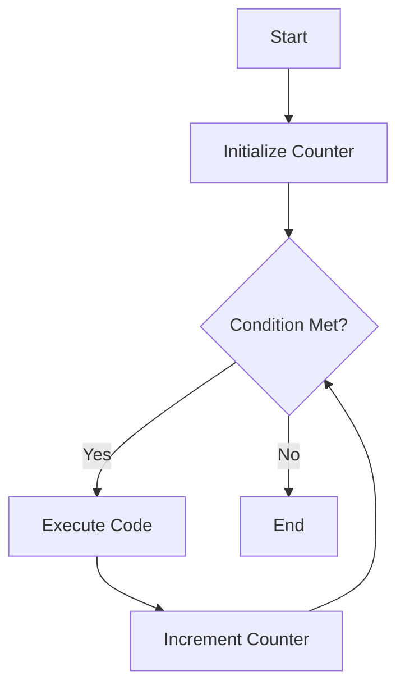

## 9.5 Iterating Over Arrays

Arrays are a fundamental part of JavaScript, allowing us to store and manipulate collections of data. However, to effectively work with arrays, we need to understand how to iterate over them. Iterating over arrays means going through each element in the array and performing some operation on it. In this section, we'll explore various techniques for iterating over arrays, including traditional `for` loops, `for...of` loops, and array iteration methods like `forEach()`, `map()`, and `filter()`.

### Traditional `for` Loops

The traditional `for` loop is one of the most basic and versatile ways to iterate over an array. It gives us complete control over the iteration process, allowing us to specify the starting point, ending condition, and increment step.

#### Syntax of a `for` Loop

Here's the basic syntax of a `for` loop:

```javascript
for (initialization; condition; increment) {
    // Code to execute on each iteration
}
```

- **Initialization**: This is executed once before the loop starts. It's typically used to initialize a counter variable.
- **Condition**: This is evaluated before each iteration. If it's `true`, the loop continues; if `false`, the loop stops.
- **Increment**: This is executed after each iteration. It's usually used to update the counter variable.

#### Iterating Over an Array with a `for` Loop

Let's see how we can use a `for` loop to iterate over an array:

```javascript
let fruits = ['apple', 'banana', 'cherry'];

for (let i = 0; i < fruits.length; i++) {
    console.log(fruits[i]); // Access each element using the index
}
```

In this example, we initialize `i` to `0`, set the condition to `i < fruits.length`, and increment `i` by `1` on each iteration. This allows us to access each element in the `fruits` array using `fruits[i]`.

### `for...of` Loops

The `for...of` loop is a more modern and concise way to iterate over arrays. It was introduced in ECMAScript 2015 (ES6) and is specifically designed for iterating over iterable objects like arrays.

#### Syntax of a `for...of` Loop

Here's the basic syntax of a `for...of` loop:

```javascript
for (element of iterable) {
    // Code to execute on each iteration
}
```

- **element**: A variable that represents the current element in the iteration.
- **iterable**: An object that can be iterated over, such as an array.

#### Iterating Over an Array with a `for...of` Loop

Let's see how we can use a `for...of` loop to iterate over an array:

```javascript
let fruits = ['apple', 'banana', 'cherry'];

for (let fruit of fruits) {
    console.log(fruit); // Directly access each element
}
```

In this example, `fruit` represents each element in the `fruits` array, allowing us to access each element directly without using an index.

### Array Iteration Methods

JavaScript provides several built-in methods for iterating over arrays. These methods are often more concise and expressive than traditional loops.

#### `forEach()`

The `forEach()` method executes a provided function once for each array element. It's a simple and effective way to iterate over an array when you don't need to modify the array or return a new array.

##### Syntax of `forEach()`

Here's the basic syntax of `forEach()`:

```javascript
array.forEach(function(element, index, array) {
    // Code to execute on each iteration
});
```

- **element**: The current element being processed.
- **index**: The index of the current element (optional).
- **array**: The array `forEach()` was called upon (optional).

##### Using `forEach()` to Iterate Over an Array

Let's see how we can use `forEach()` to iterate over an array:

```javascript
let fruits = ['apple', 'banana', 'cherry'];

fruits.forEach(function(fruit) {
    console.log(fruit); // Access each element directly
});
```

In this example, the function passed to `forEach()` is executed for each element in the `fruits` array, allowing us to access each element directly.

#### `map()`

The `map()` method creates a new array populated with the results of calling a provided function on every element in the calling array. It's useful when you want to transform each element in an array and return a new array with the transformed elements.

##### Syntax of `map()`

Here's the basic syntax of `map()`:

```javascript
let newArray = array.map(function(element, index, array) {
    // Return the new value for the new array
});
```

- **element**: The current element being processed.
- **index**: The index of the current element (optional).
- **array**: The array `map()` was called upon (optional).

##### Using `map()` to Transform an Array

Let's see how we can use `map()` to transform an array:

```javascript
let numbers = [1, 2, 3];

let doubledNumbers = numbers.map(function(number) {
    return number * 2; // Multiply each element by 2
});

console.log(doubledNumbers); // [2, 4, 6]
```

In this example, `map()` creates a new array `doubledNumbers` by multiplying each element in the `numbers` array by `2`.

#### `filter()`

The `filter()` method creates a new array with all elements that pass the test implemented by the provided function. It's useful when you want to create a new array with only the elements that meet certain criteria.

##### Syntax of `filter()`

Here's the basic syntax of `filter()`:

```javascript
let newArray = array.filter(function(element, index, array) {
    // Return true to keep the element, false otherwise
});
```

- **element**: The current element being processed.
- **index**: The index of the current element (optional).
- **array**: The array `filter()` was called upon (optional).

##### Using `filter()` to Create a Subset of an Array

Let's see how we can use `filter()` to create a subset of an array:

```javascript
let numbers = [1, 2, 3, 4, 5];

let evenNumbers = numbers.filter(function(number) {
    return number % 2 === 0; // Keep only even numbers
});

console.log(evenNumbers); // [2, 4]
```

In this example, `filter()` creates a new array `evenNumbers` containing only the even numbers from the `numbers` array.

### Try It Yourself

Now that we've covered several ways to iterate over arrays, let's try modifying some of the examples to deepen our understanding:

1. **Modify the `for` Loop Example**: Change the loop to print the elements in reverse order.
2. **Experiment with `for...of`**: Use a `for...of` loop to iterate over an array of objects and print a specific property of each object.
3. **Enhance the `forEach()` Example**: Add an index parameter to the `forEach()` function and print both the index and the element.
4. **Transform with `map()`**: Use `map()` to create a new array that contains the square of each number from an existing array.
5. **Filter with `filter()`**: Use `filter()` to create a new array that contains only the elements from an existing array that are greater than a certain value.

### Visualizing Array Iteration

To better understand how array iteration works, let's visualize the process using a flowchart. This flowchart represents the flow of a traditional `for` loop iterating over an array:



- **Start**: The loop begins.
- **Initialize Counter**: The counter variable is initialized.
- **Condition Met?**: The loop checks if the condition is true.
- **Execute Code**: If the condition is true, the code inside the loop is executed.
- **Increment Counter**: The counter is incremented.
- **End**: The loop ends when the condition is false.

### Key Takeaways

- **Traditional `for` Loops**: Provide complete control over the iteration process and are useful for complex iteration logic.
- **`for...of` Loops**: Offer a concise and readable way to iterate over arrays, especially when you don't need the index.
- **`forEach()`**: Executes a function for each array element and is ideal for simple iteration tasks.
- **`map()`**: Transforms each element in an array and returns a new array with the transformed elements.
- **`filter()`**: Creates a new array with elements that pass a test implemented by a provided function.

### Further Reading

For more information on array iteration in JavaScript, consider exploring the following resources:

- [MDN Web Docs: Array](https://developer.mozilla.org/en-US/docs/Web/JavaScript/Reference/Global_Objects/Array)
- [W3Schools: JavaScript Arrays](https://www.w3schools.com/js/js_arrays.asp)

By understanding and mastering these array iteration techniques, you'll be well-equipped to handle a wide range of programming tasks in JavaScript. Remember to practice and experiment with the examples provided to reinforce your learning.

## Quiz Time!



### What is the primary purpose of iterating over an array?

- [x] To access and perform operations on each element in the array
- [ ] To create a new array with the same elements
- [ ] To sort the elements in the array
- [ ] To delete elements from the array

> **Explanation:** Iterating over an array allows us to access and perform operations on each element in the array.

### Which loop is specifically designed for iterating over iterable objects like arrays?

- [ ] Traditional `for` loop
- [x] `for...of` loop
- [ ] `while` loop
- [ ] `do...while` loop

> **Explanation:** The `for...of` loop is specifically designed for iterating over iterable objects like arrays.

### What does the `forEach()` method do?

- [ ] Creates a new array with transformed elements
- [x] Executes a provided function once for each array element
- [ ] Filters elements based on a condition
- [ ] Sorts the elements in the array

> **Explanation:** The `forEach()` method executes a provided function once for each array element.

### What is the return value of the `map()` method?

- [ ] The original array
- [x] A new array with transformed elements
- [ ] A boolean indicating success
- [ ] An object with key-value pairs

> **Explanation:** The `map()` method returns a new array with the results of calling a provided function on every element in the calling array.

### Which method would you use to create a new array with only the elements that meet certain criteria?

- [ ] `forEach()`
- [ ] `map()`
- [x] `filter()`
- [ ] `reduce()`

> **Explanation:** The `filter()` method creates a new array with all elements that pass the test implemented by the provided function.

### In a `for` loop, what does the increment part do?

- [ ] Initializes the counter variable
- [ ] Checks the condition
- [x] Updates the counter variable after each iteration
- [ ] Ends the loop

> **Explanation:** The increment part of a `for` loop updates the counter variable after each iteration.

### What is the main advantage of using a `for...of` loop over a traditional `for` loop?

- [x] It is more concise and readable
- [ ] It allows for complex iteration logic
- [ ] It can modify the original array
- [ ] It is faster in execution

> **Explanation:** The `for...of` loop is more concise and readable, especially when you don't need the index.

### Which method would you use to transform each element in an array?

- [ ] `forEach()`
- [x] `map()`
- [ ] `filter()`
- [ ] `reduce()`

> **Explanation:** The `map()` method is used to transform each element in an array and return a new array with the transformed elements.

### What does the `filter()` method return?

- [ ] The original array
- [x] A new array with elements that pass a test
- [ ] A boolean indicating success
- [ ] An object with key-value pairs

> **Explanation:** The `filter()` method returns a new array with all elements that pass the test implemented by the provided function.

### True or False: The `forEach()` method can be used to modify the original array.

- [x] True
- [ ] False

> **Explanation:** The `forEach()` method can be used to modify the original array, as it executes a provided function once for each array element.


