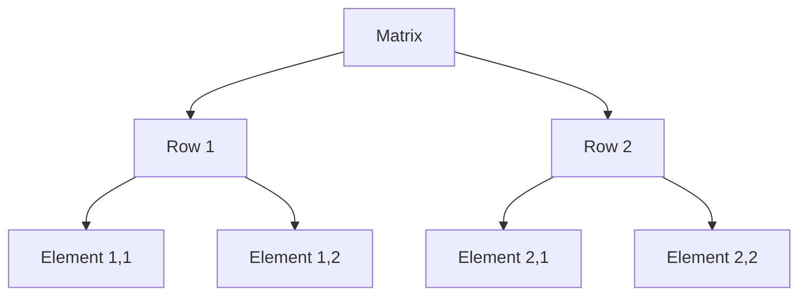

## 9.6 Multidimensional Arrays

In this section, we will explore the concept of multidimensional arrays in JavaScript. Multidimensional arrays, also known as nested arrays, are arrays that contain other arrays as their elements. This structure allows us to represent more complex data, such as matrices or grids, in a way that is both organized and easy to manipulate. Let's dive in and learn how to create, access, and modify these arrays.

### Introduction to Multidimensional Arrays

A **multidimensional array** is essentially an array of arrays. Each element of the main array can be another array, and each of those arrays can contain more arrays, and so on. This nesting can continue to as many levels as needed, depending on the complexity of the data you wish to represent.

#### Why Use Multidimensional Arrays?

Multidimensional arrays are useful for representing data structures that have more than one dimension. For example:

- **Matrices**: A matrix is a two-dimensional array, often used in mathematical computations.
- **Grids**: A grid, such as a chessboard or a seating chart, can be represented as a two-dimensional array.
- **Tables**: Data tables with rows and columns can be stored in two-dimensional arrays.

### Creating Multidimensional Arrays

To create a multidimensional array in JavaScript, you simply create an array where each element is itself an array. Let's start with a simple example: a two-dimensional array representing a 3x3 matrix.

```javascript
// Creating a 3x3 matrix
let matrix = [
  [1, 2, 3],
  [4, 5, 6],
  [7, 8, 9]
];
```

In this example, `matrix` is a two-dimensional array with three rows and three columns. Each row is an array containing three numbers.

#### Nested Arrays

You can nest arrays as deeply as you like. For example, a three-dimensional array can be created by nesting arrays within arrays within arrays:

```javascript
// Creating a 2x2x2 three-dimensional array
let threeDimensionalArray = [
  [
    [1, 2],
    [3, 4]
  ],
  [
    [5, 6],
    [7, 8]
  ]
];
```

In this example, `threeDimensionalArray` is a three-dimensional array with two layers, each containing two rows and two columns.

### Accessing Elements in Multidimensional Arrays

Accessing elements in a multidimensional array requires specifying the index at each level of the array. Let's see how we can access elements in our 3x3 matrix example.

```javascript
// Accessing elements in a 3x3 matrix
let matrix = [
  [1, 2, 3],
  [4, 5, 6],
  [7, 8, 9]
];

// Access the element in the first row, second column
let element = matrix[0][1]; // 2

// Access the element in the third row, first column
let anotherElement = matrix[2][0]; // 7
```

In the code above, `matrix[0][1]` accesses the element in the first row and second column, which is `2`. Similarly, `matrix[2][0]` accesses the element in the third row and first column, which is `7`.

#### Modifying Elements

You can modify elements in a multidimensional array in the same way you access them. Simply assign a new value to the desired position.

```javascript
// Modifying elements in a 3x3 matrix
let matrix = [
  [1, 2, 3],
  [4, 5, 6],
  [7, 8, 9]
];

// Change the element in the second row, third column to 10
matrix[1][2] = 10;

// The matrix now looks like this:
// [
//   [1, 2, 3],
//   [4, 5, 10],
//   [7, 8, 9]
// ]
```

### Practical Examples of Multidimensional Arrays

Let's look at some practical examples of how multidimensional arrays can be used in real-world scenarios.

#### Representing a Chessboard

A chessboard is an 8x8 grid, which can be represented as a two-dimensional array. Each element can hold information about the piece on that square, such as 'P' for pawn, 'K' for king, etc.

```javascript
// Representing a chessboard
let chessboard = [
  ['R', 'N', 'B', 'Q', 'K', 'B', 'N', 'R'],
  ['P', 'P', 'P', 'P', 'P', 'P', 'P', 'P'],
  [' ', ' ', ' ', ' ', ' ', ' ', ' ', ' '],
  [' ', ' ', ' ', ' ', ' ', ' ', ' ', ' '],
  [' ', ' ', ' ', ' ', ' ', ' ', ' ', ' '],
  [' ', ' ', ' ', ' ', ' ', ' ', ' ', ' '],
  ['p', 'p', 'p', 'p', 'p', 'p', 'p', 'p'],
  ['r', 'n', 'b', 'q', 'k', 'b', 'n', 'r']
];
```

In this example, uppercase letters represent white pieces, and lowercase letters represent black pieces. The empty strings represent empty squares on the chessboard.

#### Storing a Seating Chart

Consider a seating chart for a small theater with three rows and four seats per row. We can represent this as a two-dimensional array, where each element is a string representing the name of the person sitting in that seat.

```javascript
// Representing a seating chart
let seatingChart = [
  ['Alice', 'Bob', 'Charlie', 'David'],
  ['Eve', 'Frank', 'Grace', 'Heidi'],
  ['Ivan', 'Judy', 'Karl', 'Liam']
];

// Access the name of the person in the second row, third seat
let person = seatingChart[1][2]; // Grace
```

### Visualizing Multidimensional Arrays

To better understand how multidimensional arrays are structured, let's visualize them using a diagram. We'll use a simple 2x2 matrix as an example.



In this diagram, `Matrix` is the main array containing two rows, `Row 1` and `Row 2`. Each row contains two elements, represented as `Element 1,1`, `Element 1,2`, `Element 2,1`, and `Element 2,2`.

### Try It Yourself

Now that we've covered the basics of multidimensional arrays, let's try a simple exercise. Create a 3x3 grid representing a tic-tac-toe board. Initialize the board with empty strings and then fill in some moves.

```javascript
// Create a 3x3 tic-tac-toe board
let ticTacToeBoard = [
  [' ', ' ', ' '],
  [' ', ' ', ' '],
  [' ', ' ', ' ']
];

// Player X makes a move in the top-left corner
ticTacToeBoard[0][0] = 'X';

// Player O makes a move in the center
ticTacToeBoard[1][1] = 'O';

// Player X makes another move in the bottom-right corner
ticTacToeBoard[2][2] = 'X';

// Display the board
console.log(ticTacToeBoard);
```

### Exercises

1. **Matrix Addition**: Write a function that takes two 2x2 matrices and returns a new matrix that is the sum of the two matrices.

2. **Seating Chart Update**: Modify the seating chart example to add a new row and fill it with names.

3. **Chessboard Setup**: Write a function that initializes a chessboard with pieces in their starting positions.

### Summary

In this section, we've explored multidimensional arrays in JavaScript. We learned how to create, access, and modify these arrays, and we saw practical examples of how they can be used to represent complex data structures like matrices, grids, and tables. By practicing with these examples and exercises, you'll gain a solid understanding of how to work with multidimensional arrays in your own projects.

## Quiz Time!



### What is a multidimensional array?

- [x] An array containing other arrays as elements
- [ ] An array with only one dimension
- [ ] A single string of characters
- [ ] A function that returns an array

> **Explanation:** A multidimensional array is an array that contains other arrays as its elements, allowing for multiple dimensions of data.

### How do you access the element in the second row, third column of a 2D array called `matrix`?

- [ ] `matrix[3][2]`
- [x] `matrix[1][2]`
- [ ] `matrix[2][3]`
- [ ] `matrix[2][1]`

> **Explanation:** In JavaScript, array indices start at 0, so the second row is index 1, and the third column is index 2.

### What is the output of `console.log(matrix[0][1])` if `matrix` is `[[1, 2], [3, 4]]`?

- [ ] 1
- [x] 2
- [ ] 3
- [ ] 4

> **Explanation:** `matrix[0][1]` accesses the second element of the first row, which is `2`.

### How can you change the element at the first row, second column of a 2D array `grid` to `10`?

- [x] `grid[0][1] = 10;`
- [ ] `grid[1][0] = 10;`
- [ ] `grid[0][2] = 10;`
- [ ] `grid[1][1] = 10;`

> **Explanation:** To modify an element, you assign a new value to the specific index. `grid[0][1]` targets the first row, second column.

### Which of the following represents a 3x3 matrix?

- [x] `[[1, 2, 3], [4, 5, 6], [7, 8, 9]]`
- [ ] `[1, 2, 3, 4, 5, 6, 7, 8, 9]`
- [ ] `[[1, 2], [3, 4], [5, 6]]`
- [ ] `[[1, 2, 3], [4, 5], [6, 7, 8]]`

> **Explanation:** A 3x3 matrix has three rows and three columns, each row being an array of three elements.

### What is the purpose of using multidimensional arrays?

- [x] To represent complex data structures like grids and matrices
- [ ] To store only strings
- [ ] To simplify single-dimensional data
- [ ] To create functions

> **Explanation:** Multidimensional arrays are used to represent data structures with more than one dimension, such as grids and matrices.

### Which of the following is a valid way to declare a two-dimensional array?

- [x] `let array = [[1, 2], [3, 4]];`
- [ ] `let array = [1, 2, 3, 4];`
- [ ] `let array = [[1, 2, 3, 4]];`
- [ ] `let array = [1, [2, 3], 4];`

> **Explanation:** A two-dimensional array is an array of arrays, where each sub-array represents a row.

### How do you represent an empty 3x3 tic-tac-toe board?

- [x] `[[' ', ' ', ' '], [' ', ' ', ' '], [' ', ' ', ' ']]`
- [ ] `[' ', ' ', ' ', ' ', ' ', ' ', ' ', ' ', ' ']`
- [ ] `[['', '', ''], ['', '', ''], ['', '', '']]`
- [ ] `[' ', [' ', ' ', ' '], ' ']`

> **Explanation:** A 3x3 tic-tac-toe board is represented by a two-dimensional array with three rows and three columns, each initialized with an empty string or space.

### True or False: Multidimensional arrays can only be two-dimensional.

- [ ] True
- [x] False

> **Explanation:** Multidimensional arrays can have any number of dimensions, not just two.

### True or False: You can modify elements in a multidimensional array.

- [x] True
- [ ] False

> **Explanation:** Elements in a multidimensional array can be accessed and modified just like elements in a single-dimensional array.


