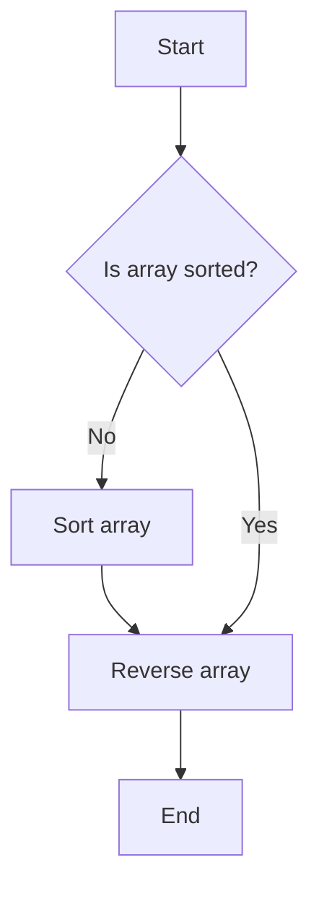

## 9.7 Sorting and Reversing Arrays

Arrays are a fundamental part of JavaScript programming, allowing us to store and manipulate collections of data. In this section, we will explore two essential operations you can perform on arrays: sorting and reversing. By the end of this guide, you'll be equipped with the knowledge to sort arrays in various ways and reverse their order, enhancing your ability to manage data effectively.

### Understanding Array Sorting with `sort()`

The `sort()` method is a built-in JavaScript function that allows us to sort the elements of an array. By default, `sort()` sorts the elements as strings in ascending order. Let's start by examining how this works with a simple example.

```javascript
// Example of sorting an array of strings
let fruits = ['banana', 'apple', 'cherry', 'date'];
fruits.sort();
console.log(fruits); // Output: ['apple', 'banana', 'cherry', 'date']
```

#### Sorting Numbers: A Common Pitfall

When sorting numbers, the default behavior of `sort()` can lead to unexpected results because it treats numbers as strings.

```javascript
// Example of sorting an array of numbers
let numbers = [40, 100, 1, 5, 25, 10];
numbers.sort();
console.log(numbers); // Output: [1, 10, 100, 25, 40, 5]
```

To sort numbers correctly, we need to provide a custom sort function.

### Custom Sort Functions

A custom sort function allows us to define the sorting logic. The `sort()` method can accept a comparison function that compares two elements, `a` and `b`. This function should return:

- A negative number if `a` should come before `b`.
- Zero if `a` and `b` are equal in terms of sorting order.
- A positive number if `a` should come after `b`.

#### Sorting Numbers Correctly

Let's see how to sort numbers in ascending and descending order using a custom sort function.

```javascript
// Sorting numbers in ascending order
let numbers = [40, 100, 1, 5, 25, 10];
numbers.sort((a, b) => a - b);
console.log(numbers); // Output: [1, 5, 10, 25, 40, 100]

// Sorting numbers in descending order
numbers.sort((a, b) => b - a);
console.log(numbers); // Output: [100, 40, 25, 10, 5, 1]
```

#### Sorting Strings Based on Length

We can also use custom sort functions to sort strings based on their length.

```javascript
// Sorting strings by length
let words = ['banana', 'apple', 'cherry', 'date'];
words.sort((a, b) => a.length - b.length);
console.log(words); // Output: ['date', 'apple', 'banana', 'cherry']
```

### Advanced Sorting Techniques

Custom sort functions can be tailored to handle more complex sorting requirements, such as sorting objects or multi-dimensional arrays.

#### Sorting Objects by Property

Consider an array of objects where each object represents a person with a `name` and `age`. We can sort this array by age.

```javascript
// Sorting objects by age
let people = [
  { name: 'John', age: 30 },
  { name: 'Jane', age: 25 },
  { name: 'Jim', age: 35 }
];

people.sort((a, b) => a.age - b.age);
console.log(people);
// Output: [{ name: 'Jane', age: 25 }, { name: 'John', age: 30 }, { name: 'Jim', age: 35 }]
```

#### Sorting Multi-Dimensional Arrays

For multi-dimensional arrays, we can sort based on the elements of the inner arrays.

```javascript
// Sorting multi-dimensional arrays by the second element
let coordinates = [[1, 2], [3, 1], [2, 3]];
coordinates.sort((a, b) => a[1] - b[1]);
console.log(coordinates); // Output: [[3, 1], [1, 2], [2, 3]]
```

### Reversing Arrays with `reverse()`

The `reverse()` method is used to reverse the order of elements in an array. This method modifies the original array and returns the reversed array.

```javascript
// Example of reversing an array
let numbers = [1, 2, 3, 4, 5];
numbers.reverse();
console.log(numbers); // Output: [5, 4, 3, 2, 1]
```

### Combining `sort()` and `reverse()`

We can combine `sort()` and `reverse()` to achieve specific sorting orders. For instance, to sort an array in descending order, we can first sort it in ascending order and then reverse it.

```javascript
// Sorting an array in descending order using sort() and reverse()
let numbers = [40, 100, 1, 5, 25, 10];
numbers.sort((a, b) => a - b).reverse();
console.log(numbers); // Output: [100, 40, 25, 10, 5, 1]
```

### Practical Examples and Exercises

Let's apply what we've learned with some practical examples and exercises.

#### Example 1: Sorting a List of Students by Name

Suppose we have a list of students and we want to sort them alphabetically by name.

```javascript
// Sorting students by name
let students = ['Charlie', 'Alice', 'Bob'];
students.sort();
console.log(students); // Output: ['Alice', 'Bob', 'Charlie']
```

#### Example 2: Sorting Products by Price

Imagine an array of product objects, each with a `name` and `price`. We want to sort these products by price in ascending order.

```javascript
// Sorting products by price
let products = [
  { name: 'Laptop', price: 1000 },
  { name: 'Phone', price: 500 },
  { name: 'Tablet', price: 750 }
];

products.sort((a, b) => a.price - b.price);
console.log(products);
// Output: [{ name: 'Phone', price: 500 }, { name: 'Tablet', price: 750 }, { name: 'Laptop', price: 1000 }]
```

#### Exercise: Sort and Reverse

Try sorting and then reversing an array of your choice. Experiment with different data types and custom sort functions.

### Visualizing Sorting and Reversing

To better understand how sorting and reversing work, let's visualize these processes using a flowchart.



**Caption:** This flowchart illustrates the process of sorting an array and then reversing it.

### Key Takeaways

- The `sort()` method sorts array elements as strings by default. Use custom sort functions for numerical or complex sorting.
- The `reverse()` method reverses the order of elements in an array.
- Combining `sort()` and `reverse()` can achieve specific sorting orders.
- Custom sort functions allow for sorting based on specific criteria, such as object properties or string lengths.

### Further Reading

For more information on array methods, check out the following resources:

- [MDN Web Docs: Array.prototype.sort()](https://developer.mozilla.org/en-US/docs/Web/JavaScript/Reference/Global_Objects/Array/sort)
- [MDN Web Docs: Array.prototype.reverse()](https://developer.mozilla.org/en-US/docs/Web/JavaScript/Reference/Global_Objects/Array/reverse)

### Try It Yourself

Experiment with sorting and reversing arrays. Modify the examples to sort by different criteria or reverse arrays of different data types. Practice makes perfect!

## Quiz Time!



### What does the `sort()` method do by default?

- [x] Sorts array elements as strings in ascending order
- [ ] Sorts array elements as numbers in descending order
- [ ] Sorts array elements as numbers in ascending order
- [ ] Sorts array elements as strings in descending order

> **Explanation:** By default, the `sort()` method sorts array elements as strings in ascending order.

### How can you sort numbers in ascending order using `sort()`?

- [x] Use a custom sort function: `(a, b) => a - b`
- [ ] Use a custom sort function: `(a, b) => b - a`
- [ ] Use the default `sort()` method
- [ ] Use the `reverse()` method

> **Explanation:** To sort numbers in ascending order, use a custom sort function `(a, b) => a - b`.

### What does the `reverse()` method do?

- [x] Reverses the order of elements in an array
- [ ] Sorts the array in descending order
- [ ] Sorts the array in ascending order
- [ ] Removes the last element of the array

> **Explanation:** The `reverse()` method reverses the order of elements in an array.

### How can you sort an array of objects by a property?

- [x] Use a custom sort function: `(a, b) => a.property - b.property`
- [ ] Use the default `sort()` method
- [ ] Use the `reverse()` method
- [ ] Use a custom sort function: `(a, b) => b.property - a.property`

> **Explanation:** To sort an array of objects by a property, use a custom sort function `(a, b) => a.property - b.property`.

### What will `numbers.sort((a, b) => b - a)` do?

- [x] Sort numbers in descending order
- [ ] Sort numbers in ascending order
- [ ] Reverse the array
- [ ] Remove duplicates from the array

> **Explanation:** The custom sort function `(a, b) => b - a` sorts numbers in descending order.

### Which method would you use to reverse an array?

- [x] `reverse()`
- [ ] `sort()`
- [ ] `splice()`
- [ ] `concat()`

> **Explanation:** The `reverse()` method is used to reverse the order of elements in an array.

### How do you sort strings by length?

- [x] Use a custom sort function: `(a, b) => a.length - b.length`
- [ ] Use the default `sort()` method
- [ ] Use the `reverse()` method
- [ ] Use a custom sort function: `(a, b) => b.length - a.length`

> **Explanation:** To sort strings by length, use a custom sort function `(a, b) => a.length - b.length`.

### What does `numbers.sort().reverse()` do?

- [x] Sorts the array in ascending order and then reverses it
- [ ] Sorts the array in descending order
- [ ] Only reverses the array
- [ ] Removes duplicates from the array

> **Explanation:** `numbers.sort().reverse()` sorts the array in ascending order and then reverses it.

### Which of the following is true about the `sort()` method?

- [x] It modifies the original array
- [ ] It returns a new array
- [ ] It only works with strings
- [ ] It cannot be used with custom sort functions

> **Explanation:** The `sort()` method modifies the original array.

### True or False: The `reverse()` method can be used to sort an array.

- [ ] True
- [x] False

> **Explanation:** The `reverse()` method only reverses the order of elements in an array; it does not sort them.


