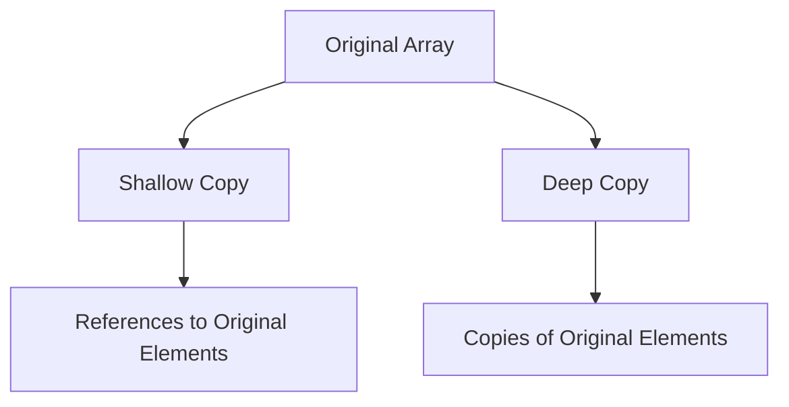

## 9.8 Copying Arrays

Arrays are a fundamental data structure in JavaScript, allowing us to store and manipulate collections of data. As we work with arrays, we often need to copy them to preserve the original data or to manipulate the copy without affecting the original. In this section, we'll explore how to copy arrays in JavaScript, focusing on both shallow and deep copy techniques. We'll also discuss the differences between these methods and provide examples to illustrate their use.

### Understanding Shallow Copies

A shallow copy of an array is a new array that contains references to the same elements as the original array. If the elements are primitive values (like numbers or strings), the shallow copy will have its own copy of those values. However, if the elements are objects or other arrays, the shallow copy will only contain references to those objects or arrays, not copies of them.

#### Using `slice()` for Shallow Copies

The `slice()` method is a built-in JavaScript function that returns a shallow copy of a portion of an array into a new array object. It does not modify the original array. Let's see how it works:

```javascript
// Original array
const originalArray = [1, 2, 3, 4, 5];

// Shallow copy using slice()
const shallowCopy = originalArray.slice();

console.log(shallowCopy); // Output: [1, 2, 3, 4, 5]

// Modifying the shallow copy
shallowCopy[0] = 10;

console.log(originalArray); // Output: [1, 2, 3, 4, 5]
console.log(shallowCopy);   // Output: [10, 2, 3, 4, 5]
```

In this example, the `slice()` method creates a shallow copy of `originalArray`. When we modify the `shallowCopy`, the `originalArray` remains unchanged, demonstrating that the copy is independent for primitive values.

#### Using the Spread Operator `[...array]`

The spread operator (`...`) is another way to create a shallow copy of an array. It expands the elements of an array into a list of elements. Here's how you can use it:

```javascript
// Original array
const originalArray = [1, 2, 3, 4, 5];

// Shallow copy using spread operator
const shallowCopy = [...originalArray];

console.log(shallowCopy); // Output: [1, 2, 3, 4, 5]

// Modifying the shallow copy
shallowCopy[0] = 10;

console.log(originalArray); // Output: [1, 2, 3, 4, 5]
console.log(shallowCopy);   // Output: [10, 2, 3, 4, 5]
```

The spread operator provides a concise and modern way to create shallow copies of arrays, especially when working with ES6 and beyond.

### Shallow Copy Limitations

While shallow copies work well for arrays containing primitive values, they have limitations when dealing with nested arrays or objects. Let's explore this with an example:

```javascript
// Original array with nested objects
const originalArray = [{ a: 1 }, { b: 2 }, { c: 3 }];

// Shallow copy using slice()
const shallowCopy = originalArray.slice();

// Modifying a nested object in the shallow copy
shallowCopy[0].a = 10;

console.log(originalArray); // Output: [{ a: 10 }, { b: 2 }, { c: 3 }]
console.log(shallowCopy);   // Output: [{ a: 10 }, { b: 2 }, { c: 3 }]
```

In this case, both `originalArray` and `shallowCopy` reflect the change because the shallow copy only copies references to the nested objects, not the objects themselves.

### Deep Copying Arrays

A deep copy of an array creates a new array with copies of all the elements, including nested objects or arrays. This ensures that changes to the copied array do not affect the original array. Deep copying is more complex than shallow copying, but it's essential when working with nested structures.

#### Using JSON Methods for Deep Copying

One common method for deep copying arrays is to use JSON serialization and deserialization. This method works well for arrays containing serializable data (i.e., data that can be converted to JSON):

```javascript
// Original array with nested objects
const originalArray = [{ a: 1 }, { b: 2 }, { c: 3 }];

// Deep copy using JSON methods
const deepCopy = JSON.parse(JSON.stringify(originalArray));

// Modifying a nested object in the deep copy
deepCopy[0].a = 10;

console.log(originalArray); // Output: [{ a: 1 }, { b: 2 }, { c: 3 }]
console.log(deepCopy);      // Output: [{ a: 10 }, { b: 2 }, { c: 3 }]
```

In this example, the `JSON.stringify()` method converts the array to a JSON string, and `JSON.parse()` converts it back to a new array, effectively creating a deep copy.

#### Limitations of JSON Methods

While JSON methods are convenient, they have limitations:

- **Non-Serializable Data**: Functions, `undefined`, and other non-serializable data types cannot be copied using JSON methods.
- **Loss of Special Object Types**: Dates, `Map`, `Set`, and other special object types are not preserved when using JSON methods.

#### Custom Deep Copy Functions

For more complex data structures, you may need to implement a custom deep copy function. Here's a simple example:

```javascript
function deepCopyArray(arr) {
    return arr.map(item => {
        if (Array.isArray(item)) {
            return deepCopyArray(item);
        } else if (item && typeof item === 'object') {
            return deepCopyObject(item);
        } else {
            return item;
        }
    });
}

function deepCopyObject(obj) {
    const copy = {};
    for (let key in obj) {
        if (obj.hasOwnProperty(key)) {
            if (Array.isArray(obj[key])) {
                copy[key] = deepCopyArray(obj[key]);
            } else if (obj[key] && typeof obj[key] === 'object') {
                copy[key] = deepCopyObject(obj[key]);
            } else {
                copy[key] = obj[key];
            }
        }
    }
    return copy;
}

// Original array with nested objects and arrays
const originalArray = [{ a: 1, b: [2, 3] }, { c: 4 }];

// Deep copy using custom function
const deepCopy = deepCopyArray(originalArray);

// Modifying a nested object in the deep copy
deepCopy[0].b[0] = 10;

console.log(originalArray); // Output: [{ a: 1, b: [2, 3] }, { c: 4 }]
console.log(deepCopy);      // Output: [{ a: 1, b: [10, 3] }, { c: 4 }]
```

This custom function recursively copies arrays and objects, ensuring a true deep copy.

### Visualizing Shallow vs. Deep Copies

To better understand the differences between shallow and deep copies, let's visualize the concept using a diagram.



**Diagram Explanation**: 
- The original array is represented by node A.
- The shallow copy (node B) contains references to the original elements (node D).
- The deep copy (node C) contains copies of the original elements (node E).

### Try It Yourself

Now that we've explored both shallow and deep copying techniques, let's try modifying the examples to reinforce your understanding:

1. **Experiment with Nested Arrays**: Create an array with nested arrays and try copying it using both shallow and deep copy methods. Observe the differences in behavior.

2. **Test with Different Data Types**: Include different data types, such as functions and `undefined`, in your arrays to see how JSON methods handle them.

3. **Implement Custom Copy Functions**: Write your own custom deep copy function and test it with complex data structures.

### Key Takeaways

- **Shallow Copies**: Use `slice()` or the spread operator (`...`) for shallow copies. They work well for arrays with primitive values but only copy references for nested objects or arrays.
- **Deep Copies**: Use JSON methods for simple, serializable data. For more complex structures, consider writing custom deep copy functions.
- **Understand Limitations**: Be aware of the limitations of each method, especially when dealing with non-serializable data or special object types.

### Further Reading

For more information on array copying techniques, consider exploring the following resources:

- [MDN Web Docs: Array.prototype.slice()](https://developer.mozilla.org/en-US/docs/Web/JavaScript/Reference/Global_Objects/Array/slice)
- [MDN Web Docs: Spread syntax](https://developer.mozilla.org/en-US/docs/Web/JavaScript/Reference/Operators/Spread_syntax)
- [MDN Web Docs: JSON](https://developer.mozilla.org/en-US/docs/Web/JavaScript/Reference/Global_Objects/JSON)

## Quiz Time!



### Which method creates a shallow copy of an array?

- [x] `slice()`
- [ ] `JSON.parse()`
- [ ] `deepCopyObject()`
- [ ] `JSON.stringify()`

> **Explanation:** The `slice()` method creates a shallow copy of an array by copying references to the elements.

### What does the spread operator (`...`) do when used with arrays?

- [x] Creates a shallow copy of the array
- [ ] Creates a deep copy of the array
- [ ] Modifies the original array
- [ ] Deletes elements from the array

> **Explanation:** The spread operator (`...`) creates a shallow copy of the array by expanding its elements into a new array.

### What is a limitation of using JSON methods for deep copying?

- [x] Non-serializable data cannot be copied
- [ ] It modifies the original array
- [ ] It creates a shallow copy
- [ ] It requires a custom function

> **Explanation:** JSON methods cannot copy non-serializable data, such as functions or `undefined`.

### Which of the following is a deep copy technique?

- [ ] `slice()`
- [ ] Spread operator
- [x] `JSON.parse(JSON.stringify())`
- [ ] `Array.prototype.map()`

> **Explanation:** `JSON.parse(JSON.stringify())` is a common technique for creating deep copies of arrays.

### Why might you need a custom deep copy function?

- [x] To handle complex data structures
- [ ] To modify the original array
- [ ] To create shallow copies
- [ ] To delete elements from the array

> **Explanation:** Custom deep copy functions are useful for handling complex data structures that JSON methods cannot copy.

### What happens when you modify a nested object in a shallow copy?

- [ ] The original array is unaffected
- [x] The original array is also modified
- [ ] The shallow copy is deleted
- [ ] A deep copy is created

> **Explanation:** Modifying a nested object in a shallow copy affects the original array because the shallow copy only contains references.

### Which method is NOT suitable for copying arrays with functions?

- [x] `JSON.parse(JSON.stringify())`
- [ ] `slice()`
- [ ] Spread operator
- [ ] Custom deep copy function

> **Explanation:** `JSON.parse(JSON.stringify())` cannot copy functions, as they are non-serializable.

### What is the output of `console.log([...originalArray])` if `originalArray` is `[1, 2, 3]`?

- [x] `[1, 2, 3]`
- [ ] `[1, 2]`
- [ ] `[1, 2, 3, 4]`
- [ ] `[]`

> **Explanation:** The spread operator creates a shallow copy of `originalArray`, resulting in `[1, 2, 3]`.

### Which of the following is true about shallow copies?

- [x] They copy references to nested objects
- [ ] They create independent copies of nested objects
- [ ] They modify the original array
- [ ] They require custom functions

> **Explanation:** Shallow copies only copy references to nested objects, not the objects themselves.

### True or False: A deep copy ensures that changes to the copied array do not affect the original array.

- [x] True
- [ ] False

> **Explanation:** A deep copy creates independent copies of all elements, ensuring changes to the copied array do not affect the original array.


