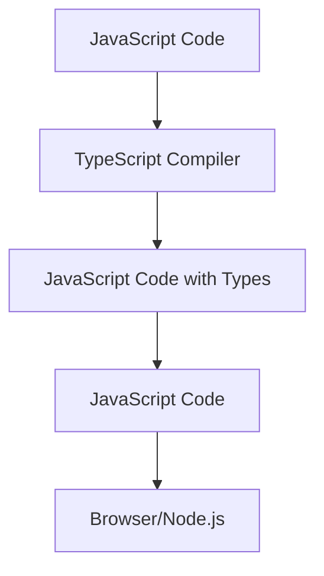

## 1.1 What is TypeScript?

### A Brief History of TypeScript

TypeScript is a programming language developed and maintained by Microsoft. It was first introduced to the world in October 2012 by Anders Hejlsberg, a prominent figure in the software development community, known for his work on C#. TypeScript was created to address some of the challenges developers face when working with JavaScript, especially as applications grow larger and more complex.

JavaScript, originally designed for adding interactivity to web pages, has evolved significantly over the years. However, as developers began building larger applications, they encountered limitations with JavaScript's dynamic typing system. TypeScript was introduced as a solution to these limitations, providing a way to write more robust and maintainable code.

### The Problems TypeScript Aims to Solve

JavaScript is a versatile and powerful language, but its dynamic nature can lead to certain challenges:

1. **Lack of Type Safety**: JavaScript does not enforce type safety, which means variables can change types unexpectedly. This can lead to runtime errors that are difficult to debug and fix.

2. **Scalability Issues**: As JavaScript applications grow, managing and understanding the codebase becomes increasingly difficult. Without static types, developers have to rely on documentation and conventions to understand how data flows through the application.

3. **Tooling Limitations**: JavaScript's dynamic nature limits the effectiveness of tools like code editors and linters. Without type information, these tools struggle to provide accurate code completion, refactoring, and error checking.

TypeScript addresses these issues by introducing static typing to JavaScript. This allows developers to define the types of variables and function parameters, enabling better tooling support and reducing the likelihood of runtime errors.

### TypeScript: A Superset of JavaScript

One of the key aspects of TypeScript is that it is a **superset** of JavaScript. This means that any valid JavaScript code is also valid TypeScript code. TypeScript builds upon JavaScript by adding additional features, most notably static types, but it does not remove or alter any existing JavaScript functionality.

This relationship between TypeScript and JavaScript allows developers to gradually adopt TypeScript in their projects. You can start by writing plain JavaScript and then incrementally add type annotations and other TypeScript features as needed.

### Basic TypeScript vs. JavaScript Code

Let's look at a simple example to illustrate the difference between JavaScript and TypeScript:

#### JavaScript Example

```javascript
function greet(name) {
    return "Hello, " + name;
}

console.log(greet("World"));
```

In this JavaScript code, the `greet` function takes a parameter `name` and returns a greeting message. However, there's no indication of what type `name` should be. This can lead to potential errors if `name` is not a string.

#### TypeScript Example

```typescript
function greet(name: string): string {
    return "Hello, " + name;
}

console.log(greet("World"));
```

In the TypeScript version, we specify that `name` is a `string` and that the function returns a `string`. This provides additional safety, as TypeScript will check that `name` is indeed a string and that the function returns the correct type.

### How TypeScript Enhances JavaScript

TypeScript enhances JavaScript in several ways:

- **Static Typing**: By allowing developers to specify types, TypeScript helps catch errors at compile time rather than at runtime. This leads to more reliable and maintainable code.

- **Enhanced Tooling**: With type information, code editors can provide better autocompletion, navigation, and refactoring tools. This improves developer productivity and reduces the likelihood of errors.

- **Improved Collaboration**: In large teams, having a clear understanding of data types and structures makes it easier for developers to collaborate and understand each other's code.

- **Modern JavaScript Features**: TypeScript supports all the latest JavaScript features, such as async/await, modules, and destructuring, making it a future-proof choice for modern web development.

### Try It Yourself

To get a feel for TypeScript, try modifying the example code. What happens if you change the type of `name` to `number`? How does TypeScript respond? Experimenting with these changes will help you understand the benefits of static typing.

### Visualizing TypeScript's Role

Let's use a diagram to visualize how TypeScript fits into the JavaScript ecosystem:



**Diagram Explanation**: This flowchart shows how TypeScript code is compiled into JavaScript. The TypeScript compiler takes TypeScript code (JavaScript with types) and produces plain JavaScript code that can be executed in any JavaScript environment, such as a browser or Node.js.

### Key Takeaways

- TypeScript is a superset of JavaScript, adding static typing to enhance code quality and maintainability.
- It was created by Microsoft to address challenges in large-scale JavaScript development.
- TypeScript provides better tooling, error checking, and collaboration capabilities.
- You can gradually adopt TypeScript in your projects, as it is fully compatible with JavaScript.

### Further Reading

To deepen your understanding of TypeScript, consider exploring the following resources:

- [TypeScript Official Documentation](https://www.typescriptlang.org/docs/)
- [MDN Web Docs on JavaScript](https://developer.mozilla.org/en-US/docs/Web/JavaScript)
- [TypeScript Handbook](https://www.typescriptlang.org/docs/handbook/intro.html)

## Quiz Time!



### What is TypeScript?

- [x] A superset of JavaScript that adds static typing
- [ ] A replacement for JavaScript
- [ ] A database management system
- [ ] A CSS framework

> **Explanation:** TypeScript is a superset of JavaScript, meaning it builds upon JavaScript by adding static typing and other features.

### Who developed TypeScript?

- [x] Microsoft
- [ ] Google
- [ ] Facebook
- [ ] Apple

> **Explanation:** TypeScript was developed by Microsoft and first released in 2012.

### What problem does TypeScript aim to solve?

- [x] Lack of type safety in JavaScript
- [ ] Slow performance of JavaScript
- [ ] Limited browser support for JavaScript
- [ ] Lack of JavaScript frameworks

> **Explanation:** TypeScript addresses the lack of type safety in JavaScript, helping to catch errors at compile time.

### How does TypeScript relate to JavaScript?

- [x] TypeScript is a superset of JavaScript
- [ ] TypeScript is a subset of JavaScript
- [ ] TypeScript is unrelated to JavaScript
- [ ] TypeScript replaces JavaScript

> **Explanation:** TypeScript is a superset of JavaScript, meaning it includes all JavaScript features and adds additional capabilities.

### What is a key feature of TypeScript?

- [x] Static typing
- [ ] Dynamic typing
- [ ] No typing
- [ ] Automatic code generation

> **Explanation:** Static typing is a key feature of TypeScript, allowing developers to specify types for variables and function parameters.

### What does the TypeScript compiler do?

- [x] Converts TypeScript code into JavaScript
- [ ] Converts JavaScript code into TypeScript
- [ ] Compiles JavaScript into machine code
- [ ] Translates JavaScript into other languages

> **Explanation:** The TypeScript compiler converts TypeScript code into plain JavaScript code that can be executed in any JavaScript environment.

### Can you use JavaScript code in a TypeScript file?

- [x] Yes
- [ ] No

> **Explanation:** Since TypeScript is a superset of JavaScript, any valid JavaScript code is also valid TypeScript code.

### What is an advantage of using TypeScript?

- [x] Improved code quality and maintainability
- [ ] Increased code size
- [ ] Slower development process
- [ ] Limited browser compatibility

> **Explanation:** TypeScript improves code quality and maintainability by providing static typing and better tooling support.

### How can you gradually adopt TypeScript in a project?

- [x] Start with JavaScript and incrementally add TypeScript features
- [ ] Rewrite the entire codebase in TypeScript
- [ ] Use TypeScript only for new projects
- [ ] Avoid using JavaScript altogether

> **Explanation:** You can gradually adopt TypeScript by starting with JavaScript and incrementally adding type annotations and other TypeScript features.

### True or False: TypeScript is only for large projects.

- [ ] True
- [x] False

> **Explanation:** TypeScript can be used for projects of any size, providing benefits such as static typing and improved tooling even in small projects.



By understanding what TypeScript is and how it enhances JavaScript, you're taking the first step towards writing more robust and maintainable code. As we continue through this guide, we'll explore more of TypeScript's features and how they can benefit your development process.
