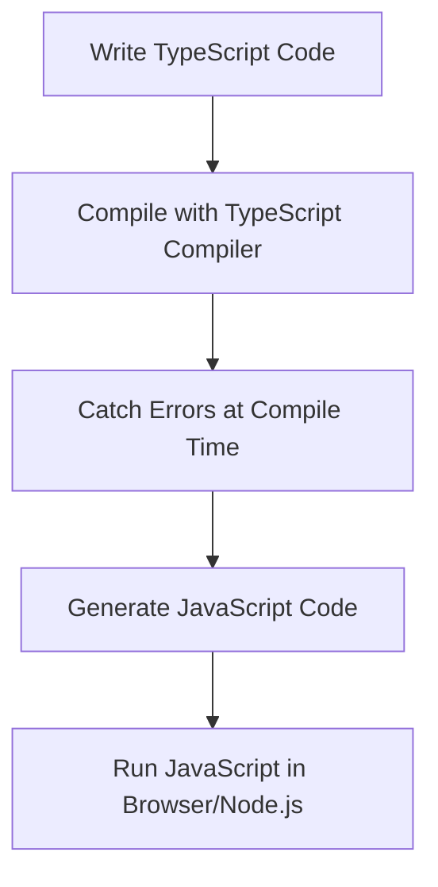

## 1.2 Advantages of Using TypeScript

As we embark on our journey to learn TypeScript, it's essential to understand why this language has gained such popularity among developers worldwide. TypeScript, a superset of JavaScript, brings several advantages to the table, making it an invaluable tool for modern web development. In this section, we will explore the key benefits of using TypeScript, including type safety, early error detection, enhanced tooling, and improved collaboration on large codebases. Let's dive in!

### Type Safety: A Shield Against Errors

One of the most significant advantages of TypeScript is its ability to provide type safety. In JavaScript, variables can hold any type of value, which can lead to unexpected behavior and runtime errors. TypeScript introduces static typing, allowing developers to define specific types for variables, function parameters, and return values. This feature acts as a shield, preventing many common errors before the code even runs.

#### Example: Catching Type Errors

Consider the following JavaScript code:

```javascript
function add(a, b) {
    return a + b;
}

console.log(add(5, "10")); // Outputs: 510
```

In this example, the `add` function is intended to add two numbers. However, due to JavaScript's dynamic typing, passing a string results in concatenation instead of addition. TypeScript helps us catch such errors at compile time:

```typescript
function add(a: number, b: number): number {
    return a + b;
}

// This line will cause a compile-time error
console.log(add(5, "10")); // Error: Argument of type 'string' is not assignable to parameter of type 'number'.
```

By specifying the types of `a` and `b`, TypeScript ensures that only numbers are passed to the `add` function, preventing unintended behavior.

### Early Error Detection: Fix Issues Before They Arise

TypeScript's static type checking allows developers to detect errors early in the development process. This early error detection is crucial for maintaining code quality and reducing debugging time. By catching errors at compile time, TypeScript saves developers from encountering runtime errors that can be more challenging to diagnose and fix.

#### Example: Detecting Null or Undefined Values

In JavaScript, accessing properties of `null` or `undefined` can lead to runtime errors. TypeScript helps prevent these issues by enforcing strict null checks:

```typescript
interface User {
    name: string;
    age?: number;
}

function greet(user: User) {
    console.log(`Hello, ${user.name}!`);
    // This line will cause a compile-time error if age is not checked
    console.log(`You are ${user.age.toFixed(2)} years old.`);
}
```

In this example, TypeScript warns us that `user.age` might be `undefined`, prompting us to handle this case explicitly:

```typescript
function greet(user: User) {
    console.log(`Hello, ${user.name}!`);
    if (user.age !== undefined) {
        console.log(`You are ${user.age.toFixed(2)} years old.`);
    }
}
```

### Enhanced Tooling: Boosting Developer Productivity

TypeScript's integration with modern Integrated Development Environments (IDEs) significantly enhances developer productivity. IDEs like Visual Studio Code provide features such as autocompletion, code navigation, and refactoring tools that are powered by TypeScript's type system.

#### Example: Autocompletion and Code Navigation

TypeScript's type annotations enable IDEs to offer intelligent autocompletion and code navigation. For instance, when working with a complex object, TypeScript helps you explore available properties and methods:

```typescript
interface Car {
    make: string;
    model: string;
    year: number;
    start(): void;
}

const myCar: Car = {
    make: "Toyota",
    model: "Corolla",
    year: 2020,
    start() {
        console.log("Car started");
    }
};

// IDE provides autocompletion for myCar properties and methods
myCar.start();
```

With TypeScript, you can easily navigate to the definition of `Car` and explore its properties and methods, making it easier to understand and work with complex codebases.

### Better Collaboration: Facilitating Teamwork on Large Codebases

TypeScript's static typing and clear type definitions improve collaboration among team members, especially in large codebases. By providing a common understanding of data structures and function signatures, TypeScript reduces misunderstandings and miscommunications.

#### Example: Consistent Function Signatures

In a team setting, consistent function signatures ensure that everyone understands how to use a function correctly:

```typescript
function calculateTotal(price: number, quantity: number, discount: number = 0): number {
    return (price * quantity) * (1 - discount);
}
```

With TypeScript, every team member knows the expected types for `price`, `quantity`, and `discount`, reducing the likelihood of errors and improving code readability.

### Code Maintainability and Scalability: Building for the Future

TypeScript's type system and tooling support make it easier to maintain and scale codebases. As projects grow, TypeScript helps manage complexity by providing clear interfaces and contracts between different parts of the code.

#### Example: Using Interfaces for Clear Contracts

Interfaces in TypeScript define the shape of objects, providing a clear contract for developers:

```typescript
interface Product {
    id: number;
    name: string;
    price: number;
    applyDiscount(discount: number): number;
}

class StoreProduct implements Product {
    constructor(public id: number, public name: string, public price: number) {}

    applyDiscount(discount: number): number {
        return this.price * (1 - discount);
    }
}
```

By using interfaces, you ensure that `StoreProduct` adheres to the `Product` contract, making it easier to refactor and extend the codebase without introducing errors.

### Testimonials: What Developers Say About TypeScript

Many developers and organizations have embraced TypeScript for its numerous benefits. Here are a few testimonials:

- **Anders Hejlsberg**, Lead Architect of TypeScript: "TypeScript is like a safety net. It catches errors before they become bugs, allowing developers to focus on building features rather than fixing issues."

- **Sarah Drasner**, VP of Developer Experience at Netlify: "TypeScript has transformed the way we write JavaScript. It provides the confidence to refactor and improve code without fear of breaking things."

- **Microsoft**, Creator of TypeScript: "TypeScript helps teams build robust applications at scale. Its type system and tooling support make it an ideal choice for large projects."

### Try It Yourself: Experiment with TypeScript

To truly appreciate the advantages of TypeScript, try experimenting with the code examples provided. Modify the types and observe how TypeScript catches errors at compile time. For instance, try changing the type of a variable or function parameter and see how TypeScript responds.

### Visual Aid: TypeScript Workflow

To better understand how TypeScript fits into the development workflow, let's visualize the process:



This diagram illustrates how TypeScript code is written, compiled, and transformed into JavaScript, with errors caught during the compilation process.

### Key Takeaways

- **Type Safety**: TypeScript provides static typing, reducing runtime errors and improving code quality.
- **Early Error Detection**: Catch errors at compile time, saving time and effort in debugging.
- **Enhanced Tooling**: Benefit from superior IDE support, including autocompletion and code navigation.
- **Better Collaboration**: Improve teamwork with clear type definitions and consistent function signatures.
- **Code Maintainability and Scalability**: Build scalable applications with clear interfaces and contracts.

### Additional Resources

- [TypeScript Official Documentation](https://www.typescriptlang.org/docs/)
- [MDN Web Docs on TypeScript](https://developer.mozilla.org/en-US/docs/Web/JavaScript/Reference/Global_Objects/TypeError)
- [Visual Studio Code](https://code.visualstudio.com/) - A popular IDE with excellent TypeScript support.

## Quiz Time!



### What is one of the primary advantages of using TypeScript?

- [x] Type safety
- [ ] Dynamic typing
- [ ] Lack of tooling
- [ ] No error detection

> **Explanation:** TypeScript provides type safety, which helps prevent errors by enforcing specific types for variables and functions.

### How does TypeScript help in early error detection?

- [x] By catching errors at compile time
- [ ] By running code faster
- [ ] By providing dynamic typing
- [ ] By reducing code size

> **Explanation:** TypeScript catches errors at compile time, allowing developers to fix issues before running the code.

### What feature of TypeScript enhances developer productivity?

- [x] Enhanced tooling and IDE support
- [ ] Lack of documentation
- [ ] Dynamic typing
- [ ] Manual code navigation

> **Explanation:** TypeScript's integration with IDEs provides features like autocompletion and code navigation, boosting productivity.

### How does TypeScript improve collaboration in large codebases?

- [x] By providing clear type definitions
- [ ] By removing all comments
- [ ] By using dynamic typing
- [ ] By reducing code readability

> **Explanation:** TypeScript's static typing and clear type definitions improve collaboration by reducing misunderstandings.

### What is an example of TypeScript's type safety?

- [x] Specifying types for function parameters
- [ ] Allowing any type for variables
- [ ] Ignoring null or undefined values
- [ ] Removing all type annotations

> **Explanation:** TypeScript allows developers to specify types for function parameters, ensuring correct usage.

### How does TypeScript aid in code maintainability?

- [x] By providing clear interfaces and contracts
- [ ] By removing all documentation
- [ ] By using dynamic typing
- [ ] By reducing code readability

> **Explanation:** TypeScript's interfaces and contracts help manage complexity and maintain codebases as projects grow.

### What is a benefit of using interfaces in TypeScript?

- [x] Defining the shape of objects
- [ ] Allowing any type for variables
- [ ] Ignoring null or undefined values
- [ ] Removing all type annotations

> **Explanation:** Interfaces in TypeScript define the shape of objects, providing a clear contract for developers.

### How does TypeScript handle null or undefined values?

- [x] By enforcing strict null checks
- [ ] By ignoring them
- [ ] By allowing any type
- [ ] By removing all type annotations

> **Explanation:** TypeScript enforces strict null checks, prompting developers to handle null or undefined values explicitly.

### What is a testimonial from a developer about TypeScript?

- [x] "TypeScript is like a safety net."
- [ ] "TypeScript removes all errors."
- [ ] "TypeScript is only for small projects."
- [ ] "TypeScript has no benefits."

> **Explanation:** Developers often describe TypeScript as a safety net, catching errors before they become bugs.

### True or False: TypeScript helps in building scalable applications.

- [x] True
- [ ] False

> **Explanation:** TypeScript's type system and tooling support make it easier to build scalable applications.


