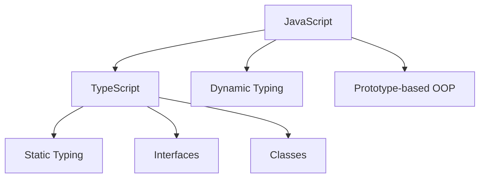

## 1.3 Comparing TypeScript and JavaScript

As we embark on our journey to understand TypeScript, it's essential to appreciate how it builds upon JavaScript, the language it extends. Both TypeScript and JavaScript are powerful tools for web development, but they offer different features and capabilities. In this section, we'll examine the key differences and similarities between these two languages, understand how TypeScript enhances JavaScript, and clarify some common misconceptions.

### Understanding JavaScript: The Foundation

JavaScript is a high-level, dynamic programming language that is widely used for web development. It allows developers to create interactive and dynamic web pages. JavaScript is known for its flexibility, but this flexibility can sometimes lead to errors that are only caught at runtime.

### Introducing TypeScript: The Extension

TypeScript is a superset of JavaScript, meaning it builds upon JavaScript by adding new features. The most significant addition is static typing, which allows developers to define the types of variables and function parameters. This can help catch errors early in the development process, leading to more robust and maintainable code.

### Side-by-Side Comparison

To better understand the differences and similarities, let's look at a side-by-side comparison of some key aspects of TypeScript and JavaScript:

| Feature                  | JavaScript                                      | TypeScript                                        |
|--------------------------|-------------------------------------------------|---------------------------------------------------|
| **Typing**               | Dynamic typing                                  | Static typing (optional)                          |
| **Compilation**          | Interpreted directly by browsers                | Compiled to JavaScript                            |
| **Syntax**               | Flexible, less strict                           | Adds strictness with types and interfaces         |
| **Error Checking**       | Errors caught at runtime                        | Errors caught at compile-time                     |
| **Tooling Support**      | Good, but less type-aware                       | Excellent, with powerful type-aware tools         |
| **Community**            | Large, well-established                         | Growing rapidly, with strong support              |
| **Backward Compatibility**| Fully backward compatible                      | Fully backward compatible with JavaScript         |

### Syntax Differences

Let's explore some syntax differences between JavaScript and TypeScript with code examples.

#### JavaScript Example

```javascript
// JavaScript function to add two numbers
function add(a, b) {
    return a + b;
}

console.log(add(5, 10)); // Output: 15
```

#### TypeScript Example

```typescript
// TypeScript function with type annotations
function add(a: number, b: number): number {
    return a + b;
}

console.log(add(5, 10)); // Output: 15
```

**Key Differences:**

- **Type Annotations**: In TypeScript, we specify the types of `a` and `b` as `number`. This helps catch errors if we accidentally pass a non-number argument.
- **Compile-Time Checking**: TypeScript will check the types at compile-time, reducing runtime errors.

### Compatibility and Transpilation

One of the great strengths of TypeScript is its compatibility with JavaScript. TypeScript code is transpiled into JavaScript, which means it can run in any environment that supports JavaScript. This transpilation process involves converting TypeScript code into standard JavaScript code.

#### TypeScript Transpilation Process

```mermaid
graph TD;
    A[TypeScript Code] --> B[TypeScript Compiler (tsc)];
    B --> C[JavaScript Code];
    C --> D[Browser/Node.js];
```

- **TypeScript Code**: Write your code in TypeScript with type annotations and other TypeScript-specific features.
- **TypeScript Compiler (tsc)**: Use the TypeScript compiler to transpile your TypeScript code into JavaScript.
- **JavaScript Code**: The output is standard JavaScript code that can run in any JavaScript environment.
- **Browser/Node.js**: The JavaScript code is executed in the browser or Node.js.

### Common Misconceptions

#### Misconception 1: TypeScript Replaces JavaScript

**Reality**: TypeScript does not replace JavaScript. Instead, it enhances JavaScript by adding features like static typing, interfaces, and classes. TypeScript is designed to be fully compatible with JavaScript, allowing developers to gradually adopt it in their projects.

#### Misconception 2: You Must Use TypeScript for All Projects

**Reality**: While TypeScript offers many benefits, it's not mandatory for all projects. Developers can choose to use TypeScript based on the project's needs, team preferences, and other factors. JavaScript remains a powerful and widely-used language.

#### Misconception 3: TypeScript is Difficult to Learn

**Reality**: If you are familiar with JavaScript, learning TypeScript is relatively straightforward. TypeScript builds upon JavaScript fundamentals, so your existing knowledge will be valuable. The additional features of TypeScript, such as static typing, can be learned incrementally.

### Importance of JavaScript Fundamentals

Before diving into TypeScript, it's crucial to have a solid understanding of JavaScript fundamentals. TypeScript is built on top of JavaScript, so knowledge of JavaScript will help you grasp TypeScript concepts more easily. Here are some key JavaScript concepts to review:

- **Variables and Data Types**: Understanding how to declare and use variables.
- **Functions**: Knowing how to define and call functions.
- **Control Structures**: Using loops and conditional statements.
- **Objects and Arrays**: Working with objects and arrays to store and manipulate data.

### Try It Yourself

To get hands-on experience, try modifying the TypeScript code example provided earlier. Change the types of the parameters to `string` and see how TypeScript responds. This will help you understand the importance of type annotations and compile-time checking.

```typescript
// Try changing the types to string
function add(a: string, b: string): string {
    return a + b;
}

console.log(add("Hello, ", "World!")); // Output: Hello, World!
```

### Visual Aids

To further illustrate the relationship between TypeScript and JavaScript, let's look at a diagram showing how TypeScript builds upon JavaScript:



- **JavaScript**: The foundation with dynamic typing and prototype-based object-oriented programming (OOP).
- **TypeScript**: Builds upon JavaScript by adding static typing, interfaces, and classes.

### Further Reading

For more information on JavaScript and TypeScript, consider exploring the following resources:

- [MDN Web Docs: JavaScript](https://developer.mozilla.org/en-US/docs/Web/JavaScript)
- [TypeScript Official Documentation](https://www.typescriptlang.org/docs/)
- [W3Schools JavaScript Tutorial](https://www.w3schools.com/js/)

### Engagement and Reinforcement

To reinforce your understanding, consider these questions:

- What are the main advantages of using TypeScript over JavaScript?
- How does TypeScript improve error checking compared to JavaScript?
- Why is it important to have a solid understanding of JavaScript before learning TypeScript?

### Exercises

1. **Convert a JavaScript Function to TypeScript**: Take a simple JavaScript function and add type annotations to convert it into TypeScript.
2. **Identify Type Errors**: Write a TypeScript function with intentional type errors and see how the TypeScript compiler helps you identify them.

### Key Takeaways

- TypeScript is a superset of JavaScript, adding features like static typing, interfaces, and classes.
- TypeScript code is transpiled into JavaScript, ensuring compatibility with all JavaScript environments.
- Understanding JavaScript fundamentals is essential for learning TypeScript.
- TypeScript enhances JavaScript, but it does not replace it.

By understanding these key differences and similarities, you'll be better equipped to leverage the strengths of both TypeScript and JavaScript in your development projects.

## Quiz Time!



### What is the primary feature that TypeScript adds to JavaScript?

- [x] Static typing
- [ ] Dynamic typing
- [ ] Prototype-based inheritance
- [ ] Asynchronous programming

> **Explanation:** TypeScript adds static typing to JavaScript, allowing developers to define types for variables and function parameters.

### How does TypeScript code become executable in a JavaScript environment?

- [x] It is transpiled into JavaScript
- [ ] It is interpreted directly by browsers
- [ ] It is compiled into machine code
- [ ] It runs in a special TypeScript engine

> **Explanation:** TypeScript code is transpiled into JavaScript, which can then be executed in any JavaScript environment.

### Which of the following is a common misconception about TypeScript?

- [x] TypeScript replaces JavaScript
- [ ] TypeScript is a superset of JavaScript
- [ ] TypeScript adds static typing
- [ ] TypeScript is compatible with JavaScript

> **Explanation:** A common misconception is that TypeScript replaces JavaScript, but in reality, it enhances JavaScript by adding additional features.

### Why is it important to understand JavaScript before learning TypeScript?

- [x] TypeScript is built on top of JavaScript
- [ ] TypeScript is a completely different language
- [ ] JavaScript is no longer used
- [ ] TypeScript does not require JavaScript knowledge

> **Explanation:** TypeScript is built on top of JavaScript, so understanding JavaScript fundamentals is crucial for learning TypeScript.

### What happens if you pass a non-number argument to a TypeScript function expecting a number?

- [x] A compile-time error occurs
- [ ] A runtime error occurs
- [ ] The function executes without error
- [ ] The argument is automatically converted to a number

> **Explanation:** TypeScript will catch the error at compile-time if a non-number argument is passed to a function expecting a number.

### Which of the following is NOT a feature of TypeScript?

- [x] Dynamic typing
- [ ] Static typing
- [ ] Interfaces
- [ ] Classes

> **Explanation:** TypeScript is known for static typing, not dynamic typing, which is a feature of JavaScript.

### How does TypeScript improve error checking compared to JavaScript?

- [x] By catching errors at compile-time
- [ ] By catching errors at runtime
- [ ] By using dynamic typing
- [ ] By using prototype-based inheritance

> **Explanation:** TypeScript improves error checking by catching errors at compile-time, reducing runtime errors.

### What is the output of the following TypeScript code?

```typescript
function greet(name: string): string {
    return "Hello, " + name;
}

console.log(greet("Alice"));
```

- [x] Hello, Alice
- [ ] Hello, undefined
- [ ] Hello, null
- [ ] Error

> **Explanation:** The function `greet` returns "Hello, " followed by the name, so the output is "Hello, Alice".

### Which tool is used to transpile TypeScript code into JavaScript?

- [x] TypeScript Compiler (tsc)
- [ ] Babel
- [ ] Webpack
- [ ] Node.js

> **Explanation:** The TypeScript Compiler (tsc) is used to transpile TypeScript code into JavaScript.

### True or False: TypeScript is fully backward compatible with JavaScript.

- [x] True
- [ ] False

> **Explanation:** TypeScript is fully backward compatible with JavaScript, allowing developers to use existing JavaScript code in TypeScript projects.


