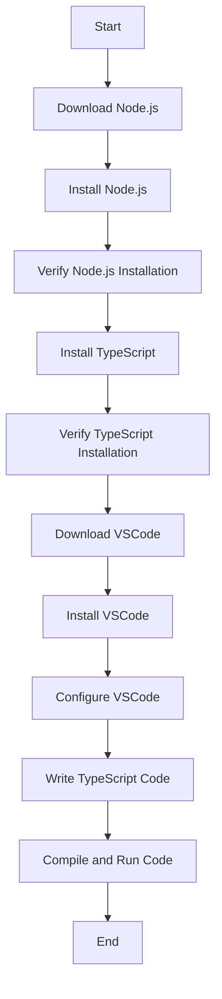

## 1.4 Setting Up the Development Environment

Welcome to your journey into TypeScript! Before we dive into writing TypeScript code, we need to set up a development environment. This involves installing Node.js, TypeScript, and configuring a code editor. Let's walk through this process step-by-step for Windows, macOS, and Linux.

### Why Set Up a Development Environment?

A well-configured development environment is crucial for efficient coding. It provides the tools necessary to write, compile, and debug your TypeScript code. By setting up your environment correctly, you'll ensure a smoother learning experience and be better prepared to tackle real-world projects.

### Step 1: Installing Node.js

Node.js is a JavaScript runtime that allows you to run JavaScript code outside of a web browser. It also includes npm (Node Package Manager), which is essential for installing TypeScript and other packages.

#### Windows Installation

1. **Download Node.js**: Visit the [Node.js official website](https://nodejs.org/) and download the Windows installer. Choose the LTS (Long Term Support) version for stability.

2. **Run the Installer**: Double-click the downloaded `.msi` file to start the installation. Follow the prompts, accepting the license agreement and selecting the default installation options.

3. **Verify Installation**: Open the Command Prompt (search for "cmd" in the Start menu) and run the following commands to verify your installation:

    ```bash
    node -v
    npm -v
    ```

    You should see the installed versions of Node.js and npm.

#### macOS Installation

1. **Download Node.js**: Go to the [Node.js official website](https://nodejs.org/) and download the macOS installer. Again, choose the LTS version.

2. **Run the Installer**: Open the downloaded `.pkg` file and follow the installation instructions.

3. **Verify Installation**: Open Terminal (found in Applications > Utilities) and run:

    ```bash
    node -v
    npm -v
    ```

    This will display the installed versions of Node.js and npm.

#### Linux Installation

For Linux, the installation process varies depending on the distribution. Here, we'll cover Ubuntu as an example.

1. **Update Package Index**: Open Terminal and update your package index:

    ```bash
    sudo apt update
    ```

2. **Install Node.js**: Use the following commands to install Node.js and npm:

    ```bash
    sudo apt install nodejs
    sudo apt install npm
    ```

3. **Verify Installation**: Check the installed versions by running:

    ```bash
    node -v
    npm -v
    ```

### Step 2: Installing TypeScript

With Node.js and npm installed, we can now install TypeScript globally on your system.

#### Global Installation

1. **Open Terminal or Command Prompt**: Depending on your operating system, open the appropriate command line interface.

2. **Install TypeScript**: Run the following command to install TypeScript globally:

    ```bash
    npm install -g typescript
    ```

3. **Verify Installation**: Check the TypeScript version to ensure it's installed correctly:

    ```bash
    tsc -v
    ```

    You should see the TypeScript version number.

### Step 3: Configuring Your Code Editor

A good code editor is essential for writing and managing TypeScript code. We recommend Visual Studio Code (VSCode) due to its powerful features and TypeScript support.

#### Installing Visual Studio Code

1. **Download VSCode**: Visit the [VSCode official website](https://code.visualstudio.com/) and download the installer for your operating system.

2. **Install VSCode**: Run the installer and follow the setup instructions.

3. **Launch VSCode**: Open VSCode after installation.

#### Configuring VSCode for TypeScript

1. **Install TypeScript Extension**: In VSCode, go to the Extensions view by clicking the Extensions icon in the Activity Bar on the side of the window or pressing `Ctrl+Shift+X` (Windows/Linux) or `Cmd+Shift+X` (macOS). Search for "TypeScript" and install the official TypeScript extension.

2. **Install ESLint Extension**: For linting and code quality, install the ESLint extension. This helps catch errors and enforce coding standards.

3. **Configure Settings**: Open the settings by clicking on the gear icon in the lower-left corner and selecting "Settings". Here, you can customize your editor to suit your preferences. For TypeScript, ensure that "Format On Save" is enabled to automatically format your code.

4. **Create a TypeScript Project**: Open a new folder in VSCode and create a new file named `index.ts`. This is where you'll write your TypeScript code.

#### Recommended Extensions for TypeScript Development

- **Prettier - Code formatter**: Automatically formats your code to ensure consistency.
- **Path Intellisense**: Provides autocompletion for file paths.
- **Bracket Pair Colorizer**: Helps with matching brackets by coloring them.

### Step 4: Writing Your First TypeScript Program

Let's write a simple TypeScript program to ensure everything is set up correctly.

1. **Create a New File**: In your project folder, create a file named `hello.ts`.

2. **Write Code**: Add the following code to `hello.ts`:

    ```typescript
    // This is a simple TypeScript program
    function greet(name: string): string {
        return `Hello, ${name}!`;
    }

    console.log(greet("World"));
    ```

3. **Compile TypeScript to JavaScript**: Open the terminal in VSCode (use `Ctrl+` or `Cmd+`) and run:

    ```bash
    tsc hello.ts
    ```

    This will generate a `hello.js` file in the same directory.

4. **Run the JavaScript File**: Execute the compiled JavaScript file using Node.js:

    ```bash
    node hello.js
    ```

    You should see `Hello, World!` printed in the terminal.

### Try It Yourself

Experiment with the code by changing the name in the `greet` function. Try adding more functions or modifying the existing one. This hands-on practice will help reinforce your understanding of TypeScript.

### Visual Aids

To help visualize the setup process, here is a simple flowchart illustrating the steps:



### Additional Resources

- [Node.js Documentation](https://nodejs.org/en/docs/)
- [TypeScript Handbook](https://www.typescriptlang.org/docs/handbook/intro.html)
- [Visual Studio Code Documentation](https://code.visualstudio.com/docs)

### Key Takeaways

- Setting up a development environment involves installing Node.js, TypeScript, and a code editor.
- Visual Studio Code is a popular choice for TypeScript development due to its features and extensions.
- Practice writing and compiling TypeScript code to become familiar with the workflow.

### Quiz Time!



### What is the first step in setting up a TypeScript development environment?

- [x] Install Node.js
- [ ] Install TypeScript
- [ ] Download VSCode
- [ ] Create a TypeScript project

> **Explanation:** Installing Node.js is the first step because it provides the runtime and package manager needed for TypeScript.

### Which command verifies the Node.js installation?

- [x] node -v
- [ ] npm install
- [ ] tsc -v
- [ ] node install

> **Explanation:** The `node -v` command displays the installed version of Node.js, verifying the installation.

### What is the purpose of npm in the development environment setup?

- [x] To manage packages and dependencies
- [ ] To compile TypeScript code
- [ ] To run JavaScript code
- [ ] To edit code

> **Explanation:** npm (Node Package Manager) is used to manage packages and dependencies, including TypeScript.

### Which code editor is recommended for TypeScript development?

- [x] Visual Studio Code
- [ ] Notepad
- [ ] Microsoft Word
- [ ] Eclipse

> **Explanation:** Visual Studio Code is recommended due to its powerful features and TypeScript support.

### How do you install TypeScript globally?

- [x] npm install -g typescript
- [ ] npm install typescript
- [ ] node install typescript
- [ ] tsc install

> **Explanation:** The `npm install -g typescript` command installs TypeScript globally on your system.

### What file extension is used for TypeScript files?

- [x] .ts
- [ ] .js
- [ ] .html
- [ ] .css

> **Explanation:** TypeScript files use the `.ts` extension.

### Which command compiles TypeScript to JavaScript?

- [x] tsc filename.ts
- [ ] node filename.ts
- [ ] npm filename.ts
- [ ] compile filename.ts

> **Explanation:** The `tsc` command is used to compile TypeScript files into JavaScript.

### What should you do if you want to format your code automatically in VSCode?

- [x] Enable "Format On Save" in settings
- [ ] Install a new theme
- [ ] Use a different code editor
- [ ] Manually format each line

> **Explanation:** Enabling "Format On Save" in VSCode settings automatically formats your code when you save the file.

### Which extension helps with code formatting in VSCode?

- [x] Prettier - Code formatter
- [ ] ESLint
- [ ] Path Intellisense
- [ ] Bracket Pair Colorizer

> **Explanation:** Prettier - Code formatter is used to automatically format code in VSCode.

### True or False: TypeScript can only be used with Visual Studio Code.

- [ ] True
- [x] False

> **Explanation:** False. TypeScript can be used with various code editors, not just Visual Studio Code.



By following these steps, you're now ready to start your TypeScript journey. Happy coding!
