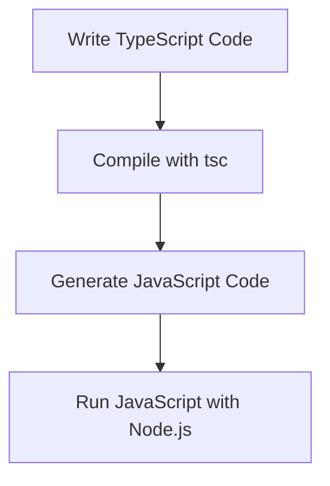

## 1.5 Your First TypeScript Program

Welcome to an exciting step in your journey to mastering TypeScript! In this section, we'll guide you through writing, compiling, and running your very first TypeScript program. By the end of this guide, you'll have a solid understanding of the TypeScript development workflow and be ready to explore more complex programs.

### Writing Your First TypeScript Program

Let's start with a classic programming exercise: writing a "Hello, World!" program. This simple program will introduce you to the syntax of TypeScript and the process of creating a TypeScript file.

1. **Create a New File**: Open your preferred code editor and create a new file named `hello.ts`. The `.ts` extension indicates that this is a TypeScript file.

2. **Write the Code**: In `hello.ts`, type the following code:

    ```typescript
    // This is a simple TypeScript program that prints "Hello, World!" to the console.
    let message: string = "Hello, World!";
    console.log(message);
    ```

    **Explanation**:
    - We declare a variable `message` with the `let` keyword, specifying its type as `string`.
    - We assign the string `"Hello, World!"` to the `message` variable.
    - We use `console.log()` to output the message to the console.

### Compiling TypeScript to JavaScript

TypeScript is a superset of JavaScript, which means it needs to be compiled into JavaScript before it can be executed. Let's see how to do this using the TypeScript compiler (`tsc`).

1. **Open a Terminal**: Navigate to the directory where your `hello.ts` file is located.

2. **Compile the TypeScript File**: Run the following command in your terminal:

    ```bash
    tsc hello.ts
    ```

    This command tells the TypeScript compiler to convert `hello.ts` into a JavaScript file. If successful, you'll see a new file named `hello.js` in the same directory.

3. **Check the Compiled JavaScript**: Open `hello.js` in your code editor. It should look like this:

    ```javascript
    // This is a simple TypeScript program that prints "Hello, World!" to the console.
    var message = "Hello, World!";
    console.log(message);
    ```

    **Note**: The `let` keyword in TypeScript is compiled to `var` in JavaScript for compatibility with older JavaScript environments.

### Running the Compiled JavaScript File

Now that we have our JavaScript file, let's run it using Node.js.

1. **Run the JavaScript File**: In your terminal, execute the following command:

    ```bash
    node hello.js
    ```

    If everything is set up correctly, you should see `Hello, World!` printed to the console.

### Common Errors and How to Resolve Them

As a beginner, you might encounter some common errors. Let's discuss a few and how to resolve them:

1. **TypeScript Compiler Not Found**: If you get an error saying `tsc` is not recognized, make sure TypeScript is installed globally. You can install it using:

    ```bash
    npm install -g typescript
    ```

2. **Syntax Errors**: If there are any typos or syntax errors in your TypeScript code, the compiler will display error messages. Carefully read the error message and correct the code.

3. **Node.js Not Installed**: If you get an error when trying to run `node hello.js`, ensure Node.js is installed on your system. You can download it from [Node.js official website](https://nodejs.org/).

### Try It Yourself: Experiment and Modify

Now that you've successfully written and run your first TypeScript program, let's encourage some experimentation:

- **Change the Message**: Modify the `message` variable to print a different message. For example, change it to `"Welcome to TypeScript!"`.

- **Add Another Variable**: Declare another variable and use it in the `console.log()` statement. For example:

    ```typescript
    let greeting: string = "Hello";
    let name: string = "TypeScript";
    console.log(greeting + ", " + name + "!");
    ```

- **Use a Number Type**: Introduce a number variable and perform a simple arithmetic operation. For example:

    ```typescript
    let num1: number = 5;
    let num2: number = 10;
    console.log("The sum is: " + (num1 + num2));
    ```

### Visual Aids: Understanding the Compilation Process

To help visualize the process of compiling TypeScript to JavaScript, let's use a flowchart:



**Description**: This flowchart represents the process of writing TypeScript code, compiling it with `tsc`, generating JavaScript code, and running it with Node.js.

### Key Takeaways

- **TypeScript Files**: Use the `.ts` extension for TypeScript files.
- **Type Annotations**: TypeScript allows you to specify types for variables, enhancing code readability and reducing errors.
- **Compilation**: Use the TypeScript compiler (`tsc`) to convert TypeScript files into JavaScript.
- **Execution**: Run the compiled JavaScript files using Node.js.

### References and Further Reading

- [TypeScript Official Documentation](https://www.typescriptlang.org/docs/)
- [Node.js Official Website](https://nodejs.org/)
- [MDN Web Docs on JavaScript](https://developer.mozilla.org/en-US/docs/Web/JavaScript)

### Engagement and Reinforcement

- **Question**: What happens if you forget to specify the type of a variable in TypeScript?
- **Challenge**: Try creating a TypeScript program that calculates the area of a rectangle given its length and width.

### Exercises

1. **Exercise 1**: Write a TypeScript program that prints your name and age.
2. **Exercise 2**: Modify the "Hello, World!" program to include a function that returns the greeting message.

### Conclusion

Congratulations on writing, compiling, and running your first TypeScript program! You've taken an important step in your journey to mastering TypeScript. Keep experimenting and building on what you've learned. In the next sections, we'll dive deeper into the powerful features of TypeScript.

## Quiz Time!



### What is the file extension for TypeScript files?

- [x] .ts
- [ ] .js
- [ ] .jsx
- [ ] .json

> **Explanation:** TypeScript files use the `.ts` extension to differentiate them from JavaScript files.

### Which command is used to compile TypeScript files?

- [x] tsc
- [ ] node
- [ ] npm
- [ ] ts-node

> **Explanation:** The `tsc` command is used to compile TypeScript files into JavaScript.

### What does the `console.log()` function do in TypeScript?

- [x] Prints messages to the console
- [ ] Compiles TypeScript code
- [ ] Declares variables
- [ ] Runs JavaScript code

> **Explanation:** `console.log()` is used to print messages to the console in both TypeScript and JavaScript.

### What should you do if `tsc` is not recognized as a command?

- [x] Install TypeScript globally using npm
- [ ] Reboot your computer
- [ ] Use a different code editor
- [ ] Uninstall Node.js

> **Explanation:** If `tsc` is not recognized, you should install TypeScript globally using npm with the command `npm install -g typescript`.

### How do you run a compiled JavaScript file using Node.js?

- [x] node <filename>.js
- [ ] tsc <filename>.ts
- [ ] npm start
- [ ] ts-node <filename>.ts

> **Explanation:** To run a compiled JavaScript file, use the `node` command followed by the filename.

### What is the purpose of the `let` keyword in TypeScript?

- [x] To declare a block-scoped variable
- [ ] To declare a global variable
- [ ] To declare a function
- [ ] To declare a constant

> **Explanation:** The `let` keyword is used to declare a block-scoped variable in TypeScript.

### What type of error might you encounter if there is a typo in your TypeScript code?

- [x] Syntax error
- [ ] Runtime error
- [ ] Compilation error
- [ ] Logical error

> **Explanation:** A typo in your TypeScript code will result in a syntax error during compilation.

### What is the output of the following TypeScript code?

```typescript
let num1: number = 5;
let num2: number = 10;
console.log("The sum is: " + (num1 + num2));
```

- [x] The sum is: 15
- [ ] The sum is: 510
- [ ] The sum is: 5 + 10
- [ ] The sum is: num1 + num2

> **Explanation:** The code calculates the sum of `num1` and `num2`, which is 15, and prints it to the console.

### What is the result of compiling a TypeScript file?

- [x] A JavaScript file
- [ ] A TypeScript file
- [ ] An HTML file
- [ ] A CSS file

> **Explanation:** Compiling a TypeScript file results in a JavaScript file that can be executed in a JavaScript environment.

### True or False: TypeScript is a superset of JavaScript.

- [x] True
- [ ] False

> **Explanation:** True. TypeScript is a superset of JavaScript, meaning it extends JavaScript by adding static types and other features.


