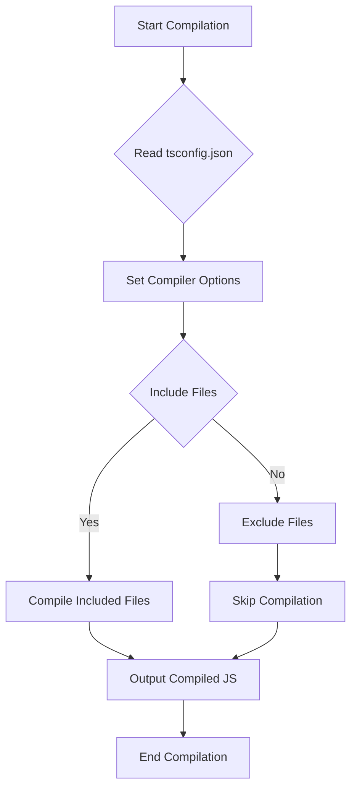

## 1.7 Configuring `tsconfig.json`

Welcome to the world of TypeScript configuration! In this section, we'll explore the `tsconfig.json` file, a crucial component in any TypeScript project. This file allows you to customize how the TypeScript compiler behaves, making your development process smoother and more efficient. Let's dive in and understand how to set up and maintain this configuration file effectively.

### What is `tsconfig.json`?

The `tsconfig.json` file is a configuration file used by the TypeScript compiler to determine how to compile your TypeScript code. It acts as a blueprint for the compiler, specifying which files to include, how to handle certain syntax, and what JavaScript version to target. By configuring `tsconfig.json`, you can tailor the compilation process to suit your project's needs, ensuring that your code is compiled correctly and efficiently.

### Why is `tsconfig.json` Important?

1. **Customization**: It allows you to customize the compilation process, ensuring that your TypeScript code is transformed into JavaScript that meets your project's requirements.
2. **Consistency**: By defining compiler options in a single file, you ensure that all developers on your team use the same settings, leading to consistent code quality.
3. **Efficiency**: It helps in optimizing the build process by including only necessary files and excluding others, reducing compilation time.
4. **Error Prevention**: With strict type checking and other options, `tsconfig.json` helps catch errors early in the development process.

### Sample `tsconfig.json` File

Let's start with a basic `tsconfig.json` file and break down each part:

```json
{
  "compilerOptions": {
    "target": "ES6",
    "module": "commonjs",
    "strict": true,
    "esModuleInterop": true,
    "outDir": "./dist",
    "rootDir": "./src",
    "removeComments": true,
    "noImplicitAny": true
  },
  "include": ["src/**/*"],
  "exclude": ["node_modules", "**/*.spec.ts"]
}
```

#### Explanation of Configuration Options

- **`compilerOptions`**: This section contains various options that control the behavior of the TypeScript compiler.

  - **`target`**: Specifies the ECMAScript version to which TypeScript will compile. Common values include `ES5`, `ES6` (also known as `ES2015`), `ES2016`, etc. For example, `"target": "ES6"` compiles TypeScript to ECMAScript 6.

  - **`module`**: Defines the module system to use in the compiled JavaScript. Options include `commonjs`, `amd`, `es6`, etc. `"module": "commonjs"` is often used for Node.js projects.

  - **`strict`**: Enables all strict type-checking options. This is a powerful feature that helps catch potential errors early. `"strict": true` is recommended for robust code.

  - **`esModuleInterop`**: Allows better compatibility with CommonJS modules. It enables default imports from modules with a `default` export. `"esModuleInterop": true` is useful when working with many JavaScript libraries.

  - **`outDir`**: Specifies the output directory for compiled JavaScript files. `"outDir": "./dist"` means compiled files will be placed in the `dist` folder.

  - **`rootDir`**: Indicates the root directory of TypeScript files. `"rootDir": "./src"` tells the compiler to look for TypeScript files in the `src` folder.

  - **`removeComments`**: Removes comments from the output JavaScript files. `"removeComments": true` can help reduce file size.

  - **`noImplicitAny`**: Raises an error on expressions and declarations with an implied `any` type. `"noImplicitAny": true` encourages explicit typing.

- **`include`**: An array of file patterns to include in the compilation. `"include": ["src/**/*"]` includes all files in the `src` directory.

- **`exclude`**: An array of file patterns to exclude from the compilation. `"exclude": ["node_modules", "**/*.spec.ts"]` excludes the `node_modules` directory and test files with `.spec.ts` extension.

### Common Compiler Options

Let's explore some common compiler options in more detail:

#### `target`

The `target` option determines the version of JavaScript that TypeScript will compile to. Choosing the right target is crucial for ensuring compatibility with the environments where your code will run. Here's a quick overview of some common targets:

- **`ES5`**: Compatible with most browsers, but lacks modern features.
- **`ES6` (or `ES2015`)**: Introduces features like classes, arrow functions, and template literals.
- **`ES2016` and beyond**: Includes newer features like async/await and more.

#### `module`

The `module` option specifies the module system for the output JavaScript. This is important for defining how modules are loaded and executed. Here are some common module systems:

- **`commonjs`**: Used in Node.js environments.
- **`amd`**: Asynchronous Module Definition, used in browsers.
- **`es6`**: Also known as `ES2015`, used for modern JavaScript modules.

#### `strict`

The `strict` option enables a set of strict type-checking options that can help catch potential errors early. It includes:

- **`noImplicitAny`**: Disallows variables with an implicit `any` type.
- **`strictNullChecks`**: Ensures that `null` and `undefined` are handled explicitly.
- **`strictFunctionTypes`**: Enforces strict function type checking.

#### `include` and `exclude`

The `include` and `exclude` options allow you to specify which files should be included or excluded from the compilation process. This is useful for optimizing the build process and ensuring that only necessary files are compiled.

### Excluding Files or Directories

Excluding files or directories from compilation can be important for improving build times and avoiding unnecessary errors. You can use the `exclude` option to specify patterns for files or directories to exclude. For example:

```json
"exclude": ["node_modules", "dist", "**/*.test.ts"]
```

This configuration excludes the `node_modules` and `dist` directories, as well as any files with a `.test.ts` extension.

### Best Practices for Maintaining `tsconfig.json`

1. **Keep It Simple**: Start with a minimal configuration and add options as needed. Avoid unnecessary complexity.
2. **Use Comments**: Although JSON doesn't support comments, you can use tools like JSONC (JSON with Comments) for development to annotate your configuration.
3. **Version Control**: Keep your `tsconfig.json` file under version control to track changes and collaborate with your team.
4. **Consistent Formatting**: Use consistent formatting and indentation for readability.
5. **Regular Updates**: Review and update your configuration periodically to take advantage of new TypeScript features and best practices.

### Try It Yourself

Let's put what we've learned into practice! Try modifying the sample `tsconfig.json` file to change the `target` to `ES5` and observe how the compiled JavaScript differs. You can also experiment with adding or removing files from the `include` and `exclude` lists to see how it affects the compilation process.

### Visualizing `tsconfig.json` Configuration

To better understand how the `tsconfig.json` file influences the TypeScript compilation process, let's visualize it using a flowchart. This flowchart represents the decision-making process of the TypeScript compiler based on the configuration options.



### Summary

In this section, we've explored the `tsconfig.json` file, a powerful tool for customizing the TypeScript compiler's behavior. We've covered common configuration options, how to include and exclude files, and best practices for maintaining your configuration file. By mastering `tsconfig.json`, you'll be well-equipped to tailor the TypeScript compilation process to meet your project's needs.

## Quiz Time!



### What is the primary purpose of the `tsconfig.json` file?

- [x] To configure the TypeScript compiler's behavior
- [ ] To store project dependencies
- [ ] To manage version control
- [ ] To write TypeScript code

> **Explanation:** The `tsconfig.json` file is used to configure how the TypeScript compiler behaves, including which files to compile and what ECMAScript version to target.

### Which option in `tsconfig.json` specifies the ECMAScript version for the output JavaScript?

- [x] `target`
- [ ] `module`
- [ ] `strict`
- [ ] `include`

> **Explanation:** The `target` option determines the ECMAScript version to which TypeScript will compile.

### What does the `strict` option in `tsconfig.json` do?

- [x] Enables all strict type-checking options
- [ ] Specifies the module system
- [ ] Includes files for compilation
- [ ] Excludes files from compilation

> **Explanation:** The `strict` option enables a set of strict type-checking options to catch potential errors early.

### How do you exclude files from the TypeScript compilation process?

- [x] Use the `exclude` option in `tsconfig.json`
- [ ] Use the `include` option in `tsconfig.json`
- [ ] Use the `target` option in `tsconfig.json`
- [ ] Use the `module` option in `tsconfig.json`

> **Explanation:** The `exclude` option specifies patterns for files or directories to exclude from the compilation process.

### Which module system is commonly used for Node.js projects?

- [x] `commonjs`
- [ ] `amd`
- [ ] `es6`
- [ ] `umd`

> **Explanation:** The `commonjs` module system is commonly used in Node.js environments.

### What is the purpose of the `outDir` option in `tsconfig.json`?

- [x] Specifies the output directory for compiled JavaScript files
- [ ] Specifies the root directory of TypeScript files
- [ ] Removes comments from output files
- [ ] Enables strict type-checking

> **Explanation:** The `outDir` option defines where the compiled JavaScript files will be placed.

### Which option allows better compatibility with CommonJS modules?

- [x] `esModuleInterop`
- [ ] `noImplicitAny`
- [ ] `strict`
- [ ] `target`

> **Explanation:** The `esModuleInterop` option allows better compatibility with CommonJS modules by enabling default imports.

### What does the `noImplicitAny` option do?

- [x] Raises an error on expressions with an implied `any` type
- [ ] Removes comments from output files
- [ ] Specifies the ECMAScript version
- [ ] Defines the module system

> **Explanation:** The `noImplicitAny` option ensures that variables with an implied `any` type raise an error, encouraging explicit typing.

### How can you include all files in the `src` directory for compilation?

- [x] Use `"include": ["src/**/*"]` in `tsconfig.json`
- [ ] Use `"exclude": ["src/**/*"]` in `tsconfig.json`
- [ ] Use `"target": "src"` in `tsconfig.json`
- [ ] Use `"module": "src"` in `tsconfig.json`

> **Explanation:** The `include` option with the pattern `"src/**/*"` includes all files in the `src` directory for compilation.

### True or False: The `tsconfig.json` file should be kept under version control.

- [x] True
- [ ] False

> **Explanation:** Keeping `tsconfig.json` under version control ensures that all developers use the same configuration settings, leading to consistent code quality.


