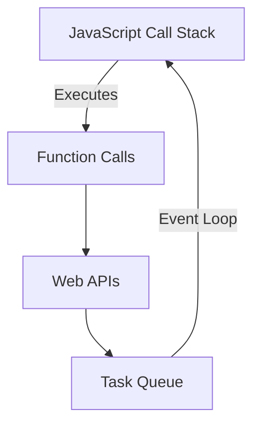
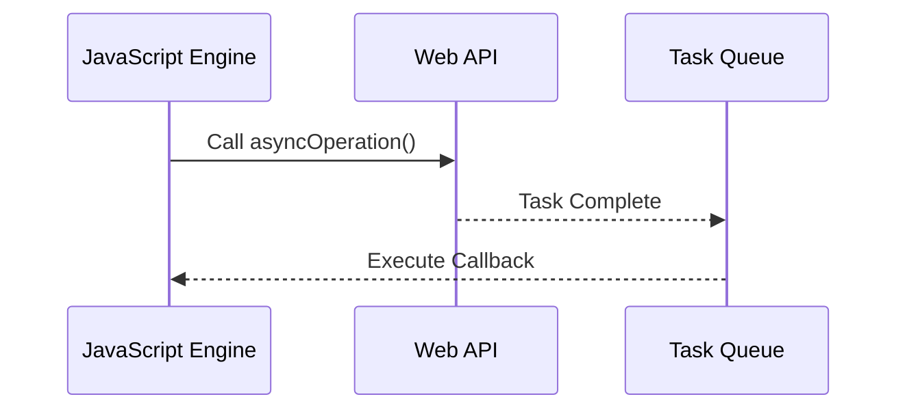

## 10.1 Understanding Asynchronous Programming

Asynchronous programming is a fundamental concept in JavaScript and TypeScript, enabling us to write code that can perform multiple tasks simultaneously. This is crucial for web applications, where tasks like fetching data from a server or responding to user interactions should not block the execution of other code. In this section, we will explore the basics of asynchronous programming, understand the event loop, and see how asynchronous code is handled in JavaScript and TypeScript.

### What is Asynchronous Programming?

In programming, operations can be classified as either synchronous or asynchronous. Let's break down these concepts:

- **Synchronous Operations**: These operations are executed sequentially. Each operation must complete before the next one begins. This can lead to inefficiencies, especially when dealing with tasks that take time, like network requests or file I/O.

- **Asynchronous Operations**: These operations allow other code to run while waiting for the operation to complete. This means that long-running tasks do not block the execution of other code, leading to more efficient and responsive applications.

### The Event Loop

The event loop is a core concept in JavaScript that enables asynchronous programming. It allows JavaScript to perform non-blocking operations by offloading tasks to the system kernel whenever possible. Let's explore how the event loop works:



#### Explanation:

1. **JavaScript Call Stack**: This is where your code is executed. Functions are pushed onto the stack when called and popped off when they return.

2. **Web APIs**: When asynchronous operations are called (like `setTimeout`, HTTP requests, etc.), they are handled by Web APIs provided by the browser, allowing the call stack to continue executing other code.

3. **Task Queue**: Once an asynchronous operation completes, its callback is placed in the task queue.

4. **Event Loop**: The event loop continuously checks the call stack and the task queue. If the call stack is empty, it pushes the first task from the queue onto the stack for execution.

### Synchronous vs. Asynchronous: An Example

Let's look at a simple example to illustrate the difference between synchronous and asynchronous operations:

**Synchronous Example:**

```typescript
console.log("Start");

function syncOperation() {
    // Simulate a long-running operation
    for (let i = 0; i < 1e9; i++) {}
    console.log("Synchronous Operation Complete");
}

syncOperation();
console.log("End");
```

**Output:**

```
Start
Synchronous Operation Complete
End
```

**Asynchronous Example:**

```typescript
console.log("Start");

function asyncOperation() {
    setTimeout(() => {
        console.log("Asynchronous Operation Complete");
    }, 1000);
}

asyncOperation();
console.log("End");
```

**Output:**

```
Start
End
Asynchronous Operation Complete
```

In the synchronous example, the entire operation must complete before moving to the next line. In contrast, the asynchronous example allows the program to continue executing while waiting for the asynchronous operation to complete.

### Importance of Asynchronous Programming

Asynchronous programming is crucial for creating responsive web applications. Here are some reasons why it's important:

- **Improved Performance**: By not blocking the main thread, asynchronous programming allows applications to remain responsive even when performing time-consuming tasks.

- **Better User Experience**: Users can interact with the application while background tasks are being processed, leading to a smoother experience.

- **Efficient Resource Utilization**: Asynchronous operations can make better use of system resources by allowing other tasks to run concurrently.

### Asynchronous Patterns in TypeScript

TypeScript, being a superset of JavaScript, supports all asynchronous patterns available in JavaScript. Let's explore some common patterns:

#### 1. Callbacks

Callbacks are functions passed as arguments to other functions and are executed once an asynchronous operation completes.

**Example:**

```typescript
function fetchData(callback: (data: string) => void) {
    setTimeout(() => {
        callback("Data fetched");
    }, 1000);
}

fetchData((data) => {
    console.log(data);
});
```

**Output:**

```
Data fetched
```

#### 2. Promises

Promises provide a more powerful and flexible way to handle asynchronous operations. They represent a value that may be available now, or in the future, or never.

**Example:**

```typescript
function fetchData(): Promise<string> {
    return new Promise((resolve, reject) => {
        setTimeout(() => {
            resolve("Data fetched");
        }, 1000);
    });
}

fetchData().then((data) => {
    console.log(data);
});
```

**Output:**

```
Data fetched
```

#### 3. Async/Await

`async` and `await` provide a more readable way to work with promises. They allow us to write asynchronous code that looks synchronous.

**Example:**

```typescript
async function fetchData(): Promise<string> {
    return new Promise((resolve, reject) => {
        setTimeout(() => {
            resolve("Data fetched");
        }, 1000);
    });
}

async function displayData() {
    const data = await fetchData();
    console.log(data);
}

displayData();
```

**Output:**

```
Data fetched
```

### Try It Yourself

Experiment with the examples provided above. Try modifying the delay in the `setTimeout` function or chaining multiple asynchronous operations using promises. This will help solidify your understanding of asynchronous programming.

### Visualizing Asynchronous Flow

To further illustrate how asynchronous operations work, let's visualize the flow using a sequence diagram:



### Conclusion

Understanding asynchronous programming is essential for developing efficient and responsive web applications. By leveraging the event loop, callbacks, promises, and async/await, we can write code that performs multiple tasks concurrently without blocking the main thread.

### Key Takeaways

- Asynchronous programming allows for non-blocking operations, improving performance and user experience.
- The event loop is a core concept that enables asynchronous behavior in JavaScript.
- Callbacks, promises, and async/await are common patterns for handling asynchronous operations in TypeScript.

### Further Reading

- [MDN Web Docs: Asynchronous JavaScript](https://developer.mozilla.org/en-US/docs/Learn/JavaScript/Asynchronous)
- [JavaScript.info: The Event Loop](https://javascript.info/event-loop)

## Quiz Time!



### What is the main advantage of asynchronous programming?

- [x] It allows multiple tasks to run concurrently without blocking the main thread.
- [ ] It simplifies code by removing the need for callbacks.
- [ ] It makes code execution faster by skipping unnecessary operations.
- [ ] It ensures that all operations are executed in the order they are written.

> **Explanation:** Asynchronous programming allows tasks to run concurrently, improving performance and responsiveness.

### What is the role of the event loop in JavaScript?

- [x] It manages the execution of asynchronous operations.
- [ ] It compiles JavaScript code into machine code.
- [ ] It handles errors and exceptions in the code.
- [ ] It optimizes the performance of synchronous operations.

> **Explanation:** The event loop manages the execution of asynchronous operations, ensuring that tasks are executed when the call stack is empty.

### Which of the following is a common pattern for handling asynchronous operations in TypeScript?

- [x] Promises
- [ ] Loops
- [ ] Variables
- [ ] Functions

> **Explanation:** Promises are a common pattern for handling asynchronous operations in TypeScript.

### How does the `async` keyword affect a function in TypeScript?

- [x] It allows the function to use `await` for asynchronous operations.
- [ ] It makes the function execute immediately.
- [ ] It converts the function into a synchronous operation.
- [ ] It removes the need for error handling.

> **Explanation:** The `async` keyword allows a function to use `await` for handling asynchronous operations.

### What is the purpose of the `setTimeout` function?

- [x] To execute a function after a specified delay.
- [ ] To immediately execute a function.
- [ ] To convert a synchronous operation into an asynchronous one.
- [ ] To handle errors in asynchronous code.

> **Explanation:** `setTimeout` is used to execute a function after a specified delay.

### What happens when an asynchronous operation completes?

- [x] Its callback is placed in the task queue.
- [ ] It is immediately executed on the call stack.
- [ ] It is discarded if not needed.
- [ ] It blocks the execution of other code.

> **Explanation:** When an asynchronous operation completes, its callback is placed in the task queue.

### How do promises improve asynchronous code handling?

- [x] They provide a more flexible and readable way to handle asynchronous operations.
- [ ] They eliminate the need for callbacks.
- [ ] They make asynchronous operations execute faster.
- [ ] They convert asynchronous operations into synchronous ones.

> **Explanation:** Promises provide a more flexible and readable way to handle asynchronous operations.

### What is the output of the following code snippet?

```typescript
console.log("Start");
setTimeout(() => console.log("Middle"), 0);
console.log("End");
```

- [x] Start, End, Middle
- [ ] Start, Middle, End
- [ ] Middle, Start, End
- [ ] End, Start, Middle

> **Explanation:** The `setTimeout` function is asynchronous, so "Middle" is logged after "End".

### Which keyword is used to pause the execution of an async function until a promise is resolved?

- [x] await
- [ ] async
- [ ] pause
- [ ] delay

> **Explanation:** The `await` keyword pauses the execution of an async function until a promise is resolved.

### True or False: Asynchronous programming is only useful for web applications.

- [ ] True
- [x] False

> **Explanation:** Asynchronous programming is useful in various contexts, not just web applications, for handling tasks that require waiting, such as file I/O or network requests.


