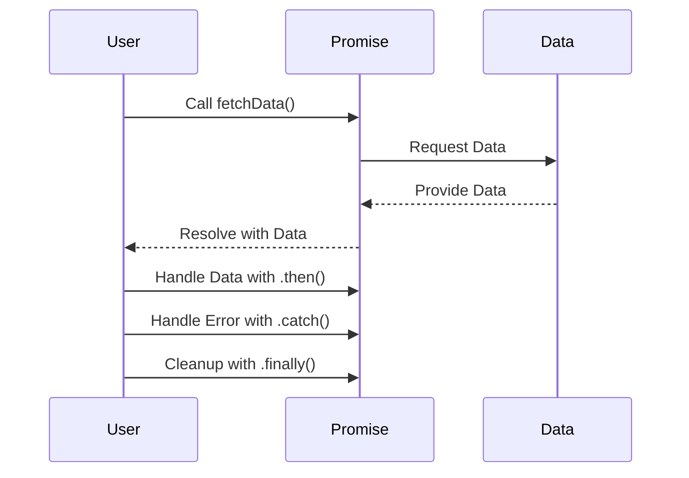

## 10.3 Promises in TypeScript

As we delve deeper into TypeScript, it's essential to understand how to handle asynchronous operations effectively. Promises are a powerful tool that can help us manage these operations smoothly. In this section, we'll explore what Promises are, how they work, and how to use them in TypeScript.

### What Are Promises?

A Promise is an object representing the eventual completion or failure of an asynchronous operation. Think of it as a placeholder for a value that will be available in the future. Promises provide a cleaner, more manageable way to handle asynchronous code compared to traditional callback functions.

#### Why Use Promises?

Promises offer several advantages:

- **Improved Readability**: Promises allow us to write asynchronous code that looks more like synchronous code, making it easier to read and understand.
- **Error Handling**: Promises provide a structured way to handle errors, reducing the likelihood of missing errors in asynchronous operations.
- **Chaining**: Promises can be chained, allowing us to perform a series of asynchronous operations in sequence.

### Creating and Using Promises

Let's start by creating a simple Promise. In TypeScript, we can create a Promise using the `Promise` constructor, which takes a function with two parameters: `resolve` and `reject`.

```typescript
function fetchData(): Promise<string> {
  return new Promise((resolve, reject) => {
    setTimeout(() => {
      const data = "Hello, TypeScript!";
      resolve(data);
    }, 2000);
  });
}
```

In this example, `fetchData` is a function that returns a Promise. After a delay of 2 seconds, the Promise is resolved with the string "Hello, TypeScript!".

### Consuming Promises with `.then()`, `.catch()`, and `.finally()`

Once we have a Promise, we can consume it using the `.then()`, `.catch()`, and `.finally()` methods.

- **`.then()`**: This method is used to specify what to do when the Promise is resolved.

```typescript
fetchData().then((data) => {
  console.log(data); // Output: Hello, TypeScript!
});
```

- **`.catch()`**: This method is used to handle errors if the Promise is rejected.

```typescript
function fetchDataWithError(): Promise<string> {
  return new Promise((resolve, reject) => {
    setTimeout(() => {
      reject("Error: Unable to fetch data.");
    }, 2000);
  });
}

fetchDataWithError()
  .then((data) => {
    console.log(data);
  })
  .catch((error) => {
    console.error(error); // Output: Error: Unable to fetch data.
  });
```

- **`.finally()`**: This method is called regardless of whether the Promise is resolved or rejected, allowing us to perform cleanup operations.

```typescript
fetchData()
  .then((data) => {
    console.log(data);
  })
  .catch((error) => {
    console.error(error);
  })
  .finally(() => {
    console.log("Fetch operation completed.");
  });
```

### Typing Promises in TypeScript

TypeScript allows us to specify the type of data a Promise will resolve to using generic type parameters. This helps us catch errors at compile time and ensures that our code is type-safe.

```typescript
function fetchNumber(): Promise<number> {
  return new Promise((resolve, reject) => {
    setTimeout(() => {
      const number = 42;
      resolve(number);
    }, 2000);
  });
}

fetchNumber().then((num) => {
  console.log(num); // Output: 42
});
```

In this example, `fetchNumber` returns a `Promise<number>`, indicating that the Promise will resolve to a number.

### Common Pitfalls with Promises

While Promises are powerful, there are some common pitfalls to be aware of:

- **Unhandled Promise Rejections**: If a Promise is rejected and no `.catch()` handler is provided, it can lead to unhandled Promise rejections. Always ensure that you handle potential errors.

- **Chaining Mistakes**: When chaining Promises, ensure that each `.then()` returns a Promise if you want to continue the chain. Otherwise, the chain will break.

- **Nested Promises**: Avoid nesting Promises unnecessarily. Instead, chain them to keep your code clean and readable.

### Try It Yourself

To reinforce your understanding, try modifying the code examples above. For instance, change the delay in the `setTimeout` function or introduce an error condition to see how the Promise behaves.

### Visualizing Promise Flow

To better understand how Promises work, let's visualize the flow of a Promise using a sequence diagram.



This diagram illustrates the interaction between the user, the Promise, and the data source. The Promise requests data and resolves with the data once it's available.

### Key Takeaways

- Promises are a powerful tool for handling asynchronous operations in TypeScript.
- Use `.then()`, `.catch()`, and `.finally()` to consume Promises and handle success, errors, and cleanup.
- Type Promises using generic type parameters to ensure type safety.
- Be mindful of common pitfalls like unhandled Promise rejections and chaining mistakes.

### Further Reading

For more information on Promises, consider exploring the following resources:

- [MDN Web Docs on Promises](https://developer.mozilla.org/en-US/docs/Web/JavaScript/Guide/Using_promises)
- [TypeScript Handbook on Promises](https://www.typescriptlang.org/docs/handbook/release-notes/typescript-2-0.html#promises)

## Quiz Time!



### What is a Promise in TypeScript?

- [x] An object representing the eventual completion or failure of an asynchronous operation
- [ ] A synchronous operation that executes immediately
- [ ] A function that returns a callback
- [ ] A data structure for storing key-value pairs

> **Explanation:** A Promise is an object representing the eventual completion or failure of an asynchronous operation.

### Which method is used to handle errors in Promises?

- [ ] .then()
- [x] .catch()
- [ ] .finally()
- [ ] .resolve()

> **Explanation:** The `.catch()` method is used to handle errors in Promises.

### How do you specify the type of data a Promise will resolve to in TypeScript?

- [ ] By using the `typeof` operator
- [x] By using generic type parameters
- [ ] By using the `instanceof` operator
- [ ] By using a type assertion

> **Explanation:** In TypeScript, you specify the type of data a Promise will resolve to using generic type parameters.

### What is the purpose of the `.finally()` method in Promises?

- [ ] To handle errors
- [ ] To resolve the Promise
- [x] To perform cleanup operations
- [ ] To cancel the Promise

> **Explanation:** The `.finally()` method is used to perform cleanup operations, regardless of whether the Promise is resolved or rejected.

### What happens if a Promise is rejected and no `.catch()` handler is provided?

- [x] It leads to an unhandled Promise rejection
- [ ] The Promise is automatically resolved
- [ ] The Promise is ignored
- [ ] The Promise is retried

> **Explanation:** If a Promise is rejected and no `.catch()` handler is provided, it leads to an unhandled Promise rejection.

### Which of the following is a common pitfall when working with Promises?

- [x] Unhandled Promise rejections
- [ ] Using `.then()` to handle errors
- [ ] Using `.finally()` to handle success
- [ ] Using `.resolve()` to handle cleanup

> **Explanation:** Unhandled Promise rejections are a common pitfall when working with Promises.

### What is the advantage of chaining Promises?

- [ ] It makes the code more complex
- [x] It allows performing a series of asynchronous operations in sequence
- [ ] It reduces the need for error handling
- [ ] It automatically resolves all Promises

> **Explanation:** Chaining Promises allows performing a series of asynchronous operations in sequence.

### How can you avoid nesting Promises unnecessarily?

- [ ] By using nested `.then()` calls
- [x] By chaining Promises
- [ ] By using multiple `.catch()` handlers
- [ ] By using synchronous code

> **Explanation:** Avoid nesting Promises unnecessarily by chaining them.

### What is the main benefit of using Promises over traditional callbacks?

- [x] Improved readability and error handling
- [ ] Faster execution
- [ ] Reduced memory usage
- [ ] Simplified syntax

> **Explanation:** The main benefit of using Promises over traditional callbacks is improved readability and error handling.

### True or False: Promises can only be used in TypeScript.

- [ ] True
- [x] False

> **Explanation:** False. Promises are a feature of JavaScript and can be used in any JavaScript environment, including TypeScript.


