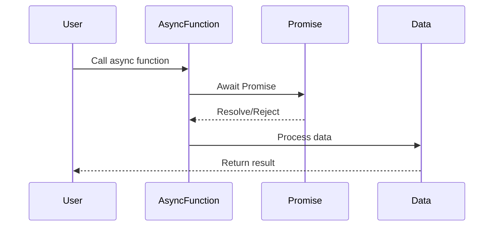

## 10.4 Async/Await Syntax

Asynchronous programming is a crucial part of modern web development, allowing applications to perform tasks like fetching data from a server or reading files without blocking the main thread. In TypeScript, we can handle asynchronous operations more elegantly using the `async` and `await` syntax. This section will guide you through understanding and using these powerful keywords to simplify your asynchronous code.

### Understanding `async` and `await`

The `async` and `await` keywords in TypeScript are built on top of Promises and provide a more readable and concise way to work with asynchronous code. Let's break down what each keyword does:

- **`async`**: This keyword is used to declare an asynchronous function. It automatically returns a Promise, allowing you to use `await` within it. Any function marked with `async` will always return a Promise, even if it explicitly returns a non-Promise value.

- **`await`**: This keyword can only be used inside an `async` function. It pauses the execution of the function until the Promise is resolved or rejected, allowing you to write code that looks synchronous while handling asynchronous operations.

### Converting Promise-based Code to Async/Await

To illustrate the power of `async` and `await`, let's convert a simple Promise-based code to use async/await syntax.

#### Promise-based Code Example

```typescript
function fetchData(url: string): Promise<string> {
    return new Promise((resolve, reject) => {
        setTimeout(() => {
            if (url) {
                resolve(`Data from ${url}`);
            } else {
                reject('URL is required');
            }
        }, 1000);
    });
}

fetchData('https://example.com')
    .then(data => {
        console.log(data);
    })
    .catch(error => {
        console.error(error);
    });
```

#### Async/Await Version

```typescript
async function fetchDataAsync(url: string): Promise<void> {
    try {
        const data = await fetchData(url);
        console.log(data);
    } catch (error) {
        console.error(error);
    }
}

fetchDataAsync('https://example.com');
```

**Explanation**: In the async/await version, the `fetchDataAsync` function is declared with the `async` keyword, allowing us to use `await` to pause execution until the `fetchData` Promise is resolved. The `try/catch` block is used for error handling, which we'll explore in more detail next.

### Importance of Error Handling with `try/catch`

When working with asynchronous code, handling errors effectively is crucial to prevent unexpected application behavior. The `try/catch` block is a common pattern for handling errors in async functions.

#### Error Handling Example

```typescript
async function getData(url: string): Promise<void> {
    try {
        const response = await fetch(url);
        if (!response.ok) {
            throw new Error(`HTTP error! status: ${response.status}`);
        }
        const data = await response.json();
        console.log(data);
    } catch (error) {
        console.error('Failed to fetch data:', error);
    }
}

getData('https://api.example.com/data');
```

**Explanation**: In this example, we use `try/catch` to handle errors that might occur during the fetch operation. If the fetch fails or the response is not okay, an error is thrown and caught in the `catch` block, allowing us to log a meaningful error message.

### How Async/Await Improves Code Readability and Maintainability

Async/await syntax significantly improves the readability and maintainability of asynchronous code by:

- **Reducing Callback Hell**: With async/await, you can avoid deeply nested callbacks, often referred to as "callback hell," making your code cleaner and easier to follow.

- **Synchronous-like Flow**: The use of `await` allows you to write asynchronous code that looks synchronous, making it easier to reason about the order of operations.

- **Simplified Error Handling**: Using `try/catch` for error handling is more intuitive and consistent with synchronous code error handling patterns.

### Transforming Existing Callback or Promise Code

If you have existing code that uses callbacks or Promises, you can refactor it to use async/await for better readability and maintainability.

#### Callback-based Code Example

```typescript
function fetchDataCallback(url: string, callback: (error: Error | null, data?: string) => void): void {
    setTimeout(() => {
        if (url) {
            callback(null, `Data from ${url}`);
        } else {
            callback(new Error('URL is required'));
        }
    }, 1000);
}

fetchDataCallback('https://example.com', (error, data) => {
    if (error) {
        console.error(error);
    } else {
        console.log(data);
    }
});
```

#### Refactored Async/Await Version

```typescript
async function fetchDataWithAwait(url: string): Promise<void> {
    try {
        const data = await fetchData(url);
        console.log(data);
    } catch (error) {
        console.error(error);
    }
}

fetchDataWithAwait('https://example.com');
```

**Explanation**: By refactoring the callback-based code to use async/await, we eliminate the need for a callback function, making the code more straightforward and easier to manage.

### Try It Yourself

Experiment with the following code by modifying the URL or introducing errors to see how the async/await syntax handles different scenarios:

```typescript
async function experimentAsyncAwait(url: string): Promise<void> {
    try {
        const data = await fetchData(url);
        console.log('Experiment Data:', data);
    } catch (error) {
        console.error('Experiment Error:', error);
    }
}

experimentAsyncAwait('https://example.com');
```

### Visualizing Async/Await Flow

To better understand how async/await works, let's visualize the flow of an async function using a Mermaid.js diagram.



**Description**: This sequence diagram illustrates the flow of an async function. The user calls the async function, which awaits a Promise. Once the Promise is resolved or rejected, the async function processes the data and returns the result to the user.

### References and Links

For further reading on async/await and asynchronous programming in TypeScript, consider exploring the following resources:

- [MDN Web Docs: async function](https://developer.mozilla.org/en-US/docs/Web/JavaScript/Reference/Statements/async_function)
- [MDN Web Docs: await](https://developer.mozilla.org/en-US/docs/Web/JavaScript/Reference/Operators/await)
- [TypeScript Handbook: Asynchronous Programming](https://www.typescriptlang.org/docs/handbook/release-notes/typescript-1-7.html#asyncawait)

### Engagement and Reinforcement

To reinforce your understanding of async/await, try refactoring some of your existing Promise-based or callback-based code to use async/await. Pay attention to how the code readability and error handling improve.

### Summary of Key Takeaways

- The `async` keyword is used to declare an asynchronous function, which returns a Promise.
- The `await` keyword pauses the execution of an async function until a Promise is resolved.
- Using `try/catch` for error handling in async functions is crucial for managing errors effectively.
- Async/await syntax improves code readability and maintainability by providing a synchronous-like flow.
- Refactoring existing callback or Promise code to use async/await can simplify your codebase.

## Quiz Time!



### What does the `async` keyword do in TypeScript?

- [x] Declares an asynchronous function that returns a Promise
- [ ] Pauses the execution of a function
- [ ] Converts a callback function to a Promise
- [ ] Automatically handles errors in asynchronous code

> **Explanation:** The `async` keyword is used to declare an asynchronous function, which automatically returns a Promise.

### What is the purpose of the `await` keyword?

- [x] Pauses the execution of an async function until a Promise is resolved
- [ ] Declares an asynchronous function
- [ ] Converts a callback function to a Promise
- [ ] Automatically handles errors in asynchronous code

> **Explanation:** The `await` keyword pauses the execution of an async function until the Promise is resolved or rejected.

### How does async/await improve code readability?

- [x] By providing a synchronous-like flow for asynchronous code
- [ ] By automatically handling errors
- [ ] By eliminating the need for Promises
- [ ] By converting all functions to asynchronous functions

> **Explanation:** Async/await syntax allows asynchronous code to be written in a way that resembles synchronous code, making it easier to read and understand.

### Why is error handling important in async functions?

- [x] To prevent unexpected application behavior and handle errors gracefully
- [ ] To convert errors into successful responses
- [ ] To eliminate the need for Promises
- [ ] To automatically resolve all Promises

> **Explanation:** Proper error handling in async functions is crucial to manage errors effectively and prevent unexpected application behavior.

### What is a common pattern for handling errors in async functions?

- [x] Using `try/catch` blocks
- [ ] Using `then/catch` methods
- [ ] Using `finally` blocks only
- [ ] Using `if/else` statements

> **Explanation:** The `try/catch` block is a common pattern for handling errors in async functions, allowing you to catch and handle exceptions.

### Which of the following is a benefit of using async/await?

- [x] Reduces callback hell
- [ ] Eliminates the need for error handling
- [ ] Converts all code to synchronous code
- [ ] Automatically resolves all Promises

> **Explanation:** Async/await helps reduce callback hell by allowing asynchronous code to be written in a more linear and readable manner.

### Can `await` be used outside of an async function?

- [ ] Yes, it can be used anywhere
- [x] No, it can only be used inside an async function
- [ ] Yes, but only in callback functions
- [ ] No, it can only be used in synchronous functions

> **Explanation:** The `await` keyword can only be used inside an async function to pause its execution until a Promise is resolved.

### What happens if a Promise is rejected in an async function without a `try/catch` block?

- [ ] The Promise is automatically resolved
- [x] The error is unhandled and may cause the application to crash
- [ ] The error is logged to the console
- [ ] The function returns `null`

> **Explanation:** If a Promise is rejected in an async function without a `try/catch` block, the error is unhandled and may cause the application to crash.

### How can existing callback-based code be refactored to use async/await?

- [x] By converting the callback function to return a Promise and using `async`/`await`
- [ ] By removing the callback function entirely
- [ ] By using `then/catch` methods
- [ ] By adding `try/catch` blocks

> **Explanation:** Existing callback-based code can be refactored to use async/await by converting the callback function to return a Promise and using `async`/`await` syntax.

### Is it possible to use async/await with synchronous functions?

- [ ] Yes, it can be used with any function
- [x] No, async/await is specifically for asynchronous functions
- [ ] Yes, but only with `try/catch` blocks
- [ ] No, it requires Promises to work

> **Explanation:** Async/await is specifically designed for asynchronous functions and requires Promises to work.


